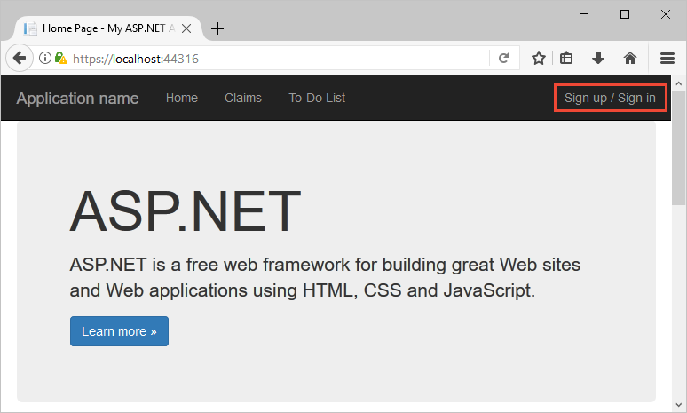

# Quickstart: Test drive an Azure AD B2C enabled web app

Azure Active Directory (Azure AD) B2C provides cloud identity management to keep your application, business, and customers protected. Azure AD B2C enables your apps to authenticate to social accounts, and enterprise accounts using open standard protocols.

In this quickstart, you use an Azure AD B2C enabled sample ASP.NET app to sign in using a social identity provider and call an Azure AD B2C protected web API.

[!INCLUDE [quickstarts-free-trial-note](../../includes/quickstarts-free-trial-note.md)]

## Prerequisites

* [Visual Studio 2017](https://www.visualstudio.com/downloads/) with the **ASP.NET and web development** workload. 
* A social account from either Facebook, Google, Microsoft, or Twitter.

## Download the sample

[Download a zip file](https://github.com/Azure-Samples/active-directory-b2c-dotnet-webapp-and-webapi/archive/master.zip) or clone the sample web app from GitHub.

```
git clone https://github.com/Azure-Samples/active-directory-b2c-dotnet-webapp-and-webapi.git
```

## Run the app in Visual Studio

In the sample application project folder, open the `B2C-WebAPI-DotNet.sln` solution in Visual Studio.

There are two projects in the sample solution:

**Web app sample app (TaskWebApp):** Web app to create and edit a task list. The web app uses the **sign-up or sign-in** policy to sign up or sign in users.

**Web API sample app (TaskService):** Web API that supports the create, read, update, and delete task list functionality. The web API is protected by Azure AD B2C and called by the web app.

For this quickstart, you run both the `TaskWebApp` and `TaskService` projects at the same time. 

1. Select solution `B2C-WebAPI-DotNet` in Solution Explorer.
2. In the Visual Studio menu, select **Project > Set StartUp Projects...**. 
3. Select **Multiple startup projects** radio button.
4. Change the **Action** for both projects to **Start**. Click **OK**.

Press **F5** to debug both applications. Each application opens in its own browser tab:

`https://localhost:44316/` - This page is the ASP.NET web application. You interact directly with this application in the quickstart.
`https://localhost:44332/` - This page is the web API that is called by the ASP.NET web application.

## Create an account

Click the **Sign up / Sign in** link in the ASP.NET web application to start the **Sign Up or Sign In** workflow based on an Azure AD B2C policy.



The sample supports several sign-up options including using a social identity provider or creating a local account using an email address. For this quickstart, use a social identity provider account from either Facebook, Google, Microsoft, or Twitter. 

### Sign up using a social identity provider

Azure AD B2C presents a custom login page for a fictitious brand called Wingtip Toys for the sample web app. 

1. To sign up using a social identity provider, click the button of the identity provider you want to use.

    

    You authenticate (sign-in) using your social account credentials and authorize the application to read information from your social account. By granting access, the application can retrieve profile information from the social account such as your name and city. 

2. Finish the sign-in process for the identity provider. For example, if you chose Twitter, enter your Twitter credentials and click **Sign in**.

    

    Your new Azure AD B2C account profile details are pre-populated with information from your social account.

3. Update the Display Name, Job Title, and City fields and click **Continue**.  The values you enter are used for your Azure AD B2C user account profile.

    

    You have successfully used the sample web app that uses an Azure AD B2C policy to authenticate using an identity provider and create an Azure AD B2C user account. 

## Edit your profile

Azure Active Directory B2C provides functionality to allow users to update their profiles. The sample web app uses an Azure AD B2C edit profile policy for the workflow. 

1. In the web application menu bar, click your profile name and select **Edit profile** to edit the profile you created.

    

2. Change your **Display name** and **City**.  
3. Click **Continue** to update your profile. The new display name is displayed in the upper right portion of the web app's home page.

## Access a protected web API resource

1. Click **To-Do List** to enter and modify your to-do list items. 

2. Enter text in the **New Item** text box. Click **Add** to call the Azure AD B2C protected web API that adds a to-do list item.

    

    The ASP.NET web application includes an Azure AD access token in the request to the protected web API resource to perform operations on the user's to-do list items.

You have successfully used your Azure AD B2C user account to make an authorized call an Azure AD B2C protected web API.

## Clean up resources

You can use your Azure AD B2C tenant if you plan to try other Azure AD B2C quickstarts or tutorials. When no longer needed, you can [delete your Azure AD B2C tenant](active-directory-b2c-faqs.md#how-do-i-delete-my-azure-ad-b2c-tenant).

## Next steps

In this quickstart, you used an Azure AD B2C enabled sample ASP.NET app to sign in with a custom login page, sign in with a social identity provider, create an Azure AD B2C account, and call a web API protected by Azure AD B2C. 

Continue to the tutorial to learn how to configure the sample ASP.NET to use your own Azure AD B2C tenant.

> [!div class="nextstepaction"]
> [Tutorial: Authenticate users with Azure Active Directory B2C in an ASP.NET web app](active-directory-b2c-tutorials-web-app.md)