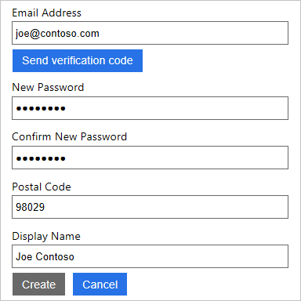

# Tutorial: Enable authentication in a web application using Azure Active Directory B2C

This tutorial shows you how to use Azure Active Directory (Azure AD) B2C to sign in and sign up users in an ASP.NET web application. Azure AD B2C enables your applications to authenticate to social accounts, enterprise accounts, and Azure Active Directory accounts using open standard protocols.

In this tutorial, you learn how to:

> [!div class="checklist"]
> * Update the application in Azure AD B2C
> * Configure the sample to use the application
> * Sign up using the user flow

[!INCLUDE [quickstarts-free-trial-note](../../includes/quickstarts-free-trial-note.md)]

## Prerequisites

* [Create user flows](tutorial-create-user-flows.md) to enable user experiences in your application.
* Install [Visual Studio 2019](https://www.visualstudio.com/downloads/) with the **ASP.NET and web development** workload.

## Update the application

In the tutorial that you completed as part of the prerequisites, you added a web application in Azure AD B2C. To enable communication with the sample in this tutorial, you need to add a redirect URI to the application in Azure AD B2C.

1. Sign in to the [Azure portal](https://portal.azure.com).
2. Make sure you're using the directory that contains your Azure AD B2C tenant by clicking the **Directory and subscription filter** in the top menu and choosing the directory that contains your tenant.
3. Choose **All services** in the top-left corner of the Azure portal, and then search for and select **Azure AD B2C**.
4. Select **Applications**, and then select the *webapp1* application.
5. Under **Reply URL**, add `https://localhost:44316`.
6. Select **Save**.
7. On the properties page, record the application ID that you'll use when you configure the web application.
8. Select **Keys**, select **Generate key**, and select **Save**. Record the key that you'll use when you configure the web application.

## Configure the sample

In this tutorial, you configure a sample that you can download from GitHub. The sample uses ASP.NET to provide a simple to-do list. The sample uses [Microsoft OWIN middleware components](https://docs.microsoft.com/aspnet/aspnet/overview/owin-and-katana/). [Download a zip file](https://github.com/Azure-Samples/active-directory-b2c-dotnet-webapp-and-webapi/archive/master.zip) or clone the sample from GitHub. Make sure that you extract the sample file in a folder where the total character length of the path is less than 260.

```
git clone https://github.com/Azure-Samples/active-directory-b2c-dotnet-webapp-and-webapi.git
```

The following two projects are in the sample solution:

- **TaskWebApp** - Create and edit a task list. The sample uses the **sign-up or sign-in** user flow to sign up and sign in users.
- **TaskService** - Supports the create, read, update, and delete task list functionality. The API is protected by Azure AD B2C and called by TaskWebApp.

You change the sample to use the application that's registered in your tenant, which includes the application ID and the key that you previously recorded. You also configure the user flows that you created. The sample defines the configuration values as settings in the *Web.config* file.

Update the settings in the Web.config file to work with your user flow:

1. Open the **B2C-WebAPI-DotNet** solution in Visual Studio.
1. In the **TaskWebApp** project, open the **Web.config** file.
    1. Replace the value of `ida:Tenant` and `ida:AadInstance` with the name of the tenant that you created.
    1. Replace the value of `ida:ClientId` with the application ID that you recorded.
    1. Replace the value of `ida:ClientSecret` with the key that you recorded. You must XML-encode the client secret before adding it to your Web.config.
    1. Replace the value of `ida:SignUpSignInPolicyId` with `b2c_1_signupsignin1`.
    1. Replace the value of `ida:EditProfilePolicyId` with `b2c_1_profileediting1`.
    1. Replace the value of `ida:ResetPasswordPolicyId` with `b2c_1_passwordreset1`.

## Run the sample

1. In Solution Explorer, right-click the **TaskWebApp** project, and then click **Set as StartUp Project**.
2. Press **F5**. The default browser launches to the local web site address `https://localhost:44316/`.

### Sign up using an email address

1. Click **Sign up / Sign in** to sign up as a user of the application. The **b2c_1_signupsignin1** user flow is used.
2. Azure AD B2C presents a sign-in page with a sign-up link. Since you don't have an account yet, select **Sign up now**. The sign-up workflow presents a page to collect and verify the user's identity using an email address. The sign-up workflow also collects the user's password and the requested attributes defined in the user flow.
3. Use a valid email address and validate using the verification code. Set a password. Enter values for the requested attributes.

    

4. Click **Create** to create a local account in the Azure AD B2C tenant.

Now the user can use their email address to sign in and use the web application.

## Next steps

In this tutorial, you learned how to:

> [!div class="checklist"]
> * Update the application in Azure AD B2C
> * Configure the sample to use the application
> * Sign up using the user flow

> [!div class="nextstepaction"]
> [Tutorial: Use Azure Active Directory B2C to protect an ASP.NET web API](active-directory-b2c-tutorials-web-api.md)
