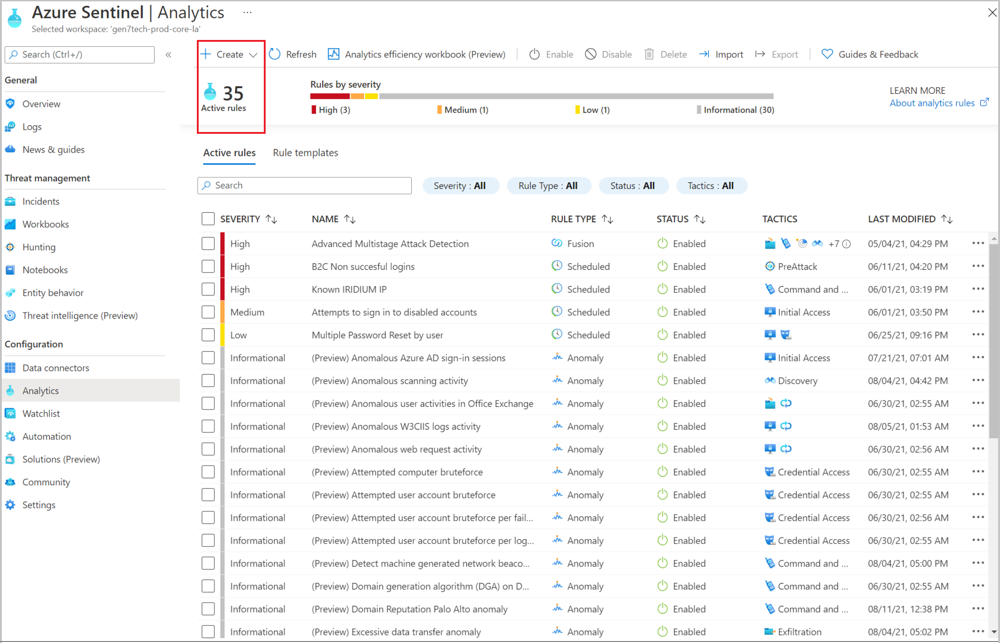
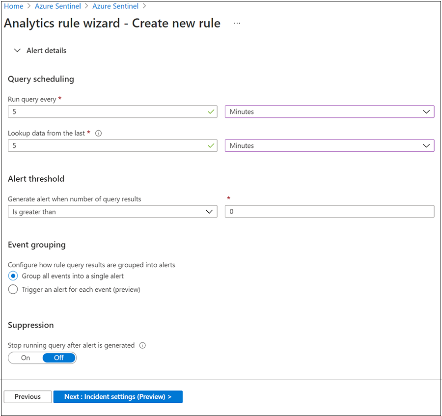
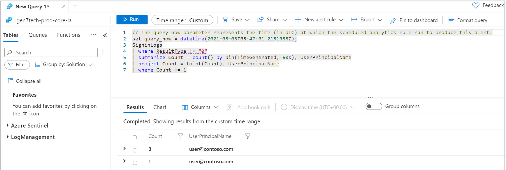

# Tutorial: Configure security analytics for Azure Active Directory B2C data with Azure Sentinel

You can further secure your Azure Active Directory B2C (Azure AD B2C) environment by routing logs and audit information to Azure Sentinel. Azure Sentinel is a cloud-native SIEM (security information and event management) and SOAR (security orchestration, automation, and response) solution. Azure Sentinel provides alert detection, threat visibility, proactive hunting, and threat response for Azure AD B2C.

By using Azure Sentinel with Azure AD B2C, you can:

- Detect previously undetected threats and minimize false positives by using Microsoft's analytics and threat intelligence.
- Investigate threats with AI. Hunt for suspicious activities at scale, and tap into years of cybersecurity-related work at Microsoft.
- Respond to incidents rapidly with built-in orchestration and automation of common tasks.
- Meet security and compliance requirements for your organization.

In this tutorial, you'll learn how to:

> [!div class="checklist"]
> * Transfer Azure AD B2C logs to a Log Analytics workspace.
> * Enable Azure Sentinel in a Log Analytics workspace.
> * Create a sample rule in Azure Sentinel that will trigger an incident.
> * Configure an automated response.

## Configure Azure AD B2C with Azure Monitor Log Analytics

To define where logs and metrics for a resource should be sent, enable **Diagnostic settings** in Azure AD within your Azure AD B2C tenant. Then, [configure Azure AD B2C to send logs to Azure Monitor](./azure-monitor.md).

## Deploy an Azure Sentinel instance

After you've configured your Azure AD B2C instance to send logs to Azure Monitor, you need to enable an Azure Sentinel instance.

>[!IMPORTANT]
>To enable Azure Sentinel, you need contributor permissions to the subscription in which the Azure Sentinel workspace resides. To use Azure Sentinel, you need either contributor or reader permissions on the resource group that the workspace belongs to.

1. Go to the [Azure portal](https://portal.azure.com). Select the subscription where the Log Analytics workspace is created.

2. Search for and select **Azure Sentinel**.

   

3. Select **Add**.

4. Select the new workspace.

   

5. Select **Add Azure Sentinel**.

>[!NOTE]
>You can [run Azure Sentinel](../sentinel/quickstart-onboard.md) on more than one workspace, but the data is isolated to a single workspace.

## Create an Azure Sentinel rule

Now that you've enabled Azure Sentinel, get notified when something suspicious occurs in your Azure AD B2C tenant.

You can create [custom analytics rules](../sentinel/detect-threats-custom.md) to discover threats and anomalous behaviors in your environment. These rules search for specific events or sets of events and alert you when certain event thresholds or conditions are reached. Then they generate incidents for further investigation.

>[!NOTE]
>Azure Sentinel provides built-in templates to help you create threat detection rules designed by Microsoft's team of security experts and analysts. Rules created from these templates automatically search across your data for any suspicious activity. There are no native Azure AD B2C connectors available at this time. For the example in this tutorial, we'll create our own rule.

In the following example, you receive a notification if someone tries to force access to your environment but isn't successful. It might mean a brute-force attack. You want to get notified for two or more unsuccessful logins within 60 seconds.

1. From the left menu in Azure Sentinel, select **Analytics**.

2. On the action bar at the top, select **+ Create** > **Scheduled query rule**. 

    

3. In the Analytics Rule wizard, go to the **General** tab and enter the following information:

    | Field | Value |
    |:--|:--|
    |**Name** | Enter a name that's appropriate for Azure AD B2C unsuccessful logins. |
    |**Description** | Enter a description that says the rule will notify on two or more unsuccessful logins within 60 seconds. |
    | **Tactics** | Choose from the categories of attacks by which to classify the rule. These categories are based on the tactics of the [MITRE ATT&CK](https://attack.mitre.org/) framework. For our example, we'll choose **PreAttack**.   MITRE ATT&CK is a globally accessible knowledge base of adversary tactics and techniques based on real-world observations. This knowledge base is used as a foundation for the development of specific threat models and methodologies.
    | **Severity** | Select an appropriate severity level. |
    | **Status** | When you create the rule, its status is **Enabled** by default. That status means the rule will run immediately after you finish creating it. If you don't want it to run immediately, select **Disabled**. The rule will then be added to your **Active rules** tab, and you can enable it from there when you need it.|

    

4. To define the rule query logic and configure settings, on the **Set rule logic** tab, write a query directly in the
**Rule query** box. 

    

    This query will alert you when there are two or more unsuccessful logins within 60 seconds to your Azure AD B2C tenant. It will organize the logins by `UserPrincipalName`.

5. In the **Query scheduling** section, set the following parameters:

    

6. Select **Next: Incident settings (Preview)**. You'll configure and add the automated response later.

7. Go to the **Review and create** tab to review all the settings for your new alert rule. When the **Validation passed** message appears, select **Create** to initialize your alert rule.

    

8. View the rule and the incidents that it generates. Find your newly created custom rule of type **Scheduled** in the table under the **Active rules** tab on the main **Analytics** screen. From this list, you can edit, enable, disable, or delete rules by using the corresponding buttons.

    

9. View the results of your new rule for Azure AD B2C unsuccessful logins. Go to the **Incidents** page, where you can triage, investigate, and remediate the threats. 

    An incident can include multiple alerts. It's an aggregation of all the relevant evidence for a specific investigation. You can set properties such as severity and status at the incident level.

    > [!NOTE]
    > A key feature of Azure Sentinel is [incident investigation](../sentinel/investigate-cases.md).
    
10. To begin an investigation, select a specific incident. 

    On the right, you can see detailed information for the incident. This information includes severity, entities involved, the raw events that triggered the incident, and the incident's unique ID.

    

11. Select **View full details** on the incident pane. Review the tabs that summarize the incident information and provide more details.

    

12. Select **Evidence** > **Events** > **Link to Log Analytics**. The result displays the `UserPrincipalName` value of the identity that's trying to log in with the number of attempts.

    

## Automated response

Azure Sentinel provides a [robust SOAR capability](../sentinel/automation-in-azure-sentinel.md). Automated actions, called a *playbook* in Azure Sentinel, can be attached to analytics rules to suit your requirements.

In this example, we add an email notification for an incident that the rule creates. To accomplish this task, use an [existing playbook from the Azure Sentinel GitHub repository](https://github.com/Azure/Azure-Sentinel/tree/master/Playbooks/Incident-Email-Notification). After the playbook is configured, edit the existing rule and select the playbook on the **Automated response** tab.

## Related information

For more information about Azure Sentinel and Azure AD B2C, see:

- [Sample workbooks](https://github.com/azure-ad-b2c/siem#workbooks)

- [Azure Sentinel documentation](../sentinel/index.yml)

## Next steps

> [!div class="nextstepaction"]
> [Handle false positives in Azure Sentinel](../sentinel/false-positives.md)
