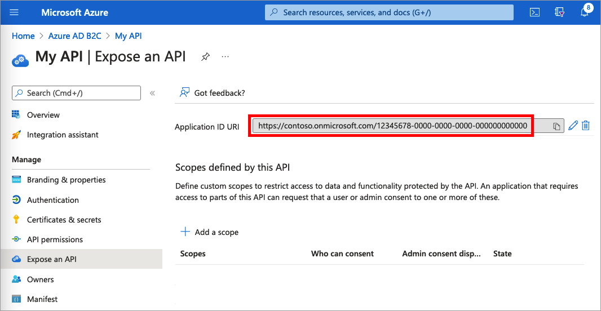
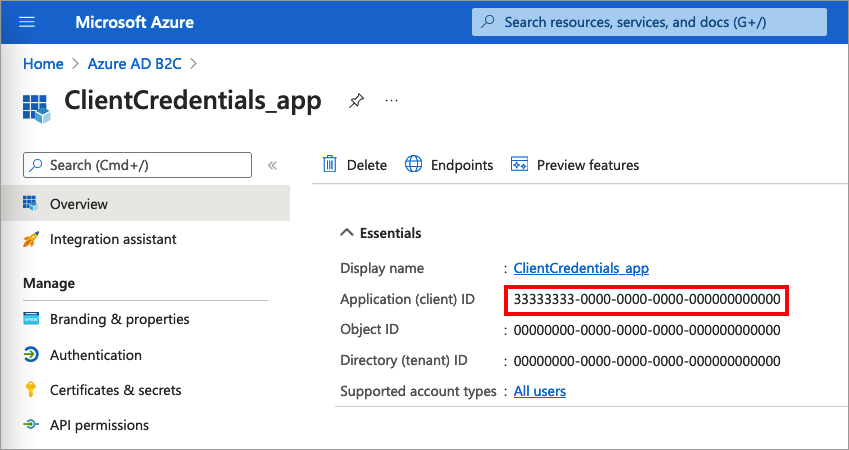
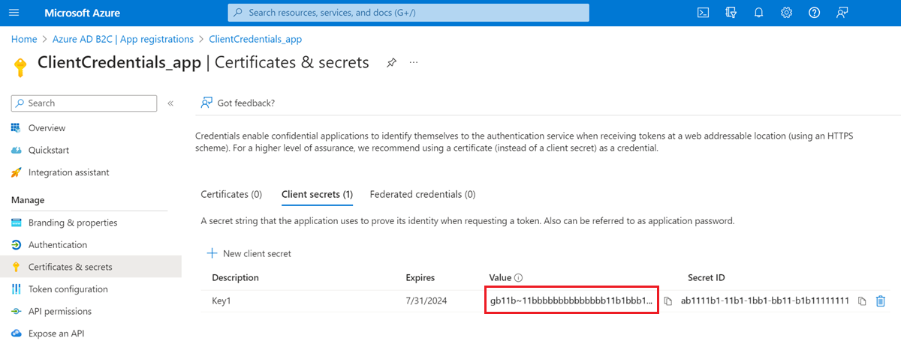
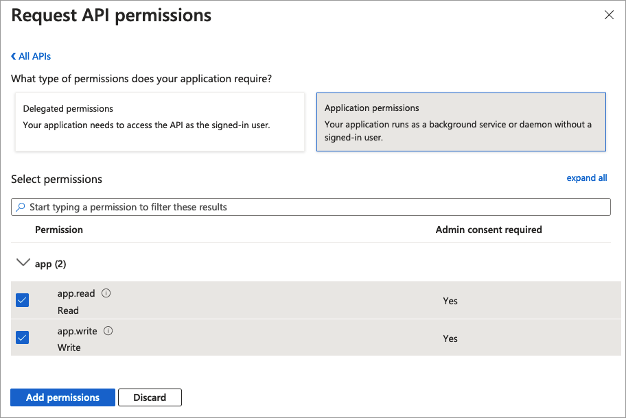

# Set up OAuth 2.0 client credentials flow in Azure Active Directory B2C

[!INCLUDE [active-directory-b2c-choose-user-flow-or-custom-policy](../../includes/active-directory-b2c-choose-user-flow-or-custom-policy.md)]

The OAuth 2.0 client credentials grant flow permits an app (confidential client) to use its own credentials, instead of impersonating a user, to authenticate when calling web resource, such as REST API. This type of grant is commonly used for server-to-server interactions that must run in the background, without immediate interaction with a user. These types of applications are often referred to as daemons or service accounts.

In the client credentials flow, permissions are granted directly to the application itself by an administrator. When the app presents a token to a resource, the resource enforces that the app itself has authorization to perform an action since there's no user involved in the authentication. This article covers the steps needed to authorize an application to call an API, and how to get the tokens needed to call that API.

> [!NOTE]
> **This feature is in public preview.**

## App registration overview

To enable your app to sign in with client credentials, then call a web API, you register two applications in the Azure AD B2C directory.  

- The **application** registration enables your app to sign in with Azure AD B2C. The app registration process generates an *application ID*, also known as the *client ID*, which uniquely identifies your app. You also create a *client secret*, which your app uses to securely acquire the tokens.

- The  **web API** registration enables your app to call a secure web API. The registration includes the web API *scopes*. The scopes provide a way to manage permissions to protected resources, such as your web API. Then, you grant your application permissions to the web API scopes. When an access token is requested, your app specifies the `.default` scope parameter of the request. Azure AD B2C returns the web API scopes granted to your app. 

The app architecture and registrations are illustrated in the following diagram:


## Step 1: Register the web API app

In this step, you register the web API (**App 2**) with its scopes. Later, you grant your application (**App 1**) permission to those scopes. If you already have such an app registration, skip this step, then move to the next one, [Step 1.1 Define web API roles (scopes)](#step-11-define-web-api-roles-scopes).

[!INCLUDE [active-directory-b2c-app-integration-register-api](../../includes/active-directory-b2c-app-integration-register-api.md)]

### Step 1.1 Define web API roles (scopes)

In this step, you configure the web API **Application ID URI**, then define **App roles**. The app *roles*, used by the OAuth 2.0 *scopes* and defined on an application registration representing your API. Your application uses the Application ID URI with the `.default` scope.  To define app roles, follow these steps:

1. Select the web API that you created, for example *my-api1*.
1. Under **Manage**, select **Expose an API**.
1. Next to **Application ID URI**, select the **Set** link. Replace the default value (GUID) with a unique name (for example, **api**), and then select  **Save**.
1. Copy the **Application ID URI**. The following screenshot shows how to copy the Application ID URI.

     

1. Under **Manage**, select **Manifest** to open the application manifest editor.
In the editor, locate the `appRoles` setting, and define app roles that target `applications`. Each app role definition must have a global unique identifier (GUID) for its `id` value. Generate 
a new GUID by running `new-guid`command in the Microsoft PowerShell, or an [online GUID  generator](https://www.bing.com/search?q=online+guid+generator). The `value` property of each app role definition appears in the scope, the `scp` claim. The `value` property 
can't contain spaces. The following example demonstrates two app roles, read and write:

    ```json
    "appRoles": [
    {
      "allowedMemberTypes": ["Application"],
      "displayName": "Read",
      "id": "d6a15e20-f83c-4264-8e61-5082688e14c8",
      "isEnabled": true,
      "description": "Readers have the ability to read tasks.",
      "value": "app.read"
    },
    {
      "allowedMemberTypes": ["Application"],
      "displayName": "Write",
      "id": "204dc4ab-51e1-439f-8c7f-31a1ebf3c7b9",
      "isEnabled": true,
      "description": "Writers have the ability to create tasks.",
      "value": "app.write"
    }],
    ```

1. At the top of the page, select **Save** to save the manifest changes.
 
## Step 2: Register an application

To enable your app to sign in with Azure AD B2C using client credentials flow, you can use an existing application or register a new one (**App 1**). 

If you're using an existing app, make sure the app's `accessTokenAcceptedVersion` is set to `2`:

1. In the Azure portal, search for and select **Azure AD B2C**. 
1. Select **App registrations**, and then select your existing app from the list.
1. In the left menu, under **Manage**, select **Manifest** to open the manifest editor.
1. Locate the `accessTokenAcceptedVersion` element, and set its value to `2`. 
1. At the top of the page, select **Save** to save the changes. 

To create a new web app registration, follow these steps:

1. In the Azure portal, search for and select **Azure AD B2C**
1. Select **App registrations**, and then select **New registration**.
1. Enter a **Name** for the application. For example, *ClientCredentials_app*.
1. Leave the other values as they are, and then select **Register**.
1. Record the **Application (client) ID** for use in a later step.

    

## Step 2.1 Create a client secret

Create a client secret for the registered application. Your app uses the client secret to prove its identity when it requests tokens.

1. Under **Manage**, select **Certificates & secrets**.
1. Select **New client secret**.
1. In the **Description** box, enter a description for the client secret (for example, *clientsecret1*).
1. Under **Expires**, select a duration for which the secret is valid, and then select **Add**.
1. Record the secret's **Value**. You use this value for configuration in a later step.
    
    

## Step 2.2 Grant the app permissions for the web API

To grant your app (**App 1**) permissions, follow these steps: 

1. Select **App registrations**, and then select the app that you created (**App 1**).
1. Under **Manage**, select **API permissions**.
1. Under **Configured permissions**, select **Add a permission**.
1. Select the **My APIs** tab.
1. Select the API (**App 2**) to which the web application should be granted access. For example, enter **my-api1**.
1. Select **Application permission**.
1. Under **Permission**, expand **app**, and then select the scopes that you defined earlier (for example, **app.read** and **app.write**).

     

1. Select **Add permissions**.
1. Select **Grant admin consent for \<*your tenant name*>**.
1. Select **Yes**.
1. Select **Refresh**, and then verify that **Granted for ...** appears under **Status** for both scopes.

## Step 3: Obtain an access token

There are no specific actions to enable the client credentials for user flows or custom policies. Both Azure AD B2C user flows and custom policies support the client credentials flow. If you haven't done so already, create a [user flow or a custom policy](add-sign-up-and-sign-in-policy.md). Then, use your favorite API development application to generate an authorization request. Construct a call like this example with the following information as the body of the POST request:

`https://<tenant-name>.b2clogin.com/<tenant-name>.onmicrosoft.com/<policy>/oauth2/v2.0/token`

- Replace `<tenant-name>` with the [name]( tenant-management-read-tenant-name.md#get-your-tenant-name) of your Azure AD B2C tenant. For example, `contoso.b2clogin.com`.
- Replace `<policy>` with the full name of your user flow, or custom policy. Note, all types of user flows and custom policies support client credentials flow. You can use any user flow or custom policy you have, or create a new one, such as sign-up or sign-in.

| Key | Value |
| --- | ----- |
| grant_type | `client_credentials` |
| client_id | The **Client ID** from the [Step 2 Register an application](#step-2-register-an-application). |
| client_secret | The **Client secret** value from [Step 2.1 Create a client secret](#step-21-create-a-client-secret). |
| scope | The **Application ID URI** from [Step 1.1 Define web API roles (scopes)](#step-11-define-web-api-roles-scopes) and `.default`. For example `https://contoso.onmicrosoft.com/api/.default`, or `https://contoso.onmicrosoft.com/12345678-0000-0000-0000-000000000000/.default`.|

The actual POST request looks like the following example:

**Request**:
```https
POST /<tenant-name>.onmicrosoft.com/B2C_1A_SUSI/oauth2/v2.0/token HTTP/1.1
Host: <tenant-name>.b2clogin.com
Content-Type: application/x-www-form-urlencoded

grant_type=client_credentials
&client_id=33333333-0000-0000-0000-000000000000
&client_secret=FyX7Q~DuPJ...
&scope=https%3A%2F%2Fcontoso.onmicrosoft.com%2Fapi%2F.default
```

**Response**:

```json
{
    "access_token": "eyJ0eXAiOiJKV1QiLCJhbGciOiJSUzI1NiIsImtpZCI6IlBFcG5OZDlnUkNWWUc2dUs...",
    "token_type": "Bearer",
    "not_before": 1645172292,
    "expires_in": 3600,
    "expires_on": 1645175892,
    "resource": "33333333-0000-0000-0000-000000000000"
}
```

Learn about the return [access token](tokens-overview.md) claims. The following table lists the claims that are related to the client credentials flow.

| Claim | Description | Value  |
| ----- | ------------- | ------------- |
| `aud` | Identifies the intended recipient of the token. | The **Client ID** of the API. |
| `sub` | The service principal associate with the application that initiated the request. | It's the service principal of the  `client_id` of the authorization request. |
| `azp` | Authorized party - the party to which the access token was issued.  | The **Client ID** of the application that initiated the request. It's the same value you specified in the `client_id` of the authorization request. |
| `scp` | The set of scopes exposed by your application API (space delimiter). | In client credentials flow, the authorization request asks for the `.default` scope, while the token contains the list of scopes exposed (and consented by the app administrator) by the API. For example, `app.read app.write`.  |

### Step 3.1 Obtain an access token with script

Use the following PowerShell script to test your configuration:

```powershell
$appId = "<client ID>"
$secret = "<client secret>"
$endpoint = "https://<tenant-name>.b2clogin.com/<tenant-name>.onmicrosoft.com/<policy>/oauth2/v2.0/token"
$scope = "<Your API id uri>/.default"
$body = "grant_type=client_credentials&scope=" + $scope + "&client_id=" + $appId + "&client_secret=" + $secret

$token = Invoke-RestMethod -Method Post -Uri $endpoint -Body $body
```

Use the following cURL script to test your configuration:

```bash
curl --location --request POST 'https://<your-tenant>.b2clogin.com/<your-tenant>.onmicrosoft.com/<policy>/oauth2/v2.0/token' \
--header 'Content-Type: application/x-www-form-urlencoded' \
--form 'grant_type="client_credentials"' \
--form 'client_id="<client ID>"' \
--form 'client_secret="<client secret>"' \
--form 'scope="<Your API id uri>/.default"'
```

## Step 4: Customize the token

::: zone pivot="b2c-user-flow"

[!INCLUDE [active-directory-b2c-limited-to-custom-policy](../../includes/active-directory-b2c-limited-to-custom-policy.md)]

::: zone-end

::: zone pivot="b2c-custom-policy"

Custom policies provide a way to extend the token issuance process. To customize the user journey of the OAuth 2.0 Client credentials, follow the [guidance how to configure a client credentials user journey](https://github.com/azure-ad-b2c/samples/tree/master/policies/client_credentials_flow). Then, in the `JwtIssuer` technical profile, add the `ClientCredentialsUserJourneyId` metadata with a reference to the user journey you created.

The following example shows how to add the `ClientCredentialsUserJourneyId` to the token issuer technical profile. 

```xml
<TechnicalProfile Id="JwtIssuer">
  <Metadata>
    <Item Key="ClientCredentialsUserJourneyId">ClientCredentialsJourney</Item>
  </Metadata>
</TechnicalProfile>
```

The following example shows a client credentials user journey. The first and the last orchestration steps are required.

```xml
<UserJourneys>
  <UserJourney Id="ClientCredentialsJourney">
    <OrchestrationSteps>
      <!-- [Required] Do the client credentials -->
      <OrchestrationStep Order="1" Type="ClaimsExchange">
        <ClaimsExchanges>
          <ClaimsExchange Id="ClientCredSetupExchange" TechnicalProfileReferenceId="ClientCredentials_Setup" />
        </ClaimsExchanges>
      </OrchestrationStep>
    
      <!-- [Optional] Call a REST API or claims transformation -->
      <OrchestrationStep Order="2" Type="ClaimsExchange">
        <ClaimsExchanges>
          <ClaimsExchange Id="TokenAugmentation" TechnicalProfileReferenceId="TokenAugmentation" />
        </ClaimsExchanges>
      </OrchestrationStep>
    
      <!-- [Required] Issue the access token -->
      <OrchestrationStep Order="3" Type="SendClaims" CpimIssuerTechnicalProfileReferenceId="JwtIssuer" />
    </OrchestrationSteps>
  </UserJourney>
</UserJourneys>
```
 

::: zone-end


## Next steps

Learn how to [set up a resource owner password credentials flow in Azure AD B2C](add-ropc-policy.md)
