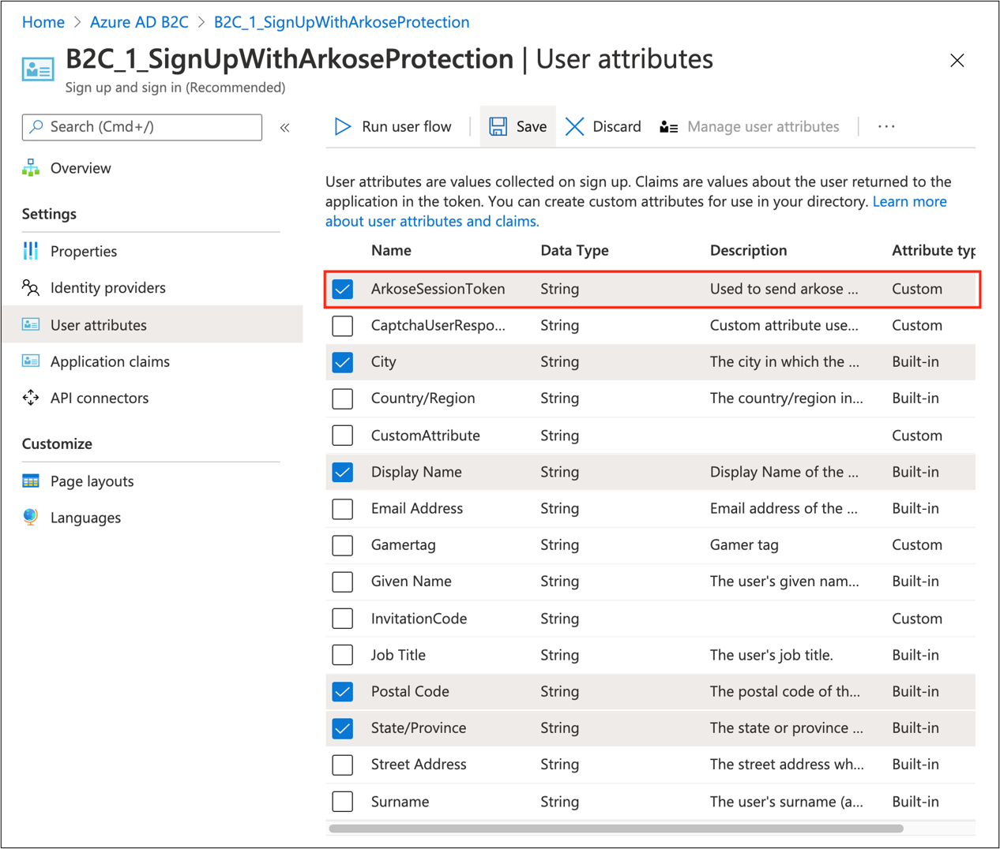
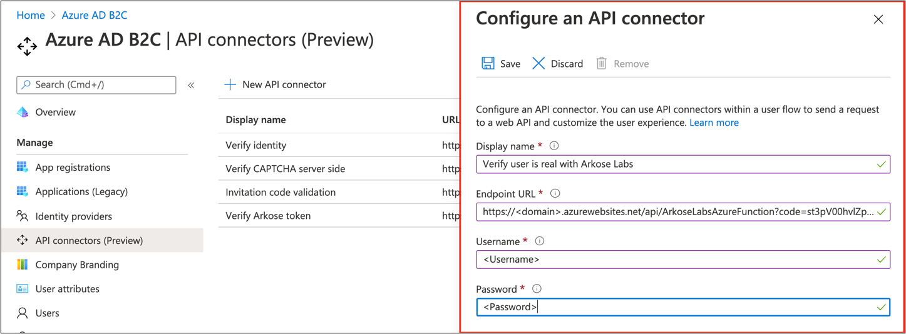

# Tutorial: Configure Azure Active Directory B2C with the Arkose Labs platform

In this tutorial, learn how to integrate Azure Active Directory B2C (Azure AD B2C) authentication with the [Arkose Labs](https://www.arkoselabs.com/) Arkose Protect Platform. Arkose Labs products help organizations against bot attacks, account takeover, and fraudulent account openings.  

## Prerequisites

To get started, you'll need:

- An Azure subscription
  - If you don't have one, you can get an [Azure free account](https://azure.microsoft.com/free/)
- [An Azure AD B2C tenant](tutorial-create-tenant.md) linked to your Azure subscription
- An Arkose Labs account
  - Go to arkoselabs.com to [request a demo](https://www.arkoselabs.com/book-a-demo/)

## Scenario description

Arkose Labs products integration includes the following components:

- **Arkose Protect Platform** - A service to protect against bots and other automated abuse
- **Azure AD B2C sign-up user flow** - The sign-up experience that uses the Arkose Labs platform
  - Custom HTML, JavaScript, and API connectors integrate with the Arkose platform
- **Azure Functions** - Your hosted API endpoint that works with the API connectors feature 
  - This API validates the server-side of the Arkose Labs session token
  - Learn more in the [Azure Functions Overview](../azure-functions/functions-overview.md)

The following diagram illustrates how the Arkose Labs platform integrates with Azure AD B2C.

   

1. A user signs up and creates an account. The user selects **Submit**, and an Arkose Labs enforcement challenge appears.
2. The user completes the challenge. Azure AD B2C sends the status to Arkose Labs to generate a token.
3. Arkose Labs sends the token to Azure AD B2C.
4. Azure AD B2C calls an intermediate web API to pass the sign-up form.
5. The sign-up form goes to Arkose Labs for token verification.
6. Arkose Labs sends verification results to the intermediate web API.
7. The API sends a success or failure result to Azure AD B2C.
8. If the challenge is successful, a sign-up form goes to Azure AD B2C, which completes authentication.

## Request a demo from Arkose Labs

1. Go to arkoselabs.com to [book a demo](https://www.arkoselabs.com/book-a-demo/).
2. Create an account.
3. Navigate to the [Arkose Portal](https://dashboard.arkoselabs.com/login) sign-in page.
4. In the dashboard, navigate to site settings.
5. Locate your public key and private key. You'll use this information later. 

> [!NOTE]
> The public and private key values are `ARKOSE_PUBLIC_KEY` and `ARKOSE_PRIVATE_KEY`. 
> See, [Azure-Samples/active-directory-b2c-node-sign-up-user-flow-arkose](https://github.com/Azure-Samples/active-directory-b2c-node-sign-up-user-flow-arkose).

## Integrate with Azure AD B2C

### Create an ArkoseSessionToken custom attribute

To create a custom attribute:

1. Go to the [Azure portal](https://portal.azure.com), then to **Azure AD B2C**.
2. Select **User attributes**.
3. Select **Add**.
4. Enter **ArkoseSessionToken** as the attribute Name.
5. Select **Create**.

Learn more: [Define custom attributes in Azure Active Directory B2C](./user-flow-custom-attributes.md?pivots=b2c-user-flow)

### Create a user flow

The user flow is for sign-up and sign-in, or sign-up. The Arkose Labs user flow appears during sign-up.

1. [Create user flows and custom policies in Azure Active Directory B2C](./tutorial-create-user-flows.md). If using a user flow, use **Recommended**.
2. In the user flow settings, go to **User attributes**.
3. Select the **ArkoseSessionToken** claim.

   

### Configure custom HTML, JavaScript, and page layout

1. Go to [Azure-Samples/active-directory-b2c-node-sign-up-user-flow-arkose](https://github.com/Azure-Samples/active-directory-b2c-node-sign-up-user-flow-arkose/blob/main/Assets/selfAsserted.html).
2. Find the HTML template with JavaScript `<script>` tags. These do three things:

* Load the Arkose Labs script, which renders their widget and does client-side Arkose Labs validation.
* Hide the `extension_ArkoseSessionToken` input element and label, corresponding to the `ArkoseSessionToken` custom attribute.
* When a user completes the Arkose Labs challenge, the user response is verified and a token generated. The callback `arkoseCallback` in the custom JavaScript sets the value of `extension_ArkoseSessionToken` to the generated token value. This value is submitted to the API endpoint.

   > [!NOTE]
   > Go to developer.arkoselabs.com for [Client-Side Instructions](https://developer.arkoselabs.com/docs/standard-setup). Follow the steps to use the custom HTML and JavaScript for your user flow.

3. In Azure-Samples, modify [selfAsserted.html](https://github.com/Azure-Samples/active-directory-b2c-node-sign-up-user-flow-arkose/blob/main/Assets/selfAsserted.html) file so `<ARKOSE_PUBLIC_KEY>` matches the value you generated for the client-side validation.
4. Host the HTML page on a Cross-Origin Resource Sharing (CORS) enabled web endpoint. 
5. [Create a storage account](../storage/common/storage-account-create.md?tabs=azure-portal&toc=%2fazure%2fstorage%2fblobs%2ftoc.json).
6. [CORS support for Azure Storage](/rest/api/storageservices/cross-origin-resource-sharing--cors--support-for-the-azure-storage-services).

    >[!NOTE]
    >If you have custom HTML, copy and paste the `<script>` elements onto your HTML page.

7. In the Azure portal, go to **Azure AD B2C**.
8. Navigate to **User flows**.
9. Select your user flow.
10. Select **Page layouts**.
11. Select **Local account sign up page layout**.
12. For **Use custom page content**, select **YES**.
13. In **Use custom page content**, paste your custom HTML URI.
14. (Optional) If you use social identity providers, repeat steps for **Social account sign-up page**.

    

15. From your user flow, go to **Properties**.
16. Select **Enable JavaScript**. 

Learn more: [Enable JavaScript and page layout versions in Azure Active Directory B2C](./javascript-and-page-layout.md?pivots=b2c-user-flow)

### Create and deploy your API

This section assumes you use Visual Studio Code to deploy Azure Functions. You can use the Azure portal, terminal, or command prompt to deploy.

Go to Visual Studio Marketplace to install [Azure Functions](https://marketplace.visualstudio.com/items?itemName=ms-azuretools.vscode-azurefunctions) for Visual Studio Code.

#### Run the API locally

1. In Visual Studio code, in the left navigation, go to the Azure extension. 
2. Select the **Local Project** folder for your local Azure Function.
3. Press **F5** or select **Debug** > **Start Debugging**. This command uses the debug configuration Azure Function created.
4. Azure Function generates files for local development, installs dependencies, and the Function Core tools, if needed. 
5. In the Visual Studio Code **Terminal** panel, output from the Function Core tool appears. 
6. When the host starts, select **Alt+click** on the local URL in the output.
7. The browser opens and runs the function. 
8. In the Azure Functions explorer, right-click the function to see the locally hosted function URL.

#### Add environment variables

The sample in this section protects the web API endpoint when using HTTP Basic authentication. Learn more on the Internet Engineering Task Force page [RFC 7617: The Basic Authentication](https://tools.ietf.org/html/rfc7617).

Username and password are stored as environment variables, not part of the repository. Learn more on [Code and test Azure Functions locally, Local settings file](../azure-functions/functions-develop-local.md#local-settings-file).

1. In your root folder, create a local.settings.json file.
2. Copy and paste the following code onto the file:

```
{
  "IsEncrypted": false,
  "Values": {
    "AzureWebJobsStorage": "",
    "FUNCTIONS_WORKER_RUNTIME": "node",
    "BASIC_AUTH_USERNAME": "<USERNAME>",
    "BASIC_AUTH_PASSWORD": "<PASSWORD>",
    "ARKOSE_PRIVATE_KEY": "<ARKOSE_PRIVATE_KEY>",
    "B2C_EXTENSIONS_APP_ID": "<B2C_EXTENSIONS_APP_ID>"
  }
}
```
3. The **BASIC_AUTH_USERNAME** and **BASIC_AUTH_PASSWORD** are the credentials to authenticate the API call to your Azure Function. Select values.

* <ARKOSE_PRIVATE_KEY> is the server-side secret you generated in the Arkose Labs platform. 
  * It calls the Arkose Labs server-side validation API to validate the value of the `ArkoseSessionToken` generated by the front end.
  * See, [Server-Side Instructions](https://developer.arkoselabs.com/docs/server-side-instructions-v4).
* <B2C_EXTENSIONS_APP_ID> is the application ID used by Azure AD B2C to store custom attributes in the directory. 

4. Navigate to App registrations.
5. Search for b2c-extensions-app.
6. From the **Overview** pane, copy the Application (client) ID. 
7. Remove the `-` characters.

    

#### Deploy the application to the web

1. Deploy your Azure Function to the cloud. Learn more with [Azure Functions documentation](../azure-functions/index.yml).
2. Copy the endpoint web URL of your Azure Function.
3. After deployment, select the **Upload settings** option. 
4. Your environment variables are uploaded to the Application settings of the app service. Learn more on [Application settings in Azure](../azure-functions/functions-develop-vs-code.md?tabs=csharp#application-settings-in-azure). 

    >[!NOTE]
    >You can [manage your function app](../azure-functions/functions-how-to-use-azure-function-app-settings.md). See also, [Deploy project files](../azure-functions/functions-develop-vs-code.md?tabs=csharp#republish-project-files) to learn about Visual Studio Code development for Azure Functions.

#### Configure and enable the API connector

1. Create an API connector. See, [Add an API connector to a sign-up user flow](./add-api-connector.md).
2. Enable it for your user flow. 

    

- **Endpoint URL** - The Function URL you copied while you deployed Azure Function
- **Username** - The username you defined
- **Password** - The password you defined

3. In the **API connector** settings for your user flow, select the API connector to be invoked at **Before creating the user**.  
4. The API validates the `ArkoseSessionToken` value.

    

## Test the user flow

1. Open the Azure AD B2C tenant.
2. Under **Policies**, select **User flows**.
3. Select your created user flow.
4. Select **Run user flow**.
5. For **Application** select the registered app (the example is JWT).
6. For **Reply URL**, select the redirect URL.
7. Select **Run user flow**.
8. Perform the sign-up flow.
9. Create an account.
10. Sign out.
11. Perform the sign-in flow.
12. Select **Continue**.
13. An Arkose Labs puzzle appears.

## Resources

- [Azure-Samples/active-directory-b2c-node-sign-up-user-flow-arkose](https://github.com/Azure-Samples/active-directory-b2c-node-sign-up-user-flow-arkose) 
  - Find the Azure AD B2C sign-up user flow
- [Azure AD B2C custom policy overview](./custom-policy-overview.md)
- [Tutorial: Create user flows and custom policies in Azure Active Directory B2C](./tutorial-create-user-flows.md?pivots=b2c-custom-policy)
