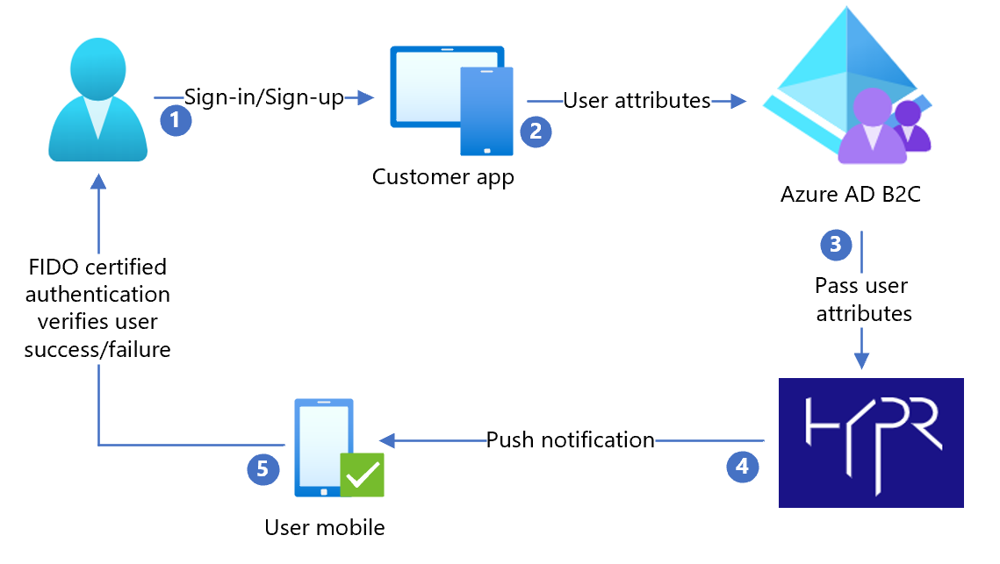

# Tutorial for configuring HYPR with Azure Active Directory B2C

In this sample tutorial, we provide guidance on how to configure Azure AD B2C with [HYPR](https://get.hypr.com). With Azure AD B2C as an identity provider, you can integrate HYPR with any of your customer applications to provide true passwordless authentication to your users. HYPR replaces passwords with Public key encryptions eliminating fraud, phishing, and credential reuse.

## Prerequisites

To get started, you'll need:

- An Azure AD subscription. If you don't have a subscription, you can get a [free account](https://azure.microsoft.com/free/).

- An [Azure AD B2C tenant](./tutorial-create-tenant.md). Tenant is linked to your Azure subscription.

- A HYPR cloud tenant, get a free [trial account](https://get.hypr.com/free-trial).

- A user's mobile device registered using the HYPR REST APIs or the HYPR Device Manager in your HYPR tenant. For example, you can use the [HYPR Java SDK](https://docs.hypr.com/integratinghypr/docs/hypr-java-web-sdk) to accomplish this task.

## Scenario description

The HYRP integration includes the following components:

- Azure AD B2C – The authorization server, responsible for verifying the user’s credentials, also known as the identity provider

- Web and mobile applications - Your mobile or web applications that you choose to protect with HYPR and Azure AD B2C. HYPR provides a robust mobile SDK also a mobile app that you can use on iOS and Android platforms to do true passwordless authentication.

- The HYPR mobile app - The HYPR mobile app can be used to execute this sample if prefer not to use the mobile SDKs in your own mobile applications.

- HYPR REST APIs - You can use the HYPR APIs to do both user device registration and authentication. These APIs can be found [here](https://apidocs.hypr.com).

The following architecture diagram shows the implementation.

|Step | Description |
|:-----| :-----------|
| 1. | User arrives at a login page. Users select sign-in/sign-up and enter username into the page.
| 2. | The application sends the user attributes to Azure AD B2C for identify verification.
| 3. | Azure AD B2C collects the user attributes and sends the attributes to HYPR to authenticate the user through the HYPR mobile app.
| 4. | HYPR sends a push notification to the registered user mobile device for a Fast Identity Online (FIDO) certified authentication. It can be a user finger print, biometric or decentralized pin.  
| 5. | After user acknowledges the push notification, user is either granted or denied access to the customer application based on the verification results.

## Configure the Azure AD B2C policy

1. Go to the [Azure AD B2C HYPR policy](https://github.com/HYPR-Corp-Public/Azure-AD-B2C-HYPR-Sample/tree/master/policy) in the Policy folder.

2. Follow this [document](tutorial-create-user-flows.md?pivots=b2c-custom-policy#custom-policy-starter-pack) to download [LocalAccounts starter pack](https://github.com/Azure-Samples/active-directory-b2c-custom-policy-starterpack/tree/master/LocalAccounts)

3. Configure the policy for the Azure AD B2C tenant.

>[!NOTE]
>Update the provided policies to relate to your specific tenant.

## Test the user flow

1. Open the Azure AD B2C tenant and under Policies select **Identity Experience Framework**.

2. Select your previously created **SignUpSignIn**.

3. Select **Run user flow** and select the settings:

   a. **Application**: select the registered app (sample is JWT)

   b. **Reply URL**: select the **redirect URL**

   c. Select **Run user flow**.

4. Go through sign-up flow and create an account

5. HYPR will be called during the flow, after user attribute is created. If the flow is incomplete, check that user isn't saved in the directory.

## Next steps

For additional information, review the following articles:

- [Custom policies in Azure AD B2C](./custom-policy-overview.md)

- [Get started with custom policies in Azure AD B2C](tutorial-create-user-flows.md?pivots=b2c-custom-policy)