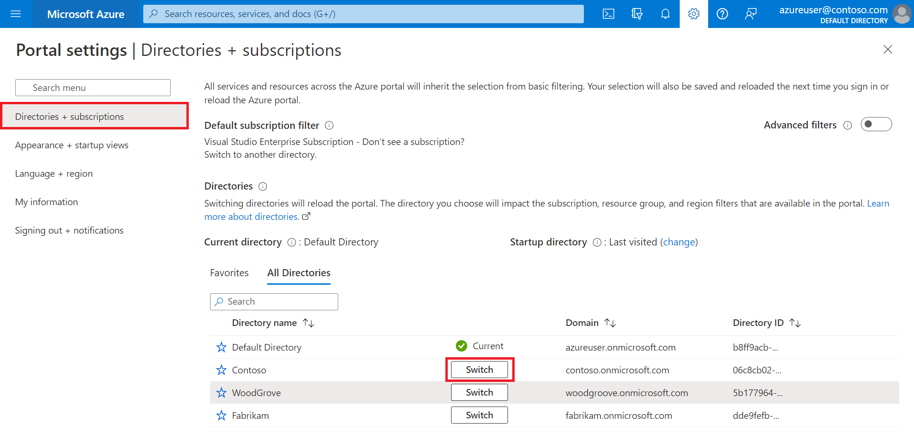
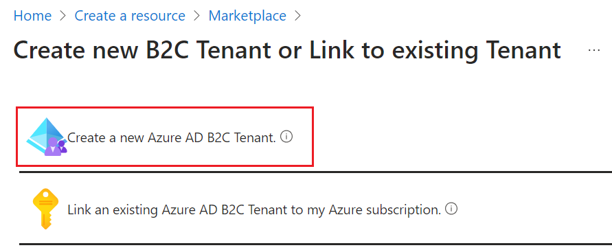
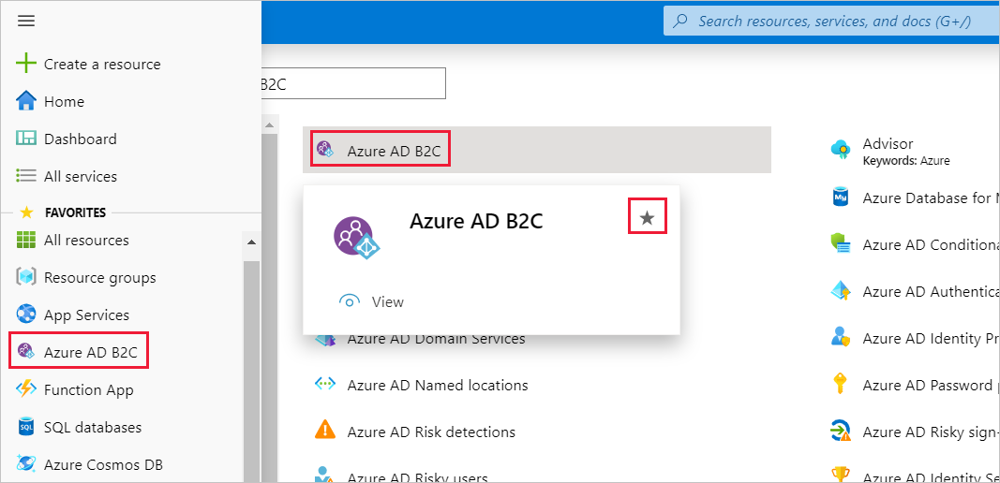

# Tutorial: Create an Azure Active Directory B2C tenant

Before your applications can interact with Azure Active Directory B2C (Azure AD B2C), they must be registered in a tenant that you manage. 

> [!NOTE]
> You can create up to 20 tenants per subscription. This limit helps protect against threats to your resources, such as denial-of-service attacks, and is enforced in both the Azure portal and the underlying tenant creation API. If you need to create more than 20 tenants, please contact [Microsoft Support](support-options.md).
> 
> If you want to reuse a tenant name that you previously tried to delete, but you see the error "Already in use by another directory" when you enter the domain name, you'll need to [follow these steps to fully delete the tenant first](./faq.yml?tabs=app-reg-ga#how-do-i-delete-my-azure-ad-b2c-tenant-). A role of at least Subscription Administrator is required. After deleting the tenant, you might also need to sign out and sign back in before you can reuse the domain name.

In this article, you learn how to:

> [!div class="checklist"]
> * Create an Azure AD B2C tenant
> * Link your tenant to your subscription
> * Switch to the directory containing your Azure AD B2C tenant
> * Add the Azure AD B2C resource as a **Favorite** in the Azure portal

You learn how to register an application in the next tutorial.

## Prerequisites

- An Azure subscription. If you don't have one, create a [free account](https://azure.microsoft.com/free/?WT.mc_id=A261C142F) before you begin.

- An Azure account that's been assigned at least the [Contributor](../role-based-access-control/built-in-roles.md) role within the subscription or a resource group within the subscription is required. 

## Create an Azure AD B2C tenant
>[!NOTE]
>If you're unable to create Azure AD B2C tenant, review your user settings page to ensure that tenant creation isn't switched off. If tenant creation is switched off, ask your _Global Administrator_ to assign you a _Tenant Creator_ role.

1. Sign in to the [Azure portal](https://portal.azure.com/). 

1. Make sure you're using the directory that contains your subscription:

    1. In the Azure portal toolbar, select the **Directories + subscriptions** filter icon. 
    
        

    1. Find the directory that contains your subscription and select the **Switch** button next to it. Switching a directory reloads the portal. If the directory that contains your subscription has the **Current** label next to it, you don't need to do anything. 

        

1. Add **Microsoft.AzureActiveDirectory** as a resource provider for the Azure subscription you're using ([learn more](../azure-resource-manager/management/resource-providers-and-types.md?WT.mc_id=Portal-Microsoft_Azure_Support#register-resource-provider-1)):

    1. On the Azure portal, search for and select **Subscriptions**.
    2. Select your subscription, and then in the left menu, select **Resource providers**. If you don't see the left menu, select the **Show the menu for < name of your subscription >** icon at the top left part of the page to expand it.
    3. Make sure the **Microsoft.AzureActiveDirectory** row shows a status of **Registered**. If it doesn't, select the row, and then select **Register**.

1. On the Azure portal menu or from the **Home** page, select **Create a resource**.

   

1. Search for **Azure Active Directory B2C**, and then select **Create**.
2. Select **Create a new Azure AD B2C Tenant**.

    

1. On the **Create a directory** page, enter the following:

   - **Organization name** - Enter a name for your Azure AD B2C tenant.
   - **Initial domain name** - Enter a domain name for your Azure AD B2C tenant.
   - **Country or region** - Select your country or region from the list. This selection can't be changed later.
   - **Subscription** - Select your subscription from the list.
   - **Resource group** - Select or search for the resource group that will contain the tenant.

    

1. Select **Review + create**.
1. Review your directory settings. Then select **Create**. Learn more about [troubleshooting deployment errors](../azure-resource-manager/templates/common-deployment-errors.md).

You can link multiple Azure AD B2C tenants to a single Azure subscription for billing purposes. To link a tenant, you must be an admin in the Azure AD B2C tenant and be assigned at least a Contributor role within the Azure subscription. See [Link an Azure AD B2C tenant to a subscription](billing.md#link-an-azure-ad-b2c-tenant-to-a-subscription).

> [!NOTE]
> When an Azure AD B2C directory is created, an application called `b2c-extensions-app`  is automatically created inside the new directory. Do not modify or delete it. The application is used by Azure AD B2C for storing user data. Learn more about [Azure AD B2C: Extensions app](extensions-app.md).

## Select your B2C tenant directory

To start using your new Azure AD B2C tenant, you need to switch to the directory that contains the tenant:
1. In the Azure portal toolbar, select the **Directories + subscriptions** filter icon.
1. On the **All Directories** tab, find the directory that contains your Azure AD B2C tenant and then select the **Switch** button next to it.

If at first you don't see your new Azure B2C tenant in the list, refresh your browser window or sign out and sign back in. Then in the Azure portal toolbar, select the **Directories + subscriptions** filter again.

## Add Azure AD B2C as a favorite (optional)

This optional step makes it easier to select your Azure AD B2C tenant in the following and all subsequent tutorials.

Instead of searching for *Azure AD B2C* in **All services** every time you want to work with your tenant, you can instead favorite the resource. Then, you can select it from the portal menu's **Favorites** section to quickly browse to your Azure AD B2C tenant.

You only need to perform this operation once. Before performing these steps, make sure you've switched to the directory containing your Azure AD B2C tenant as described in the previous section, [Select your B2C tenant directory](#select-your-b2c-tenant-directory).

1. Sign in to the [Azure portal](https://portal.azure.com).
1. In the Azure portal menu, select **All services**.
1. In the **All services** search box, search for **Azure AD B2C**, hover over the search result, and then select the star icon in the tooltip. **Azure AD B2C** now appears in the Azure portal under **Favorites**.
1. If you want to change the position of your new favorite, go to the Azure portal menu, select **Azure AD B2C**, and then drag it up or down to the desired position.

    

## Next steps

In this article, you learned how to:

> [!div class="checklist"]
> * Create an Azure AD B2C tenant
> * Link your tenant to your subscription
> * Switch to the directory containing your Azure AD B2C tenant
> * Add the Azure AD B2C resource as a **Favorite** in the Azure portal

Next, learn how to register a web application in your new tenant.

> [!div class="nextstepaction"]
> [Register your applications >](tutorial-register-applications.md)
