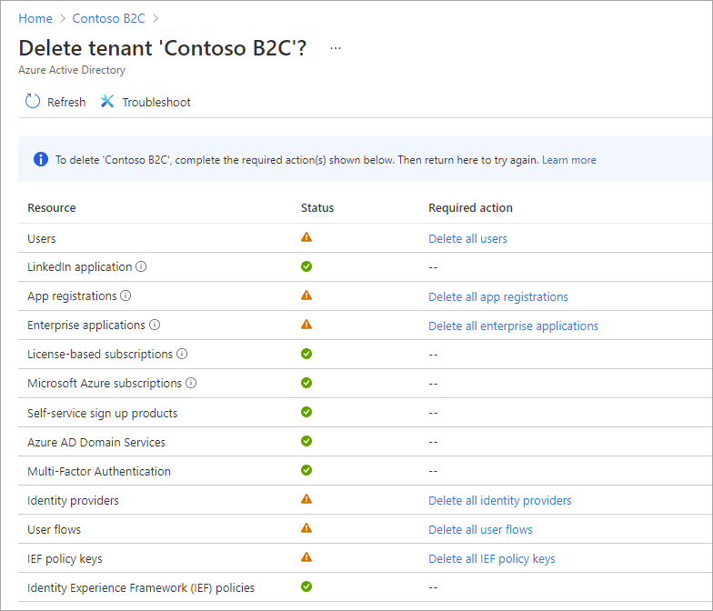
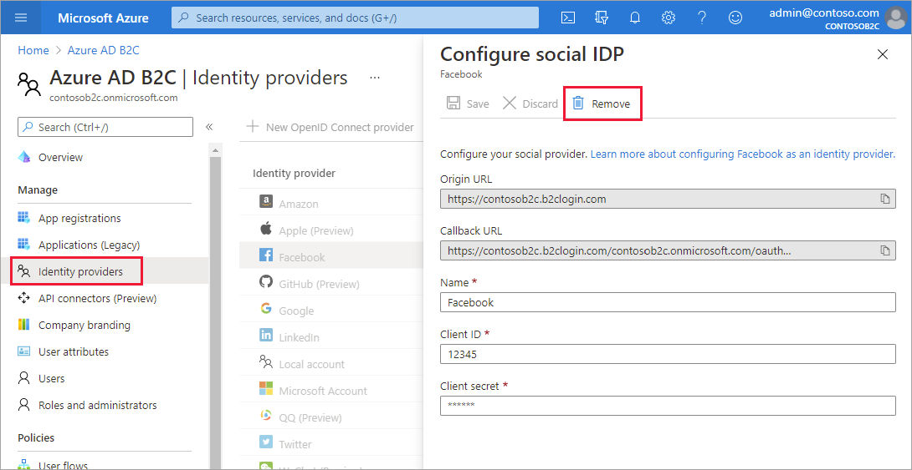

# Clean up resources and delete the tenant

When you've finished the Azure Active Directory B2C (Azure AD B2C) tutorials, you can delete the tenant you used for testing or training. To delete the tenant, you'll first need to delete all tenant resources. In this article, you'll:

> [!div class="checklist"]
> * Use the **Delete tenant** option to identify cleanup tasks
> * Delete tenant resources (user flows, identity providers, applications, users)
> * Delete the tenant

## Identify cleanup tasks

1. Sign in to the [Azure portal](https://portal.azure.com/) with a global administrator or subscription administrator role. Use the same work or school account or the same Microsoft account that you used to sign up for Azure.
1. Make sure you're using the directory that contains your Azure AD B2C tenant: 
    1. Select the **Directories + subscriptions** icon in the portal toolbar.
    1. On the **Portal settings | Directories + subscriptions** page, find your Azure AD B2C directory in the **Directory name** list, and then select **Switch** button next to it.
1. In the Azure portal, search for and select the **Microsoft Entra ID** service.
1. In the left menu, under **Manage**, select **Properties**.
1. Under **Access management for Azure resources**, select **Yes**, and then select **Save**.
1. Sign out of the Azure portal and then sign back in to refresh your access.
1. Repeat step two to make sure you're using the directory that contains your Azure AD B2C tenant.
1. In the Azure portal, search for and select the **Microsoft Entra ID** service
1. On the **Overview** page, select **Manage tenants**. 
1. On the **Manage tenants** page, select (by check marking) the tenant you want to delete, and then, at the top of the page, select the **Delete** button. The **Required action** column indicates the resources you need to remove before you can delete the tenant.

   

## Delete tenant resources

If you've the confirmation page open from the previous section, you can use the links in the **Required action** column to open the Azure portal pages where you can remove these resources. Or, you can remove tenant resources from within the Azure AD B2C service using the following steps.

1. Sign in to the [Azure portal](https://portal.azure.com/) with a global administrator or subscription administrator role. Use the same work or school account or the same Microsoft account that you used to sign up for Azure.
1. Make sure you're using the directory that contains your Azure AD B2C tenant:
    1.  Select the **Directories + subscriptions** icon in the portal toolbar.
    1. On the **Portal settings | Directories + subscriptions** page, find your Azure AD B2C directory in the **Directory name** list, and then select **Switch** button next to it.
1. In the Azure portal, select the **Azure AD B2C** service, or search for and select **Azure AD B2C**.
1. Delete all users *except* the admin account you're currently signed in as: 
    1. Under **Manage**, select **Users**. 
    1. On the **All users** page, select the checkbox next to each user (except the admin account you're currently signed in as). 
    1. At the top of the page, select **Delete user**, and then select **Yes** when prompted.

   

1. Delete app registrations and the *b2c-extensions-app*: 
    1. Under **Manage**, select **App registrations**. 
    1. Select the **All applications** tab. 
    1. Select an application to open it, and then select **Delete** button. Repeat for all applications, including the **b2c-extensions-app** application.

   

1. Delete any identity providers you configured: 
    1. Under **Manage**, select **Identity providers**. 
    1. Select an identity provider you configured, and then select **Remove**.

   

1. Delete user flows: 
    1. Under **Policies**, select **User flows**. 
    1. Next to each user flow, select the ellipses (...) and then select **Delete**.

   

1. Delete policy keys: 
    1. Under **Policies**, select **Identity Experience Framework**, and then select **Policy keys**. 
    1. Next to each policy key, select the ellipses (...) and then select **Delete**.

1. Delete custom policies: 
    1. Under **Policies**, select **Identity Experience Framework**, and then select **Custom policies**.
    1. Next to each Custom policy, select the ellipses (...) and then select **Delete**.

## Delete the tenant

Once you delete all the tenant resources, you can now delete the tenant itself: 

1. Sign in to the [Azure portal](https://portal.azure.com/) with a global administrator or subscription administrator role. Use the same work or school account or the same Microsoft account that you used to sign up for Azure.
1. Make sure you're using the directory that contains your Azure AD B2C tenant:
    1.  Select the **Directories + subscriptions** icon in the portal toolbar.
    1. On the **Portal settings | Directories + subscriptions** page, find your Azure AD B2C directory in the **Directory name** list, and then select **Switch** button next to it.
1. In the Azure portal, search for and select the **Microsoft Entra ID** service.
1. If you haven't already granted yourself access management permissions, do the following:

   1. Under **Manage**, select **Properties**.
   1. Under **Access management for Azure resources**, select **Yes**, and then select **Save**.
   1. Sign out of the Azure portal and then sign back in to refresh your access, and select the **Microsoft Entra ID** service.

1. On the **Overview** page, select **Manage tenants**.

   :::image type="content" source="media/tutorial-delete-tenant/manage-tenant.png" alt-text="Screenshot of how to manage tenant for deletion.":::

1. On the **Manage tenants** page, select (by check marking) the tenant you want to delete, and then, at the top of the page, select the **Delete** button
1. Follow the on-screen instructions to complete the process.

## Next steps

In this article, you learned how to:

> [!div class="checklist"]
> * Delete your tenant resources
> * Delete the tenant

Next, learn more about getting started with Azure AD B2C [user flows and custom policies](user-flow-overview.md).
