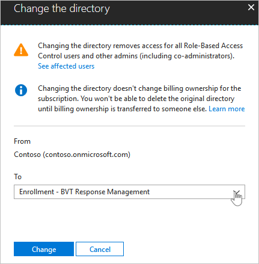
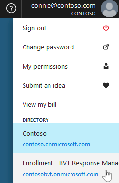

# How to associate or add an Azure subscription to Azure Active Directory

This article covers information about the relationship between an Azure subscription and Azure Active Directory (Azure AD), and how to add an existing subscription to your Azure AD directory. Your Azure subscription has a trust relationship with Azure AD, which means that it trusts the directory to authenticate users, services, and devices. Multiple subscriptions can trust the same directory, but each subscription trusts only one directory. 

The trust relationship that a subscription has with a directory is unlike the relationship that it has with other resources in Azure (websites, databases, and so on). If a subscription expires, access to the other resources associated with the subscription also stops. But an Azure AD directory remains in Azure, and you can associate a different subscription with that directory and manage the directory using the new subscription.

All users have a single home directory that authenticates them, but they can also be guests in other directories. In Azure AD, you can see the directories of which your user account is a member or guest.

## Before you begin

* You must sign in with account that has RBAC Owner access to the subscription.
* You must sign in with an account that exists in both the current directory with which the subscription is associated and in the directory you want to add it to. To learn more about getting access to another directory, see [How do Azure Active Directory admins add B2B collaboration users?](active-directory-b2b-admin-add-users.md)

## To associate an existing subscription to your Azure AD directory

1. Sign in and select a subscription from the [Subscriptions page in Azure portal](https://portal.azure.com/#blade/Microsoft_Azure_Billing/SubscriptionsBlade).
2. Click **Change directory**.

    
3. Review the warnings. All [Role-Based Access Control (RBAC)](role-based-access-control-configure.md) users with assigned access and all subscription admins lose access when the subscription directory changes.
4. Select a directory.

    
5. Click **Change**.
6. Success! Use the directory switcher to go to the new directory.

    

    

Changing the subscription directory is a service-level operation. It doesn't affect subscription billing ownership, and the Account Admin can still change Service Admin using the [Account Center](https://account.azure.com/subscriptions). If you want to delete the original directory, you must transfer the subscription billing ownership to a new Account Admin. To learn more about transferring billing ownership, see [Transfer ownership of an Azure subscription to another account](../billing/billing-subscription-transfer.md). 

## Next steps

* To learn more about creating a new Azure AD directory for free, see [How to get an Azure Active Directory tenant](develop/active-directory-howto-tenant.md)
* To learn more about transferring billing ownership of an Azure subscription, see [Transfer ownership of an Azure subscription to another account](../billing/billing-subscription-transfer.md)
* To learn more about how resource access is controlled in Microsoft Azure, see [Understanding resource access in Azure](active-directory-understanding-resource-access.md)
* For more information on how to assign roles in Azure AD, see [Assigning administrator roles in Azure Active Directory](active-directory-assign-admin-roles-azure-portal.md)

<!--Image references-->
[1]: ./media/active-directory-how-subscriptions-associated-directory/WAAD_PassThruAuth.png
[2]: ./media/active-directory-how-subscriptions-associated-directory/WAAD_OrgAccountSubscription.png
[3]: ./media/active-directory-how-subscriptions-associated-directory/WAAD_SignInDisambiguation.PNG
