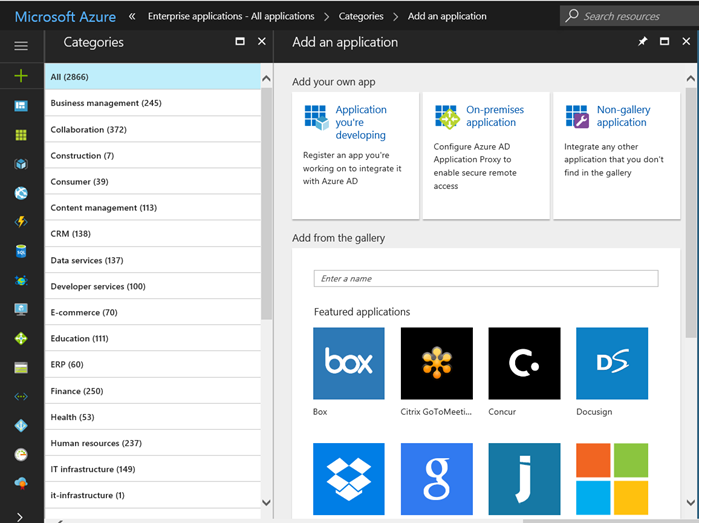
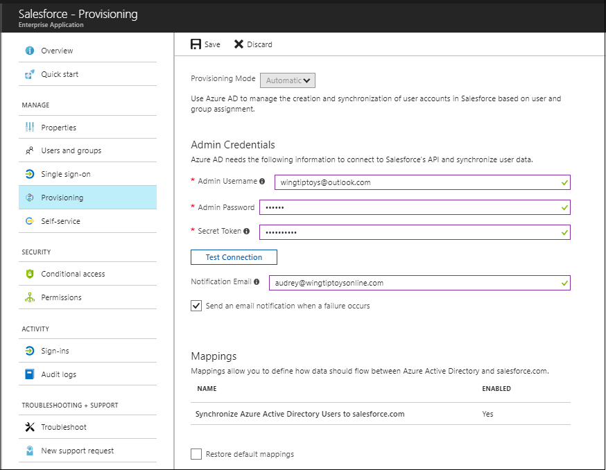
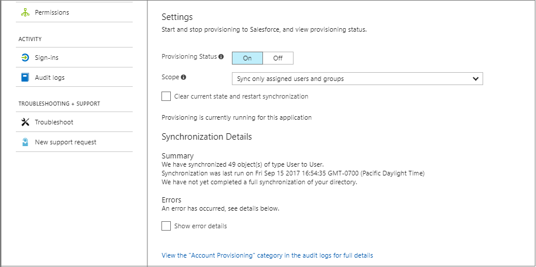
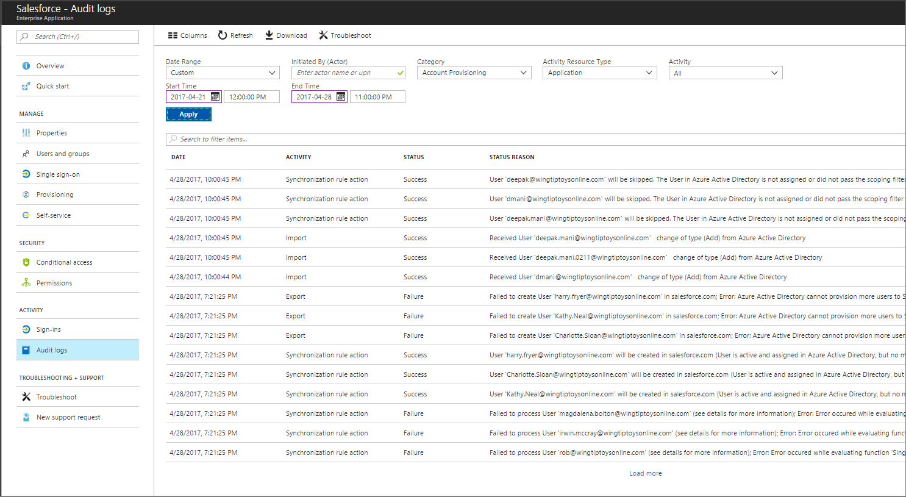

# Automate user provisioning and deprovisioning to SaaS applications with Azure Active Directory
## What is automated user provisioning for SaaS apps?
Azure Active Directory (Azure AD) allows you to automate the creation, maintenance, and removal of user identities in cloud ([SaaS](https://azure.microsoft.com/overview/what-is-saas/)) applications such as Dropbox, Salesforce, ServiceNow, and more.

**Below are some examples of what this feature allows you to do:**

* Automatically create new accounts in the right systems for new people when they join your team or organization.
* Automatically deactivate accounts in the right systems when people leave the team or organization.
* Ensure that the identities in your apps and systems are kept up-to-date based on changes in the directory, or your human resources system.
* Provision non-user objects, such as groups, to applications that support them.

**Automated user provisioning also includes the following functionality:**

* The ability to match existing identities between source and target systems.
* Customization options to help Azure AD fit the current configurations of the apps and systems that your organization is currently using.
* Optional email alerts for provisioning errors.
* Reporting and activity logs to help with monitoring and troubleshooting.

## Why use automated provisioning?
Some common motivations for using this feature include:

* To avoid the costs, inefficiencies, and human error associated with manual provisioning processes.
* To avoid the costs associated with hosting and maintaining custom-developed provisioning solutions and scripts
* To secure your organization by instantly removing users' identities from key SaaS apps when they leave the organization.
* To easily import a bulk number of users into a particular SaaS application or system.
* To enjoy the convenience of having your provisioning solution run off of the same app access policies that you defined for Azure AD Single Sign-On.

## How does automatic provisioning work?
	
The **Azure AD Provisioning Service** provisions users to SaaS apps and other systems, by connecting to user management API endpoints provided by each application vendor. These user management API endpoints allow Azure AD to programmatically create, update, and remove users. For selected applications the provisioning service can also create, update, and remove additional identity-related objects, such as groups and roles. 

*Figure 1: The Azure AD Provisioning Service*

*Figure 2: "Outbound" user provisioning workflow from Azure AD to popular SaaS applications*

*Figure 3: "Inbound" user provisioning workflow from popular Human Capital Management (HCM) applications to Azure Active Directory and Windows Server Active Directory*

## What applications and systems can I use with Azure AD automatic user provisioning?

Azure AD features pre-integrated support for a variety of popular SaaS apps and human resources systems, as well as generic support for apps that implement specific parts of the [SCIM 2.0 standard](https://docs.microsoft.com/azure/active-directory/active-directory-scim-provisioning).

All of the "Featured" apps in the Azure AD application gallery support automated user provisioning. [The list of featured apps can be viewed here.](https://azuremarketplace.microsoft.com/marketplace/apps/category/azure-active-directory-apps?page=1&subcategories=featured)

In order for an application to support automated user provisioning, it must first provide the necessary user management endpoints that allow for external programs to automate the creation, maintenance, and removal of users. Therefore, not all SaaS apps are compatible with this feature. For apps that do support user management APIs, the Azure AD engineering team will then be able to build a provisioning connector to those apps, and this work is prioritized by the needs of current and prospective customers. 

To contact the Azure AD engineering team to request provisioning support for additional applications, submit a message through the [Azure Active Directory feedback forum](https://feedback.azure.com/forums/374982-azure-active-directory-application-requests/category/172035-user-provisioning).	
	
	
## How do I set up automatic provisioning to an application?

Configuration of the Azure AD provisioning service for a selected application starts in the **[Azure portal](https://potal.azure.com)**. In the **Azure Active Directory > Enterprise Applications** section, select **Add**, then **All**, and then add either of the following depending on your scenario:

* All applications in the **Featured applications** section support automatic provisioning

* Use the “non-gallery application” option for custom-developed SCIM integrations

In the application management screen, provisioning is configured in the **Provisioning** tab.

* **Admin credentials** must be provided to the Azure AD provisioning service that will allow it to connect to the user management API provided by the application.

* **Attribute mappings** can be configured that specify which fields in the source system (example: Azure AD) will have their contents synchronized to which fields in the target system (example: ServiceNow). If the target application supports it, this section will allow you to optionally configure provisioning of groups in addition to user accounts. "Matching properties" allow you to select which fields are used to match accounts between the systems. "[Expressions](active-directory-saas-writing-expressions-for-attribute-mappings.md)" allow you to modify and transform the values retrieved from the source system before they are written to the target system. For more information, see [Customizing Attribute Mappings](active-directory-saas-customizing-attribute-mappings.md).

* **Scoping filters** tell the provisioning service which users and group in the source system should be provisioned and/or deprovisioned to the target system. There are two aspects to scoping filters that are evaluated together that determine who is in scope for provisioning:

* **Filter on attribute values** - The "Source Object Scope" menu in the attribute mappings allows filtering on specific attribute values. For example, you can specify that only users with a "Department" attribute of "Sales" should be in scope for provisioning.

* **Filter on assignments** - The "Scope" menu in the Provisioning > Settings section of the portal allows you to specify whether only "assigned" users and groups should be in scope for provisioning, or if all users in the Azure AD directory should be provisioned. For information on "assigning" users and groups, see [Assign a user or group to an enterprise app in Azure Active Directory](active-directory-coreapps-assign-user-azure-portal.md).
	
* **Settings** control the operation of the provisioning service for an application, including whether it is currently running or not.

* **Audit logs** provide records of every operation performed by the Azure AD provisioning service. For more details, see the [provisioning reporting guide](active-directory-saas-provisioning-reporting.md).

## What happens during provisioning?

1. When you enable provisioning for an application for the first time, the following actions are performed:
   * Azure AD will attempt to match any existing users in the SaaS app with their corresponding identities in the directory. When a user is matched, they are *not* automatically enabled for single sign-on. In order for a user to have access to the application, they must be explicitly assigned to the app in Azure AD, either directly or via group membership.
   * If you have already specified which users should be assigned to the application, and if Azure AD fails to find existing accounts for those users, Azure AD will provision new accounts for them in the application.
2. Once the initial synchronization has been completed as described above, Azure AD will check every 20 minutes for the following changes:
   * If new users have been assigned to the application (either directly or through group membership), then they are provisioned with a new account in the SaaS app.
   * If a user's access has been removed, then their account in the SaaS app is marked as disabled (users are never fully deleted, which protects you from data loss in the event of a misconfiguration).
   * If a user was recently assigned to the application and they already had an account in the SaaS app, that account is marked as enabled, and certain user properties may be updated if they are out-of-date compared to the directory.
   * If a user's information (such as phone number, office location) has been changed in the directory, then that information will also be updated in the SaaS application.

## Frequently asked questions
**How frequently does Azure AD write directory changes to the SaaS app?**

After an initial full sync has completed, the Azure AD provisioning service typically checks for changes every 20 minutes. 

If the SaaS app is returning several errors (such as in the case of invalid admin credentials), then Azure AD will gradually slow its frequency to up to once per day until the errors are fixed. When this happens, the Azure AD provisioning job goes into a "quarantine" state, and indicates this in the [provisioning summary report](active-directory-saas-provisioning-reporting.md).

**How long will it take to provision my users?**

After an initial full sync has completed, incremental changes typically happen within 20-40 minutes. If you are trying to provision most of your directory, then it depends on the number of users and groups you have. Performance is dependent on the performance of the user management APIs that the provisioning services uses to read data from the source system and write the data to the target system. 

Performance is also slower if there are many errors (recorded in the [audit logs](active-directory-saas-provisioning-reporting.md)) and the provisioning service has gone into a "quarantine" state.

**What is an initial full sync, and why does it take longer than subsequent syncs?**

The first time the Azure AD provisioning service is run for a given app, it takes a "snapshot" of the users (and optionally groups) in the source directory. This snapshot enables the provisioning service to reduce the number of round trips to the source and target APIs, and allows subsequent "delta" syncs to behave more efficiently. 

The initial full sync of users can often be completed in minutes for very small directories, but may take several hours for larger directories. Enterprise directories with hundreds of thousands of users may take many hours for the initial sync to complete. However, after initial sync, subsequent "delta" syncs happen much more quickly.

> [!NOTE]
> For applications that support provisioning of groups and group memberships, enabling this greatly increases the time it takes for a full sync to complete. If you do not want to provision group names and group memberships to your application, you can disable this in the [attribute mappings](active-directory-saas-customizing-attribute-mappings.md) of your provisioning configuration.

**How can I track the progress of the current provisioning job?**

See the [provisioning reporting guide](active-directory-saas-provisioning-reporting.md).

**How will I know if users fail to get provisioned properly?**

All failures are recorded in the Azure AD audit logs. For more information, see the [provisioning reporting guide](active-directory-saas-provisioning-reporting.md).

**How can I submit feedback to the engineering team?**

Contact us through the [Azure Active Directory feedback forum](https://feedback.azure.com/forums/169401-azure-active-directory/).

## Related articles
* [Article Index for Application Management in Azure Active Directory](active-directory-apps-index.md)
* [Customizing Attribute Mappings for User Provisioning](active-directory-saas-customizing-attribute-mappings.md)
* [Writing Expressions for Attribute Mappings](active-directory-saas-writing-expressions-for-attribute-mappings.md)
* [Scoping Filters for User Provisioning](active-directory-saas-scoping-filters.md)
* [Using SCIM to enable automatic provisioning of users and groups from Azure Active Directory to applications](active-directory-scim-provisioning.md)
* [Account Provisioning Notifications](active-directory-saas-account-provisioning-notifications.md)
* [List of Tutorials on How to Integrate SaaS Apps](active-directory-saas-tutorial-list.md)

