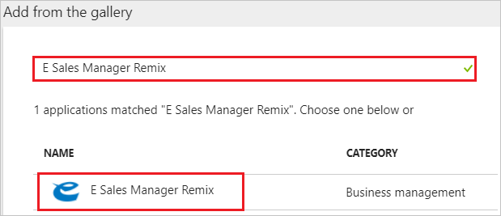
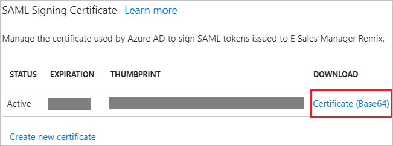
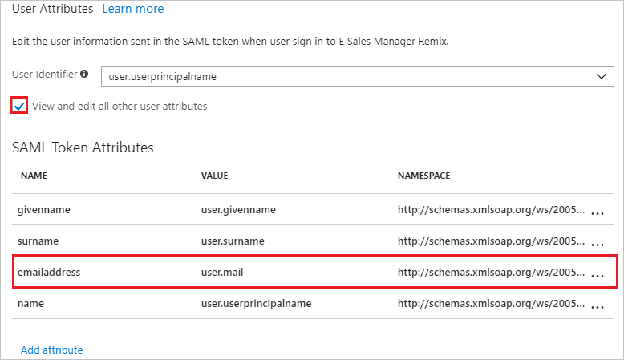
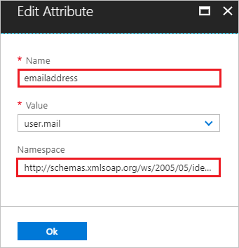
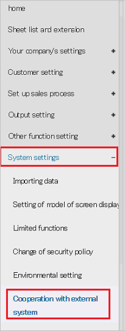
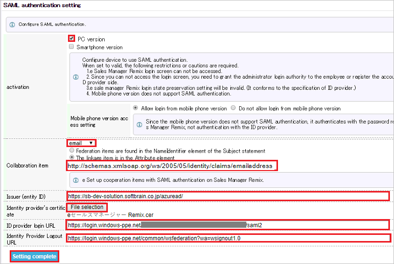
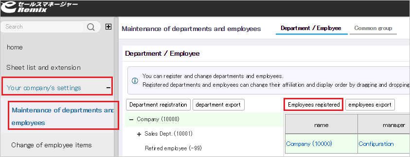
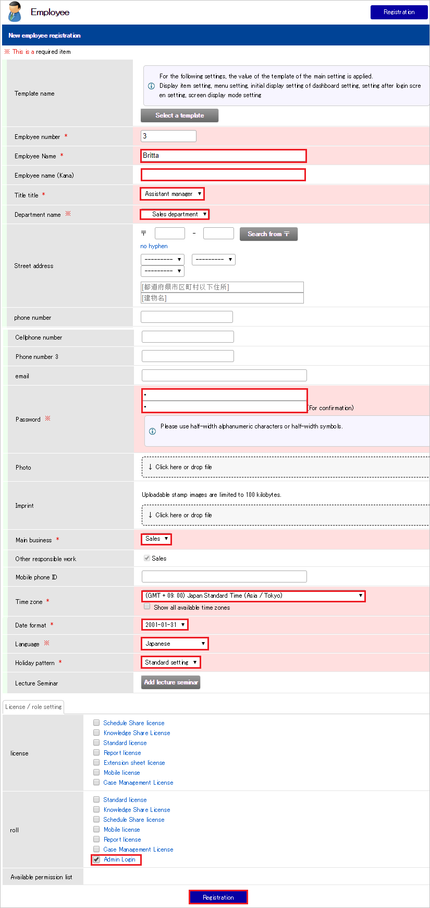

# Integrate Azure Active Directory with E Sales Manager Remix

In this tutorial, you learn how to integrate Azure Active Directory (Azure AD) with E Sales Manager Remix.

By integrating Azure AD with E Sales Manager Remix, you get the following benefits:

- You can control in Azure AD who has access to E Sales Manager Remix.
- You can enable your users to get signed in automatically to E Sales Manager Remix (single sign-on, or SSO) with their Azure AD accounts.
- You can manage your accounts in one central location, the Azure portal.

To learn more about SaaS app integration with Azure AD, see [What is application access and single sign-on with Azure Active Directory?](manage-apps/what-is-single-sign-on.md).

## Prerequisites

To configure Azure AD integration with E Sales Manager Remix, you need the following items:

- An Azure AD subscription
- An E Sales Manager Remix SSO-enabled subscription

> [!NOTE]
> When you test the steps in this tutorial, we recommend that you do *not* use a production environment.

To test the steps in this tutorial, follow these recommendations:

- Do not use your production environment, unless it is necessary.
- If you don't have an Azure AD trial environment, you can [get a one-month trial](https://azure.microsoft.com/pricing/free-trial/).

## Scenario description
In this tutorial, you test Azure AD single sign-on in a test environment. 

The scenario outlined in this tutorial consists of two main building blocks:

* Adding E Sales Manager Remix from the gallery
* Configuring and testing Azure AD single sign-on

## Add E Sales Manager Remix from the gallery
To configure the integration of Azure AD with E Sales Manager Remix, add E Sales Manager Remix from the gallery to your list of managed SaaS apps by doing the following:

1. In the [Azure portal](https://portal.azure.com), in the left pane, select **Azure Active Directory**. 

	![The Azure Active Directory button][1]

2. Select **Enterprise applications** > **All applications**.

	![The "Enterprise applications" window][2]
	
3. To add a new application, select **New application** at the top of the window.

	![The New application button][3]

4. In the search box, type **E Sales Manager Remix**, select **E Sales Manager Remix** in the results list, and then select **Add**.

	

## Configure and test Azure AD single sign-on

In this section, you configure and test Azure AD single sign-on with E Sales Manager Remix, based on a test user called "Britta Simon."

For single sign-on to work, Azure AD needs to identify the E Sales Manager Remix user and its counterpart in Azure AD. In other words, a link relationship between an Azure AD user and the same user in E Sales Manager Remix must be established.

To configure and test Azure AD single sign-on with E Sales Manager Remix, complete the building blocks in the next five sections:

### Configure Azure AD single sign-on

Enable Azure AD single sign-on in the Azure portal and configure single sign-on in your E Sales Manager Remix application by doing the following:

1. In the Azure portal, on the **E Sales Manager Remix** application integration page, select **Single sign-on**.

	![The "Single sign-on" link][4]

2. In the **Single sign-on** window, in the **Single Sign-on Mode** box, select **SAML-based Sign-on**.
 
	

3. Under **E Sales Manager Remix Domain and URLs**, do the following:

	

    a. In the **Sign-on URL** box, type a URL in the following format: *https://\<Server-Based-URL>/\<sub-domain>/esales-pc*.

	b. In the **Identifier** box, type a URL in the following format: *https://\<Server-Based-URL>/\<sub-domain>/*.

	c. Note the **Identifier** value for later use in this tutorial.
	
	> [!NOTE] 
	> The preceding values are not real. Update them with the actual sign-in URL and identifier. To obtain the values, contact [E Sales Manager Remix Client support team](mailto:esupport@softbrain.co.jp).

4. Under **SAML Signing Certificate**, select **Certificate (Base64)**, and then save the certificate file on your computer.

	 

5. Select the **View and edit all other user attributes** check box, and then select the **emailaddress** attribute.
	
	

    The **Edit Attribute** window opens.

6. Copy the **Namespace** and **Name** values. Generate the value in the pattern *\<Namespace>/\<Name>*, and save it for later use in this tutorial.

	

7. Under **E Sales Manager Remix Configuration**, select **Configure E Sales Manager Remix**.

	 

    The **Configure sign-on** window opens.

8. In the **Quick Reference** section, copy the sign-out URL and the SAML single sign-on service URL.

9. Select **Save**.

	

10. Sign in to your E Sales Manager Remix application as an administrator.

11. At the top right, select **To Administrator Menu**.

	

12. In the left pane, select **System settings** > **Cooperation with external system**.

	
	
13. In the **Cooperation with external system** window, select **SAML**.

	

14. Under **SAML authentication setting**, do the following:

	
	
	a. Select the **PC version** check box.
	
	b. In the **Collaboration item** section, in the drop-down list, select **email**.

	c. In the **Collaboration item** box, paste the claim value that you copied earlier from the Azure portal (that is, **http://schemas.xmlsoap.org/ws/2005/05/identity/claims/emailaddress**).

	d. In the **Issuer (entity ID)** box, paste the identifier value that you copied earlier from the **E Sales Manager Remix Domain and URLs** section of the Azure portal.

	e. To upload your downloaded certificate from the Azure portal, select **File selection**.

	f. In the **ID provider login URL** box, paste the SAML single sign-on service URL that you copied earlier in the Azure portal.

	g. In **Identity Provider Logout URL** box, paste the sign-out URL value that you copied earlier in the Azure portal.

	h. Select **Setting complete**.

> [!TIP]
> As you're setting up the app, you can read a concise version of the preceding instructions in the [Azure portal](https://portal.azure.com). After you've added the app in the **Active Directory** > **Enterprise Applications** section, select the **Single Sign-On** tab, and then access the embedded documentation in the **Configuration** section at the bottom. For more information about the embedded documentation feature, see [Azure AD embedded documentation]( https://go.microsoft.com/fwlink/?linkid=845985).
> 

### Create an Azure AD test user

In this section, you create test user Britta Simon in the Azure portal by doing the following:

![Create an Azure AD test user][100]

1. In the Azure portal, in the left pane, select **Azure Active Directory**.

    

2. To display a list of current users, select **Users and groups** > **All users**.

    

3. At the top of the **All Users** window, select **Add**.

    
    
    The **User** window opens.

4. In the **User** window, do the following:

    

    a. In the **Name** box, type **BrittaSimon**.

    b. In the **User name** box, type the email address of user Britta Simon.

    c. Select the **Show Password** check box, and then note the value that's displayed in the **Password** box.

    d. Select **Create**.
 
### Create an E Sales Manager Remix test user

1. Sign on to your E Sales Manager Remix application as an administrator.

2. Select **To Administrator Menu** from the menu at the top right.

	

3. Select **Your company's settings** > **Maintenance of departments and employees**, and then select **Employees registered**.

	

4. In the **New employee registration** section, do the following:
	
	

	a. In the **Employee Name** box, type the name of the user (for example, **Britta**).

	b. Complete the remaining required fields.
	
	c. If you enable SAML, the administrator cannot sign in from the sign-in page. Grant administrator sign-in privileges to the user by selecting the **Admin Login** check box.

	d. Select **Registration**.

5. In the future, to sign in as an administrator, sign in as the user who has administrator permissions and then, at the top right, select **To Administrator Menu**.

	

### Assign the Azure AD test user

In this section, you enable user Britta Simon to use Azure single sign-on by granting access to E Sales Manager Remix. To do so, do the following: 

![Assign the user role][200] 

1. In the Azure portal, open the **Applications** view, go to the **Directory** view, and then select **Enterprise applications** > **All applications**.

	![The "Enterprise applications" and "All applications" links][201] 

2. In the **Applications** list, select **E Sales Manager Remix**.

	  

3. In the left pane, select **Users and groups**.

	![The "Users and groups" link][202]

4. Select **Add** and then, in the **Add Assignment** pane, select **Users and groups**.

	![The Add Assignment pane][203]

5. In the **Users and groups** window, in the **Users** list, select **Britta Simon**.

6. Select the **Select** button.

7. In the **Add Assignment** window, select **Assign**.
	
### Test single sign-on

In this section, you test your Azure AD single sign-on configuration by using the Access Panel.

When you select the E Sales Manager Remix tile in the Access Panel, you should be signed in automatically to your E Sales Manager Remix application.

For more information about the Access Panel, see [Introduction to the Access Panel](active-directory-saas-access-panel-introduction.md). 

## Additional resources

* [List of tutorials about integrating SaaS apps with Azure Active Directory](active-directory-saas-tutorial-list.md)
* [What is application access and single sign-on with Azure Active Directory?](manage-apps/what-is-single-sign-on.md)

<!--Image references-->

[1]: ./media/active-directory-saas-esalesmanagerremix-tutorial/tutorial_general_01.png
[2]: ./media/active-directory-saas-esalesmanagerremix-tutorial/tutorial_general_02.png
[3]: ./media/active-directory-saas-esalesmanagerremix-tutorial/tutorial_general_03.png
[4]: ./media/active-directory-saas-esalesmanagerremix-tutorial/tutorial_general_04.png

[100]: ./media/active-directory-saas-esalesmanagerremix-tutorial/tutorial_general_100.png

[200]: ./media/active-directory-saas-esalesmanagerremix-tutorial/tutorial_general_200.png
[201]: ./media/active-directory-saas-esalesmanagerremix-tutorial/tutorial_general_201.png
[202]: ./media/active-directory-saas-esalesmanagerremix-tutorial/tutorial_general_202.png
[203]: ./media/active-directory-saas-esalesmanagerremix-tutorial/tutorial_general_203.png

