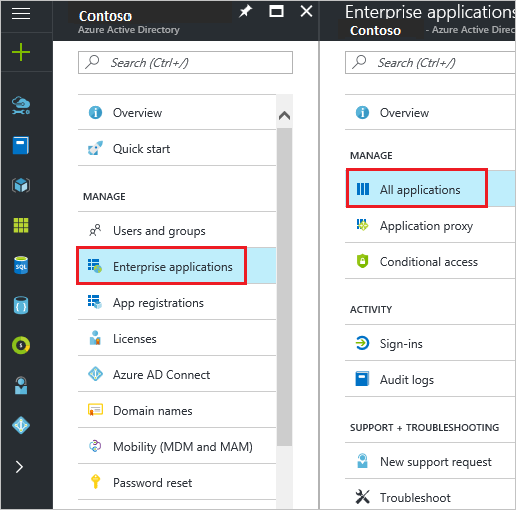
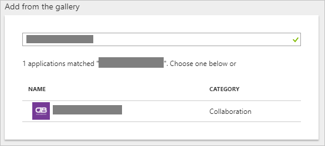
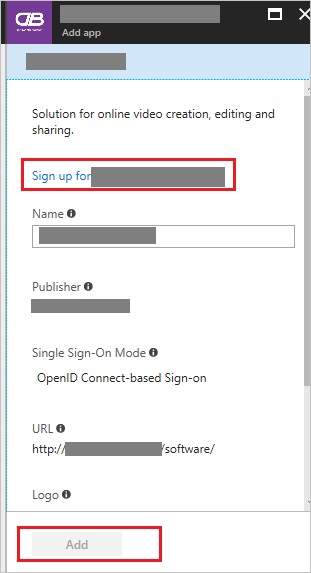
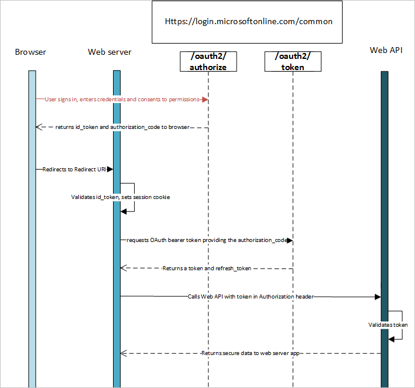
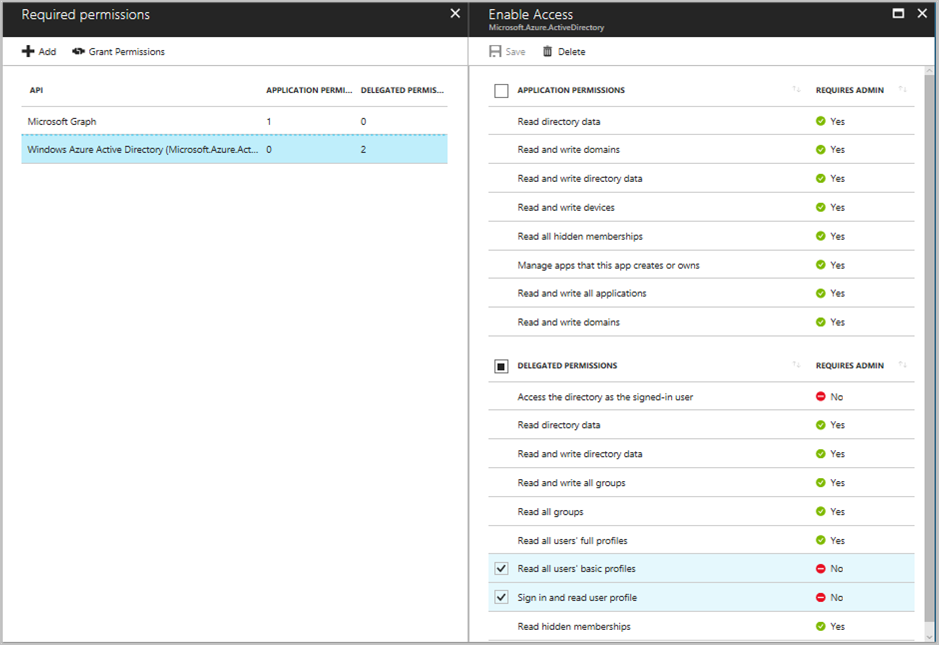
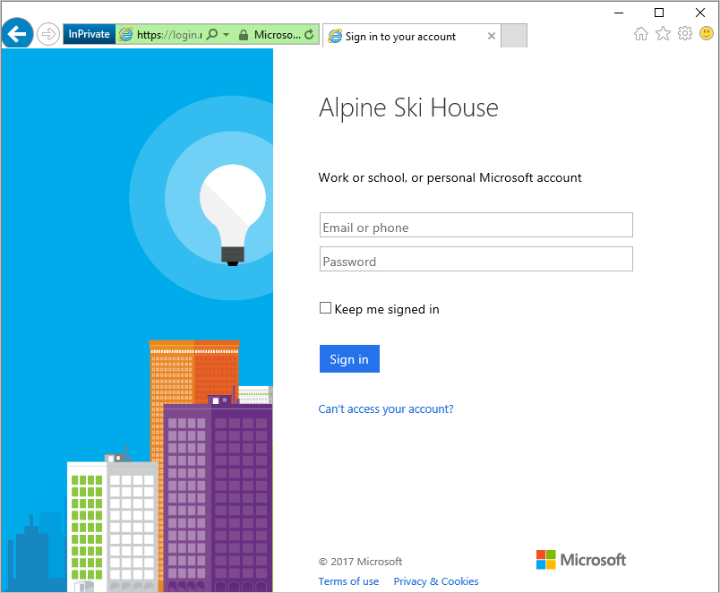
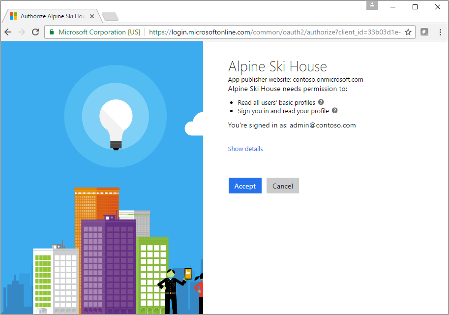
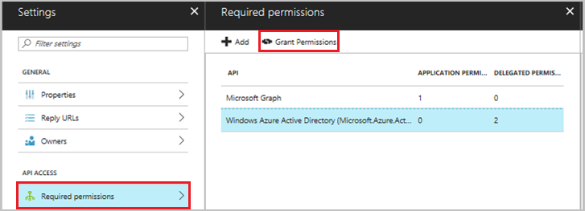

# Steps to configure an OpenID/OAuth application from Azure AD App gallery

## Process of Open ID application addition from gallery

1. In the **[Azure portal](https://portal.azure.com)**, on the left navigation panel, click **Azure Active Directory** icon. 

	

2. Navigate to **Enterprise applications**. Then go to **All applications**.

	

3. To add new application, click **New application** button on the top of dialog.

	

4. In the search box, type **Application name**, select the **desired application** from result panel and sign up to the application.

    

    > [!NOTE]
    > For Open ID Connect and OAuth apps the Add button is disabled by default. Here the tenant admin should click on the **sign-up** button and provide the consent to the application. With that that the application will get added into the customer tenant, no need to add explicitly, and do the configurations.

    

5. When you click on sign up link, you are redirected to Azure AD page for login credentials.

6. After successful authentication, user has to accept the consent from consent page and after that, the application homepage will be displayed.

	> [!NOTE]
    > Customers are allowed to only add one instance of the application. If you have already added one and tried to provide the consent again it will not be added again in the tenant. So logically they can use only one app instance in the tenant.

## Authentication flow using OpenID Connect

The most basic sign-in flow contains the following steps - each of them is described in detail below.

* **Multi-tenant application** - A multi-tenant application is intended for use in many organizations, not just one organization. These are typically software-as-a-service (SaaS) applications written by an independent software vendor (ISV). Multi-tenant applications need to be provisioned in each directory where they will be used, which requires user or administrator consent to register them. This consent process starts when an application has been registered in the directory and is given access to the Graph API or perhaps another web API. When a user or administrator from a different organization sign up to use the application, they are presented with a dialog that displays the permissions the application requires. The user or administrator can then consent to the application, which gives the application access to the stated data, and finally registers the application in their directory.

    > [!NOTE]
    > If you are making your application available to users in multiple directories, you need a mechanism to determine which tenant they’re in. A single tenant application only needs to look in its own directory for a user, while a multi-tenant application needs to identify a specific user from all the directories in Azure AD. To accomplish this task, Azure AD provides a common authentication endpoint where any multi-tenant application can direct sign-in requests, instead of a tenant-specific endpoint. This endpoint is [https://login.microsoftonline.com/common](https://login.microsoftonline.com/common) for all directories in Azure AD, whereas a tenant-specific endpoint might be [https://login.microsoftonline.com/contoso.onmicrosoft.com](https://login.microsoftonline.com/contoso.onmicrosoft.com). The common endpoint is especially important to consider when developing your application because you’ll need the necessary logic to handle multiple tenants during sign-in, sign-out, and token validation.

Azure AD team by default promotes multi-tenant application as that can be easily accessed across various organizations and is easy to use after accepting the consent.

## What is Consent Framework?

The Azure AD consent framework makes it easy to develop multi-tenant web and native client applications. These applications allow sign-in by user accounts from an Azure AD tenant, different from the one where the application is registered. They may also need to access web APIs such as the Microsoft Graph API (to access Azure Active Directory, Intune, and services in Office 365) and other Microsoft services' APIs, in addition to your own web APIs. The framework is based on a user or an administrator giving consent to an application that asks to be registered in their directory, which may involve accessing directory data. After consent is given, the client application will be able to call the Microsoft Graph API on behalf of the user, and use the information as needed.

The [Microsoft Graph API](https://graph.microsoft.io/) provides access to data in Office 365 (like calendars and messages from Exchange, sites and lists from SharePoint, documents from OneDrive, notebooks from OneNote, tasks from Planner, workbooks from Excel, etc.), as well as users and groups from Azure AD and other data objects from more Microsoft cloud services.

The following steps show you how the consent experience works for both the application developer and user.

1. Assume you have a web client application that needs to request specific permissions to access a resource/API. The Azure portal is used to declare permission requests at configuration time. Like other configuration settings, they become part of the application's Azure AD registration:

    

2. Consider that your application’s permissions have been updated, the application is running, and a user is about to use it for the first time. First the application needs to obtain an authorization code from Azure AD’s /authorize endpoint. The authorization code can then be used to acquire a new access and refresh token.

3. If the user is not already authenticated, Azure AD's /authorize endpoint prompts for sign-in.

    

4. After the user has signed in, Azure AD will determine if the user needs to be shown a consent page. This determination is based on whether the user (or their organization’s administrator) has already granted the application consent. If consent has not already been granted, Azure AD prompts the user for consent and displays the required permissions it needs to function. The set of permissions that is displayed in the consent dialog match the ones selected in the Delegated Permissions in the Azure portal.

    

Some permissions can be consented to by a regular user, while others require a tenant administrator’s consent.

## What’s the difference between Admin consent and User consent?

As an administrator, you can also consent to an application's delegated permissions on behalf of all the users in your tenant. Administrative consent prevents the consent dialog from appearing for every user in the tenant and can be done in the Azure portal by users with the administrator role. From the Settings page for your application, click Required Permissions and click on the Grant Permissions button.

> [!NOTE]
> Granting explicit consent using the Grant Permissions button is currently required for single page applications (SPA) that use ADAL.js. Otherwise, the application fails when the access token is requested.

App-only permissions always require a tenant administrator’s consent. If your application requests an app-only permission and a user tries to sign in to the application, an error message is displayed saying the user isn’t able to consent.

If your application uses permissions that require admin consent, you need to have a gesture such as a button or link where the admin can initiate the action. The request your application sends for this action is the usual OAuth2/OpenID Connect authorization request that also includes the prompt=admin_consent query string parameter. Once the admin has consented and the service principal is created in the customer’s tenant, subsequent sign-in requests do not need the prompt=admin_consent parameter. Since the administrator has decided the requested permissions are acceptable, no other users in the tenant are prompted for consent from that point forward. A tenant administrator can disable the ability for regular users to consent to applications. If this capability is disabled, admin consent is always required for the application to be used in the tenant. If you want to test your application with end-user consent disabled, you can find the configuration switch in the [Azure portal](https://portal.azure.com/) in the [User settings](https://portal.azure.com/#blade/Microsoft_AAD_IAM/StartboardApplicationsMenuBlade/UserSettings/menuId/) section under **Enterprise applications**

The prompt=admin_consent parameter can also be used by applications that request permissions that do not require admin consent. An example of when this would be used is if the application requires an experience where the tenant admin “signs up” one time, and no other users are prompted for consent from that point on.

If an application requires admin consent and an admin signs in without the prompt=admin_consent parameter being sent, when the admin successfully consents to the application it applies only for their user account. Regular users will still not be able to sign in or consent to the application. This feature is useful if you want to give the tenant administrator the ability to explore your application before allowing other users access.