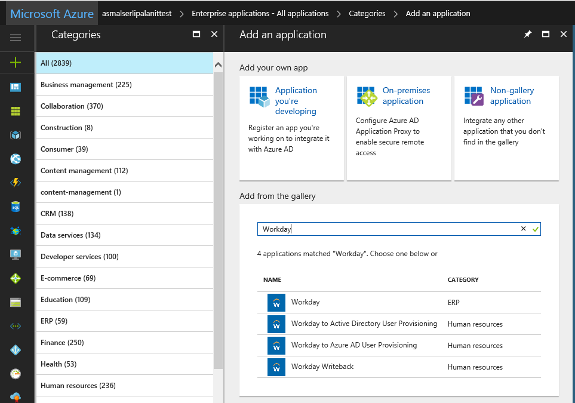
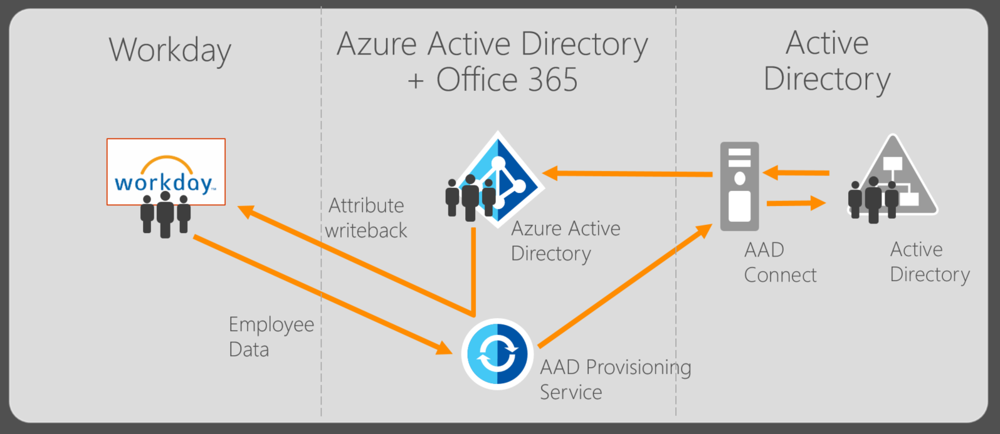
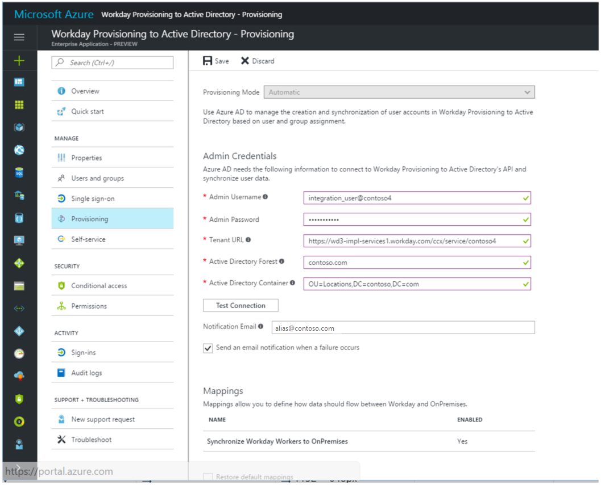
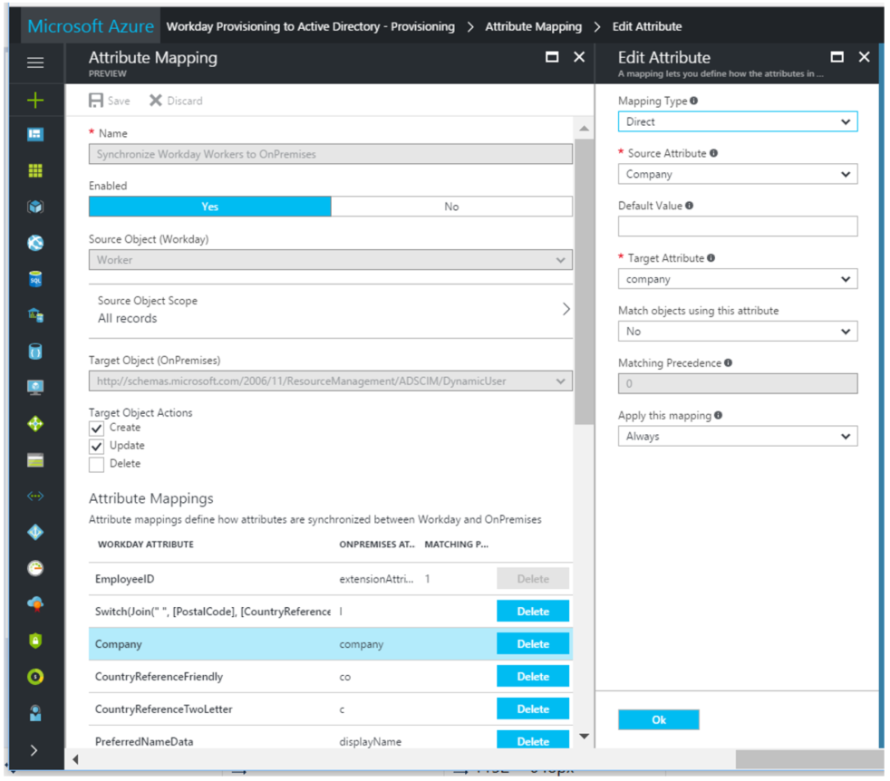
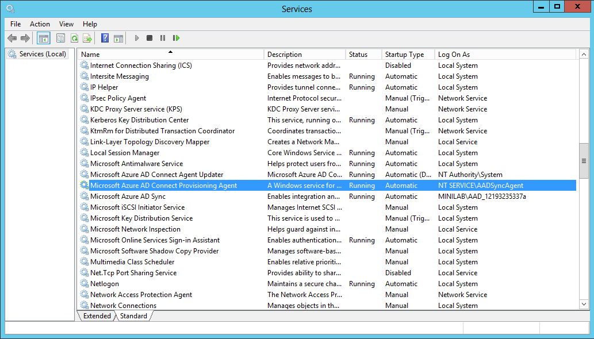
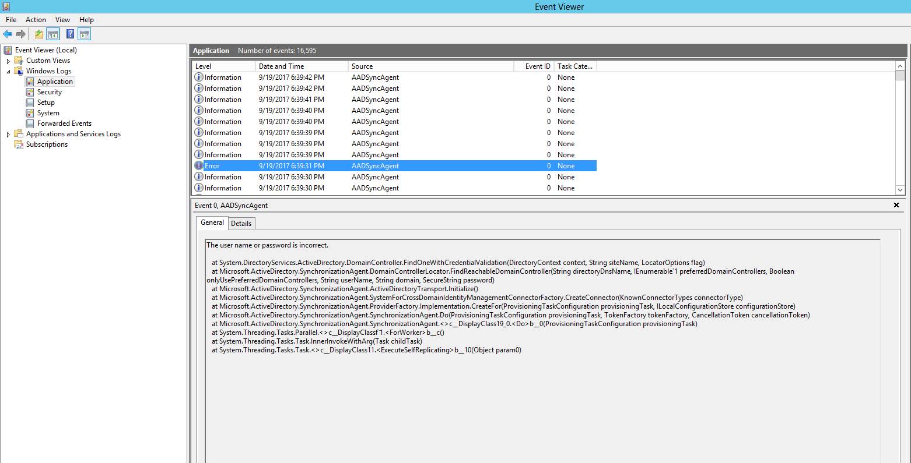
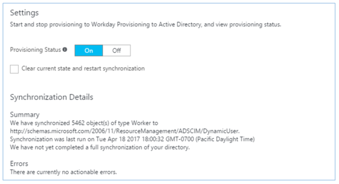
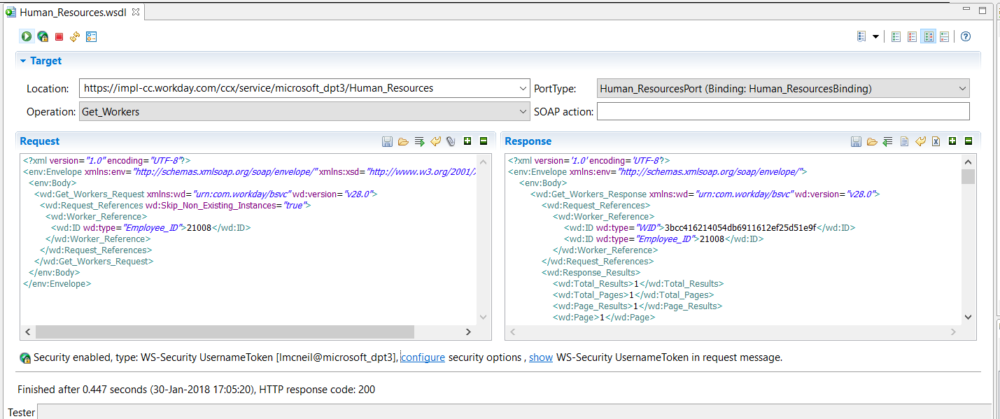
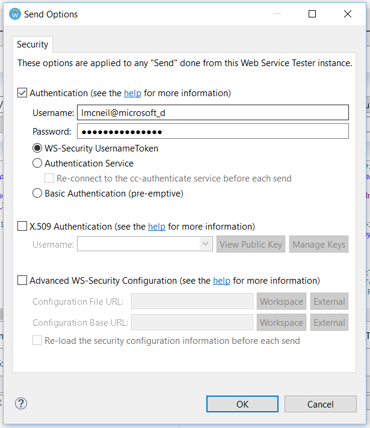
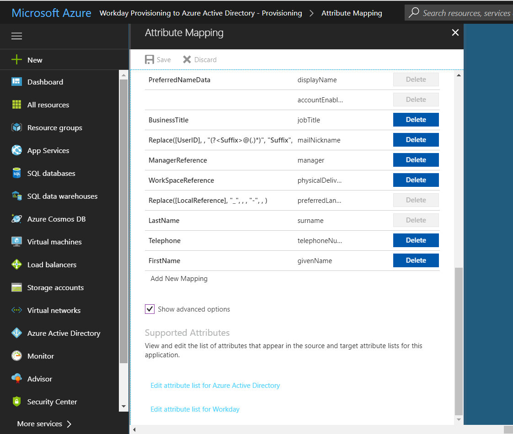

# Tutorial: Configure Workday for automatic user provisioning

The objective of this tutorial is to show you the steps you need to perform to import people from Workday into both Active Directory and Azure Active Directory, with optional writeback of some attributes to Workday. 


## Overview

The [Azure Active Directory user provisioning service](active-directory-saas-app-provisioning.md) integrates with the [Workday Human Resources API](https://community.workday.com/sites/default/files/file-hosting/productionapi/Human_Resources/v21.1/Get_Workers.html) in order to provision user accounts. Azure AD uses this connection to enable the following user provisioning workflows:

* **Provisioning users to Active Directory** - Synchronize selected sets of users from Workday into one or more Active Directory forests. 

* **Provisioning cloud-only users to Azure Active Directory** - Hybrid users who exist in both Active Directory and Azure Active Directory can be provisioned into the latter using [AAD Connect](connect/active-directory-aadconnect.md). However, users that are cloud-only can be provisioned directly from Workday to Azure Active Directory using the Azure AD user provisioning service.

* **Writeback of email addresses to Workday** - the Azure AD user provisioning service can write selected Azure AD user attributes back to Workday, such as the email address.

### Scenarios covered

The Workday user provisioning workflows supported by the Azure AD user provisioning service enable automation of the following human resources and identity lifecycle management scenarios:

* **Hiring new employees** - When a new employee is added to Workday, a user account will be automatically created in Active Directory, Azure Active Directory, and optionally Office 365 and [other SaaS applications supported by Azure AD](active-directory-saas-app-provisioning.md), with write-back of the email address to Workday.

* **Employee attribute and profile updates** - When an employee record is updated in Workday (such as their name, title, or manager), their user account will be automatically updated in Active Directory, Azure Active Directory, and optionally Office 365 and [other SaaS applications supported by Azure AD](active-directory-saas-app-provisioning.md).

* **Employee terminations** - When an employee is terminated in Workday, their user account is automatically disabled in Active Directory, Azure Active Directory, and optionally Office 365 and [other SaaS applications supported by Azure AD](active-directory-saas-app-provisioning.md).

* **Employee re-hires** - When an employee is rehired in Workday, their old account can be automatically reactivated or re-provisioned (depending on your preference) to Active Directory, Azure Active Directory, and optionally Office 365 and [other SaaS applications supported by Azure AD](active-directory-saas-app-provisioning.md).


## Planning your solution

Before beginning your Workday integration, check the prerequisites below and read the following guidance on how to match your current Active Directory architecture and user provisioning requirements with the solution(s) provided by Azure Active Directory.

### Prerequisites

The scenario outlined in this tutorial assumes that you already have the following items:

* A valid Azure AD Premium P1 subscription with global administrator access
* A Workday implementation tenant for testing and integration purposes
* Administrator permissions in Workday to create a system integration user, and make changes to test employee data for testing purposes
* For user provisioning to Active Directory, a domain-joined server running Windows Service 2012 or greater is required to host the [on-premises synchronization agent](https://go.microsoft.com/fwlink/?linkid=847801)
* [Azure AD Connect](connect/active-directory-aadconnect.md) for synchronizing between Active Directory and Azure AD


### Solution architecture

Azure AD provides a rich set of provisioning connectors to help you solve provisioning and identity lifecycle management from Workday to Active Directory, Azure AD, SaaS apps, and beyond. Which features you will use and how you set up the solution will vary depending on your organization's environment and requirements. As a first step, take stock of how many of the following are present and deployed in your organization:

* How many Active Directory Forests are in use?
* How many Active Directory Domains are in use?
* How many Active Directory Organizational Units (OUs) are in use?
* How many Azure Active Directory tenants are in use?
* Are there users who need to be provisioned to both Active Directory and Azure Active Directory (e.g. "hybrid" users)?
* Are there users who need to be provisioned to Azure Active Directory, but not Active Directory (e.g. "cloud-only" users)?
* Do user email addresses need to be written back to Workday?

Once you have answers to these questions, you can plan your Workday provisioning deployment by following the guidance below.

#### Using provisioning connector apps

Azure Active Directory supports pre-integrated provisioning connectors for Workday and a large number of other SaaS applications. 

A single provisioning connector interfaces with the API of a single source system, and helps provision data to a single target system. Most provisioning connectors that Azure AD supports are for a single source and target system (e.g. Azure AD to ServiceNow), and can be set up by adding the app in question from the Azure AD app gallery (e.g. ServiceNow). 

There is a one-to-one relationship between provisioning connector instances and app instances in Azure AD:

| Source System | Target System |
| ---------- | ---------- | 
| Azure AD tenant | SaaS application |


However, when working with Workday and Active Directory, there are multiple source and target systems to be considered:

| Source System | Target System | Notes |
| ---------- | ---------- | ---------- |
| Workday | Active Directory Forest | Each forest is treated as a distinct target system |
| Workday | Azure AD tenant | As required for cloud-only users |
| Active Directory Forest | Azure AD tenant | This flow is handled by AAD Connect today |
| Azure AD tenant | Workday | For writeback of email addresses |

To facilitate these multiple workflows to multiple source and target systems, Azure AD provides multiple provisioning connector apps that you can add from the Azure AD app gallery:



* **Workday to Active Directory Provisioning** - This app facilitates user account provisioning from Workday to a single Active Directory forest. If you have multiple forests, you can add one instance of this app from the Azure AD app gallery for each Active Directory forest you need to provision to.

* **Workday to Azure AD Provisioning** - While AAD Connect is the tool that should be used to synchronize Active Directory users to Azure Active Directory, this app can be used to facilitate provisioning of cloud-only users from Workday to a single Azure Active Directory tenant.

* **Workday Writeback** - This app facilitates writeback of user's email addresses from Azure Active Directory to Workday.

> [!TIP]
> The regular "Workday" app is used for setting up single sign-on between Workday and Azure Active Directory. 

How to set up and configure these special provisioning connector apps is the subject of the remaining sections of this tutorial. Which apps you choose to configure will depend on which systems you need to provision to, and how many Active Directory Forests and Azure AD tenants are in your environment.



## Configure a system integration user in Workday
A common requirement of all the Workday provisioning connectors is they require credentials for a Workday system integration account to connect to the Workday Human Resources API. This section describes how to create a system integrator account in Workday.

> [!NOTE]
> It is possible to bypass this procedure and instead use a Workday global administrator account as the system integration account. This may work fine for demos, but is not recommended for production deployments.

### Create an integration system user

**To create an integration system user:**

1. Sign into your Workday tenant using an administrator account. In the **Workday Workbench**, enter create user in the search box, and then click **Create Integration System User**. 
   
    
2. Complete the **Create Integration System User** task by supplying a user name and password for a new Integration System User.  
 * Leave the **Require New Password at Next Sign In** option unchecked, because this user will be logging on programmatically. 
 * Leave the **Session Timeout Minutes** with its default value of 0, which will prevent the user’s sessions from timing out prematurely. 
   
    

### Create a security group
You need to create an unconstrained integration system security group and assign the user to it.

**To create a security group:**

1. Enter create security group in the search box, and then click **Create Security Group**. 
   
    
2. Complete the **Create Security Group** task.  
3. Select Integration System Security Group—Unconstrained from the **Type of Tenanted Security Group** dropdown.
4. Create a security group to which members will be explicitly added. 
   
    

### Assign the integration system user to the security group

**To assign the integration system user:**

1. Enter edit security group in the search box, and then click **Edit Security Group**. 
   
    
2. Search for, and select the new integration security group by name. 
   
    
3. Add the new integration system user to the new security group. 
   
      

### Configure security group options
In this step, you'll grant domain security policy permissions for the worker data secured by the following domain security policies:


| Operation | Domain Security Policy |
| ---------- | ---------- | 
| Get and Put |  External Account Provisioning |
| Get and Put | Worker Data: Public Worker Reports |
| Get and Put | Worker Data: All Positions |
| Get and Put | Worker Data: Current Staffing Information |
| Get and Put | Worker Data: Business Title on Worker Profile |
| View and Modify | Worker Data: Work Email |

**To configure security group options:**

1. Enter domain security policies in the search box, and then click on the link **Domain Security Policies for Functional Area**.  
   
      
2. Search for system and select the **System** functional area.  Click **OK**.  
   
      
3. In the list of security policies for the System functional area, expand **Security Administration** and select the domain security policy **External Account Provisioning**.  
   
      
4. Click **Edit Permissions**, and then, on the **Edit Permissions** dialog page, add the new security group to the list of security groups with **Get** and **Put** integration permissions. 
   
      
5. Repeat step 1 above to return to the screen for selecting functional areas, and this time, search for staffing, select the **Staffing functional area** and click **OK**.
   
      
6. In the list of security policies for the Staffing functional area, expand **Worker Data: Staffing** and repeat step 4 above for each of these remaining security policies:

   * Worker Data: Public Worker Reports
   * Worker Data: All Positions
   * Worker Data: Current Staffing Information
   * Worker Data: Business Title on Worker Profile
   
7. Repeat step 1, above, to return to the screen for selecting
    functional areas, and this time, search for **Contact Information**,
    select the Staffing functional area, and click **OK**.

8.  In the list of security policies for the Staffing functional area,
    expand **Worker Data: Work Contact Information**, and repeat step 4
    above for the security policies below:

    * Worker Data: Work Email

      
    
### Activate security policy changes

**To activate security policy changes:**

1. Enter activate in the search box, and then click on the link **Activate Pending Security Policy Changes**. 
   
     
2. Begin the Activate Pending Security Policy Changes task by entering a comment for auditing purposes, and then click **OK**. 
   
       
3. Complete the task on the next screen by checking the checkbox **Confirm**, and then click **OK**. 
   
      

## Configuring user provisioning from Workday to Active Directory
Follow these instructions to configure user account provisioning from Workday to each Active Directory forest that you require provisioning to.

### Part 1: Adding the provisioning connector app and creating the connection to Workday

**To configure Workday to Active Directory provisioning:**

1.  Go to <https://portal.azure.com>

2.  In the left navigation bar, select **Azure Active Directory**

3.  Select **Enterprise Applications**, then **All Applications**.

4.  Select **Add an application**, and select the **All** category.

5.  Search for **Workday Provisioning to Active Directory**, and add that app from the gallery.

6.  After the app is added and the app details screen is shown, select **Provisioning**

7.  Change the **Provisioning** **Mode** to **Automatic**

8.  Complete the **Admin Credentials** section as follows:

   * **Admin Username** – Enter the username of the Workday
        integration system account, with the tenant domain name
        appended. **Should look something like: username@contoso4**

   * **Admin password –** Enter the password of the Workday
        integration system account

   * **Tenant URL –** Enter the URL to the Workday web services
        endpoint for your tenant. This should look like:
        https://wd3-impl-services1.workday.com/ccx/service/contoso4,
        where contoso4 is replaced with your correct tenant name and
        wd3-impl is replaced with the correct environment string.

   * **Active Directory Forest -** The “Name” of your Active
        Directory forest, as returned by the Get-ADForest powershell
        commandlet. This is typically a string like: *contoso.com*

   * **Active Directory Container -** Enter the container string that
        contains all users in your AD forest. Example: *OU=Standard
        Users,OU=Users,DC=contoso,DC=test*

   * **Notification Email –** Enter your email address, and check the
        “send email if failure occurs” checkbox.

   * Click the **Test Connection** button. If the connection test succeeds, click the **Save** button at
        the top. If it fails, double-check that the Workday credentials are valid
        in Workday. 



### Part 2: Configure attribute mappings 

In this section, you will configure how user data flows from Workday to
Active Directory.

1.  On the Provisioning tab under **Mappings**, click **Synchronize
    Workday Workers to OnPremises**.

2.  In the **Source Object Scope** field, you can select which sets of
    users in Workday should be in scope for provisioning to AD, by
    defining a set of attribute-based filters. The default scope is “all
    users in Workday”. Example filters:

   * Example: Scope to users with Worker IDs between 1000000 and
        2000000

      * Attribute: WorkerID

      * Operator: REGEX Match

      * Value: (1[0-9][0-9][0-9][0-9][0-9][0-9])

   * Example: Only employees and not contingent workers 

      * Attribute: EmployeeID

      * Operator: IS NOT NULL

3.  In the **Target Object Actions** field, you can globally filter what
    actions are allowed to be performed on Active Directory. **Create**
    and **Update** are most common.

4.  In the **Attribute mappings** section, you can define how individual
    Workday attributes map to Active Directory attributes.

5. Click on an existing attribute mapping to update it, or click **Add new mapping** at the bottom of the screen to add new
        mappings. An individual attribute mapping supports these properties:

      * **Mapping Type**

         * **Direct** – Writes the value of the Workday attribute
                to the AD attribute, with no changes

         * **Constant** - Write a static, constant string value to
                the AD attribute

         * **Expression** – Allows you to write a custom value to
                the AD attribute, based on one or more Workday
                attributes. [For more info, see this article on
                expressions](active-directory-saas-writing-expressions-for-attribute-mappings.md).

      * **Source attribute** - The user attribute from Workday. If the attribute you are looking for is not present, see [Customizing the list of Workday user attributes](#customizing-the-list-of-workday-user-attributes).

      * **Default value** – Optional. If the source attribute has
            an empty value, the mapping will write this value instead.
            Most common configuration is to leave this blank.

      * **Target attribute** – The user attribute in Active
            Directory.

      * **Match objects using this attribute** – Whether or not this
            mapping should be used to uniquely identify users between
            Workday and Active Directory. This is typically set on the
            Worker ID field for Workday, which is typically mapped to
            one of the Employee ID attributes in Active Directory.

      * **Matching precedence** – Multiple matching attributes can
            be set. When there are multiple, they are evaluated in the
            order defined by this field. As soon as a match is found, no
            further matching attributes are evaluated.

      * **Apply this mapping**
       
         * **Always** – Apply this mapping on both user creation
                and update actions

         * **Only during creation** - Apply this mapping only on
                user creation actions

6. To save your mappings, click **Save** at the top of the
        Attribute Mapping section.



**Below are some example attribute mappings between Workday and Active
Directory, with some common expressions**

-   The expression that maps to the parentDistinguishedName attribute
    is used to provision a users to different OUs based on one or
    more Workday source attributes. This example here places users in
    different OUs based on what city they are in.

-   The userPrincipalName attribute in Active Directory is generated by concatenating the Workday user ID with a domain suffix

-   [There is documentation on writing expressions here](active-directory-saas-writing-expressions-for-attribute-mappings.md). This includes examples on how to remove special characters.

  
| WORKDAY ATTRIBUTE | ACTIVE DIRECTORY ATTRIBUTE |  MATCHING ID? | CREATE / UPDATE |
| ---------- | ---------- | ---------- | ---------- |
| **WorkerID**  |  EmployeeID | **Yes** | Written on create only | 
| **UserID**    |  cn    |   |   Written on create only |
| **Join("@",[UserID], "contoso.com")**   | userPrincipalName     |     | Written on create only 
| **Replace(Mid(Replace(\[UserID\], , "(\[\\\\/\\\\\\\\\\\\\[\\\\\]\\\\:\\\\;\\\\|\\\\=\\\\,\\\\+\\\\\*\\\\?\\\\&lt;\\\\&gt;\])", , "", , ), 1, 20), , "([\\\\.)\*\$](file:///\\.)*$)", , "", , )**      |    sAMAccountName            |     |         Written on create only |
| **Switch(\[Active\], , "0", "True", "1",)** |  accountDisabled      |     | Create + update |
| **FirstName**   | givenName       |     |    Create + update |
| **LastName**   |   sn   |     |  Create + update |
| **PreferredNameData**  |  displayName |     |   Create + update |
| **Company**         | company   |     |  Create + update |
| **SupervisoryOrganization**  | department  |     |  Create + update |
| **ManagerReference**   | manager  |     |  Create + update |
| **BusinessTitle**   |  title     |     |  Create + update | 
| **AddressLineData**    |  streetAddress  |     |   Create + update |
| **Municipality**   |   l   |     | Create + update |
| **CountryReferenceTwoLetter**      |   co |     |   Create + update |
| **CountryReferenceTwoLetter**    |  c  |     |         Create + update |
| **CountryRegionReference** |  st     |     | Create + update |
| **WorkSpaceReference** | physicalDeliveryOfficeName    |     |  Create + update |
| **PostalCode**  |   postalCode  |     | Create + update |
| **PrimaryWorkTelephone**  |  telephoneNumber   |     | Create + update |
| **Fax**      | facsimileTelephoneNumber     |     |    Create + update |
| **Mobile**  |    mobile       |     |       Create + update |
| **LocalReference** |  preferredLanguage  |     |  Create + update |                                               
| **Switch(\[Municipality\], "OU=Standard Users,OU=Users,OU=Default,OU=Locations,DC=contoso,DC=com", "Dallas", "OU=Standard Users,OU=Users,OU=Dallas,OU=Locations,DC=contoso,DC=com", "Austin", "OU=Standard Users,OU=Users,OU=Austin,OU=Locations,DC=contoso,DC=com", "Seattle", "OU=Standard Users,OU=Users,OU=Seattle,OU=Locations,DC=contoso,DC=com", “London", "OU=Standard Users,OU=Users,OU=London,OU=Locations,DC=contoso,DC=com")**  | parentDistinguishedName     |     |  Create + update |
  
### Part 3: Configure the on-premises synchronization agent

In order to provision to Active Directory on-premises, an agent must be
installed on a domain-joined server in the desire Active Directory
forest. Domain admin (or Enterprise admin) credentials are required to
complete the procedure.

**[You can download the on-premises synchronization agent here](https://go.microsoft.com/fwlink/?linkid=847801)**

After installing agent, run the Powershell commands below to configure the agent for your environment.

**Command #1**

> cd C:\\Program Files\\Microsoft Azure Active Directory Synchronization
Agent\\Modules\\AADSyncAgent

> import-module AADSyncAgent.psd1

**Command #2**

> Add-ADSyncAgentActiveDirectoryConfiguration

* Input: For "Directory Name", enter the AD Forest name, as entered in part \#2
* Input: Admin username and password for Active Directory forest

**Command #3**

> Add-ADSyncAgentAzureActiveDirectoryConfiguration

* Input: Global admin username and password for your Azure AD tenant

>[!IMPORTANT]
>There is presently a known issue with global administrator credentials not working if they use a custom domain (example: admin@contoso.com). As a workaround, create and use a global administrator account with an onmicrosoft.com domain (example: admin@contoso.onmicrosoft.com)


**Command #4**

> Get-AdSyncAgentProvisioningTasks

* Action: Confirm data is returned. This command automatically discovers Workday provisioning apps in your Azure AD tenant. Example output:

> Name          : My AD Forest
>
> Enabled       : True
>
> DirectoryName : mydomain.contoso.com
>
> Credentialed  : False
>
> Identifier    : WDAYdnAppDelta.c2ef8d247a61499ba8af0a29208fb853.4725aa7b-1103-41e6-8929-75a5471a5203

**Command #5**

> Start-AdSyncAgentSynchronization -Automatic

**Command #6**

> net stop aadsyncagent

**Command #7**

> net start aadsyncagent

>[!TIP]
>In addition to the "net" commands in Powershell, the synchronization agent service can also be started and stopped using **Services.msc**. If you get errors when running the Powershell commands, ensure that the **Microsoft Azure AD Connect Provisioning Agent** is running in **Services.msc**.

  

**Additional configuration for customers in the European Union**

If your Azure Active Directory tenant is located in one of the EU data centers, then follow the additional steps below.

1. Open **Services.msc** , and stop the **Microsoft Azure AD Connect Provisioning Agent** service.
2. Go to the agent installation folder (example: C:\Program Files\Microsoft Azure AD Connect Provisioning Agent).
3. Open **SyncAgnt.exe.config** in a text editor.
4. Replace https://manage.hub.syncfabric.windowsazure.com/Management with **https://eu.manage.hub.syncfabric.windowsazure.com/Management**
5. Replace https://provision.hub.syncfabric.windowsazure.com/Provisioning with **https://eu.provision.hub.syncfabric.windowsazure.com/Provisioning**
6. Save the **SyncAgnt.exe.config** file.
7. Open **Services.msc**, and start the **Microsoft Azure AD Connect Provisioning Agent** service.

**Agent troubleshooting**

The [Windows Event Log](https://technet.microsoft.com/en-us/library/cc722404(v=ws.11).aspx) on the Windows Server machine hosting the agent contains events for all operations performed by the agent. To view these events:
	
1. Open **Eventvwr.msc**.
2. Select **Windows Logs > Application**.
3. View all events logged under the source **AADSyncAgent**. 
4. Check for errors and warnings.

If there is a permissions problem with either the Active Directory or Azure Active Directory credentials provided in the Powershell commands, you will see an error such as this one: 
	
 


### Part 4: Start the service
Once parts 1-3 have been completed, you can start the provisioning service back in the Azure portal.

1.  In the **Provisioning** tab, set the **Provisioning Status** to **On**.

2. Click **Save**.

3. This will start the initial sync, which can take a variable number of hours depending on how many users are in Workday.

4. At any time, check the **Audit logs** tab in the Azure portal to see what actions the provisioning service has performed. The audit logs lists all individual sync events performed by the provisioning service, such as which users are being read out of Workday and then subsequently added or updated to Active Directory. **[See the provisioning reporting guide for detailed instructions on how to read the audit logs](active-directory-saas-provisioning-reporting.md)**

5.  Check the [Windows Event Log](https://technet.microsoft.com/en-us/library/cc722404(v=ws.11).aspx) on the Windows Server machine hosting the agent for any new errors or warnings. These events are viewable by launching **Eventvwr.msc** on the server and selecting **Windows Logs > Application**. All provisioning-related messages are logged under the source **AADSyncAgent**. 
	

6. One completed, it will write an audit summary report in the
    **Provisioning** tab, as shown below.




## Configuring user provisioning to Azure Active Directory
How you configure provisioning to Azure Active Directory will depend on your provisioning requirements, as detailed in the table below.

| Scenario | Solution |
| -------- | -------- |
| **Users need to be provisioned to Active Directory and Azure AD** | Use **[AAD Connect](connect/active-directory-aadconnect.md)** |
| **Users need to be provisioned to Active Directory only** | Use **[AAD Connect](connect/active-directory-aadconnect.md)** |
| **Users need to be provisioned to Azure AD only (cloud only)** | Use the **Workday to Azure Active Directory provisioning** app in the app gallery |

For instructions on setting up Azure AD Connect, see the [Azure AD Connect documentation](connect/active-directory-aadconnect.md).

The following sections describe setting up a connection between Workday and Azure AD to provision cloud-only users.

> [!IMPORTANT]
> Only follow the procedure below if you have cloud-only users that need to be provisioned to Azure AD and not on-premises Active Directory.

### Part 1: Adding the Azure AD provisioning connector app and creating the connection to Workday

**To configure Workday to Azure Active Directory provisioning for cloud-only users:**

1.  Go to <https://portal.azure.com>.

2.  In the left navigation bar, select **Azure Active Directory**

3.  Select **Enterprise Applications**, then **All Applications**.

4.  Select **Add an application**, and then select the **All** category.

5.  Search for **Workday to Azure AD provisioning**, and add that app from the gallery.

6.  After the app is added and the app details screen is shown, select **Provisioning**

7.  Change the **Provisioning** **Mode** to **Automatic**

8.  Complete the **Admin Credentials** section as follows:

   * **Admin Username** – Enter the username of the Workday
        integration system account, with the tenant domain name
        appended. Should look something like: username@contoso4

   * **Admin password –** Enter the password of the Workday
        integration system account

   * **Tenant URL –** Enter the URL to the Workday web services
        endpoint for your tenant. This should look like:
        https://wd3-impl-services1.workday.com/ccx/service/contoso4,
        where contoso4 is replaced with your correct tenant name and
        wd3-impl is replaced with the correct environment string. If this URL is not known, please work with your Workday integration partner or support representative to determine the correct URL to use.

   * **Notification Email –** Enter your email address, and check the
        “send email if failure occurs” checkbox.

   * Click the **Test Connection** button.

   * If the connection test succeeds, click the **Save** button at
        the top. If it fails, double-check that the Workday URL and credentials are valid
        in Workday.


### Part 2: Configure attribute mappings 

In this section, you will configure how user data flows from Workday to
Azure Active Directory for cloud-only users.

1.  On the Provisioning tab under **Mappings**, click **Synchronize
    Workers to Azure AD**.

2.   In the **Source Object Scope** field, you can select which sets of
    users in Workday should be in scope for provisioning to Azure AD, by
    defining a set of attribute-based filters. The default scope is “all
    users in Workday”. Example filters:

   * Example: Scope to users with Worker IDs between 1000000 and
        2000000

      * Attribute: WorkerID

      * Operator: REGEX Match

      * Value: (1[0-9][0-9][0-9][0-9][0-9][0-9])

   * Example: Only contingent workers and not regular employees

      * Attribute: ContingentID

      * Operator: IS NOT NULL

3.  In the **Target Object Actions** field, you can globally filter what
    actions are allowed to be performed on Azure AD. **Create**
    and **Update** are most common.

4.  In the **Attribute mappings** section, you can define how individual
    Workday attributes map to Active Directory attributes.

5. Click on an existing attribute mapping to update it, or click **Add new mapping** at the bottom of the screen to add new
        mappings. An individual attribute mapping supports these properties:

   * **Mapping Type**

      * **Direct** – Writes the value of the Workday attribute
                to the AD attribute, with no changes

      * **Constant** - Write a static, constant string value to
                the AD attribute

      * **Expression** – Allows you to write a custom value to
                the AD attribute, based on one or more Workday
                attributes. [For more info, see this article on
                expressions](active-directory-saas-writing-expressions-for-attribute-mappings.md).

   * **Source attribute** - The user attribute from Workday. If the attribute you are looking for is not present, see [Customizing the list of Workday user attributes](#customizing-the-list-of-workday-user-attributes).

   * **Default value** – Optional. If the source attribute has
            an empty value, the mapping will write this value instead.
            Most common configuration is to leave this blank.

   * **Target attribute** – The user attribute in Azure AD.

   * **Match objects using this attribute** – Whether or not this
            mapping should be used to uniquely identify users between
            Workday and Azure AD. This is typically set on the
            Worker ID field for Workday, which is typically mapped to
            the Employee ID attribute (new) or an extension attribute in Azure AD.

   * **Matching precedence** – Multiple matching attributes can
            be set. When there are multiple, they are evaluated in the
            order defined by this field. As soon as a match is found, no
            further matching attributes are evaluated.

   * **Apply this mapping**

     * **Always** – Apply this mapping on both user creation
                and update actions

     * **Only during creation** - Apply this mapping only on
                user creation actions

6. To save your mappings, click **Save** at the top of the
        Attribute Mapping section.

### Part 3: Start the service
Once parts 1-2 have been completed, you can start the provisioning service.

1.  In the **Provisioning** tab, set the **Provisioning Status** to
    **On**.

2. Click **Save**.

3. This will start the initial sync, which can take a variable number
    of hours depending on how many users are in Workday.

4. Individual sync events can be viewed in the **Audit Logs** tab. **[See the provisioning reporting guide for detailed instructions on how to read the audit logs](active-directory-saas-provisioning-reporting.md)**

5. One completed, it will write an audit summary report in the
    **Provisioning** tab, as shown below.


## Configuring writeback of email addresses to Workday
Follow these instructions to configure writeback of user email addresses from Azure Active Directory to Workday.

### Part 1: Adding the provisioning connector app and creating the connection to Workday

**To configure Workday to Active Directory provisioning:**

1.  Go to <https://portal.azure.com>

2.  In the left navigation bar, select **Azure Active Directory**

3.  Select **Enterprise Applications**, then **All Applications**.

4.  Select **Add an application**, then select the **All** category.

5.  Search for **Workday Writeback**, and add that app from the gallery.

6.  After the app is added and the app details screen is shown, select **Provisioning**

7.  Change the **Provisioning** **Mode** to **Automatic**

8.  Complete the **Admin Credentials** section as follows:

   * **Admin Username** – Enter the username of the Workday
        integration system account, with the tenant domain name
        appended. Should look something like: username@contoso4

   * **Admin password –** Enter the password of the Workday
        integration system account

   * **Tenant URL –** Enter the URL to the Workday web services
        endpoint for your tenant. This should look like:
        https://wd3-impl-services1.workday.com/ccx/service/contoso4,
        where contoso4 is replaced with your correct tenant name and
        wd3-impl is replaced with the correct environment string (if
        necessary).

   * **Notification Email –** Enter your email address, and check the
        “send email if failure occurs” checkbox.

   * Click the **Test Connection** button. If the connection test succeeds, click the **Save** button at
        the top. If it fails, double-check that the Workday URL and credentials are valid
        in Workday.


### Part 2: Configure attribute mappings 


In this section, you will configure how user data flows from Workday to
Active Directory.

1.  On the Provisioning tab under **Mappings**, click **Synchronize
    Azure AD Users to Workday**.

2.  In the **Source Object Scope** field, you can optionally filter which sets of
    users in Azure Active Directory should have their email addresses written back to Workday. The default scope is “all
    users in Azure AD”. 

3.  In the **Attribute mappings** section, you can define how individual
    Workday attributes map to Active Directory attributes. There is a mapping for the email address by default. However, the matching ID must be updated to match users in Azure AD with their corresponding entries in Workday. A popular matching method is to synchronize the Workday worker ID or employee ID to extensionAttribute1-15 in Azure AD, and then use this attribute in Azure AD to match users back in Workday.

4.  To save your mappings, click **Save** at the top of the Attribute Mapping section.

### Part 3: Start the service
Once parts 1-2 have been completed, you can start the provisioning service.

1.  In the **Provisioning** tab, set the **Provisioning Status** to
    **On**.

2. Click **Save**.

3. This will start the initial sync, which can take a variable number
    of hours depending on how many users are in Workday.

4. Individual sync events can be viewed in the **Audit Logs** tab. **[See the provisioning reporting guide for detailed instructions on how to read the audit logs](active-directory-saas-provisioning-reporting.md)**

5. One completed, it will write an audit summary report in the
    **Provisioning** tab, as shown below.


## Customizing the list of Workday user attributes
The Workday provisioning apps for Active Directory and Azure AD both include a default list of Workday user attributes you can select from. However, these lists are not comprehensive. Workday supports many hundreds of possible user attributes, which can either be standard or unique to your Workday tenant. 

The Azure AD provisioning service supports the ability to customize your list or Workday attribute to include any attributes exposed in the [Get_Workers](https://community.workday.com/sites/default/files/file-hosting/productionapi/Human_Resources/v21.1/Get_Workers.html) operation of the Human Resources API.

To do this, you must use [Workday Studio](https://community.workday.com/studio-download) to extract the XPath expressions that represent the attributes you wish to use, and then add them to your provisioning configuration using the advanced attribute editor in the Azure portal.

**To retrieve an XPath expression for a Workday user attribute:**

1. Download and install [Workday Studio](https://community.workday.com/studio-download). You will need a Workday community account to access the installer.

2. Download the Workday Human_Resources WDSL file from this URL: https://community.workday.com/sites/default/files/file-hosting/productionapi/Human_Resources/v21.1/Human_Resources.wsdl

3. Launch Workday Studio.

4. From the command bar, select the  **Workday > Test Web Service in Tester** option.

5. Select **External**, and select the Human_Resources WSDL file you downloaded in step 2.

    

6. Set the **Location** field to `https://IMPL-CC.workday.com/ccx/service/TENANT/Human_Resources`, but replacing "IMPL-CC" with your actual instance type, and "TENANT" with your real tenant name.

7. Set **Operation** to **Get_Workers**

8.	Click the small **configure** link below the Request/Response panes to set your Workday credentials. Check **Authentication**, and then enter the user name and password for your Workday integration system account. Be sure to format the user name as name@tenant, and leave the **WS-Security UsernameToken** option selected.

    

9. Select **OK**.

10.	The **Request** pane, paste in the XML below and set **Employee_ID** to the employee ID of a real user in your Workday tenant. Select a user that has the attribute populated that you wish to extract.

    ```
    <?xml version="1.0" encoding="UTF-8"?>
    <env:Envelope xmlns:env="http://schemas.xmlsoap.org/soap/envelope/" xmlns:xsd="http://www.w3.org/2001/XMLSchema">
      <env:Body>
        <wd:Get_Workers_Request xmlns:wd="urn:com.workday/bsvc" wd:version="v21.1">
          <wd:Request_References wd:Skip_Non_Existing_Instances="true">
            <wd:Worker_Reference>
              <wd:ID wd:type="Employee_ID">21008</wd:ID>
            </wd:Worker_Reference>
          </wd:Request_References>
		  <wd:Response_Group>
            <wd:Include_Reference>true</wd:Include_Reference>
            <wd:Include_Personal_Information>true</wd:Include_Personal_Information>
            <wd:Include_Employment_Information>true</wd:Include_Employment_Information>
            <wd:Include_Management_Chain_Data>true</wd:Include_Management_Chain_Data>
            <wd:Include_Organizations>true</wd:Include_Organizations>
            <wd:Include_Reference>true</wd:Include_Reference>
            <wd:Include_Transaction_Log_Data>true</wd:Include_Transaction_Log_Data>
            <wd:Include_Photo>true</wd:Include_Photo>
            <wd:Include_User_Account>true</wd:Include_User_Account>
          </wd:Response_Group>
        </wd:Get_Workers_Request>
      </env:Body>
    </env:Envelope>
    ```
 
11. Click the **Send Request** (green arrow) to execute the command. If successful, the response should appear in the **Response** pane. Check the response to ensure it has the data of the user ID you entered, and not an error.

12. If successful, copy the XML from the **Response** pane and save it as an XML file.

13. In the command bar of Workday Studio, select **File > Open File...** and open the XML file you just saved. This opens it in the Workday Studio XML editor.

    

14. In the file tree, navigate through **/env:Envelope > env:Body > wd:Get_Workers_Response > wd:Response_Data > wd:Worker** to find your user's data. 

15. Under **wd:Worker**, find the attribute that you wish to add, and select it.

16. Copy the XPath expression for your selected attribute out of the **Document Path** field.

17. Remove the **/env:Envelope/env:Body/wd:Get_Workers_Response/wd:Response_Data/** prefix from the copied expression. 

18. If the last item in the copied expression is a node (example: "/wd:Birth_Date"), then append **/text()** at the end of the expression. This is not necessary if the last item is an attribute (example: "/@wd:type").

19. The result should be something like `wd:Worker/wd:Worker_Data/wd:Personal_Data/wd:Birth_Date/text()`. This is what you will copy into the Azure portal.


**To add your custom Workday user attribute to your provisioning configuration:**

1. Launch the [Azure portal](https://portal.azure.com), and navigate to the Provisioning section of your Workday provisioning application, as described earlier in this tutorial.

2. Set **Provisioning Status** to **Off**, and select **Save**. This will help ensure your changes will take effect only when you are ready.

3. Under **Mappings**, select **Synchronize Workers to OnPremises** (or **Synchronize Workers to Azure AD**).

4. Scroll to the bottom of the next screen, and select **Show advanced options**.

5. Select **Edit attribute list for Workday**.

    

6. Scroll to the bottom of the attribute list to where the input fields are.

7. For **Name**, enter a display name for your attribute.

8. For **Type**, select type that appropriately corresponds to your attribute (**String** is most common).

9. For **API Expression**, enter the XPath expression you copied from Workday Studio. Example: `wd:Worker/wd:Worker_Data/wd:Personal_Data/wd:Birth_Date/text()`

10. Select **Add Attribute**.

    

11. Select **Save** above, and then **Yes** to the dialog. Close the Attribute Mapping screen if it is still open.

12. Back on the main **Provisioning** tab, select **Synchronize Workers to OnPremises** (or **Synchronize Workers to Azure AD**) again.

13. Select **Add new mapping**.

14. Your new attribute should now appear in the **Source attribute** list.

15. Add a mapping for your new attribute as desired.

16. When finished, remember to set **Provisioning Status** back to **On** and save.


## Known issues

* When running the **Add-ADSyncAgentAzureActiveDirectoryConfiguration** Powershell command, there is presently a known issue with global administrator credentials not working if they use a custom domain (example: admin@contoso.com). As a workaround, create and use a global administrator account in Azure AD with an onmicrosoft.com domain (example: admin@contoso.onmicrosoft.com).

* A previous issue with audit logs not appearing in Azure AD tenants located in the European Union has been resolved. However, additional agent configuration is required for Azure AD tenants in the EU. For details, see [Part 3: Configure the on-premises synchronization agent](#Part 3: Configure the on-premises synchronization agent)

## GDPR compliance

[General Data Protection Regulation (GDPR)](http://ec.europa.eu/justice/data-protection/reform/index_en.htm) is a European Union (EU) data protection and privacy law. The GDPR imposes rules on companies, government agencies, non-profits, and other organizations that offer goods and services to people in the EU, or that collect and analyze data tied to EU residents. 

The Azure AD provisioning service is GDPR compliant along with the rest of Microsoft’s services and features. To learn more about Microsoft’s GDPR story, see the [terms of service](https://www.microsoftvolumelicensing.com/DocumentSearch.aspx?Mode=3&DocumentTypeId=31).

However, because the Workday provisioning solution for Active Directory requires a synchronization agent to be installed on a domain-joined server, there are some events you will need to monitor to also stay GDPR compliant.
 
The agent creates logs in the **Windows Event log**, which can contain personally-identifiable information.

There are two ways for you to stay GDPR compliant:

1. Upon request, extract data for a person and remove data from that person from the Windows Event logs. 
2. Keep retention of Windows Event logs sourced from the AADSyncAgent process to under 48 hours

For information on how to configure data retention for the Windows Event logs, see the [Settings for event logs](https://technet.microsoft.com/en-us/library/cc952132.aspx). For general information on the Windows Event log, see [this article](https://msdn.microsoft.com/en-us/library/windows/desktop/aa385772.aspx).


## Next steps

* [Learn how to review logs and get reports on provisioning activity](https://docs.microsoft.com/azure/active-directory/active-directory-saas-provisioning-reporting)
* [Learn how to configure single sign-on between Workday and Azure Active Directory](active-directory-saas-workday-tutorial.md)
* [Learn how to integrate other SaaS applications with Azure Active Directory](active-directory-saas-tutorial-list.md)

