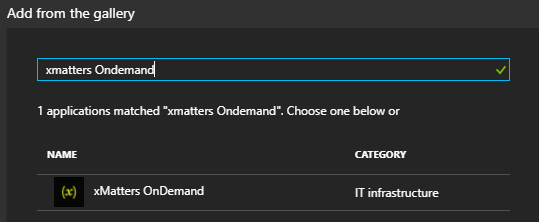
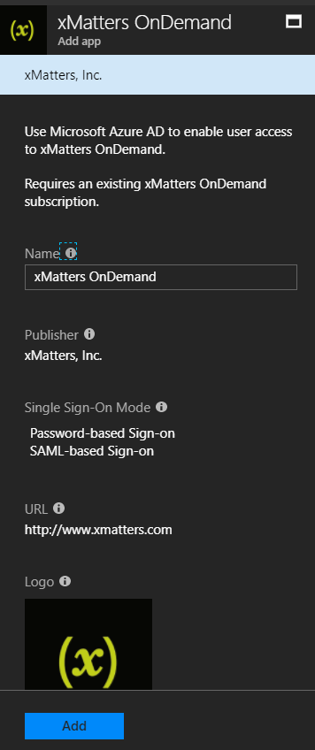
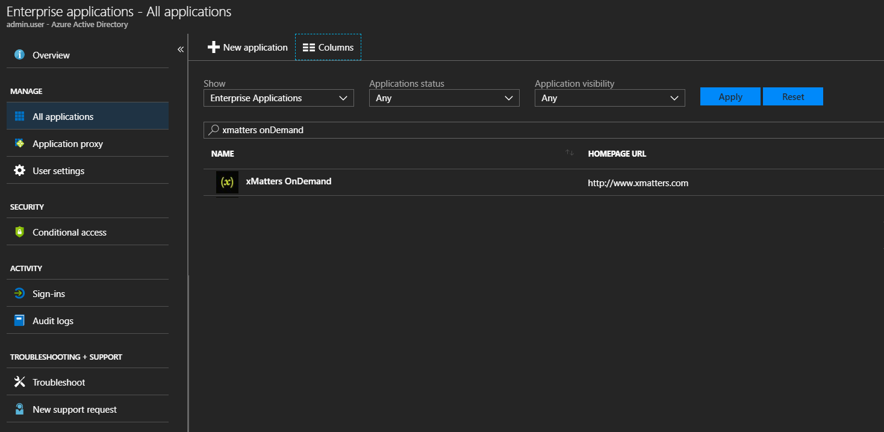
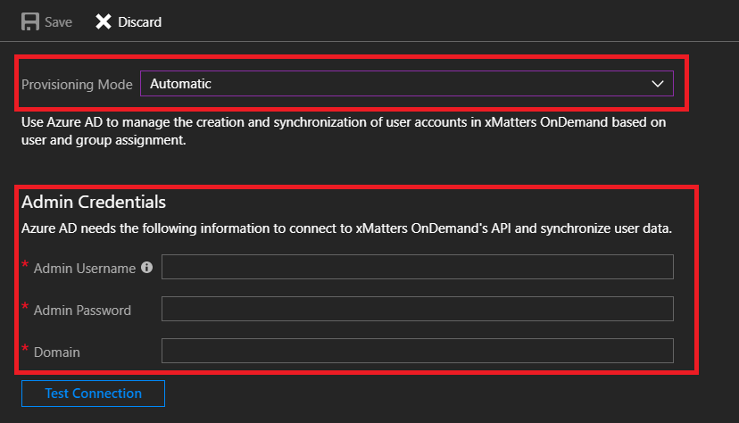
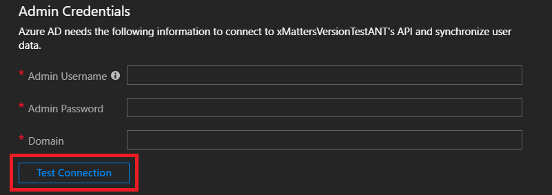
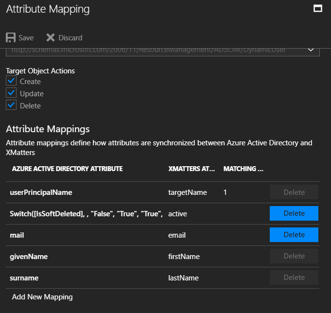
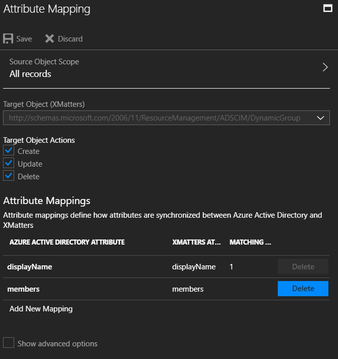

# Tutorial: Configure xMatters OnDemand for automatic user provisioning

The objective of this tutorial is to demonstrate the steps to be performed in xMatters OnDemand and Azure Active Directory (Azure AD) to configure Azure AD to automatically provision and de-provision users and/or groups to xMatters OnDemand.

> [!NOTE]
> This tutorial describes a connector built on top of the Azure AD User Provisioning Service. For important details on what this service does, how it works, and frequently asked questions, see [Automate user provisioning and deprovisioning to SaaS applications with Azure Active Directory](./active-directory-saas-app-provisioning.md).

## Prerequisites

The scenario outlined in this tutorial assumes that you already have the following:

*   An Azure AD tenant
*   A xMatters OnDemand tenant with the [Starter](https://www.xmatters.com/pricing) plan or better enabled 
*   A user account in xMatters OnDemand with Admin permissions

> [!NOTE]
> The Azure AD provisioning integration relies on the [xMatters OnDemand API](https://help.xmatters.com/xmAPI), which is available to xMatters OnDemand teams on the Starter plan or better.

## Adding xMatters OnDemand from the gallery

Before configuring xMatters OnDemand for automatic user provisioning with Azure AD, you need to add xMatters OnDemand from the Azure AD application gallery to your list of managed SaaS applications.

**To add xMatters OnDemand from the Azure AD application gallery, perform the following steps:**

1. In the **[Azure portal](https://portal.azure.com)**, on the left navigation panel, click on the **Azure Active Directory** icon.

	![The Azure Active Directory button][1]

2. Navigate to **Enterprise applications** > **All applications**.

	![The Enterprise applications Section][2]
	
3. To add xMatters OnDemand, click the **New application** button on the top of the dialog.

	![The New application button][3]

4. In the search box, type **xMatters OnDemand**.

	

5. In the results panel, select **xMatters OnDemand**, and then click the **Add** button to add xMatters OnDemand to your list of SaaS applications.

	

	

## Assigning users to xMatters OnDemand

Azure Active Directory uses a concept called "assignments" to determine which users should receive access to selected apps. In the context of automatic user provisioning, only the users and/or groups that have been "assigned" to an application in Azure AD are synchronized.

Before configuring and enabling automatic user provisioning, you should decide which users and/or groups in Azure AD need access to xMatters OnDemand. Once decided, you can assign these users and/or groups to xMatters OnDemand by following the instructions here:

*   [Assign a user or group to an enterprise app](manage-apps/assign-user-or-group-access-portal.md)

### Important tips for assigning users to xMatters OnDemand

*	It is recommended that a single Azure AD user is assigned to xMatters OnDemand to test the automatic user provisioning configuration. Additional users and/or groups may be assigned later.

*	When assigning a user to xMatters OnDemand, you must select any valid application-specific role (if available) in the assignment dialog. Users with the **Default Access** role are excluded from provisioning.

## Configuring automatic user provisioning to xMatters OnDemand 

This section guides you through the steps to configure the Azure AD provisioning service to create, update, and disable users and/or groups in xMatters OnDemand based on user and/or group assignments in Azure AD.

> [!TIP]
> You may also choose to enable SAML-based single sign-on for xMatters OnDemand, following the instructions provided in the [xMatters OnDemand single sign-on tutorial](active-directory-saas-xmatters-ondemand-tutorial.md). Single sign-on can be configured independently of automatic user provisioning, though these two features compliment each other.

### To configure automatic user provisioning for xMatters OnDemand in Azure AD:

1. Sign in to the [Azure portal](https://portal.azure.com) and browse to **Azure Active Directory > Enterprise applications > All applications**.

2. Select xMatters OnDemand from your list of SaaS applications.
 
	

3. Select the **Provisioning** tab.
	
	

4. Set the **Provisioning Mode** to **Automatic**.

	

5. Under the **Admin Credentials** section, input the **Admin Username**, **Admin Password**, and **Domain** of your xMatters OnDemand's account.

	*   In the **Admin Username** field, populate the username of the admin account on your xMatters OnDemand tenant. Example: admin@contoso.com.

	*   In the **Admin Password** field, populate the password corresponding to the admin username.

	*   In the **Domain** field, populate the subdomain of your xMatters OnDemand tenant.
	Example: For an account with a tenant URL of https://my-tenant.xmatters.com, your subdomain would be **my-tenant**.

6. Upon populating the fields shown in Step 5, click **Test Connection** to ensure Azure AD can connect to xMatters OnDemand. If the connection fails, ensure your xMatters OnDemand account has Admin permissions and try again.

	
	
7. In the **Notification Email** field, enter the email address of a person or group who should receive the provisioning error notifications and check the checkbox - **Send an email notification when a failure occurs**.

	

8. Click **Save**.

9. Under the **Mappings** section, select **Synchronize Azure Active Directory Users to xMatters OnDemand**.

	

10. Review the user attributes that are synchronized from Azure AD to xMatters OnDemand in the **Attribute Mapping** section. The attributes selected as **Matching** properties are used to match the user accounts in xMatters OnDemand for update operations. Select the **Save** button to commit any changes.

	

11. Under the **Mappings** section, select **Synchronize Azure Active Directory Groups to xMatters OnDemand**.

	

12. Review the group attributes that are synchronized from Azure AD to xMatters OnDemand in the **Attribute Mapping** section. The attributes selected as **Matching** properties are used to match the groups in xMatters OnDemand for update operations. Select the **Save** button to commit any changes.

	

13. To configure scoping filters, refer to the following instructions provided in the [Scoping filter tutorial](./active-directory-saas-scoping-filters.md).

14. To enable the Azure AD provisioning service for xMatters OnDemand, change the **Provisioning Status** to **On** in the **Settings** section.

	

15. Define the users and/or groups that you would like to provision to xMatters OnDemand by choosing the desired values in **Scope** in the **Settings** section.

	

16. When you are ready to provision, click **Save**.

	

This operation starts the initial synchronization of all users and/or groups defined in **Scope** in the **Settings** section. The initial sync takes longer to perform than subsequent syncs, which occur approximately every 40 minutes as long as the Azure AD provisioning service is running. You can use the **Synchronization Details** section to monitor progress and follow links to provisioning activity report, which describes all actions performed by the Azure AD provisioning service on xMatters OnDemand.

For more information on how to read the Azure AD provisioning logs, see [Reporting on automatic user account provisioning](./active-directory-saas-provisioning-reporting.md).

## Additional resources

* [Managing user account provisioning for Enterprise Apps](manage-apps/configure-automatic-user-provisioning-portal.md)
* [What is application access and single sign-on with Azure Active Directory?](manage-apps/what-is-single-sign-on.md)

## Next steps

* [Learn how to review logs and get reports on provisioning activity](active-directory-saas-provisioning-reporting.md)

<!--Image references-->
[1]: ./media/active-directory-saas-xmatters-ondemand-provisioning-tutorial/tutorial_general_01.png
[2]: ./media/active-directory-saas-xmatters-ondemand-provisioning-tutorial/tutorial_general_02.png
[3]: ./media/active-directory-saas-xmatters-ondemand-provisioning-tutorial/tutorial_general_03.png
