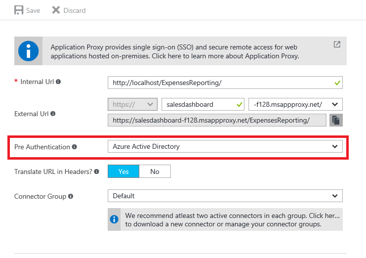

# How to configure single sign-on to an Application Proxy application

Single sign-on (SSO) allows your users to access an application without authenticating multiple times. It allows the single authentication to occur in the cloud, against Azure Active Directory, and allows the service or Connector to impersonate the user to complete any additional authentication challenges from the application.

## How to configure single-sign on
To configure SSO, first make sure that your application is configured for Pre-Authentication through Azure Active Directory. To do this configuration, go to **Azure Active Directory** -&gt; **Enterprise Applications** -&gt; **All Applications** -&gt; Your application **-&gt; Application Proxy**. On this page, you see the “Pre Authentication” field, and make sure that is set to “Azure Active Directory. 

For more information on the Pre-Authentication methods, see step 4 of the [app publishing document](manage-apps/application-proxy-publish-azure-portal.md).

   

## Configuring single sign-on modes for Application Proxy Applications
Configure the specific type of single sign-on. The sign-on methods are classified based on what type of authentication the backend application uses. App Proxy applications support three types of sign-on:

-   **Password-based Sign-On**: Password-based sign-on can be used for any application that uses username and password fields to sign on. Configuration steps are in the [password-SSO configuration documentation](active-directory-enterprise-apps-whats-new-azure-portal.md#bring-your-own-password-sso-applications).

-   **Integrated Windows Authentication**: For applications using Integrated Windows Authentication (IWA), single sign-on is enabled through Kerberos Constrained Delegation (KCD). This method gives Application Proxy Connectors permission in Active Directory to impersonate users, and to send and receive tokens on their behalf. Details on configuring KCD can be found in the [Single Sign-On with KCD documentation](manage-apps/application-proxy-configure-single-sign-on-with-kcd.md).

-   **Header-based Sign-On**: Header-based sign-on is enabled through a partnership and does require some additional configuration. For details on the partnership and step-by-step instructions for configuring single sign-on to an application that uses headers for authentication, see the [PingAccess for Azure AD documentation](application-proxy-ping-access.md).

Each of these options can be found by going to your application in “Enterprise Applications”, and opening the **Single Sign-On** page on the left menu. note that if your application was created in the old portal, you may not see all these options.

On this page, you also see one additional Sign-On option: Linked Sign-On. This option is also supported by Application Proxy. However, this option does not add single sign-on to the application. That said the application may already have single sign-on implemented using another service such as Active Directory Federation Services. 

This option allows an admin to create a link to an application that users first land on when accessing the application. For example, if there is an application that is configured to authenticate users using Active Directory Federation Services 2.0, an administrator can use the “Linked Sign-On” option to create a link to it on the access panel.

## Next steps
[Provide single sign-on to your apps with Application Proxy](manage-apps/application-proxy-configure-single-sign-on-with-kcd.md)
