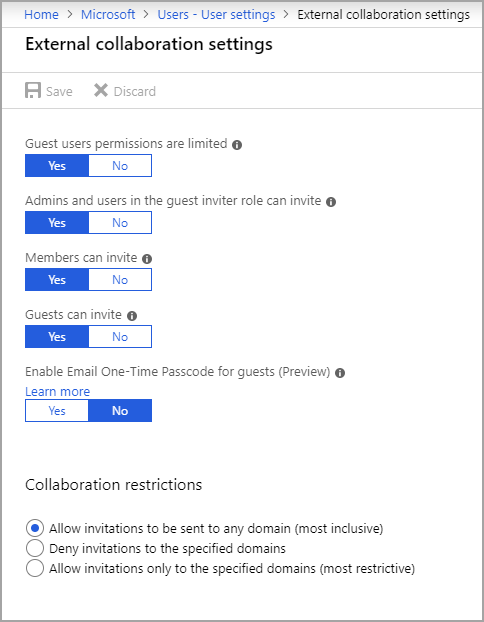

# Delegate invitations for Azure Active Directory B2B collaboration

With Azure Active Directory (Azure AD) business-to-business (B2B) collaboration, you do not have to be a global admin to send invitations. Instead, you can use policies and delegate invitations to users whose roles allow them to send invitations. An important new way to delegate guest user invitations is through the Guest Inviter role.

## Guest Inviter role
We can assign the user to Guest Inviter role to send invitations. You don't have to be member of the global admin role to send invitations. By default, regular users can also invoke the invite API unless a global admin disabled invitations for regular users. A user can also invoke the API using the Azure portal or PowerShell.

Here's an example that shows how to use PowerShell to add a user to the Guest Inviter role:

```
Add-MsolRoleMember -RoleObjectId 95e79109-95c0-4d8e-aee3-d01accf2d47b -RoleMemberEmailAddress <RoleMemberEmailAddress>
```

## Control who can invite

In Azure Active Directory, select **User Settings**. Under **External users**, select **Manage External Collaboration Settings**.

> [!NOTE]
> The **External collaboration settings** are also available from the **Organizational relationships** page. In Azure Active Directory, under **Manage**, go to **Organizational relationships** > **Settings**.



With Azure AD B2B collaboration, a tenant admin can set the following invitation policies:

- Turn off invitations
- Only admins and users in the Guest Inviter role can invite
- Admins, the Guest Inviter role, and members can invite
- All users, including guests, can invite

By default, tenants are set to #4. (All users, including guests, can invite B2B users.)

## Next steps

See the following articles on Azure AD B2B collaboration:

- [What is Azure AD B2B collaboration?](what-is-b2b.md)
- [Add B2B collaboration guest users without an invitation](add-user-without-invite.md)
- [Adding a B2B collaboration user to a role](add-guest-to-role.md)


