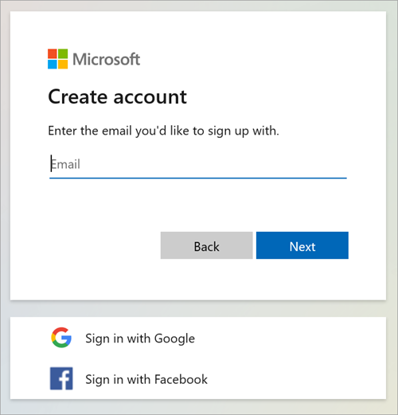

# Identity Providers for External Identities

An *identity provider* creates, maintains, and manages identity information while providing authentication services to applications. When sharing your apps and resources with external users, Azure AD is the default identity provider for sharing. This means when you invite external users who already have an Azure AD or Microsoft account, they can automatically sign in without further configuration on your part.

However, you can enable users to sign in with various identity providers. For example, you can set up federation with social identity providers that are supported by Azure AD, including Google and Facebook. You can also federate with any external identity provider that supports the SAML or WS-Fed protocols. With external identity provider federation, you can offer external users the ability to sign in to your apps with their existing social or enterprise accounts.

## How it works

Azure AD External Identities is preconfigured for federation with Google and Facebook. To set up these identity providers in your Azure AD tenant, you'll create an application at each identity provider and configure credentials. You'll obtain a client or app ID and a client or app secret, which you can then add to your Azure AD tenant.

Once you've added an identity provider to your Azure AD tenant:

- When you invite an external user to apps or resources in your organization, the external user can sign in using their own account with that identity provider.
- When you enable [self-service sign-up](self-service-sign-up-overview.md) for your apps, external users can sign up for your apps using their own accounts with the identity providers you've added. 

When redeeming your invitation or signing up for your app, the external user has the option to sign in and authenticate with the social identity provider:

For an optimal sign-in experience, federate with identity providers whenever possible so you can give your invited guests a seamless sign-in experience when they access your apps.  

## Next steps

To learn how to add identity providers for sign-in to your applications, refer to the following articles:

- [Add Google](google-federation.md) to your list of social identity providers
- [Add Facebook](facebook-federation.md) to your list of social identity providers
- [Set up direct federation](direct-federation.md) with any organization whose identity provider supports the SAML 2.0 or WS-Fed protocol. Note that direct federation is not an option for self-service sign-up user flows.
