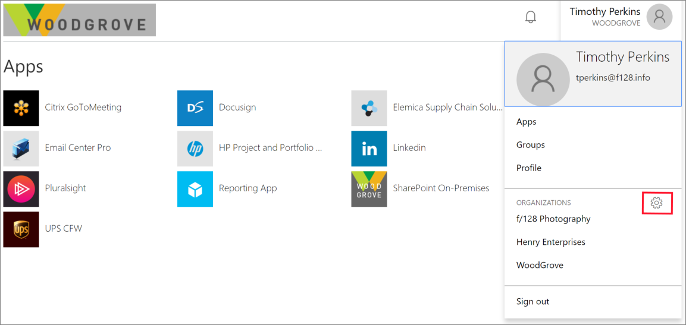
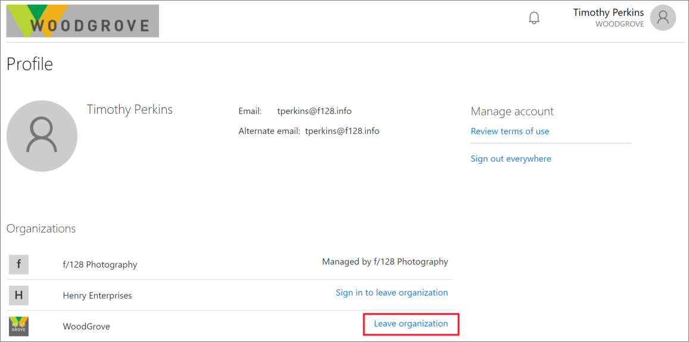

---

title: Leave an organization as a guest user - Azure Active Directory | Microsoft Docs
description: Shows how an Azure AD B2B guest user can leave an organization by using the Access Panel.

services: active-directory
ms.service: active-directory
ms.subservice: B2B
ms.topic: conceptual
ms.date: 05/11/2018

ms.author: mimart
author: msmimart
manager: daveba
ms.reviewer: sasubram

ms.collection: M365-identity-device-management
---

# Leave an organization as a guest user

An Azure Active Directory (Azure AD) B2B guest user can decide to leave an organization at any time if they no longer need to use apps from that organization or maintain any association. A user can leave an organization on their own, without having to contact an administrator.

## Leave an organization

To leave an organization, as a user signed in to the [Access Panel](https://myapps.microsoft.com), do the following:

1. If you’re not already signed in to the organization that you want to leave, select your name in the upper-right corner, and click the organization you want to leave.
2. In the upper-right corner, select your name.
3. Next to **Organizations**, select the settings icon (gear).
 
    

3. Under **Organizations**, find the organization that you want to leave, and select **Leave organization**.

   

4. When asked to confirm, select **Leave**. 

## Account removal

When a user leaves an organization, the user account is "soft deleted" in the directory. By default, the user object moves to the **Deleted users** area in Azure AD but is not permanently deleted for 30 days. This soft deletion enables the administrator to restore the user account (including groups and permissions), if the user makes a request to restore the account within the 30-day period.

If desired, a tenant administrator can permanently delete the account at any time during the 30-day period. To do this:

1. In the [Azure portal](https://portal.azure.com), select **Azure Active Directory**.
2. Under **Manage**, select **Users**.
3. Select **Deleted users**.
4. Select the check box next to a deleted user, and then select **Delete permanently**.

If you permanently delete a user, this action is irrevocable.

[!INCLUDE [GDPR-related guidance](../../../includes/gdpr-dsr-and-stp-note.md)]

## Next steps

- For an overview of Azure AD B2B, see [What is Azure AD B2B collaboration?](what-is-b2b.md)

