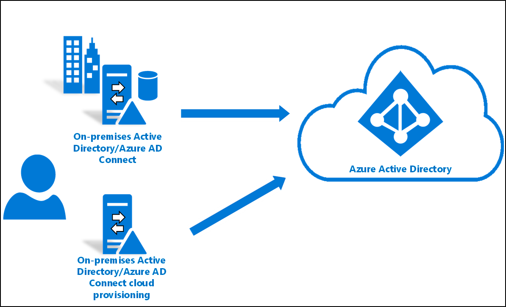
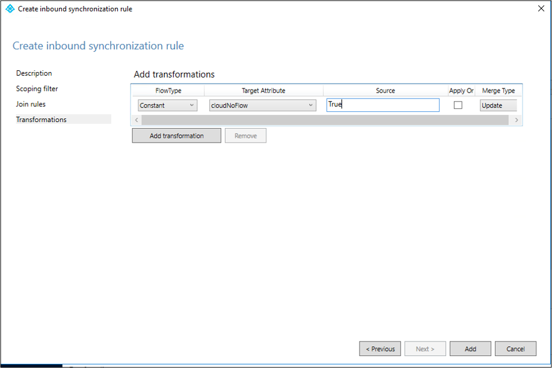
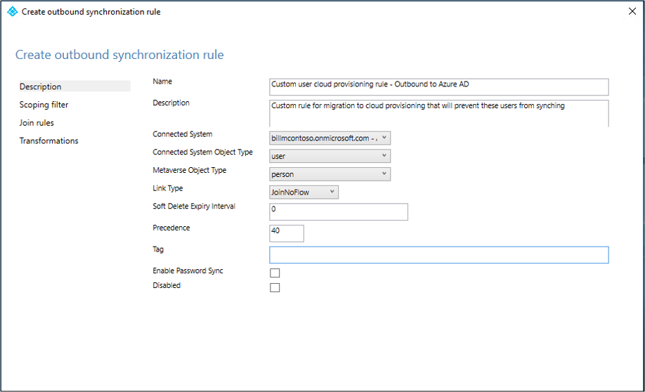
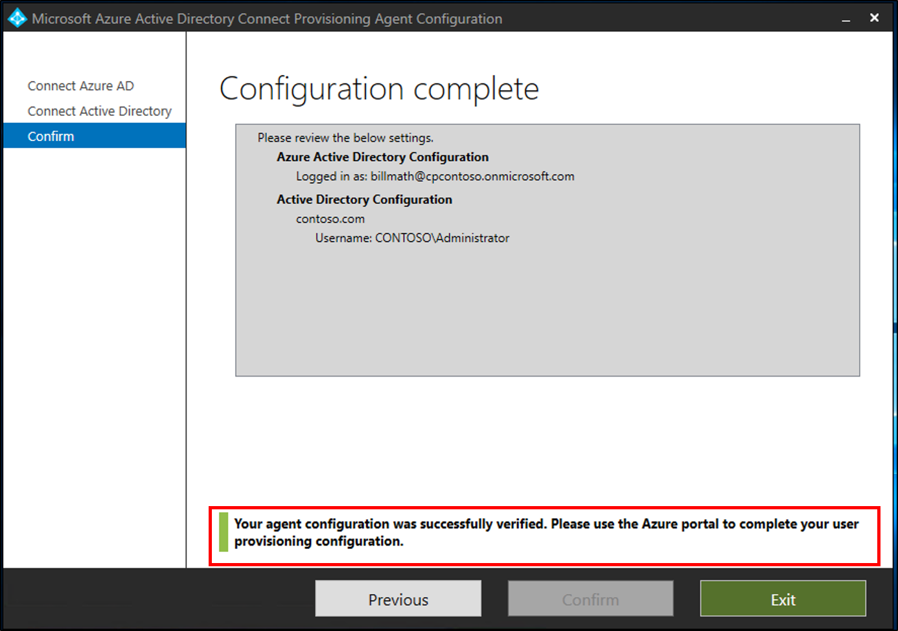
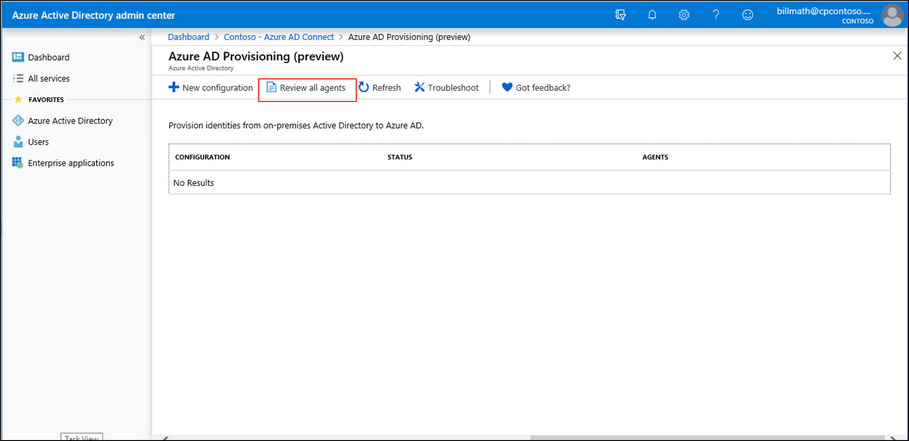
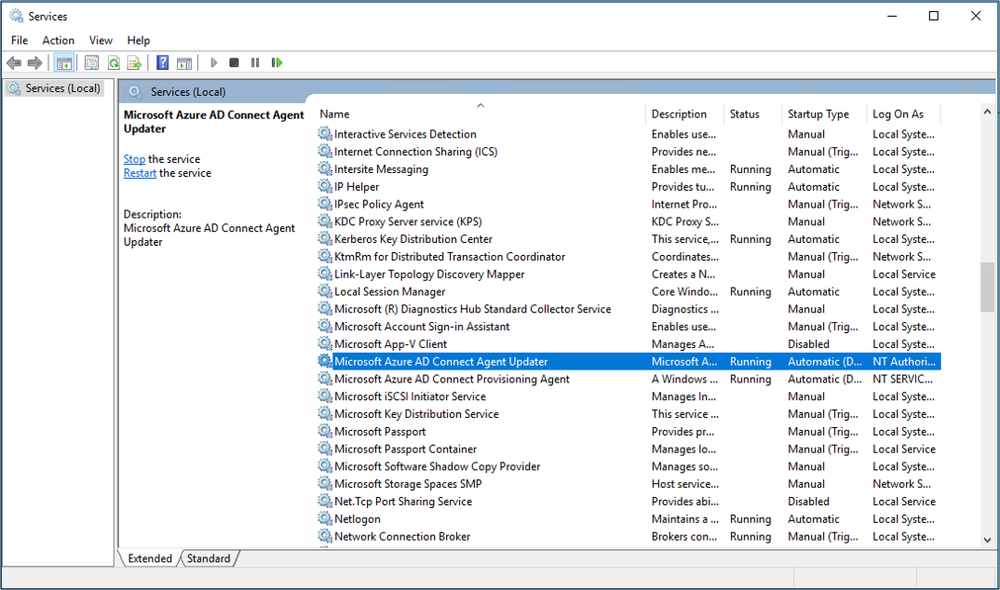
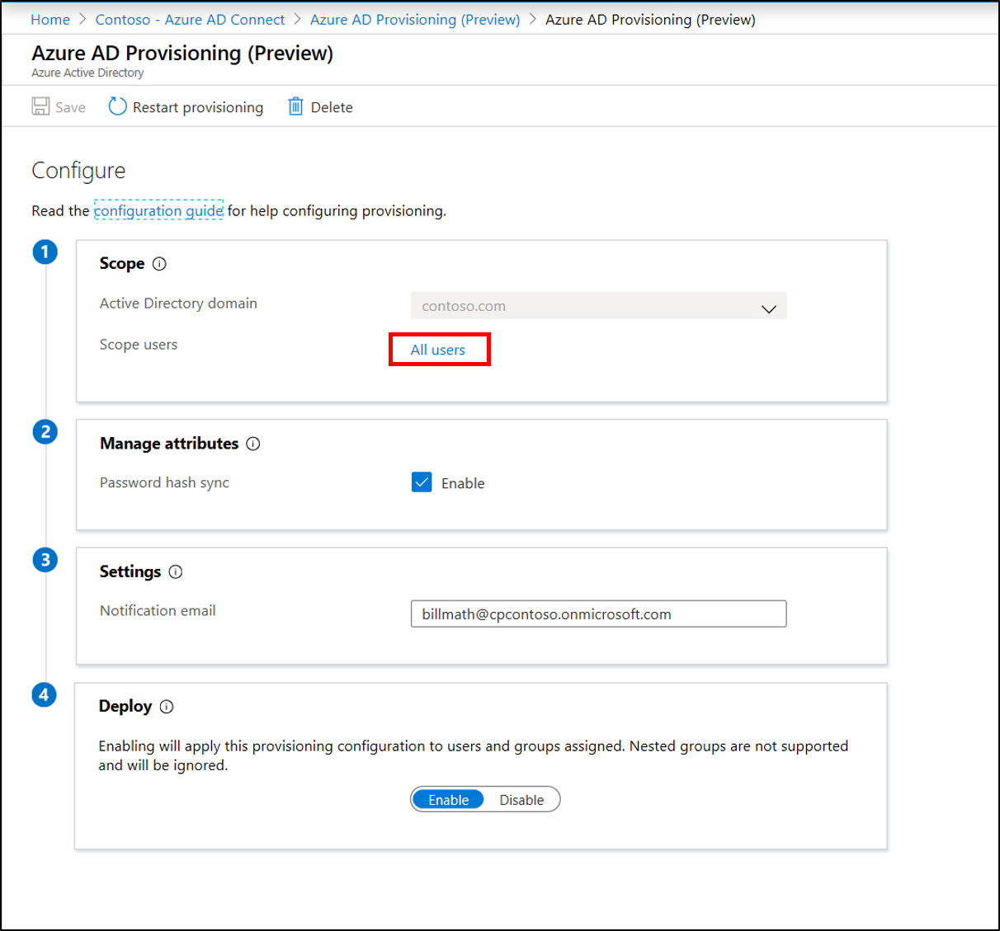
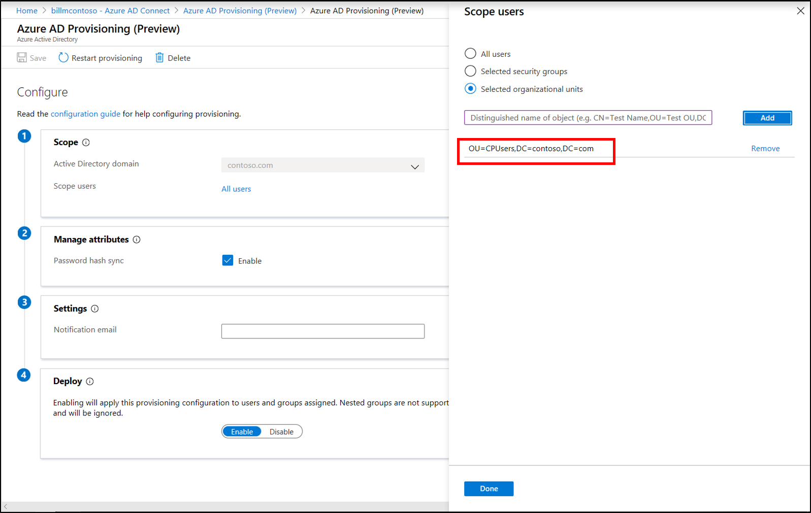
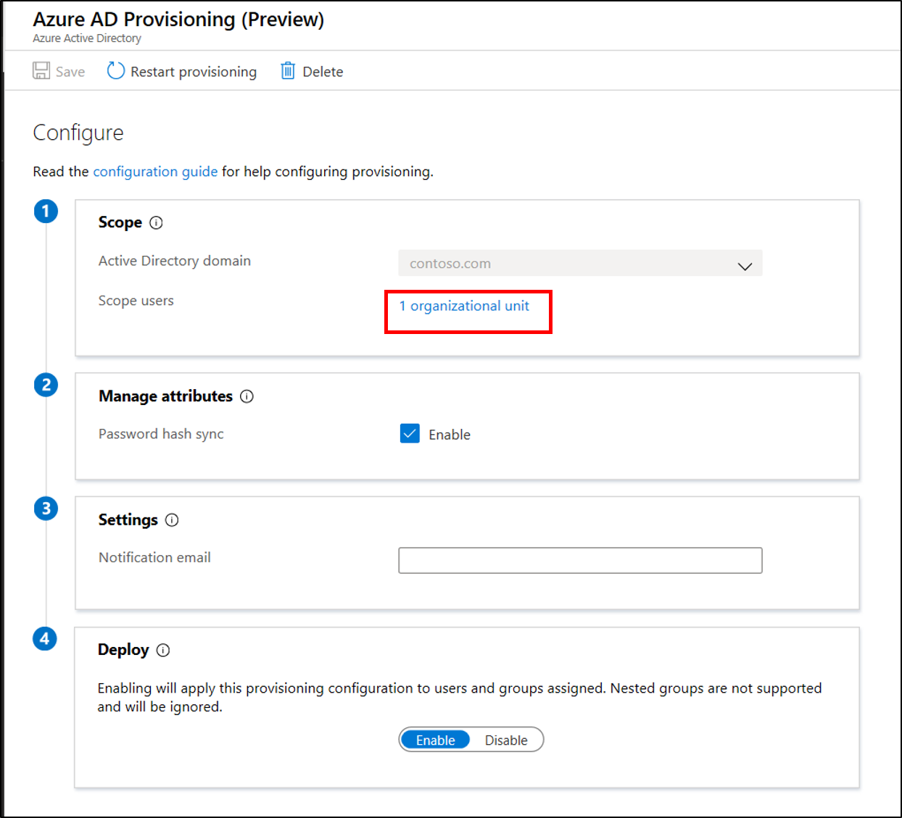
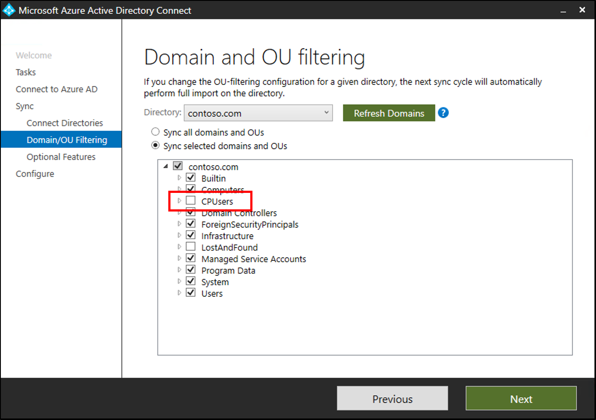

# Pilot cloud provisioning for an existing synced AD forest 

This tutorial walks you through piloting cloud provisioning for a test Active Directory forest that is already synced using Azure Active Directory (Azure AD) Connect sync.

## Considerations
Before you try this tutorial, consider the following items:
1. Ensure that you're familiar with basics of cloud provisioning. 
2. Ensure that you're running Azure AD Connect sync version 1.4.32.0 or later and have configured the sync rules as documented. When piloting, you will be removing a test OU or group from Azure AD Connect sync scope. Moving objects out of scope leads to deletion of those objects in Azure AD. In case of user objects, the objects in Azure AD are soft-deleted and can be restored. In case of group objects, the objects in Azure AD are hard-deleted and cannot be restored. A new link type has been introduced in Azure AD Connect sync which will prevent the deletion in case of a piloting scenario. 
3. Ensure that the objects in the pilot scope have ms-ds-consistencyGUID populated so cloud provisioning hard matches the objects. 

   > [!NOTE]
   > Azure AD Connect sync does not populate *ms-ds-consistencyGUID* by default for group objects.

4. This is an advanced scenario. Ensure that you follow the steps documented in this tutorial precisely.

## Prerequisites
The following are prerequisites required for completing this tutorial
- A test environment with Azure AD Connect sync version 1.4.32.0 or later
- An OU or group that is in scope of sync and can be used the pilot. We recommend starting with a small set of objects.
- A server running Windows Server 2012 R2 or later that will host the provisioning agent.  This cannot be the same server as the Azure AD Connect server.
- Source anchor for AAD Connect sync should be either *objectGuid* or *ms-ds-consistencyGUID*

## Update Azure AD Connect

As a minimum, you should have [Azure AD connect](https://www.microsoft.com/download/details.aspx?id=47594) 1.4.32.0. To update Azure AD Connect sync, complete the steps in [Azure AD Connect: Upgrade to the latest version](../hybrid/how-to-upgrade-previous-version.md).  

## Stop the scheduler
Azure AD Connect sync synchronizes changes occurring in your on-premises directory using a scheduler. In order to modify and add custom rules, you want to disable the scheduler so that synchronizations will not run while you are working on this.  Use the following steps:

1.  On the server that is running Azure AD Connect sync open PowerShell with Administrative Privileges.
2.  Run `Stop-ADSyncSyncCycle`.  Hit Enter.
3.  Run `Set-ADSyncScheduler -SyncCycleEnabled $false`.

>[!NOTE] 
>If you are running your own custom scheduler for AAD Connect sync, then please disable the scheduler. 

## Create custom user inbound rule

 1. Launch the synchronization editor from the application menu in desktop as shown below: 
  
 
 2. Select **Inbound** from the drop-down list for Direction and click on **Add new rule**.
  
 
 3. On the **Description** page, enter the following and click **Next**:

    **Name:** Give the rule a meaningful name 
    **Description:** Add a meaningful description 
    **Connected System:** Choose the AD connector that you are writing the custom sync rule for 
    **Connected System Object Type:** User 
    **Metaverse Object Type:** Person 
    **Link Type:** Join 
    **Precedence:** Provide a value that is unique in the system 
    **Tag:** Leave this empty 
     
 
 4.	On the **Scoping filter** page, enter the OU or security group that you want the pilot based off.  To filter on OU, add the OU portion of the distinguished name. This rule will be applied to all users who are in that OU.  So, if DN ends with "OU=CPUsers,DC=contoso,DC=com, you would add this filter.  Then click **Next**. 

    |Rule|Attribute|Operator|Value|
    |-----|----|----|-----|
    |Scoping OU|DN|ENDSWITH|Distinguished name of the OU.|
    |Scoping group||ISMEMBEROF|Distinguished name of the security group.|

     
 
 5.	On the **Join** rules page, click **Next**.
 6. On the **Transformations** page, add a Constant transformation: flow True to cloudNoFlow attribute. Click **Add**.
  

Same steps need to be followed for all object types (user, group and contact). Repeat steps per configured AD Connector / per AD forest. 

## Create custom user outbound rule

 1. Select **Outbound** from the drop-down list for Direction and click on **Add rule**.
  
 
 2. On the **Description** page, enter the following and click **Next**:

    **Name:** Give the rule a meaningful name 
    **Description:** Add a meaningful description 
    **Connected System:** Choose the AAD connector that you are writing the custom sync rule for 
    **Connected System Object Type:** User 
    **Metaverse Object Type:** Person 
    **Link Type:** JoinNoFlow 
    **Precedence:** Provide a value that is unique in the system 
    **Tag:** Leave this empty 
    
     
 
 3. On the **Scoping filter** page, choose **cloudNoFlow** equal **True**. Then click **Next**.
  
 
 4. On the **Join** rules page, click **Next**.
 5. On the **Transformations** page, click **Add**.

Same steps need to be followed for all object types (user, group and contact).

## Install the Azure AD Connect provisioning agent
1. Sign in to the server you will use with enterprise admin permissions.  If you are using the  [Basic AD and Azure environment](tutorial-basic-ad-azure.md) tutorial it would be CP1.
2. Download the Azure AD Connect cloud provisioning agent [here](https://go.microsoft.com/fwlink/?linkid=2109037).
3. Run the Azure AD Connect cloud provisioning (AADConnectProvisioningAgent.Installer)
3. On the splash screen, **Accept** the licensing terms and click **Install**. 
 

4. Once this operation completes, the configuration wizard will launch.  Sign in with your Azure AD global administrator account.
5. On the **Connect Active Directory** screen, click **Add directory** and then sign in with your Active Directory administrator account.  This operation will add your on-premises directory.  Click **Next**. 
 

6. On the **Configuration complete** screen, click **Confirm**.  This operation will register and restart the agent. 
 

7. Once this operation completes you should see a notice **Your was successfully verified.**  You can click **Exit**. 
 
8. If you still see the initial splash screen, click **Close**.

## Verify agent installation
Agent verification occurs in the Azure portal and on the local server that is running the agent.

### Azure portal agent verification
To verify the agent is being seen by Azure follow these steps:

1. Sign in to the Azure portal.
2. On the left, select **Azure Active Directory**, click **Azure AD Connect** and in the center select **Manage provisioning (preview)**. 
 

3.  On the **Azure AD Provisioning (preview)** screen click **Review all agents**.
 
 
4. On the **On-premises provisioning agents screen** you will see the agents you have installed.  Verify that the agent in question is there and is marked **Disabled**.  The agent is disabled by default
 

### On the local server
To verify that the agent is running follow these steps:

1.  Log on to the server with an administrator account
2.  Open **Services** by either navigating to it or by going to Start/Run/Services.msc.
3.  Under **Services** make sure **Microsoft Azure AD Connect Agent Updater** and **Microsoft Azure AD Connect Provisioning Agent** are there and the status is **Running**.

## Configure Azure AD Connect cloud provisioning
Use the following steps to configure provisioning:

 1. Sign-in to the Azure AD portal.
 2. Click **Azure Active Directory**
 3. Click **Azure AD Connect**
 4. Select **Manage provisioning (Preview)**
  
 5.  Click **New Configuration**
  
 6.  On the configuration screen, enter a **Notification email**, move the selector to **Enable** and click **Save**.
  
 7. Under **Configure**, select **All users** to change the scope of the configuration rule.
  
 8. On the right, change the scope to include the specific OU you just created "OU=CPUsers,DC=contoso,DC=com".
  
 9.  Click **Done** and **Save**.
 10. The scope should now be set to one organizational unit. 
  
 

## Verify users are provisioned by cloud provisioning
You will now verify that the users that you had in our on-premises directory have been synchronized and now exist in out Azure AD tenant.  Be aware that this may take a few hours to complete.  To verify users are provisioning by cloud provisioning, follow these steps:

1. Browse to the [Azure portal](https://portal.azure.com) and sign in with an account that has an Azure subscription.
2. On the left, select **Azure Active Directory**
3. Click on **Azure AD Connect**
4. Click on **Manage provisioning (preview)**
5. Click on **Logs** button
6. Search for a username to confirm that the user is provisioned by cloud provisioning

Additionally, you can verify that the user and group exist in Azure AD.

## Start the scheduler
Azure AD Connect sync synchronizes changes occurring in your on-premises directory using a scheduler. Now that you have modified the rules, you can re-start the scheduler.  Use the following steps:

1.  On the server that is running Azure AD Connect sync open PowerShell with Administrative Privileges
2.  Run `Set-ADSyncScheduler -SyncCycleEnabled $true`.
3.  Run `Start-ADSyncSyncCycle`.  Hit Enter.  

>[!NOTE] 
>If you are running your own custom scheduler for AAD Connect sync, then please enable the scheduler. 

## Something went wrong
In case the pilot does not work as expected, you can go back to the Azure AD Connect sync setup by following the steps below:
1.	Disable provisioning configuration in the Azure portal. 
2.	Disable all the custom sync rules created for Cloud Provisioning using the Sync Rule Editor tool. Disabling should cause full sync on all the connectors.

## Configure Azure AD Connect sync to exclude the pilot OU
Once you have verified that users from the pilot OU are successfully managed by cloud provisioning, you can re-configure Azure AD Connect to exclude the pilot OU that was created above.  The cloud provisioning agent will handle synchronization for these users going forward.  Use the following steps to scope Azure AD Connect.

 1. On the server that is running Azure AD Connect, double-click on the Azure AD Connect icon.
 2. Click **Configure**
 3. Select **Customize synchronization options** and click next.
 4. Sign-in to Azure AD and click **Next**.
 5. On the **Connect your directories** screen click **Next**.
 6. On the **Domain and OU filtering** screen, select **Sync selected domains and OUs**.
 7. Expand your domain and **de-select** the **CPUsers** OU.  Click **Next**.
 
 9. On the **Optional features** screen, click **Next**.
 10. On the **Ready to configure** screen click **Configure**.
 11. Once that has completed, click **Exit**. 

## Next steps 

- [What is provisioning?](what-is-provisioning.md)
- [What is Azure AD Connect cloud provisioning?](what-is-cloud-provisioning.md)

