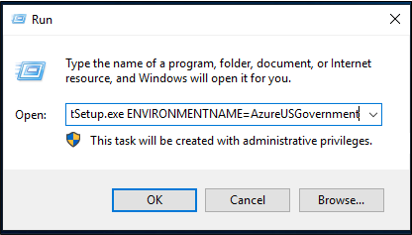

# Install the Azure AD Connect provisioning agent

This article walks you through the installation process for the Azure Active Directory (Azure AD) Connect provisioning agent and how to initially configure it in the Azure portal.

>[!IMPORTANT]
>The following installation instructions assume that all the [prerequisites](how-to-prerequisites.md) were met.

>[!NOTE]
>This article deals with installing the provisioning agent by using the wizard. For information on installing the Azure AD Connect provisioning agent by using a command-line interface (CLI), see [Install the Azure AD Connect provisioning agent by using a CLI and PowerShell](how-to-install-pshell.md).

For more information and an example, see the following video.

> [!VIDEO https://www.microsoft.com/en-us/videoplayer/embed/RWK5mR]

## Group Managed Service Accounts
A Group Managed Service Account (gMSA) is a managed domain account that provides automatic password management, simplified service principal name (SPN) management, and the ability to delegate the management to other administrators. It also extends this functionality over multiple servers. Azure AD Connect cloud sync supports and recommends the use of a Group Managed Service Account for running the agent. For more information on a Group Managed Service Account, see [Group Managed Service Accounts](how-to-prerequisites.md#group-managed-service-accounts).


### Upgrade an existing agent to use the gMSA
To upgrade an existing agent to use the Group Managed Service Account created during installation, update the agent service to the latest version by running AADConnectProvisioningAgent.msi. Now run through the installation wizard again and provide the credentials to create the account when prompted.

## Install the agent

[!INCLUDE [active-directory-cloud-sync-how-to-install](../../../includes/active-directory-cloud-sync-how-to-install.md)]

## Verify agent installation

[!INCLUDE [active-directory-cloud-sync-how-to-verify-installation](../../../includes/active-directory-cloud-sync-how-to-verify-installation.md)]

>[!IMPORTANT]
>The agent has been installed, but it must be configured and enabled before it will start synchronizing users. To configure a new agent, see [Create a new configuration for Azure AD Connect cloud sync](how-to-configure.md).

## Enable password writeback in Azure AD Connect cloud sync 

To use password writeback and enable the self-service password reset (SSPR) service to detect the cloud sync agent, you need to use the `Set-AADCloudSyncPasswordWritebackConfiguration` cmdlet and tenant’s global administrator credentials: 

  ```   
   Import-Module "C:\\Program Files\\Microsoft Azure AD Connect Provisioning Agent\\Microsoft.CloudSync.Powershell.dll" 
   Set-AADCloudSyncPasswordWritebackConfiguration -Enable $true -Credential $(Get-Credential)
  ```

For more information on using password writeback with Azure AD Connect cloud sync, see [Tutorial: Enable cloud sync self-service password reset writeback to an on-premises environment (preview)](../../active-directory/authentication/tutorial-enable-cloud-sync-sspr-writeback.md).

## Installing against US government cloud

By default, the Azure Active Directory (Azure AD) Connect provisioning agent installs against the default Azure cloud environment.  If you're installing the agent for use in the US government, follow these steps:

- In step #7 above, instead of select **Open file**, go to start run and navigate to the **AADConnectProvisioningAgentSetup.exe** file.  In the run box, after the executable, enter **ENVIRONMENTNAME=AzureUSGovernment** and select **Ok**.

    [](media/how-to-install/new-install-12.png#lightbox)

## Password hash synchronization and FIPS with cloud sync

If your server has been locked down according to Federal Information Processing Standard (FIPS), then MD5 is disabled.


To enable MD5 for password hash synchronization, perform the following steps:

1. Go to %programfiles%\Microsoft Azure AD Connect Provisioning Agent.
2. Open AADConnectProvisioningAgent.exe.config.
3. Go to the configuration/runtime node at the top of the file.
4. Add the following node: `<enforceFIPSPolicy enabled="false"/>`
5. Save your changes.

For reference, this snippet is what it should look like:

```xml
<configuration>
   <runtime>
      <enforceFIPSPolicy enabled="false"/>
   </runtime>
</configuration>
```

For information about security and FIPS, see [Azure AD password hash sync, encryption, and FIPS compliance](https://blogs.technet.microsoft.com/enterprisemobility/2014/06/28/aad-password-sync-encryption-and-fips-compliance/).


## Next steps 

- [What is provisioning?](what-is-provisioning.md)
- [What is Azure AD Connect cloud sync?](what-is-cloud-sync.md)
- [Create a new configuration for Azure AD Connect cloud sync](how-to-configure.md).

