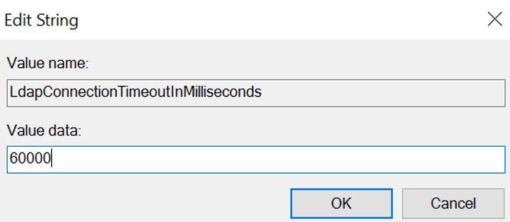
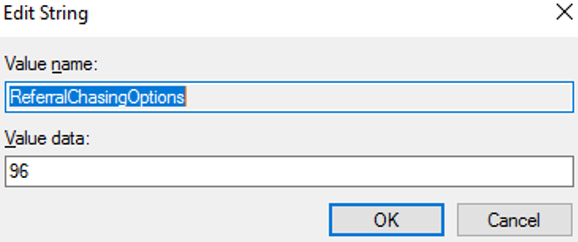
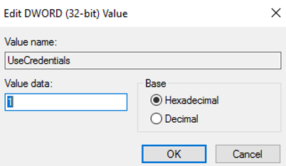

# Manage agent registry options

This section describes registry options that you can set to control the runtime processing behavior of the Azure AD Connect provisioning agent. 

## Configure LDAP connection timeout
When performing LDAP operations on configured Active Directory domain controllers, by default, the provisioning agent uses the default connection timeout value of 30 seconds. If your domain controller takes more time to respond, then you may see the following error message in the agent log file: 

`
System.DirectoryServices.Protocols.LdapException: The operation was aborted because the client side timeout limit was exceeded.
`

LDAP search operations can take longer if the search attribute is not indexed. As a first step, if you get the above error, first check if the search/lookup attribute is [indexed](https://docs.microsoft.com/windows/win32/ad/indexed-attributes). If the search attributes are indexed and the error persists, you can increase the LDAP connection timeout using the following steps: 

1. Log on as Administrator on the Windows server running the Azure AD Connect Provisioning Agent.
1. Use the *Run* menu item to open the registry editor (regedit.exe) 
1. Locate the key folder **HKEY_LOCAL_MACHINE\SOFTWARE\Microsoft\Azure AD Connect Agents\Azure AD Connect Provisioning Agent**
1. Right-click and select "New -> String Value"
1. Provide the name: 
  `LdapConnectionTimeoutInMilliseconds`
1. Double-click on the **Value Name** and enter the value data as `60000` milliseconds.
    > [!div class="mx-imgBorder"]
    > 
1. Restart the Azure AD Connect Provisioning Service from the *Services* console.
1. If you have deployed multiple provisioning agents, apply this registry change to all agents for consistency. 

## Configure referral chasing
By default, the Azure AD Connect provisioning agent does not chase [referrals](https://docs.microsoft.com/windows/win32/ad/referrals). 
You may want to enable referral chasing, to support certain HR inbound provisioning scenarios such as: 
* Checking uniqueness of UPN across multiple domains
* Resolving cross-domain manager references

Use the following steps to turn on referral chasing:

1. Log on as Administrator on the Windows server running the Azure AD Connect Provisioning Agent.
1. Use the *Run* menu item to open the registry editor (regedit.exe) 
1. Locate the key folder **HKEY_LOCAL_MACHINE\SOFTWARE\Microsoft\Azure AD Connect Agents\Azure AD Connect Provisioning Agent**
1. Right-click and select "New -> String Value"
1. Provide the name: 
  `ReferralChasingOptions`
1. Double-click on the **Value Name** and enter the value data as `96`. This value corresponds to the constant value for `ReferralChasingOptions.All` and specifies that both subtree and base-level referrals will be followed by the agent. 
    > [!div class="mx-imgBorder"]
    > 
1. Restart the Azure AD Connect Provisioning Service from the *Services* console.
1. If you have deployed multiple provisioning agents, apply this registry change to all agents for consistency.

## Skip GMSA configuration
With agent version 1.1.281.0+, by default, when you run the agent configuration wizard, you are prompted to setup [Group Managed Service Account (GMSA)](/windows-server/security/group-managed-service-accounts/group-managed-service-accounts-overview). The GMSA setup by the wizard is used at runtime for all sync and provisioning operations. 

If you are upgrading from a prior version of the agent and have setup a custom service account with delegated OU-level permissions specific to your Active Directory topology, you may want to skip/postpone GMSA configuration and plan for this change. 

> [!NOTE]
> This guidance specifically applies to customers who have configured HR (Workday/SuccessFactors) inbound provisioning with agent versions prior to 1.1.281.0 and have setup a custom service account for agent operations. In the long run, we recommend switching to GMSA as a best practice.  

In this scenario, you can still upgrade the agent binaries and skip the GMSA configuration using the following steps: 

1. Log on as Administrator on the Windows server running the Azure AD Connect Provisioning Agent.
1. Run the agent installer to install the new agent binaries. Close the agent configuration wizard which opens up automatically after the installation is successful. 
1. Use the *Run* menu item to open the registry editor (regedit.exe) 
1. Locate the key folder **HKEY_LOCAL_MACHINE\SOFTWARE\Microsoft\Azure AD Connect Agents\Azure AD Connect Provisioning Agent**
1. Right-click and select "New -> DWORD Value"
1. Provide the name: 
  `UseCredentials`
1. Double-click on the **Value Name** and enter the value data as `1`.  
    > [!div class="mx-imgBorder"]
    > 
1. Restart the Azure AD Connect Provisioning Service from the *Services* console.
1. If you have deployed multiple provisioning agents, apply this registry change to all agents for consistency.
1. From the desktop short cut, run the agent configuration wizard. The wizard will skip the GMSA configuration. 

> [!NOTE]
> You can confirm the registry options have been set by enabling [verbose logging](how-to-troubleshoot.md#log-files). The logs emitted during agent startup will display the config values picked from the registry. 

## Next steps 

- [What is provisioning?](what-is-provisioning.md)
- [What is Azure AD Connect cloud sync?](what-is-cloud-sync.md)

