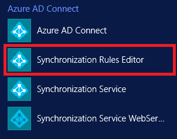
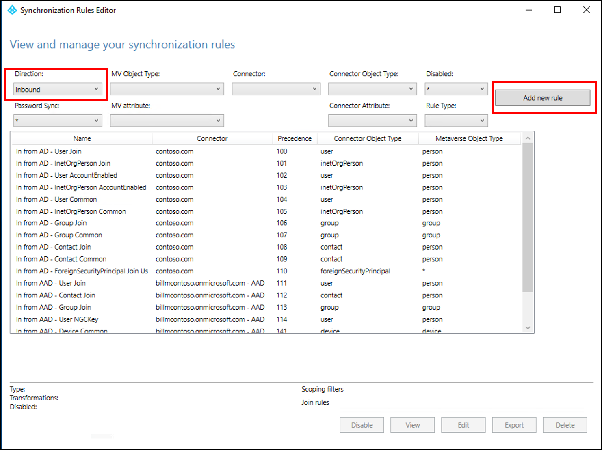
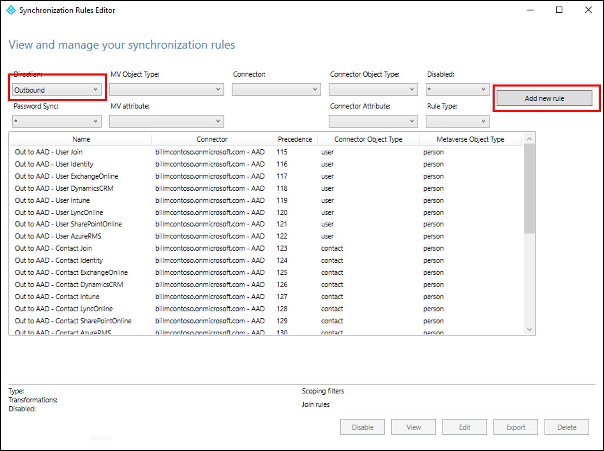
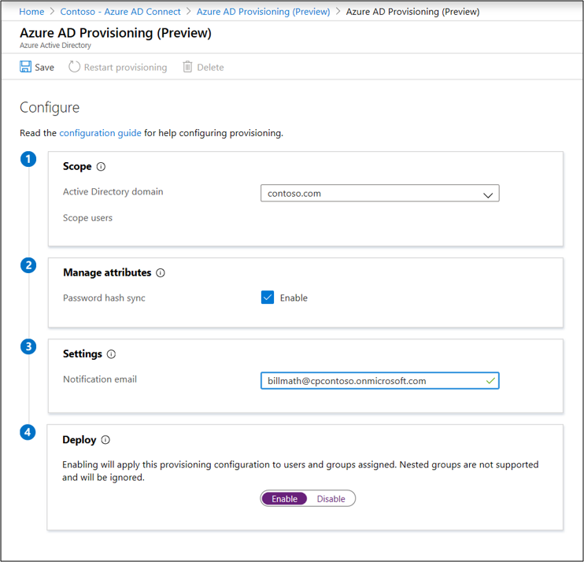

# Pilot cloud sync for an existing synced Active Directory forest

This tutorial walks you through piloting cloud sync for a test Active Directory forest that's already synced by using Azure Active Directory (Azure AD) Connect sync.

## Considerations

Before you try this tutorial, keep the following in mind:

* You should be familiar with the basics of cloud sync.

* Ensure that you're running Azure AD Connect cloud sync version 1.4.32.0 or later and you've configured the sync rules as documented. 

* When you're piloting, you'll be removing a test organizational unit (OU) or group from the Azure AD Connect sync scope. Moving objects out of scope leads to deletion of those objects in Azure AD.

    - **User objects**: The objects in Azure AD that are soft-deleted and can be restored. 
    - **Group objects**: The objects in Azure AD that are hard-deleted and can't be restored. 
    
    A new link type has been introduced in Azure AD Connect sync, which will prevent deletions in a piloting scenario.

* Ensure that the objects in the pilot scope have *ms-ds-consistencyGUID* populated so that cloud sync hard matches the objects.

   > [!NOTE]
   > Azure AD Connect sync doesn't populate *ms-ds-consistencyGUID* by default for group objects.

* This configuration is for advanced scenarios. Be sure to follow the steps documented in this tutorial precisely.

## Prerequisites

Before you begin, be sure that you've set up your environment to meet the following prerequisites:

- A test environment with [Azure AD connect version 1.4.32.0 or later](https://www.microsoft.com/download/details.aspx?id=47594). 
   
   To update Azure AD Connect sync, complete the steps in [Azure AD Connect: Upgrade to the latest version](../hybrid/how-to-upgrade-previous-version.md).

- An OU or group that's in scope of sync and can be used in the pilot. We recommend starting with a small set of objects.

- Windows Server 2012 R2 or later, which will host the provisioning agent.

- The source anchor for Azure AD Connect sync should be either *objectGuid* or *ms-ds-consistencyGUID*.

## Stop the scheduler

Azure AD Connect sync synchronizes changes occurring in your on-premises directory by using a scheduler. To modify and add custom rules, disable the scheduler so that synchronizations won't run while you're making the changes. To stop the scheduler:

1. On the server that's running Azure AD Connect sync, open PowerShell with administrative privileges.
1. Run `Stop-ADSyncSyncCycle`, and then select **Enter**.
1. Run `Set-ADSyncScheduler -SyncCycleEnabled $false`.

>[!NOTE]
>If you're running your own custom scheduler for Azure AD Connect sync, be sure to disable the scheduler.

## Create a custom user inbound rule

1. Open **Synchronization Rules Editor** from the application menu in the desktop, as shown in the following screenshot:
 
     

1. Under **Direction**, select **Inbound** from the dropdown list, and then select **Add new rule**.

     

1. On the **Description** page, do the following:

    - **Name**: Give the rule a meaningful name.
    - **Description**: Add a meaningful description.
    - **Connected System**: Select the Active Directory connector that you're writing the custom sync rule for.
    - **Connected System Object Type**: Select **User**.
    - **Metaverse Object Type**: Select **Person**.
    - **Link Type**: Select **Join**.
    - **Precedence**: Enter a value that's unique in the system.
    - **Tag**: Leave this field empty.

    

1. On the **Scoping filter** page, enter the OU or security group that the pilot is based on.  
 
    To filter on OU, add the OU portion of the *distinguished name* (DN). This rule will be applied to all users who are in that OU. for example, if DN ends with "OU=CPUsers,DC=contoso,DC=com, add this filter.

    |Rule|Attribute|Operator|Value|
    |-----|----|----|-----|
    |Scoping&nbsp;OU|DN|ENDSWITH|The distinguished name of the OU.|
    |Scoping&nbsp;group||ISMEMBEROF|The distinguished name of the security group.|

    

1. Select **Next**.
1. On the **Join** rules page, select **Next**.
1. Under **Add transformations**, do the following:
 
    * **FlowType**: Select **Constant**.  
    * **Target Attribute**: Select **cloudNoFlow**.  
    * **Source**: Select **True**.  

     

1. Select **Next**.

1. Select **Add**.

Follow the same steps for all object types (*user*, *group*, and *contact*). Repeat the steps for each configured AD Connector and Active Directory forest.

## Create a custom user outbound rule

1. In the **Direction** dropdown list, select **Outbound**, and then select **Add rule**.

     

1. On the **Description** page, do the following:

    - **Name**: Give the rule a meaningful name.
    - **Description**: Add a meaningful description.
    - **Connected System**: Select the Azure AD connector that you're writing the custom sync rule for.
    - **Connected System Object Type**: Select **User**.
    - **Metaverse Object Type**: Select **Person**.
    - **Link Type**: Select **JoinNoFlow**.
    - **Precedence**: Enter a value that's unique in the system.
    - **Tag**: Leave this field empty.

    

1. Select **Next**.

1. On the **Create outbound synchronization rule** pane, under **Add scoping filters**, do the following:
 
    * **Attribute**: Select **cloudNoFlow**.
    * **Operator**: Select **EQUAL**.
    * **Value**: Select **True**.

     

1. Select **Next**.

1. On the **Join** rules pane, select **Next**.

1. On the **Transformations** pane, select **Add**.

Follow the same steps for all object types (*user*, *group*, and *contact*).

## Install the Azure AD Connect provisioning agent

If you're using the [Basic Active Directory and Azure environment](tutorial-basic-ad-azure.md) tutorial, the agent is CP1. To install the agent, do the following: 

[!INCLUDE [active-directory-cloud-sync-how-to-install](../../../includes/active-directory-cloud-sync-how-to-install.md)]

## Verify the agent installation

[!INCLUDE [active-directory-cloud-sync-how-to-verify-installation](../../../includes/active-directory-cloud-sync-how-to-verify-installation.md)]

## Configure Azure AD Connect cloud sync

To configure the cloud sync setup, do the following:

1. Sign in to the Azure AD portal.
1. Select **Azure Active Directory**.
1. Select **Azure AD Connect**.
1. Select the **Manage provisioning (Preview)** link.

    

1. Select **New Configuration**

    

1. On the **Configure** pane, under **Settings**, enter a **Notification email** and then, under **Deploy**, move the selector to **Enable**.

    

1. Select **Save**.

1. Under **Scope**, select the **All users** link to change the scope of the configuration rule.

    
    
1. Under **Scope users**, change the scope to include the OU that you created: **OU=CPUsers,DC=contoso,DC=com**.

    
    
1. Select **Done** and **Save**.

   The scope should now be set to **1 organizational unit**.

    

## Verify that users have been set up by cloud sync

You'll now verify that the users in your on-premises Active Directory have been synchronized and now exist in your Azure AD tenant.  This process might take a few hours to complete.  To verify that the users have been synchronized, do the following:

1. Sign in to the [Azure portal](https://portal.azure.com) with an account that has an Azure subscription.
1. On the left pane, select **Azure Active Directory**.
1. Select **Azure AD Connect**.
1. Select **Manage cloud sync**.
1. Select the **Logs** button.
1. Search for a username to confirm that the user has been set up by cloud sync.

Additionally, you can verify that the user and group exist in Azure AD.

## Start the scheduler

Azure AD Connect sync synchronizes changes that occur in your on-premises directory by using a scheduler. Now that you've modified the rules, you can restart the scheduler.  

1. On the server that's running Azure AD Connect sync, open PowerShell with administrative privileges.
1. Run `Set-ADSyncScheduler -SyncCycleEnabled $true`.
1. Run `Start-ADSyncSyncCycle`, and then select <kbd>Enter</kbd>.

> [!NOTE]
> If you're running your own custom scheduler for Azure AD Connect sync, be sure to enable the scheduler.

After the scheduler is enabled, Azure AD Connect stops exporting any changes on objects with `cloudNoFlow=true` in the metaverse, unless any reference attribute (such as `manager`) is being updated. 

If there's any reference attribute update on the object, Azure AD Connect will ignore the `cloudNoFlow` signal and export all updates on the object.

## Does your setup work?

If the pilot doesn't work as you had expected, you can go back to the Azure AD Connect sync setup by doing the following:

1. Disable the provisioning configuration in the Azure portal.
1. Disable all the custom sync rules that were created for cloud provisioning by using the Sync Rule Editor tool. Disabling the rules should result in a full sync of all the connectors.

## Next steps

- [What is provisioning?](what-is-provisioning.md)
- [What is Azure AD Connect cloud sync?](what-is-cloud-sync.md)
