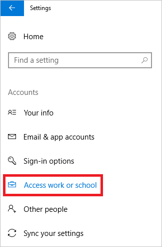
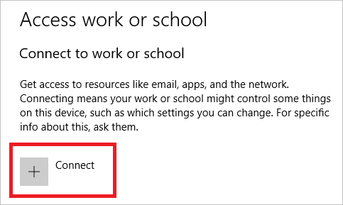
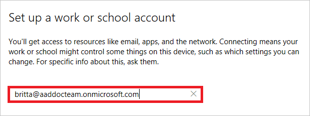
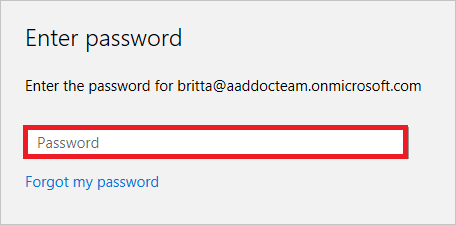

# Set up Azure Active Directory-registered Windows 10 devices

Device management in Azure Active Directory (Azure AD) can help you ensure that users access your resources from devices that meet your security and compliance standards. For more information, see [Introduction to device management in Azure Active Directory](device-management-introduction.md).

With [Azure AD registered devices](device-management-introduction.md#azure-ad-registered-devices), you can enable the the **Bring Your Own Device (BYOD)** scenario, which permits your users to access your organization's resources using personally owned devices.  

In Azure AD, you can set up Azure AD-registered devices for:

- Windows 10
- iOS
- Android
- macOS.  

This topic provides you with instructions on how to register Windows 10 devices with Azure AD. 

## Prerequisites

Before you begin, you should verify that:

- The permissions to register devices 

    

- You have not yet exceeded yet the maximum number of devices per user 

    

For more information, see [Configure device settings](device-management-azure-portal.md#configure-device-settings).

## What you should know

When you register a device, note the following:

- Windows registers the device in the organization’s directory in Azure AD.

- You might be required to pass a multi-factor authentication challenge. Your IT admin can set up this challenge.

- Azure AD checks whether a device requires mobile device management enrollment. It enrolls the device, if applicable.

- Windows redirects managed users to the desktop through the automatic sign-in.

- Federated users are redirected to a Windows sign-in page to enter credentials.

## Register a device

To register your Windows 10 device with Azure AD, complete the following steps. If you have successfully registered your device with Azure AD, your **Access work or school** page indicates this with a **Work or school account** entry.

To register your Windows 10 device:

1. On the **Start** menu, click **Settings**.

    

2. Click **Accounts**.

    

3. Click **Access work or school**.

    

4. On the **Access work or school** page, click **Connect**.

    

5. On the  **Set up a work or school account** page, enter your account name (for example, someone@example.com), and then click **Next**.

    

6. On the  **Enter password** page, enter your password, and then click **Next**.

    

7. On the **You're all set** page, click **Done**.

    

## Verification

To verify whether a device is joined to Azure AD, check the **Access work or school** page on your device.

Or, you can review the device settings in the Azure AD portal.

## Next steps

For more information, see: 

- The [introduction to device management in Azure Active Directory](device-management-introduction.md)

- [Managing devices using the Azure portal](device-management-azure-portal.md)

