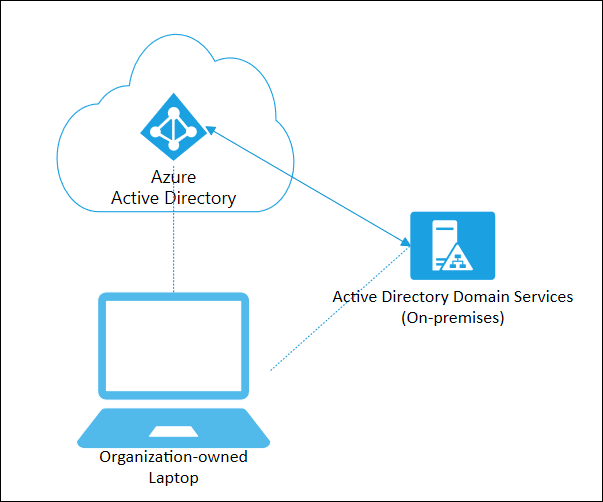

# Hybrid Azure AD joined devices

Organizations with existing Active Directory implementations can benefit from some of the functionality provided by Azure Active Directory (Azure AD) by implementing hybrid Azure AD joined devices. These devices are joined to your on-premises Active Directory and registered with Azure Active Directory.

Hybrid Azure AD joined devices require network line of sight to your on-premises domain controllers periodically. Without this connection, devices become unusable. If this requirement is a concern, consider [Azure AD joining](concept-azure-ad-join.md) your devices.

| Hybrid Azure AD Join | Description |
| --- | --- |
| **Definition** | Joined to on-premises AD and Azure AD requiring organizational account to sign in to the device |
| **Primary audience** | Suitable for hybrid organizations with existing on-premises AD infrastructure |
|   | Applicable to all users in an organization |
| **Device ownership** | Organization |
| **Operating Systems** | Windows 10 and above, 8.1 and 7 |
|   | Windows Server 2008/R2, 2012/R2, 2016 and 2019 |
| **Provisioning** | Windows 10, Windows Server 2016/2019 |
|   | Domain join by IT and autojoin via Azure AD Connect or ADFS config |
|   | Domain join by Windows Autopilot and autojoin via Azure AD Connect or ADFS config |
|   | Windows 8.1, Windows 7, Windows Server 2012 R2, Windows Server 2012, and Windows Server 2008 R2 - Require MSI |
| **Device sign in options** | Organizational accounts using: |
|   | Password |
|   | Windows Hello for Business for Win10 and above |
| **Device management** | [Group Policy](/mem/configmgr/comanage/faq#my-environment-has-too-many-group-policy-objects-and-legacy-authenticated-apps--do-i-have-to-use-hybrid-azure-ad-) |
|   | [Configuration Manager standalone or co-management with Microsoft Intune](/mem/configmgr/comanage/overview) |
| **Key capabilities** | SSO to both cloud and on-premises resources |
|   | Conditional Access through Domain join or through Intune if co-managed |
|   | [Self-service Password Reset and Windows Hello PIN reset on lock screen](../authentication/howto-sspr-windows.md) |

## Scenarios

Use Azure AD hybrid joined devices if:

- You support down-level devices running Windows 7 and 8.1.
- You want to continue to use [Group Policy](/mem/configmgr/comanage/faq#my-environment-has-too-many-group-policy-objects-and-legacy-authenticated-apps--do-i-have-to-use-hybrid-azure-ad-) to manage device configuration.
- You want to continue to use existing imaging solutions to deploy and configure devices.
- You have Win32 apps deployed to these devices that rely on Active Directory machine authentication.

## Next steps

- [Plan your hybrid Azure AD join implementation](hybrid-azuread-join-plan.md)
- [Co-management using Configuration Manager and Microsoft Intune](/mem/configmgr/comanage/overview)
- [Manage device identities using the Azure portal](device-management-azure-portal.md)
- [Manage stale devices in Azure AD](manage-stale-devices.md)
