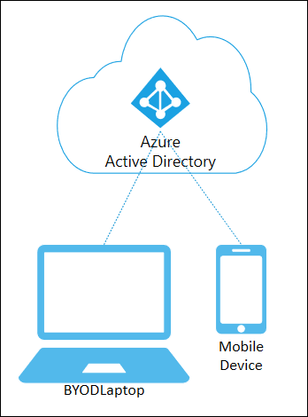

# Azure AD registered devices

The goal of Azure AD registered - also known as Workplace joined - devices is to provide your users with support for bring your own device (BYOD) or mobile device scenarios. In these scenarios, a user can access your organization’s resources using a personal device.

| Azure AD Registered | Description |
| --- | --- |
| **Definition** | Registered to Azure AD without requiring organizational account to sign in to the device |
| **Primary audience** | Applicable to all users with the following criteria: |
|   | Bring your own device |
|   | Mobile devices |
| **Device ownership** | User or Organization |
| **Operating Systems** | Windows 10 or newer, iOS, Android, macOS, Ubuntu 20.04/22.04 |
| **Provisioning** | Windows 10 or newer – Settings |
|   | iOS/Android – Company Portal or Microsoft Authenticator app |
|   | macOS – Company Portal |
|   | Linux - Intune Agent | 
| **Device sign in options** | End-user local credentials |
|   | Password |
|   | Windows Hello |
|   | PIN |
|   | Biometrics or pattern for other devices |
| **Device management** | Mobile Device Management (example: Microsoft Intune) |
|   | Mobile Application Management |
| **Key capabilities** | SSO to cloud resources |
|   | Conditional Access when enrolled into Intune |
|   | Conditional Access via App protection policy |
|   | Enables Phone sign in with Microsoft Authenticator app |

Azure AD registered devices are signed in to using a local account like a Microsoft account on a Windows 10 or newer device. These devices have an Azure AD account for access to organizational resources. Access to resources in the organization can be limited based on that Azure AD account and Conditional Access policies applied to the device identity.

Administrators can secure and further control these Azure AD registered devices using Mobile Device Management (MDM) tools like Microsoft Intune. MDM provides a means to enforce organization-required configurations like requiring storage to be encrypted, password complexity, and security software kept updated. 

Azure AD registration can be accomplished when accessing a work application for the first time or manually using the Windows 10 or Windows 11 Settings menu. 

## Scenarios

A user in your organization wants to access your benefits enrollment tool from their home PC. Your organization requires that anyone accesses this tool from an Intune compliant device. The user registers their home PC with Azure AD and Enrolls the device in Intune, then the required Intune policies are enforced giving the user access to their resources.

Another user wants to access their organizational email on their personal Android phone that has been rooted. Your company requires a compliant device and has created an Intune compliance policy to block any rooted devices. The employee is stopped from accessing organizational resources on this device.

## Next steps

- [Manage device identities using the Azure portal](device-management-azure-portal.md)
- [Manage stale devices in Azure AD](manage-stale-devices.md)
- [Register your personal device on your work or school network](https://support.microsoft.com/account-billing/register-your-personal-device-on-your-work-or-school-network-8803dd61-a613-45e3-ae6c-bd1ab25bf8a8)
