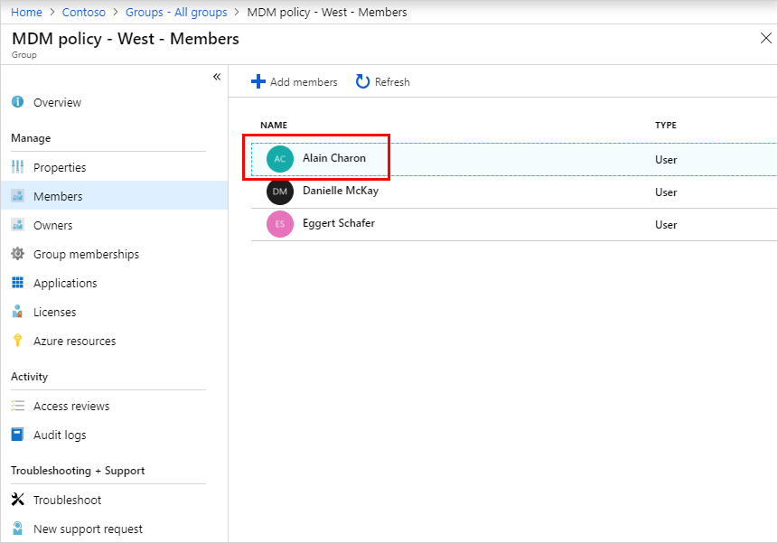

# Quickstart: Search for a specific group and view its members using Azure Active Directory
You can search for a specific group and review the assigned members using Azure Active Directory.

In this quickstart, you’ll view all your existing groups, select the **MDM policy – West** group, and then view the assigned members.

If you don’t have an Azure subscription, create a [free account](https://azure.microsoft.com/free/) before you begin. 

## Prerequisites
Before you begin, you’ll need to:

1. Create an Azure Active Directory tenant. For more information, see [Access the Azure Active Directory portal and create a new tenant](active-directory-access-create-new-tenant.md).

2.	Create the _MDM policy - West_ group and add member, _Alain Charon_. For more information, see [Create a basic group and add members](active-directory-groups-create-azure-portal.md).

## Sign in to the Azure portal
You must sign in to the [Azure portal](https://portal.azure.com/) using a Global administrator account for the directory.

## View your existing groups
You can see all the groups for your organization in the **Groups - All groups** page of the Azure portal.

- Select Azure **Active Directory**, and then select **Groups**.

    The **Groups - All groups** page appears, showing all your active groups.

    

## Search for a specific group
Search the **Groups – All groups** page to find the **MDM policy – West** group.

1. From the **Groups - All groups** page, type _MDM_ into the **Search** box.

    The search results appear under the **Search** box, including the _MDM policy - West_ group.

    

3. Select the group **MDM policy – West**.

4. View the group info on the **MDM policy - West Overview** page, including the number of members of that group.

    

## View members of the MDM policy – West group
Now that you’ve found the group, you can view all the assigned members.

- Select **Members** from the **Manage** area, and then review the complete list of member names assigned to that specific group, including _Alain Charon_.

    

## Clean up resources
If you’re not going to continue to use this application, you can delete the group and its assigned members with the following steps:

1. On the **Groups - All groups** page, search for the **MDM policy - West** group.

2.	Select the **MDM policy - West** group.

    The **MDM policy - West Overview** page appears.

3. Select **Delete**.

    The group and its associated members are deleted.

    

    >[!Important]
    >This doesn't delete the user Alain Charon, just his membership in the deleted group.

## Next steps
After you find your group and see the members, you can continue to:
- [Add or remove members](active-directory-groups-members-azure-portal.md)

- [Use the group to manage access to resources](active-directory-manage-groups.md)

- [Add group owners](active-directory-accessmanagement-managing-group-owners.md)

For more complex concepts and processes about groups, such as creating and using dynamic groups, delegating, and working with SaaS apps, see the [Azure Active Directory users, groups, roles, and licenses documentation](https://docs.microsoft.com/azure/active-directory/users-groups-roles/).