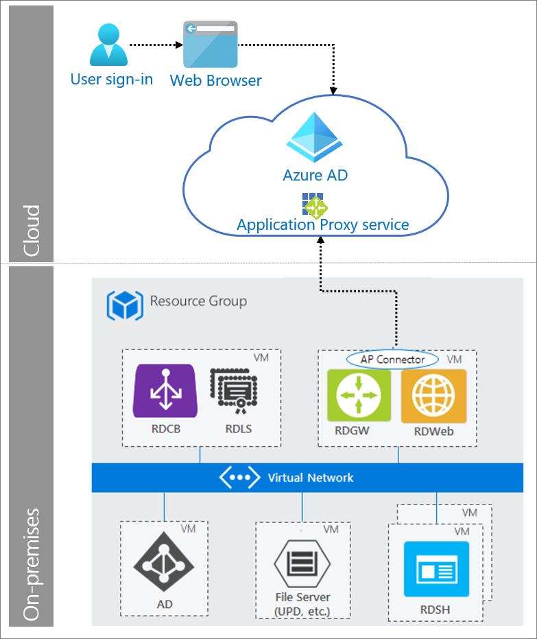

# Remote Desktop Gateway Services

A standard Remote Desktop Services (RDS) deployment includes various [Remote Desktop role services](/windows-server/remote/remote-desktop-services/Desktop-hosting-logical-architecture) running on Windows Server. The RDS deployment with Azure Active Directory (Azure AD) Application Proxy has a permanent outbound connection from the server that is running the connector service. Other deployments leave open inbound connections through a load balancer.

This authentication pattern allows you to offer more types of applications by publishing on premises applications through Remote Desktop Services. It reduces the attack surface of their deployment by using Azure AD Application Proxy.

## When to use Remote Desktop Gateway Services

Use Remote Desktop Gateway Services when you need to provide remote access and protect your Remote Desktop Services deployment with pre-authentication.

## System components

* **User**: Accesses RDS served by Application Proxy.
* **Web browser**: The component that the user interacts with to access the external URL of the application.
* **Azure AD**: Authenticates the user. 
* **Application Proxy service**: Acts as reverse proxy to forward request from the user to RDS. Application Proxy can also enforce any Conditional Access policies.
* **Remote Desktop Services**: Acts as a platform for individual virtualized applications, providing secure mobile and remote desktop access. It provides end users with the ability to run their applications and desktops from the cloud.

## Implement Remote Desktop Gateway services with Azure AD

Explore the following resources to learn more about implementing Remote Desktop Gateway services with Azure AD.

* [Publish Remote Desktop with Azure Active Directory Application Proxy](../app-proxy/application-proxy-integrate-with-remote-desktop-services.md) describes how Remote Desktop Service and Azure AD Application Proxy work together to improve productivity of workers who are away from the corporate network.
* The [Tutorial - Add an on-premises app - Application Proxy in Azure Active Directory](../app-proxy/application-proxy-add-on-premises-application.md) helps you to prepare your environment for use with Application Proxy.

## Next steps

* [Azure Active Directory authentication and synchronization protocol overview](auth-sync-overview.md) describes integration with authentication and synchronization protocols. Authentication integrations enable you to use Azure AD and its security and management features with little or no changes to your applications that use legacy authentication methods. Synchronization integrations enable you to sync user and group data to Azure AD and then user Azure AD management capabilities. Some sync patterns enable automated provisioning.
* [Remote Desktop Services architecture](/windows-server/remote/remote-desktop-services/Desktop-hosting-logical-architecture.md) describes configurations for deploying Remote Desktop Services to host Windows apps and desktops for end-users.
