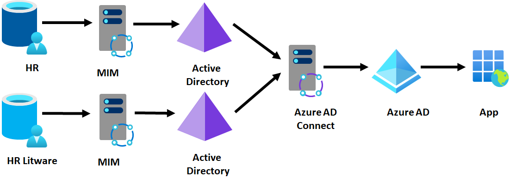
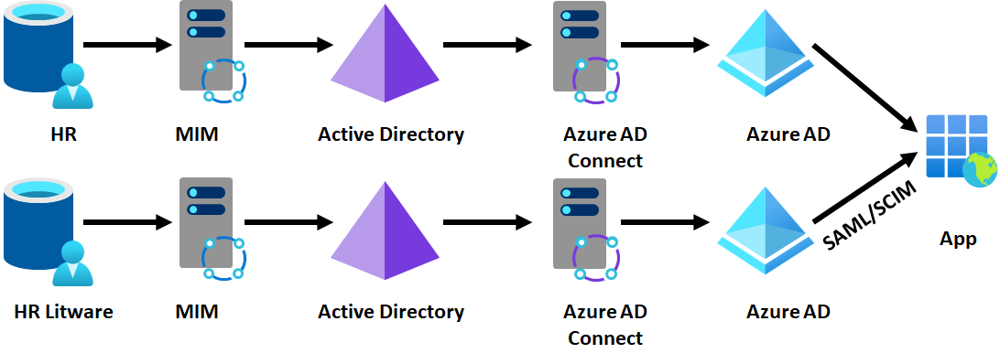
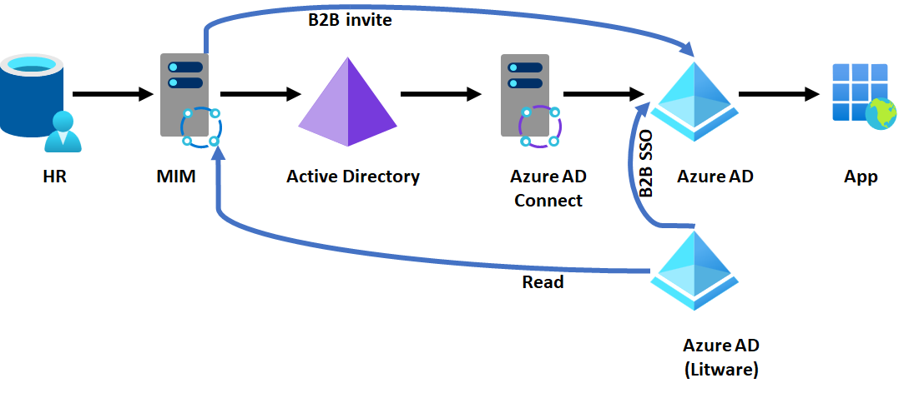
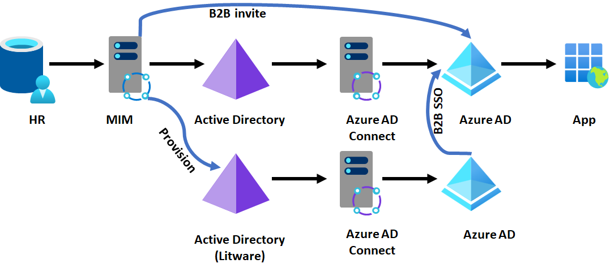

# Parallel and combined identity infrastructure options

Microsoft delivers a range of technologies and solutions to integrate between their different on-premises and cloud components of their identity infrastructure. Often customers are unclear on which technologies are most right and may incorrectly think "the most recent release covers all scenarios of earlier technology releases."

This article covers scenarios when your company is going through a complex scenario outlined below and looking to combine your identity information. Ideally, an organization with a single HR source, a single Active Directory forest, and a single Azure Active Directory (Azure AD) tenant, all integrated with the same people in each, will have the best identity experience for their Microsoft Online Services. However, in practice an enterprise customer may not always be in a situation where that is possible. For example, the customer may be going through a merger, or have a need for isolation for some users or applications. A customer who has multiple HR, multiple AD, or multiple Azure AD tenants must decide on whether to combine to fewer instances of each or keep them in parallel.

Based on our customer feedback, the following are some of the common scenarios and requirements.

## Scenarios that come up for multi-cloud and multi-org identities

- Mergers and acquisitions (M&A) – refers to a situation where, usually Company A buys Company B.
- Rebranding – A company name or brand change and typically an e-mail domain name change.
- Azure AD or Office 365 tenant consolidation - Companies with more than one Office 365 tenant may want to combine because of compliance or historic requirements.
- Active Directory Domain or forest consolidation - Companies evaluating to perform Active Directory domain or forest consolidation.
- Divestitures – Where a division or business group of a company is sold or becomes independent.
- User information privacy – Where companies have requirements to keep certain data (attributes) from not being publicly visible and only right delegated groups or users can read, change, and update it.

## Requirements that stem out from these scenarios

- Bring all users' and groups' data to a single place, including email and status availability for meeting scheduling by creating a central or **universal directory**.
- Maintain a **single username and credentials** while reducing the need to enter usernames and passwords across all applications by implementing Single Sign On.
- Streamline user on-boarding so it doesn't take weeks or months.
- Prepare the organization for future acquisitions and access management demands.
- Enable and improve cross-company collaboration and productivity.
- Reduce the likelihood of a security breach or data exfiltration with security policies deployed centrally and consistently!

## Scenarios not covered in this article

- Partial M&A. For example, an organization buys part of another organization.
- Divesture or splitting organizations
- Renaming organizations.
- Joint ventures or temporary partners

This article outlines various multi-cloud or multi-org identity environments including M&A scenarios that Microsoft supports today and outline how an organization might select the right technologies depending upon how they approach consolidation.

## Consolidation options for a hypothetical M&A scenario

The following sections cover four main scenarios for a hypothetical M&A scenario:

Suppose Contoso is an enterprise customer, and their IT has a single (on-premises) HR system, single Active Directory forest, single tenant Azure AD for their apps, running as expected. Users are brought in from their HR system into Active Directory and projected into Azure AD and from there into SaaS apps. This scenario is illustrated with the diagram below, with the arrows showing the flow of identity information. The same model is also applicable to customers with cloud HR system such as Workday or SuccessFactors provisioning Active Directory, not just customers using Microsoft Identity Manager (MIM).

  
Next, Contoso has begun to merge with Litware, which has previously been running their own IT independently. Contoso IT will handle the merger and expects that Contoso's IT will continue to have Contoso's apps remain unchanged, but they want to be able to have Litware's users receive access to them and collaborate within those apps. For Microsoft apps, third-party SaaS, and custom apps, the end state should be that Contoso and Litware users conceptually have access to the same data.

The first IT decision is how much they wish to combine infrastructure. They could choose to not rely upon any of Litware's identity infrastructure. Or they could consider using Litware's infrastructure and converging over time while minimizing disruption to Litware's environment. In some cases, the customer may wish to keep Litware's existing identity infrastructure independent and not converging it, while still using it to give Litware employee access to Contoso apps.

If the customer chooses to keep some or all Litware's identity infrastructure, then there are tradeoffs on how much of Litware's Active Directory Domain Services or Azure AD are used to give Litware users access to Contoso resources. This section looks at workable options, based on what Contoso would use for Litware's users:

- Scenario A - Don't use *any* of Litware's identity infrastructure.
- Scenario B - Use Litware's Active Directory forests, but not Litware's Azure AD (if they've one)
- Scenario C - Use Litware's Azure AD.
- Scenario D - Use Litware's non-Microsoft identity infrastructure (if Litware isn't using Active Directory/Azure AD) 

The following table summarizes each option with the technologies for how the customer could achieve those outcomes, the constraints, and benefits of each.

| Considerations | A1: Single HR, single IAM & tenant | A2: Separate HR, single IAM, and tenant | B3: Active Directory forest trust, single Azure AD Connect | B4: Azure AD Connect their Active Directory to the single tenant | B5: Azure AD Connect cloud sync their Active Directory | C6: parallel provision multiple tenants into apps | C7: read from their tenant and B2B invite their users | C8: single IAM and B2B users as needed | D9: DF with their non-Azure AD IDP |
|:-|:-|:-|:-|:-|:-|:-|:-|:-|:-|
| Migration effort | High | Medium effort | Lower effort | Low effort | Low effort | None | None | None | None |
| Deployment effort | Less effort | Medium effort | Medium effort | Medium effort | Low | Low | High | High | Very High |
| End-user impact during migration | High | High | Medium | Medium | Medium | None | None | None | None |
| Operating effort | Low cost | Low cost | Low cost | Low cost | Low cost | High | High | High | Very High |
| Privacy and data capabilities (geo location/data boundaries) | None (Major roadblock for geo-location scenarios) | Limited isolation even though challenging | Limited isolation on-prem but not on the cloud | Limited isolation on-prem but not on the cloud | Limited isolation on-prem but not on the cloud | Good isolation both on-prem and on the cloud | Limited isolation both on-prem and cloud | Limited isolation both on-prem and cloud | Isolation both on-prem and on the cloud |
| Isolation (separate delegation and setup different admin models) Note: as defined in source system (HR) | Not possible | Possible | Possible | Possible | Possible | Highly Possible | Highly possible | Highly possible | Possible |
| Collaboration capabilities | Excellent | Excellent | Excellent | Excellent | Excellent | Poor | Average | Average | Poor |
| IT admin model supported (centralized vs. separated) | Centralized | Centralized | Centralized | Centralized | Centralized | Decentralized | Decentralized | Decentralized | Actively Decentralized |
| Limitations | No isolation | Limited isolation | Limited isolation | Limited isolation | Limited isolation. No writeback capabilities | Won't work for Microsoft Online Services apps. Highly dependent on app capability | Requires apps to be B2B aware | Requires apps to be B2B aware | Require apps to be B2B aware. Uncertainty in how it all works together |

Table details

- The employee effort tries to predict the required expertise and extra work required to implement the solution in an organization.
- Operating effort tries to predict the cost and effort it takes to keep the solution running.
- Privacy and data capabilities show if the solution allows support for geo location and data boundaries.
- Isolation shows if this solution supplies the ability to separate or delegate admin models.
- Collaboration capabilities show the level of collaboration the solution supports, more integrated solutions supply higher fidelity of teamwork.
- The IT admin model shows if the admin model requires to centralized or can be decentralized.
- Limitations: any issues of challenges worth listing.

### Decision tree

Use the following decision tree to help you decide which scenario would work best for your organization.

The rest of this document, will outline four scenarios A-D with various options supporting them.

## Scenario A - If Contoso does not wish to rely upon Litware's existing identity infrastructure

For this option, Litware may not have any identity systems (for example, a small business), or the customer may wish to turn off Litware's infrastructure. Or they wish to leave it untouched, for use by Litware employees to authenticate to Litware's apps but give Litware employees new identities as part of Contoso. For example, if Alice Smith was a Litware employee, she might have two identities – Alice@litware.com and ASmith123@contoso.com. Those identities would be entirely distinct from each other.

### Option 1 - Combine into a single HR system

Typically, customers would bring the Litware employees into the Contoso HR system. This option would trigger those employees to receive accounts and the right access to Contoso's directories and apps. A Litware user would then have a new Contoso identity, which they could use to request access to the right Contoso apps.

### Option 2 - Keep Litware HR system

Sometimes converging the HR systems may not be possible, at least not in the short term. Instead, the customer would connect their provisioning system, for example, MIM, to read from *both* HR systems. In this diagram, the top HR is the existing Contoso environment, and the second HR is Litware's addition to the overall infrastructure.

The same scenario would also be possible using Azure AD Workday or SuccessFactors inbound – Contoso could bring in users from Litware's Workday HR source alongside existing Contoso employees.

### Outcomes of consolidating all identity infrastructure

- Reduced IT infrastructure, only one identity system to manage, no network connectivity requirements except for an HR system.
- Consistent end user and administrative experience

### Constraints of consolidating all identity infrastructure

- Any data that is needed by Contoso employees that originated in Litware must be migrated to the Contoso environment.
- Any Active Directory or Azure AD-integrated apps from Litware that will be needed for Contoso must be reconfigured to the Contoso environment. This reconfiguration may require changes to the configuration, which groups it uses for access, or potentially to the apps themselves.

## Scenario B - If Contoso wishes to keep Litware's Active Directory forests, but not use Litware's Azure AD

Litware may have many existing Active Directory-based apps that they rely on, and so Contoso may wish to continue to have Litware employees keep their own identities in their existing AD. A Litware employee would then use their existing identity for their authentication of their existing resources and authentication of Contoso resources. In this scenario, Litware doesn't have any cloud identities in Microsoft Online Services – either Litware wasn't an Azure AD customer, nothing of Litware's cloud assets were to be shared with Contoso, or Contoso migrated Litware's cloud assets to be part of Contoso's tenant.

### Option 3 - Forest trust with the acquired forest

Using an [Active Directory forest trust](/windows-server/identity/ad-ds/plan/forest-design-models), Contoso and Litware can connect their Active Directory domains. This trust enables Litware users to authenticate Contoso's Active Directory-integrated apps. Also [Azure AD Connect](../hybrid/whatis-azure-ad-connect.md) can also read from Litware's Active Directory forest so that Litware users authenticate with Contoso's Azure AD integrated apps. This deployment topology requires a network route set up between the two domains, and TCP/IP network connectivity between any Litware user and Contoso Active Directory-integrated app. It's also straightforward to set up bidirectional trusts, so that Contoso users can access Litware AD-integrated apps (if any).

### Outcome of setting up a forest trust

- All Litware employees can authenticate Contoso's Active Directory or Azure AD-integrated apps, and Contoso can use current AD-based tools to manage authorization.

### Constraints of setting up a forest trust

- Requires TCP/IP connectivity between users who are domain joined to one forest and resources joined to the other forest.
- Requires the Active Directory-based apps in the Contoso forest to be multi-forest-aware

### Option 4 - Configure Azure AD Connect to the acquired forest without forest trust

A customer can also configure Azure AD Connect to read from another forest. This configuration enables the Litware users to authenticate to Contoso's Azure AD integrated apps but doesn't supply access to Contoso's Active Directory integrated apps to the Litware user – those Contoso apps don't recognize Litware users. This deployment topology requires TCP/IP network connectivity between Azure AD Connect and Litware's domain controllers. For example, if Azure AD Connect is on a Contoso IaaS VM, they would need to establish a tunnel also to Litware's network as well.

### Outcome of using Azure AD Connect to provision one tenant

- All Litware employees can authenticate Contoso's Azure AD integrated apps.

### Constraints of using Azure AD Connect to provision one tenant

- Requires TCP/IP connectivity between Contoso's Azure AD Connect and Litware's Active Directory domains.
- Doesn't permit Litware users to have access to Contoso's Active Directory based applications

### Option 5 - Deploy Azure AD Connect cloud sync in the acquired forest

[Azure AD Connect cloud provisioning](../cloud-sync/what-is-cloud-sync.md) removes the network connectivity requirement, but you can only have one Active Directory to Azure AD linking for a given user with cloud sync. Litware users can authenticate Contoso's Azure AD integrated apps, but not Contoso's Active Directory-integrated apps. This topology does not require any TCP/IP connectivity between Litware and Contoso's on-premises environments.

### Outcome of deploying Azure AD Connect cloud sync in the acquired forest

- All Litware employees can authenticate Contoso's Azure AD-integrated apps.

### Constraints of using Azure AD Connect cloud sync in the acquired forest

- Doesn't permit Litware users to have access to Contoso's AD-based applications

## Scenario C - If Contoso wants to keep Litware's Azure AD

Litware may be a Microsoft Online Services or Azure customer or may have one or more Azure AD-based apps that they rely on. So, Contoso may want to continue to have Litware employees keep their own identities for access to those resources. A Litware employee would then use their existing identity for their authentication of their existing resources and authentication of Contoso resources.

This scenario is suitable in cases where:

- Litware has an extensive Azure or Microsoft Online Services investment including multiple Office 365 tenants that would be costly or time consuming to migrate to another tenant.
- Litware may be spun out in future or is a partnership that will run independently.
- Litware doesn't have on-premises infrastructure

### Option 6 - Maintain parallel provisioning and SSO for apps in each Azure AD

One option is for each Azure AD to independently provide SSO and [provision](../app-provisioning/user-provisioning.md) users from their directory into the target app. For example, if Contoso IT are using an app such as Salesforce, they would provide Litware with administrative rights to create users in the same Salesforce subscription.

### Outcome of parallel provisioning

- Users can authenticate apps using their existing identity, without making changes to Contoso's infrastructure.

### Constraints of parallel provisioning

- If using federation, it requires applications to support multiple federation providers for the same subscription.
- Not possible for Microsoft apps such as Office or Azure
- Contoso doesn't have visibility in their Azure AD of application access for Litware users

### Option 7 - Configure B2B accounts for users from the acquired tenant

If Litware has been running its own tenant, then Contoso can read the users from that tenant, and through the B2B API, invite each of those users into the Contoso tenant. (This bulk invite process can be done through the [MIM graph connector](/microsoft-identity-manager/microsoft-identity-manager-2016-connector-graph), for example.) If Contoso also has AD-based apps that they wish to make available to Litware users, then MIM could also create users in Active Directory that would map to the UPNs of Azure AD users, so that the app proxy could perform KCD on behalf of a representation of a Litware user in Contoso's Active Directory.

Then when a Litware employee wishes to access a Contoso app, they can do so by authenticating to their own directory, with access assignment to the resource tenant.

### Outcome of setting up B2B accounts for users from the other tenant

- Litware users can authenticate Contoso apps, and Contoso controls that access in their tenant.

### Constraints of setting up B2B accounts for users from the other tenant

- It requires a duplicate account for each Litware user who requires access to Contoso resources.
- Requires the apps to be B2B capable for SSO.

### Option 8 - Configure B2B but with a common HR feed for both directories

In some situations, after acquisition the organization may converge on a single HR platform, but still run existing identity management systems. In this scenario, MIM could provision users into multiple Active Directory systems, depending on with part of the organization the user is affiliated with. They could continue to use B2B so that users authenticate their existing directory, and have a unified GAL.

### Outcome of setting up B2B guest users from a common HR system feed

- Litware users can authenticate to Contoso apps, and Contoso control that access in their tenant.
- Litware and Contoso have a unified GAL.
- No change to Litware's Active Directory or Azure AD

### Constraints of setting up B2B guest users from a common HR system feed

- Requires changes to Contoso's provisioning to also send users to Litware's Active Directory, and connectivity between Litware's domains and Contoso's domains.
- Requires the apps to be B2B capable for SSO.

## Scenario D - If Litware is using non-Active Directory infrastructure

Finally, if Litware is using another directory service, either on-premises or in the cloud, then Contoso IT can still configure that Litware employees authenticate and can get access to Contoso's resources using their existing identity.

### Option 9 - Use B2B direct federation (public preview)

In this scenario, Litware is assumed to have:

- Some existing directories, such as OpenLDAP or even a SQL database or flat file of users with their email addresses that they can regularly share with Contoso.
- An identity provider that supports SAML, such as PingFederate or OKTA.
- A publicly routed DNS domain such as Litware.com and users with email addresses in that domain

In this approach, Contoso would configure a [direct federation](../external-identities/direct-federation.md) relationship from their tenant for that domain to Litware's identity provider, and then regularly read updates to Litware users from their directory to invite the Litware users into Contoso's Azure AD. This update can be done with a MIM Graph connector. If Contoso also has Active Directory-based apps that they wish to make available to Litware users, then MIM could also create users in Active Directory that would map to the UPNs of Azure AD users, so that the app proxy could perform KCD on behalf of a representation of a Litware user in Contoso's Active Directory.

### Outcome of using B2B direct federation

- Litware users authenticate to Contoso's Azure AD with their existing identity provider and access Contoso's cloud and on-premises web apps,

### Constraints of using B2B direct federation

- Require the Contoso apps to able to support B2B user SSO.

## Next steps

- [What is Azure AD Connect cloud sync](../cloud-sync/what-is-cloud-sync.md)
- [Setup Inbound provisioning for Azure AD](../app-provisioning/plan-cloud-hr-provision.md)
- [Setup B2B direct federation](../external-identities/direct-federation.md)
- [Multi-tenant user management options](multi-tenant-user-management-introduction.md)
- [What is application provisioning?](../app-provisioning/user-provisioning.md)
