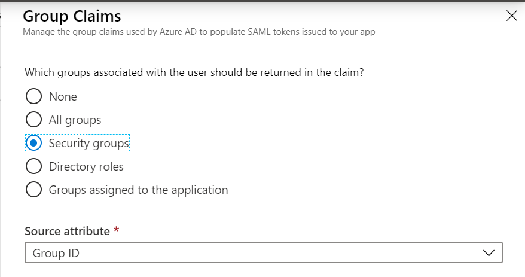
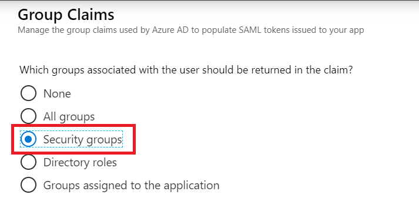
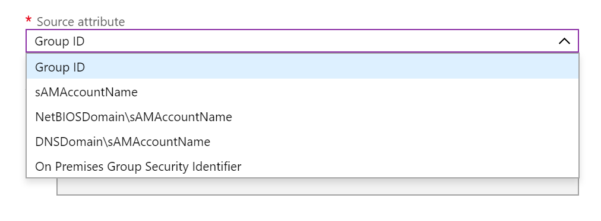

# Configure group claims for applications with Azure Active Directory (Public Preview)

Azure Active Directory can provide a users group membership information in tokens for use within applications.  Two main patterns are supported:

- Groups identified by their Azure Active Directory object identifier (OID) attribute (Generally Available)
- Groups identified by sAMAccountName or GroupSID attributes for Active Directory (AD) synchronized groups and users (Public Preview)

> [!IMPORTANT]
> There are a number of caveats to note for this preview functionality:
>
>- Support for use of sAMAccountName and security identifier (SID) attributes synced from on-premises is designed to enable moving existing applications from AD FS and other identity providers. Groups managed in Azure AD do not contain the attributes necessary to emit these claims.
>- In larger organizations the number of groups a user is a member of may exceed the limit that Azure Active Directory will add to a token. 150 groups for a SAML token, and 200 for a JWT. This can lead to unpredictable results. If your users have large numbers of group memberships, we recommend using the option to restrict the groups emitted in claims to the relevant groups for the application.  
>- For new application development, or in cases where the application can be configured for it, and where nested group support isn't required, we recommend that in-app authorization is based on application roles rather than groups.  This limits the amount of infomation that needs to go into the token, is more secure, and separates user assignment from app configuration.

## Group claims for applications migrating from AD FS and other identity providers

Many applications configured to authenticate with AD FS rely on group membership information in the form of Windows AD group attributes.   These attributes are the group sAMAccountName, which may be qualified by-domain name, or the Windows Group Security Identifier (GroupSID).  When the application is federated with AD FS, AD FS uses the TokenGroups function to retrieve the group memberships for the user.

An app that has been moved from AD FS needs claims in the same format. Group and role claims may be emitted from Azure Active Directory containing the domain qualified sAMAccountName or the GroupSID synced from Active Directory rather than the group's Azure Active Directory objectID.

The supported formats for group claims are:

- **Azure Active Directory Group ObjectId** (Available for all groups)
- **sAMAccountName** (Available for groups synchronized from Active Directory)
- **NetbiosDomain\sAMAccountName** (Available for groups synchronized from Active Directory)
- **DNSDomainName\sAMAccountName** (Available for groups synchronized from Active Directory)
- **On Premises Group Security Identifier** (Available for groups synchronized from Active Directory)

> [!NOTE]
> sAMAccountName and On Premises Group SID attributes are only available on Group objects synced from Active Directory.   They aren't available on groups created in Azure Active Directory or Office365.   Applications configured in Azure Active Directory to get synced on-premises group attributes get them for synced groups only.

## Options for applications to consume group information

Applications can call the MS Graph groups endpoint to obtain group information for the authenticated user. This call ensures that all the groups a user is a member of are available even when there are a large number of groups involved.  Group enumeration is then independent of token size limitations.

However, if an existing application expects to consume group information via claims, Azure Active Directory can be configured with a number of different claims formats.  Consider the following options:

- When using group membership for in-application authorization purposes it is preferable to use the Group ObjectID. The Group ObjectID is immutable and unique in Azure Active Directory and available for all groups.
- If using the on-premises group sAMAccountName for authorization, use domain qualified names;  there’s less chance of names clashing. sAMAccountName may be unique within an Active Directory domain, but if more than one Active Directory domain is synchronized with an Azure Active Directory tenant there is a possibility for more than one group to have the same name.
- Consider using [Application Roles](../../active-directory/develop/howto-add-app-roles-in-azure-ad-apps.md) to provide a layer of indirection between the group membership and the application.   The application then makes internal authorization decisions based on role clams in the token.
- If the application is configured to get group attributes that are synced from Active Directory and a Group doesn't contain those attributes, it won't be included in the claims.
- Group claims in tokens include nested groups except when using the option to restrict the group claims to groups assigned to the application.  If a user is a member of GroupB and GroupB is a member of GroupA, then the group claims for the user will contain both GroupA and GroupB. When an organization's users have large numbers of group memberships, the number of groups listed in the token can grow the token size.  Azure Active Directory limits the number of groups it will emit in a token to 150 for SAML assertions, and 200 for JWT.  If a user is a member of a larger number of groups, the groups are omitted and a link to the Graph endpoint to obtain group information is included instead.

## Prerequisites for using Group attributes synchronized from Active Directory

Group membership claims can be emitted in tokens for any group if you use the ObjectId format. To use group claims in formats other than the group ObjectId, the groups must be synchronized from Active Directory using Azure AD Connect.

There are two steps to configuring Azure Active Directory to emit group names for Active Directory Groups.

1. **Synchronize group names from Active Directory**
Before Azure Active Directory can emit the group names or on premises group SID in group or role claims, the required attributes need to be synchronized from Active Directory.  You must be running Azure AD Connect version 1.2.70 or later.   Earlier versions of Azure AD Connect than 1.2.70 will synchronize the group objects from Active Directory, but will not include the required group name attributes.  Upgrade to the current version.

2. **Configure the application registration in Azure Active Directory to include group claims in tokens**
Group claims can be configured in the Enterprise Applications section of the portal, or using the Application Manifest in the Application Registrations section.  To configure group claims in the application manifest see “Configuring the Azure Active Directory Application Registration for group attributes” below.

## Add group claims to tokens for SAML applications using SSO configuration

To configure Group Claims for a Gallery or Non-Gallery SAML application, open **Enterprise Applications**, click on the application in the list, select **Single Sign On configuration**, and then select **User Attributes & Claims**.

Click on **Add a group claim**  


Use the radio buttons to select which groups should be included in the token



| Selection | Description |
|----------|-------------|
| **All groups** | Emits security groups and distribution lists and roles.  |
| **Security groups** | Emits security groups the user is a member of in the groups claim |
| **Directory roles** | If the user is assigned directory roles, they are emitted as a 'wids' claim (groups claim won't be emitted) |
| **Groups assigned to the application** | Emits only the groups that are explicitly assigned to the application and the user is a member of |

For example, to emit all the Security Groups the user is a member of, select Security Groups



To emit groups using Active Directory attributes synced from Active Directory instead of Azure AD objectIDs select the required format from the drop-down. Only groups synchronized from Active Directory will be included in the claims.



To emit only groups assigned to the application, select **Groups Assigned to the application**


Groups assigned to the application will be included in the token.  Other groups the user is a member of will be omitted.  With this option nested groups are not included and the user must be a direct member of the group assigned to the application.

To change the groups assigned to the application, select the application from the **Enterprise Applications** list and then click **Users and Groups** from the application’s left-hand navigation menu.

See the document [Methods for assigning users and groups to an app](../../active-directory/manage-apps/methods-for-assigning-users-and-groups.md#assign-groups) for details of managing group assignment to applications.

### Advanced options

The way group claims are emitted can be modified by the settings under Advanced options

Customize the name of the group claim:  If selected, a different claim type can be specified for group claims.   Enter the claim type in the Name field and the optional namespace for the claim in the namespace field.


Some applications require the group membership information to appear in the 'role' claim. You can optionally emit the user's groups as roles by checking the 'Emit groups a role claims' box.


> [!NOTE]
> If the option to emit group data as roles is used, only groups will appear in the role claim.  Any Application Roles the user is assigned will not appear in the role claim.

### Edit the group claims configuration

Once a group claim configuration has been added to the User Attributes & Claims configuration, the option to add a group claim will be greyed out.  To change the group claim configuration click on the group claim in the **Additional claims** list.


## Configure the Azure AD Application Registration for group attributes

Group claims can also be configured in the [Optional Claims](../../active-directory/develop/active-directory-optional-claims.md) section of the [Application Manifest](../../active-directory/develop/reference-app-manifest.md).

1. In the portal ->Azure Active Directory -> Application Registrations->Select Application->Manifest

2. Enable group membership claims by changing the groupMembershipClaim

Valid values are:

| Selection | Description |
|----------|-------------|
| **"All"** | Emits security groups, distribution lists and roles |
| **"SecurityGroup"** | Emits security groups the user is a member of in the groups claim |
| **"DirectoryRole** | If the user is assigned directory roles, they are emitted as a 'wids' claim (groups claim won't be emitted) |
| **"ApplicationGroup** | Emits only the groups that are explicitly assigned to the application and the user is a member of |

   For example:

   ```json
   "groupMembershipClaims": "SecurityGroup"
   ```

   By default Group ObjectIDs will be emitted in the group claim value.  To modify the claim value to contain on premises group attributes, or to change the claim type to role, use OptionalClaims configuration as follows:

3. Set group name configuration optional claims.

   If you want the groups in the token to contain the on premises AD group attributes, specify which token type optional claim should be applied to in the optional claims section.  Multiple token types can be listed:

   - idToken for the OIDC ID token
   - accessToken for the OAuth/OIDC access token
   - Saml2Token for SAML tokens.

   > [!NOTE]
   > The Saml2Token type applies to both SAML1.1 and SAML2.0 format tokens

   For each relevant token type, modify the groups claim to use the OptionalClaims section in the manifest. The OptionalClaims schema is as follows:

   ```json
   {
   "name": "groups",
   "source": null,
   "essential": false,
   "additionalProperties": []
   }
   ```

   | Optional Claims Schema | Value |
   |----------|-------------|
   | **name:** | Must be "groups" |
   | **source:** | Not used. Omit or specify null |
   | **essential:** | Not used. Omit or specify false |
   | **additionalProperties:** | List of additional properties.  Valid options are "sam_account_name", “dns_domain_and_sam_account_name”, “netbios_domain_and_sam_account_name”, "emit_as_roles" |

   In additionalProperties only one of "sam_account_name", “dns_domain_and_sam_account_name”, “netbios_domain_and_sam_account_name” are required.  If more than one is present, the first is used and any others ignored.

   Some applications require group information about the user in the role claim.  To change the claim type to from a group claim to a role claim, add “emit_as_roles” to additional properties.  The group values will be emitted in the role claim.

   > [!NOTE]
   > If "emit_as_roles" is used any Application Roles configured that the user is assigned will not appear in the role claim

### Examples

Emit groups as group names in OAuth access tokens in dnsDomainName\SAMAccountName format

```json
"optionalClaims": {
    "accessToken": [{
        "name": "groups",
        "additionalProperties": ["dns_domain_and_sam_account_name"]
    }]
}
 ```

To emit group names to be returned in netbiosDomain\samAccountName format as the roles claim in SAML and OIDC ID Tokens:

```json
"optionalClaims": {
    "saml2Token": [{
        "name": "groups",
        "additionalProperties": ["netbios_name_and_sam_account_name", "emit_as_roles"]
    }],

    "idToken": [{
        "name": "groups",
        "additionalProperties": ["netbios_name_and_sam_account_name", "emit_as_roles"]
    }]
 }
 ```

## Next steps

[Methods for assigning users and groups to an app](../../active-directory/manage-apps/methods-for-assigning-users-and-groups.md#assign-groups)

[Configure role claims](../../active-directory/develop/active-directory-enterprise-app-role-management.md)