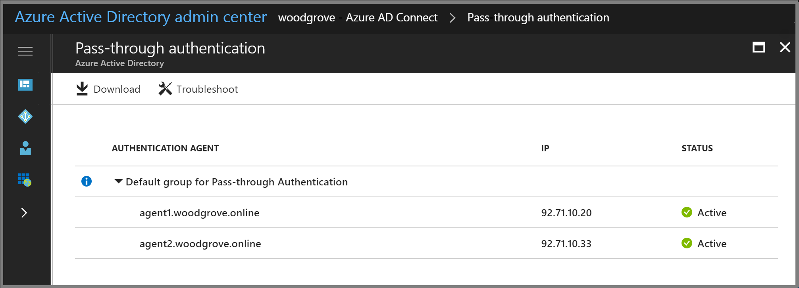

# Azure Active Directory Pass-through Authentication: Upgrade preview Authentication Agents

## Overview

This article is for customers using Azure AD Pass-through Authentication through preview. We recently upgraded (and rebranded) the Authentication Agent software. You need to _manually_ upgrade preview Authentication Agents installed on your on-premises servers. This manual upgrade is a one-time action only. All future updates to Authentication Agents are automatic. The reasons to upgrade are as follows:

- The preview versions of Authentication Agents will not receive any further security or bug fixes.
-	The preview versions of Authentication Agents can't be installed on additional servers, for high availability.

## Check versions of your Authentication Agents

### Step 1: Check where your Authentication Agents are installed

Follow these steps to check where your Authentication Agents are installed:

1. Sign in to the [Azure Active Directory admin center](https://aad.portal.azure.com) with the Global Administrator credentials for your tenant.
2. Select **Azure Active Directory** on the left-hand navigation.
3. Select **Azure AD Connect**. 
4. Select **Pass-through Authentication**. This blade lists the servers where your Authentication Agents are installed.

### Step 2: Check the versions of your Authentication Agents

To check the versions of your Authentication Agents, on each server identified in the preceding step, follow these instructions:

1. Go to **Control Panel -> Programs -> Programs and Features** on the on-premises server.
2. If there is an entry for "**Microsoft Azure AD Connect Authentication Agent**", you don't need to take any action on this server.
3. If there is an entry for "**Microsoft Azure AD Application Proxy Connector**", you need to manually upgrade on this server.

## Best practices to follow before starting the upgrade

Before upgrading, ensure that you have the following items in place:

1. **Create cloud-only Global Administrator account**: Don’t upgrade without having a cloud-only Global Administrator account to use in emergency situations where your Pass-through Authentication Agents are not working properly. Learn about [adding a cloud-only Global Administrator account](../active-directory-users-create-azure-portal.md). Doing this step is critical and ensures that you don't get locked out of your tenant.
2.	**Ensure high availability**: If not completed previously, install a second standalone Authentication Agent to provide high availability for sign-in requests, using these [instructions](how-to-connect-pta-quick-start.md#step-4-ensure-high-availability).

## Upgrading the Authentication Agent on your Azure AD Connect server

You need upgrade Azure AD Connect before upgrading the Authentication Agent on the same server. Follow these steps on both your primary and staging Azure AD Connect servers:

1. **Upgrade Azure AD Connect**: Follow this [article](how-to-upgrade-previous-version.md) and upgrade to the latest Azure AD Connect version.
2. **Uninstall the preview version of the Authentication Agent**: Download [this PowerShell script](https://aka.ms/rmpreviewagent) and run it as an Administrator on the server.
3. **Download the latest version of the Authentication Agent (versions 1.5.389.0 or later)**: Sign in to the [Azure Active Directory admin center](https://aad.portal.azure.com) with your tenant's Global Administrator credentials. Select **Azure Active Directory -> Azure AD Connect -> Pass-through Authentication -> Download agent**. Accept the [terms of service](https://aka.ms/authagenteula) and download the latest version of the Authentication Agent. You can also download the Authentication Agent from [here](https://aka.ms/getauthagent).
4. **Install the latest version of the Authentication Agent**: Run the executable downloaded in Step 3. Provide your tenant's Global Administrator credentials when prompted.
5. **Verify that the latest version has been installed**: As shown before, go to **Control Panel -> Programs -> Programs and Features** and verify that there is an entry for "**Microsoft Azure AD Connect Authentication Agent**".

>[!NOTE]
>If you check the Pass-through Authentication blade on the [Azure Active Directory admin center](https://aad.portal.azure.com) after  completing the preceding steps, you'll see two Authentication Agent entries per server - one entry showing the Authentication Agent as **Active** and the other as **Inactive**. This is _expected_. The **Inactive** entry is automatically dropped after a few days.

## Upgrading the Authentication Agent on other servers

Follow these steps to upgrade Authentication Agents on other servers (where Azure AD Connect is not installed):

1. **Uninstall the preview version of the Authentication Agent**: Download [this PowerShell script](https://aka.ms/rmpreviewagent) and run it as an Administrator on the server.
2. **Download the latest version of the Authentication Agent (versions 1.5.389.0 or later)**: Sign in to the [Azure Active Directory admin center](https://aad.portal.azure.com) with your tenant's Global Administrator credentials. Select **Azure Active Directory -> Azure AD Connect -> Pass-through Authentication -> Download agent**. Accept the terms of service and download the latest version.
3. **Install the latest version of the Authentication Agent**: Run the executable downloaded in Step 2. Provide your tenant's Global Administrator credentials when prompted.
4. **Verify that the latest version has been installed**: As shown before, go to **Control Panel -> Programs -> Programs and Features** and verify that there is an entry called **Microsoft Azure AD Connect Authentication Agent**.

>[!NOTE]
>If you check the Pass-through Authentication blade on the [Azure Active Directory admin center](https://aad.portal.azure.com) after  completing the preceding steps, you'll see two Authentication Agent entries per server - one entry showing the Authentication Agent as **Active** and the other as **Inactive**. This is _expected_. The **Inactive** entry is automatically dropped after a few days.

## Next steps
- [**Troubleshoot**](tshoot-connect-pass-through-authentication.md) - Learn how to resolve common issues with the feature.
