# Azure AD Connect sync: Make a change to the default configuration
The purpose of this article is to walk you through how to make changes to the default configuration in Azure Active Directory (Azure AD) Connect sync. It provides steps for some common scenarios. With this knowledge, you should be able to make simple changes to your own configuration based on your own business rules.

> [!WARNING]
> If you make changes to the default sync rules then these changes will be overwritten the next time Azure AD Connect is updated, resulting in unexpected and likely unwanted synchronization results.
>
> The out-of-box sync rules have a thumbprint. If you make a change to these rules, the thumbprint is no longer matching. You might have problems in the future when you try to apply a new release of Azure AD Connect. Only make changes the way it is described in this article.

## Synchronization Rules Editor
The Synchronization Rules Editor is used to see and change the default configuration. You can find it on the **Start** menu under the **Azure AD Connect** group.  
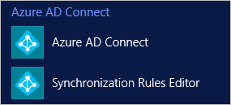

When you open the editor, you see the default out-of-box rules.

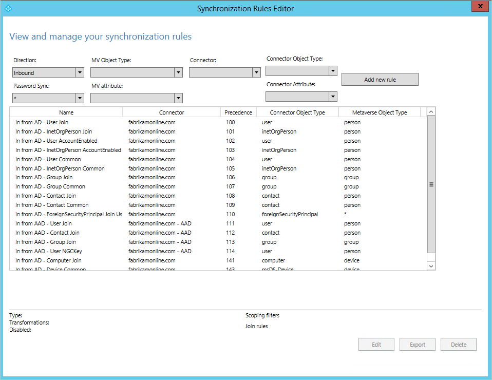

### Navigating in the editor
Using the drop-downs at the top of the editor, you can quickly find a specific rule. For example, if you want to see the rules where the attribute proxyAddresses is included, you can change the drop-downs to the following:  
  
To reset filtering and load a fresh configuration, press F5 on the keyboard.

On the upper right is the **Add new rule** button. You use this button to create your own custom rule.

At the bottom are buttons for acting on a selected sync rule. **Edit** and **Delete** do what you expect them to. **Export** produces a PowerShell script for re-creating the sync rule. With this procedure, you can move a sync rule from one server to another.

## Create your first custom rule
The most common changes are to the attribute flows. The data in your source directory might not be the same as in Azure AD. In the example in this section, make sure the given name of a user is always in *proper case*.

### Disable the scheduler
The [scheduler](how-to-connect-sync-feature-scheduler.md) runs every 30 minutes by default. Make sure it is not starting while you are making changes and troubleshooting your new rules. To temporarily disable the scheduler, start PowerShell and run `Set-ADSyncScheduler -SyncCycleEnabled $false`.

  

### Create the rule
1. Click **Add new rule**.
2. On the **Description** page, enter the following:  
     
   * **Name**: Give the rule a descriptive name.
   * **Description**: Give some clarification so someone else can understand what the rule is for.
   * **Connected System**: This is the system in which the object can be found. In this case, select **Active Directory Connector**.
   * **Connected System/Metaverse Object Type**: Select **User** and **Person**, respectively.
   * **Link Type**: Change this value to **Join**.
   * **Precedence**: Provide a value that is unique in the system. A lower numeric value indicates higher precedence.
   * **Tag**: Leave this empty. Only out-of-box rules from Microsoft should have this box populated with a value.
3. On the **Scoping filter** page, enter **givenName ISNOTNULL**.  
     
   This section is used to define to which objects the rule should apply. If it's left empty, the rule would apply to all user objects. However, that would include conference rooms, service accounts, and other non-people user objects.
4. On the **Join rules** page, leave the field empty.
5. On the **Transformations** page, change **FlowType** to **Expression**. For **Target Attribute**, select **givenName**. And for **Source**, enter **PCase([givenName])**.
     
   The sync engine is case-sensitive for both the function name and the name of the attribute. If you type something wrong, you see a warning when you add the rule. You can save and continue, but you need to reopen and correct the rule.
6. Click **Add** to save the rule.

Your new custom rule should be visible with the other sync rules in the system.

### Verify the change
With this new change, you want to make sure it is working as expected and is not throwing any errors. Depending on the number of objects you have, there are two ways to do this step:

- Run a full sync on all objects.
- Run a preview and full sync on a single object.

Open the **Synchronization Service** from the **Start** menu. The steps in this section are all in this tool.

**Full sync on all objects**  

   1. Select **Connectors** at the top. Identify the connector that you changed in the previous section (in this case, Active Directory Domain Services), and select it. 
   2. For **Actions**, select **Run**.
   3. Select **Full Synchronization**, and then select **OK**.
   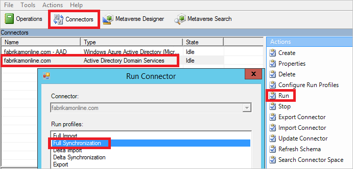  
   The objects are now updated in the metaverse. Verify your changes by looking at the object in the metaverse.

**Preview and full sync on a single object**  

   1. Select **Connectors** at the top. Identify the connector that you changed in the previous section (in this case, Active Directory Domain Services), and select it.
   2. Select **Search Connector Space**. 
   3. Use **Scope** to find an object that you want to use to test the change. Select the object and click **Preview**. 
   4. On the new screen, select **Commit Preview**.  
     
   The change is now committed to the metaverse.

**View the object in the metaverse**  

1. Pick a few sample objects to make sure that the value is expected and that the rule applied. 
2. Select **Metaverse Search** from the top. Add any filter that you need to find the relevant objects. 
3. From the search result, open an object. Look at the attribute values, and also verify in the **Sync Rules** column that the rule applied as expected.  
  

### Enable the scheduler
If everything is as expected, you can enable the scheduler again. From PowerShell, run `Set-ADSyncScheduler -SyncCycleEnabled $true`.

## Other common attribute flow changes
The previous section described how to make changes to an attribute flow. In this section, some additional examples are provided. The steps for how to create the sync rule is abbreviated, but you can find the full steps in the previous section.

### Use an attribute other than the default
In this Fabrikam scenario, there is a forest where the local alphabet is used for given name, surname, and display name. The Latin character representation of these attributes can be found in the extension attributes. For building a global address list in Azure AD and Office 365, the organization wants to use these attributes instead.

With a default configuration, an object from the local forest looks like this:  
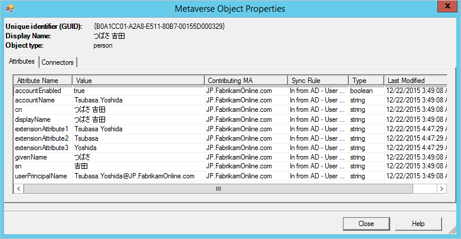

To create a rule with other attribute flows, do the following:

1. Open the **Synchronization Rules Editor** from the **Start** menu.
2. With **Inbound** still selected to the left, click the **Add new rule** button.
3. Give the rule a name and description. Select the on-premises Active Directory instance and the relevant object types. In **Link Type**, select **Join**. For **Precedence**, pick a number that is not used by another rule. The out-of-box rules start with 100, so the value 50 can be used in this example.
  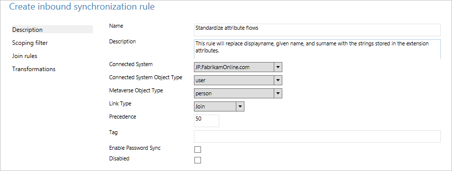
4. Leave **Scoping filter** empty. (That is, it should apply to all user objects in the forest.)
5. Leave **Join rules** empty. (That is, let the out-of-box rule handle any joins.)
6. In **Transformations**, create the following flows:  
  
7. Click **Add** to save the rule.
8. Go to **Synchronization Service Manager**. On **Connectors**, select the connector where you added the rule. Select **Run**, and then select **Full Synchronization**. A full synchronization recalculates all objects by using the current rules.

This is the result for the same object with this custom rule:  

### Length of attributes
String attributes are indexable by default, and the maximum length is 448 characters. If you are working with string attributes that might contain more, make sure to include the following in the attribute flow:  
`attributeName` <- `Left([attributeName],448)`.

### Changing the userPrincipalSuffix
The userPrincipalName attribute in Active Directory is not always known by the users and might not be suitable as the sign-in ID. With the Azure AD Connect sync installation wizard, you can choose a different attribute--for example, *mail*. But in some cases, the attribute must be calculated.

For example, the company Contoso has two Azure AD directories, one for production and one for testing. They want the users in their test tenant to use another suffix in the sign-in ID:  
`userPrincipalName` <- `Word([userPrincipalName],1,"@") & "@contosotest.com"`.

In this expression, take everything left of the first @-sign (Word) and concatenate with a fixed string.

### Convert a multi-value attribute to single value
Some attributes in Active Directory are multi-valued in the schema, even though they look single-valued in Active Directory Users and Computers. An example is the description attribute:  
`description` <- `IIF(IsNullOrEmpty([description]),NULL,Left(Trim(Item([description],1)),448))`.

In this expression, if the attribute has a value, take the first item (*Item*) in the attribute, remove leading and trailing spaces (*Trim*), and then keep the first 448 characters (*Left*) in the string.

### Do not flow an attribute
For background on the scenario for this section, see [Control the attribute flow process](concept-azure-ad-connect-sync-declarative-provisioning.md#control-the-attribute-flow-process).

There are two ways to not flow an attribute. The first is by using the installation wizard to [remove selected attributes](how-to-connect-install-custom.md#azure-ad-app-and-attribute-filtering). This option works if you have never synchronized the attribute before. However, if you have started to synchronize this attribute and later remove it with this feature, the sync engine stops managing the attribute and the existing values are left in Azure AD.

If you want to remove the value of an attribute and make sure it does not flow in the future, you need create a custom rule.

In this Fabrikam scenario, we have realized that some of the attributes we synchronize to the cloud should not be there. We want to make sure these attributes are removed from Azure AD.  

1. Create a new inbound synchronization rule and populate the description.
  
2. Create attribute flows with **Expression** for **FlowType** and with **AuthoritativeNull** for **Source**. The literal **AuthoritativeNull** indicates that the value should be empty in the metaverse, even if a lower-precedence sync rule tries to populate the value.
  
3. Save the sync rule. Start the **Synchronization Service**, find the connector, select **Run**, and then select **Full Synchronization**. This step recalculates all attribute flows.
4. Verify that the intended changes are about to be exported by searching the Connector Space.
  

## Create rules with PowerShell
Using the sync rule editor works fine when you only have a few changes to make. If you need to make many changes, PowerShell might be a better option. Some advanced features are only available with PowerShell.

### Get the PowerShell script for an out-of-box rule
To see the PowerShell script that created an out-of-box rule, select the rule in the sync rules editor and click **Export**. This action gives you the PowerShell script that created the rule.

### Advanced precedence
The out-of-box sync rules start with a precedence value of 100. If you have many forests and you need to make many custom changes, then 99 sync rules might not be enough.

You can instruct the sync engine that you want additional rules inserted before the out-of-box rules. To get this behavior, follow these steps:

1. Mark the first out-of-box sync rule (**In from AD-User Join**) in the sync rules editor and select **Export**. Copy the SR Identifier value.  
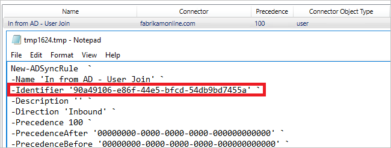  
2. Create the new sync rule. You can use the sync rules editor to create it. Export the rule to a PowerShell script.
3. In the property **PrecedenceBefore**, insert the Identifier value from the out-of-box rule. Set the **Precedence** to **0**. Make sure the Identifier attribute is unique and that you are not reusing a GUID from another rule. Also make sure that the **ImmutableTag** property is not set. This property should be set only for an out-of-box rule.
4. Save the PowerShell script and run it. The result is that your custom rule is assigned the precedence value of 100 and all other out-of-box rules are incremented.  
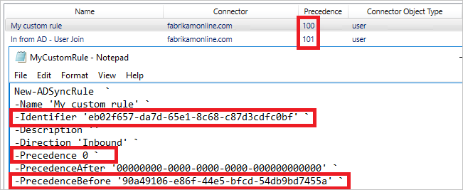  

You can have many custom sync rules by using the same **PrecedenceBefore** value when needed.

## Enable synchronization of UserType
Azure AD Connect supports synchronization of the **UserType** attribute for **User** objects in version 1.1.524.0 and later. More specifically, the following changes have been introduced:

- The schema of the object type **User** in the Azure AD Connector is extended to include the UserType attribute, which is of the type string and is single-valued.
- The schema of the object type **Person** in the metaverse is extended to include the UserType attribute, which is of the type string and is single-valued.

By default, the UserType attribute is not enabled for synchronization because there is no corresponding UserType attribute in on-premises Active Directory. You must manually enable synchronization. Before doing this, you must take note of the following behavior enforced by Azure AD:

- Azure AD only accepts two values for the UserType attribute: **Member** and **Guest**.
- If the UserType attribute is not enabled for synchronization in Azure AD Connect, Azure AD users created through directory synchronization would have the UserType attribute set to **Member**.
- Azure AD does not permit the UserType attribute on existing Azure AD users to be changed by Azure AD Connect. It can only be set during the creation of the Azure AD users.

Before enabling synchronization of the UserType attribute, you must first decide how the attribute is derived from on-premises Active Directory. The following are the most common approaches:

- Designate an unused on-premises AD attribute (such as extensionAttribute1) to be used as the source attribute. The designated on-premises AD attribute should be of the type **string**, be single-valued, and contain the value **Member** or **Guest**. 

    If you choose this approach, you must ensure that the designated attribute is populated with the correct value for all existing user objects in on-premises Active Directory that are synchronized to Azure AD before enabling synchronization of the UserType attribute.

- Alternatively, you can derive the value for the UserType attribute from other properties. For example, you want to synchronize all users as **Guest** if their on-premises AD userPrincipalName attribute ends with domain part <em>@partners.fabrikam123.org</em>. 

    As mentioned previously, Azure AD Connect does not permit the UserType attribute on existing Azure AD users to be changed by Azure AD Connect. Therefore, you must ensure that the logic you have decided is consistent with how the UserType attribute is already configured for all existing Azure AD users in your tenant.

The steps to enable synchronization of the UserType attribute can be summarized as:

1.	Disable the sync scheduler and verify there is no synchronization in progress.
2.	Add the source attribute to the on-premises AD Connector schema.
3.	Add the UserType to the Azure AD Connector schema.
4.	Create an inbound synchronization rule to flow the attribute value from on-premises Active Directory.
5.	Create an outbound synchronization rule to flow the attribute value to Azure AD.
6.	Run a full synchronization cycle.
7.	Enable the sync scheduler.

>[!NOTE]
> The rest of this section covers these steps. They are described in the context of an Azure AD deployment with single-forest topology and without custom synchronization rules. If you have multi-forest topology, custom synchronization rules configured, or have a staging server, you need to adjust the steps accordingly.

### Step 1: Disable the sync scheduler and verify there is no synchronization in progress
To avoid exporting unintended changes to Azure AD, ensure that no synchronization takes place while you are in the middle of updating synchronization rules. To disable the built-in sync scheduler:

 1. Start a PowerShell session on the Azure AD Connect server.
 2. Disable scheduled synchronization by running the cmdlet `Set-ADSyncScheduler -SyncCycleEnabled $false`.
 3. Open the Synchronization Service Manager by going to **Start** > **Synchronization Service**.
 4. Go to the **Operations** tab and confirm there is no operation with a status of *in progress*.

### Step 2: Add the source attribute to the on-premises AD Connector schema
Not all Azure AD attributes are imported into the on-premises AD Connector Space. To add the source attribute to the list of the imported attributes:

 1. Go to the **Connectors** tab in the Synchronization Service Manager.
 2. Right-click the on-premises AD Connector and select **Properties**.
 3. In the pop-up dialog box, go to the **Select Attributes** tab.
 4. Make sure the source attribute is checked in the attribute list.
 5. Click **OK** to save.
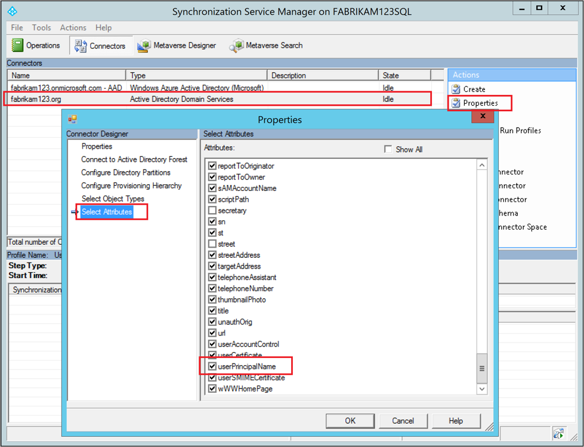

### Step 3: Add the UserType to the Azure AD Connector schema
By default, the UserType attribute is not imported into the Azure AD Connect Space. To add the UserType attribute to the list of imported attributes:

 1. Go to the **Connectors** tab in the Synchronization Service Manager.
 2. Right-click the **Azure AD Connector** and select **Properties**.
 3. In the pop-up dialog box, go to the **Select Attributes** tab.
 4. Make sure the UserType attribute is checked in the attribute list.
 5. Click **OK** to save.

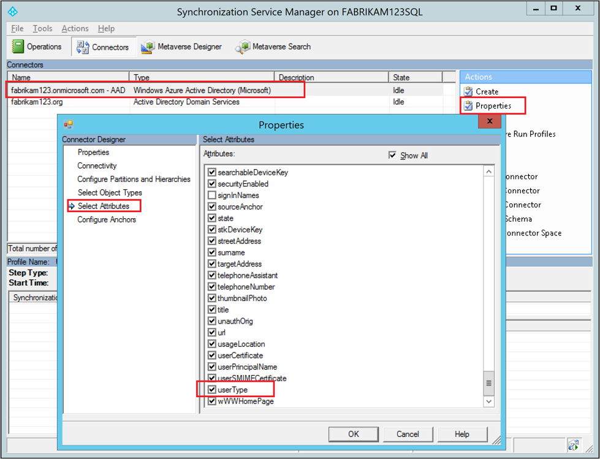

### Step 4: Create an inbound synchronization rule to flow the attribute value from on-premises Active Directory
The inbound synchronization rule permits the attribute value to flow from the source attribute from on-premises Active Directory to the metaverse:

1. Open the Synchronization Rules Editor by going to **Start** > **Synchronization Rules Editor**.
2. Set the search filter **Direction** to be **Inbound**.
3. Click the **Add new rule** button to create a new inbound rule.
4. Under the **Description** tab, provide the following configuration:

    | Attribute | Value | Details |
    | --- | --- | --- |
    | Name | *Provide a name* | For example, *In from AD – User UserType* |
    | Description | *Provide a description* |  |
    | Connected System | *Pick the on-premises AD connector* |  |
    | Connected System Object Type | **User** |  |
    | Metaverse Object Type | **Person** |  |
    | Link Type | **Join** |  |
    | Precedence | *Choose a number between 1–99* | 1–99 is reserved for custom sync rules. Do not pick a value that is used by another synchronization rule. |

5. Go to the **Scoping filter** tab and add a **single scoping filter group** with the following clause:

    | Attribute | Operator | Value |
    | --- | --- | --- |
    | adminDescription | NOTSTARTWITH | User\_ |

    The scoping filter determines to which on-premises AD objects this inbound synchronization rule is applied. In this example, we use the same scoping filter used in the *In from AD – User Common* out-of-box synchronization rule, which prevents the synchronization rule from being applied to User objects created through the Azure AD User writeback feature. You might need to tweak the scoping filter according to your Azure AD Connect deployment.

6. Go to the **Transformation** tab and implement the desired transformation rule. For example, if you have designated an unused on-premises AD attribute (such as extensionAttribute1) as the source attribute for the UserType, you can implement a direct attribute flow:

    | Flow type | Target attribute | Source | Apply once | Merge type |
    | --- | --- | --- | --- | --- |
    | Direct | UserType | extensionAttribute1 | Unchecked | Update |

    In another example, you want to derive the value for the UserType attribute from other properties. For example, you want to synchronize all users as Guest if their on-premises AD userPrincipalName attribute ends with domain part <em>@partners.fabrikam123.org</em>. You can implement an expression like this:

    | Flow type | Target attribute | Source | Apply once | Merge type |
    | --- | --- | --- | --- | --- |
    | Expression | UserType | IIF(IsPresent([userPrincipalName]),IIF(CBool(InStr(LCase([userPrincipalName]),"@partners.fabrikam123.org")=0),"Member","Guest"),Error("UserPrincipalName is not present to determine UserType")) | Unchecked | Update |

7. Click **Add** to create the inbound rule.

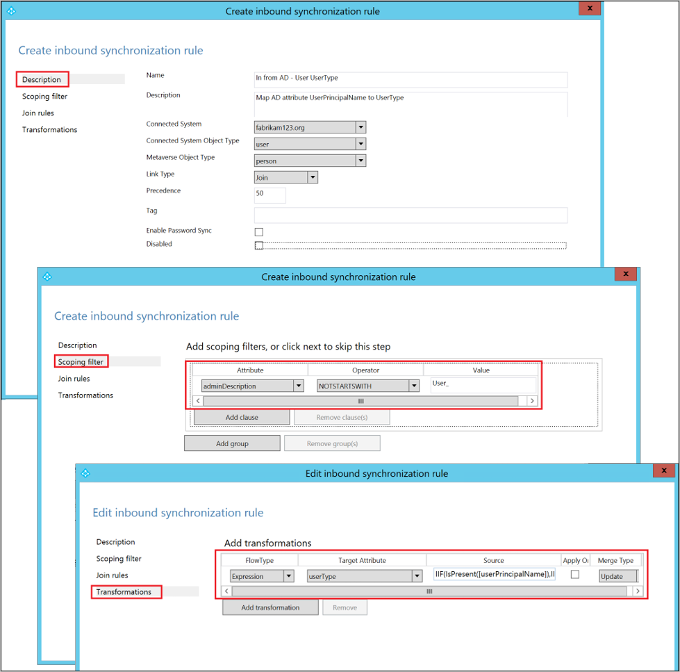

### Step 5: Create an outbound synchronization rule to flow the attribute value to Azure AD
The outbound synchronization rule permits the attribute value to flow from the metaverse to the UserType attribute in Azure AD:

1. Go to the Synchronization Rules Editor.
2. Set the search filter **Direction** to be **Outbound**.
3. Click the **Add new rule** button.
4. Under the **Description** tab, provide the following configuration:

    | Attribute | Value | Details |
    | ----- | ------ | --- |
    | Name | *Provide a name* | For example, *Out to AAD – User UserType* |
    | Description | *Provide a description* ||
    | Connected System | *Select the AAD connector* ||
    | Connected System Object Type | **User** ||
    | Metaverse Object Type | **Person** ||
    | Link Type | **Join** ||
    | Precedence | *Choose a number between 1–99* | 1–99 is reserved for custom sync rules. Do not pick a value that is used by another synchronization rule. |

5. Go to the **Scoping filter** tab and add a **single scoping filter group** with two clauses:

    | Attribute | Operator | Value |
    | --- | --- | --- |
    | sourceObjectType | EQUAL | User |
    | cloudMastered | NOTEQUAL | True |

    The scoping filter determines to which Azure AD objects this outbound synchronization rule is applied. In this example, we use the same scoping filter from the *Out to AD – User Identity* out-of-box synchronization rule. It prevents the synchronization rule from being applied to User objects that are not synchronized from on-premises Active Directory. You might need to tweak the scoping filter according to your Azure AD Connect deployment.

6. Go to the **Transformation** tab and implement the following transformation rule:

    | Flow type | Target attribute | Source | Apply once | Merge type |
    | --- | --- | --- | --- | --- |
    | Direct | UserType | UserType | Unchecked | Update |

7. Click **Add** to create the outbound rule.

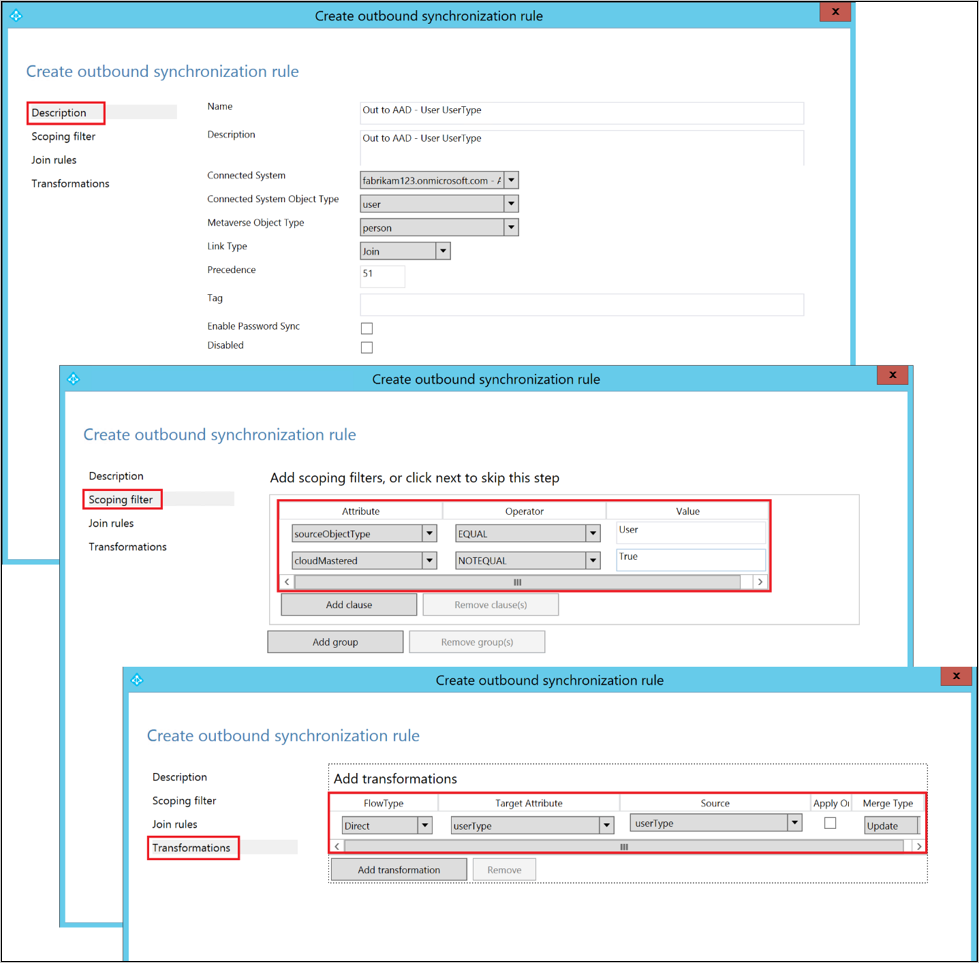

### Step 6: Run a full synchronization cycle
In general, a full synchronization cycle is required because we have added new attributes to both the Active Directory and Azure AD Connector schemas, and introduced custom synchronization rules. You want to verify the changes before exporting them to Azure AD. 

You can use the following steps to verify the changes while manually running the steps that make up a full synchronization cycle.

1. Run a **Full import** on the **on-premises AD Connector**:

   1. Go to the **Operations** tab in the Synchronization Service Manager.
   2. Right-click the **on-premises AD Connector** and select **Run**.
   3. In the pop-up dialog box, select **Full Import** and then click **OK**.
   4. Wait for the operation to finish.

    > [!NOTE]
    > You can skip a full import on the on-premises AD Connector if the source attribute is already included in the list of imported attributes. In other words, you did not have to make any changes during [Step 2: Add the source attribute to the on-premises AD Connector schema](#step-2-add-the-source-attribute-to-the-on-premises-ad-connector-schema).

2. Run a **Full import** on the **Azure AD Connector**:

   1. Right-click the **Azure AD Connector** and select **Run**.
   2. In the pop-up dialog box, select **Full Import** and then click **OK**.
   3. Wait for the operation to finish.

3. Verify the synchronization rule changes on an existing User object:

    The source attribute from on-premises Active Directory and the UserType from Azure AD have been imported into their respective Connector Spaces. Before proceeding with a full synchronization, do a **Preview** on an existing User object in the on-premises AD Connector Space. The object you chose should have the source attribute populated.
    
    A successful **Preview** with the UserType populated in the metaverse is a good indicator that you have configured the synchronization rules correctly. For information about how to do a **Preview**, refer to the section [Verify the change](#verify-the-change).

4. Run a **Full Synchronization** on the **on-premises AD Connector**:

   1. Right-click the **on-premises AD Connector** and select **Run**.
   2. In the pop-up dialog box, select **Full Synchronization** and then click **OK**.
   3. Wait for the operation to finish.

5. Verify **Pending Exports** to Azure AD:

   1. Right-click the **Azure AD Connector** and select **Search Connector Space**.
   2. In the **Search Connector Space** pop-up dialog box:

      - Set **Scope** to **Pending Export**.
      - Select all three check boxes: **Add**, **Modify**, and **Delete**.
      - Click the **Search** button to get the list of objects with changes to be exported. To examine the changes for a given object, double-click the object.
      - Verify that the changes are expected.

6. Run **Export** on the **Azure AD Connector**:

   1. Right-click the **Azure AD Connector** and select **Run**.
   2. In the **Run Connector** pop-up dialog box, select **Export** and then click **OK**.
   3. Wait for the export to Azure AD to finish.

> [!NOTE]
> These steps do not include the full synchronization and export steps on the Azure AD Connector. These steps are not required because the attribute values are flowing from on-premises Active Directory to Azure AD only.

### Step 7: Re-enable the sync scheduler
Re-enable the built-in sync scheduler:

1. Start a PowerShell session.
2. Re-enable scheduled synchronization by running the cmdlet `Set-ADSyncScheduler -SyncCycleEnabled $true`.

## Next steps
* Read more about the configuration model in [Understanding Declarative Provisioning](concept-azure-ad-connect-sync-declarative-provisioning.md).
* Read more about the expression language in [Understanding Declarative Provisioning Expressions](concept-azure-ad-connect-sync-declarative-provisioning-expressions.md).

**Overview topics**

* [Azure AD Connect sync: Understand and customize synchronization](how-to-connect-sync-whatis.md)
* [Integrating your on-premises identities with Azure Active Directory](whatis-hybrid-identity.md)
