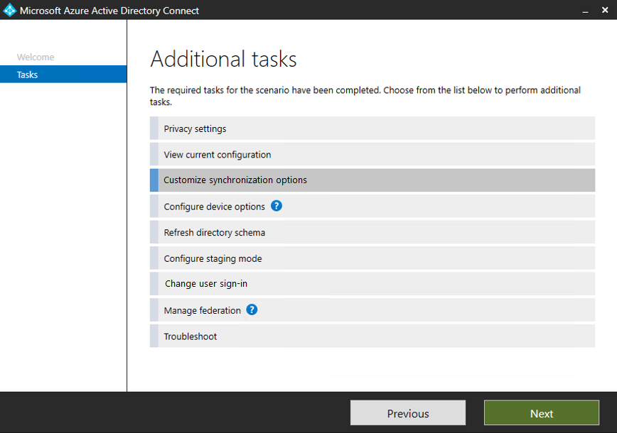
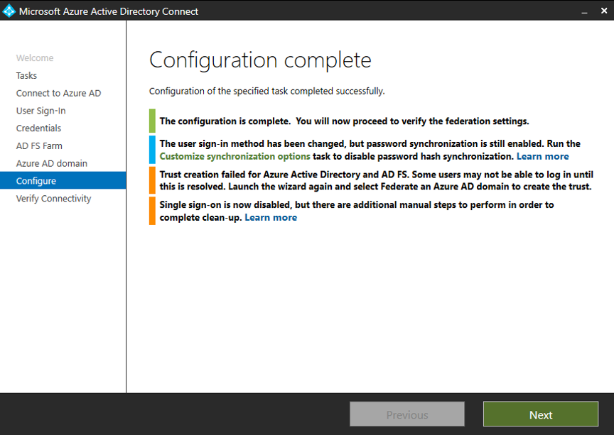

# Tutorial:  Setting up PHS as backup for AD FS in Azure AD Connect

The following tutorial will walk you through setting up password hash sync as a backup and fail-over for AD FS.  This document will also demonstrate how to enable password hash sync as the primary authentication method, if AD FS has failed or become unavailable.

>[!NOTE] 
>Although these steps are usually performed during emergency or outage situations, it is recommended that you test these steps and verify your procedures before an outage occurs.

>[!NOTE]
>In the event that you do not have access to Azure AD Connect server or the server does not have access to the internet, you can contact [Microsoft Support](https://support.microsoft.com/en-us/contactus/) to assist with the changes to the Azure AD side.

## Prerequisites
This tutorial builds upon the [Tutorial: Federate a single AD forest environment to the cloud](tutorial-federation.md) and is a per-requisite before attempting this tutorial.  If you have not completed this tutorial, do so before attempting the steps in this document.

>[!IMPORTANT]
>Prior to switching to PHS you should create a backup of your AD FS environment.  This can be done using the [AD FS Rapid Restore Tool](/windows-server/identity/ad-fs/operations/ad-fs-rapid-restore-tool#how-to-use-the-tool).

## Enable PHS in Azure AD Connect
The first step, now that we have an Azure AD Connect environment that is using federation, is to turn on password hash sync and allow Azure AD Connect to synchronize the hashes.

Do the following:

1.  Double-click the Azure AD Connect icon that was created on the desktop
2.  Click **Configure**.
3.  On the Additional tasks page, select **Customize synchronization options** and click **Next**.
4.  Enter the username and password for your Hybrid Identity Administrator or your hybrid identity administrator.  This account was created [here](tutorial-federation.md#create-a-hybrid-identity-administrator-in-azure-ad) in the previous tutorial.
5.  On the **Connect your directories** screen, click **Next**.
6.  On the **Domain and OU filtering** screen, click **Next**.
7.  On the **Optional features** screen, check **Password hash synchronization** and click **Next**.
 
8.  On the **Ready to configure** screen click **Configure**.
9.  Once the configuration completes, click **Exit**.
10. That's it!  You are done.  Password hash synchronization will now occur and can be used as a backup if AD FS becomes unavailable.

## Switch to password hash synchronization
Now, we will show you how to switch over to password hash synchronization. Before you start, consider under which conditions should you make the switch. Don't make the switch for temporary reasons, like a network outage, a minor AD FS problem, or a problem that affects a subset of your users. If you decide to make the switch because fixing the problem will take too long, do the following:

> [!IMPORTANT]
> Be aware that it will take some time for the password hashes to synchronize to Azure AD.  This means that it may take up 3 hours for the synchronizations to complete and before you can start authenticating using the password hashes.

1. Double-click the Azure AD Connect icon that was created on the desktop
2.  Click **Configure**.
3.  Select **Change user sign-in** and click **Next**.
 
4.  Enter the username and password for your Hybrid Identity Administratoristrator or your hybrid identity administrator.  This account was created [here](tutorial-federation.md#create-a-hybrid-identity-administrator-in-azure-ad) in the previous tutorial.
5.  On the **User sign-in** screen, select **Password Hash Synchronization** and place a check in the **Do not convert user accounts** box.  
6.  Leave the default **Enable single sign-on** selected and click **Next**.
7.  On the **Enable single sign-on** screen click **Next**.
8.  On the **Ready to configure** screen, click **Configure**.
9.  Once configuration is complete, click **Exit**.
10. Users can now use their passwords to sign in to Azure and Azure services.

## Test signing in with one of our users

1. Browse to [https://myapps.microsoft.com](https://myapps.microsoft.com)
2. Sign in with a user account that was created in our new tenant.  You will need to sign in using the following format: (user@domain.onmicrosoft.com). Use the same password that the user uses to sign in on-premises. 
    

## Switch back to federation
Now, we will show you how to switch back to federation.  To do this, do the following:

1.  Double-click the Azure AD Connect icon that was created on the desktop
2.  Click **Configure**.
3.  Select **Change user sign-in** and click **Next**.
4.  Enter the username and password for your Hybrid Identity Administrator or your hybrid identity administrator.  This is the account that was created [here](tutorial-federation.md#create-a-hybrid-identity-administrator-in-azure-ad) in the previous tutorial.
5.  On the **User sign-in** screen, select **Federation with AD FS** and click **Next**.  
6. On the Domain Administrator credentials page, enter the contoso\Administrator username and password and click **Next.**
7. On the AD FS farm screen, click **Next**.
8. On the **Azure AD domain** screen, select the domain from the drop-down and click **Next**.
9. On the **Ready to configure** screen, click **Configure**.
10. Once configuration is complete, click **Next**.
 
11. On the **Verify federation connectivity** screen, click **Verify**.  You may need to configure DNS records (add A and AAAA records) for this to complete successfully.
 
12. Click **Exit**.

## Reset the AD FS and Azure trust
Now we need to reset the trust between AD FS and Azure.

1.  Double-click the Azure AD Connect icon that was created on the desktop
2.  Click **Configure**.
3.  Select **Manage Federation** and click **Next**.
4.  Select **Reset Azure AD trust** and click **Next**.
 
5.  On the **Connect to Azure AD** screen enter the username and password for your global administrator or your hybrid identity administrator.
6.  On the **Connect to AD FS** screen, enter the contoso\Administrator username and password and click **Next.**
7.  On the **Certificates** screen, click **Next**.

## Test signing in with a user

1.  Browse to [https://myapps.microsoft.com](https://myapps.microsoft.com)
2. Sign-in with a user account that was created in our new tenant.  You will need to sign-in using the following format: (user@domain.onmicrosoft.com). Use the same password that the user uses to sign-in on-premises.

You have now successfully setup a hybrid identity environment that you can use to test and familiarize yourself with what Azure has to offer.

## Next steps

- [Hardware and prerequisites](how-to-connect-install-prerequisites.md) 
- [Express settings](how-to-connect-install-express.md)
- [Password hash synchronization](how-to-connect-password-hash-synchronization.md)
