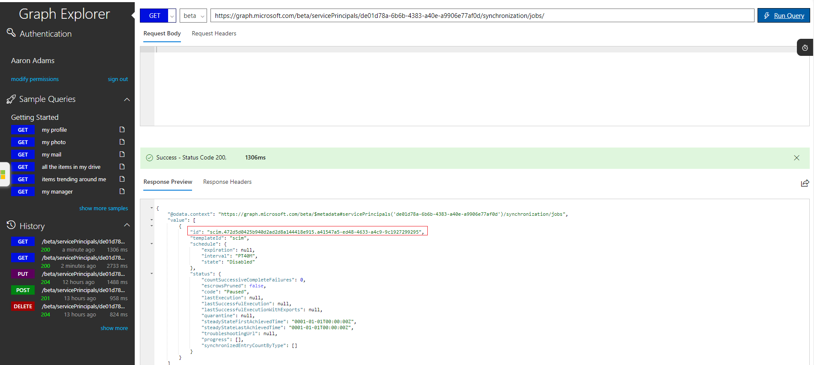
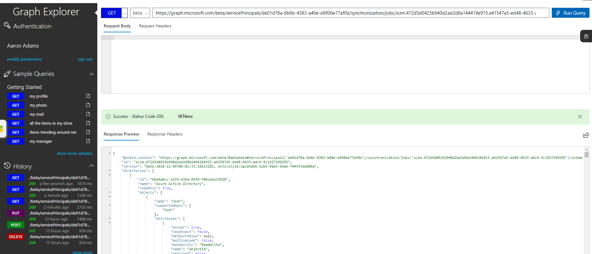

# Known issues and resolutions with SCIM 2.0 protocol compliance of the Azure AD User Provisioning service

Azure Active Directory (Azure AD) can automatically provision users and groups to any application or system that is fronted by a web service with the interface defined in the [System for Cross-Domain Identity Management (SCIM) 2.0 protocol specification](https://tools.ietf.org/html/draft-ietf-scim-api-19). 

Azure AD's support for the SCIM 2.0 protocol is described in [Using System for Cross-Domain Identity Management (SCIM) to automatically provision users and groups from Azure Active Directory to applications](use-scim-to-provision-users-and-groups.md), which lists the specific parts of the protocol that it implements in order to automatically provision users and groups from Azure AD to applications that support SCIM 2.0.

This article describes current and past issues with the Azure AD user provisioning service's adherence to the SCIM 2.0 protocol, and how to work around these issues.

> [!IMPORTANT]
> The latest update to the Azure AD user provisioning service SCIM client was made on December 18, 2018. This update addressed the known compatibility issues listed in the table below. See the frequently asked questions below for more information about this update.

## SCIM 2.0 compliance issues and status

| **SCIM 2.0 compliance issue** |  **Fixed?** | **Fix date**  |  
|---|---|---|
| Azure AD requires "/scim" to be in the root of the application's SCIM endpoint URL  | Yes  |  December 18, 2018 | 
| Extension attributes use dot "." notation before attribute names instead of colon ":" notation |  Yes  | December 18, 2018  | 
|  Patch requests for multi-value attributes contain invalid path filter syntax | Yes  |  December 18, 2018  | 
|  Group creation requests contain an invalid schema URI | Yes  |  December 18, 2018  |  

## Were the services fixes described automatically applied to my pre-existing SCIM app?

No. As it would have constituted a breaking change to SCIM apps that were coded to work with the older behavior, the changes were not automatically applied to existing apps.

The changes are applied to all new [non-gallery SCIM apps](configure-single-sign-on-non-gallery-applications.md)
 configured in the Azure portal, after the date of the fix.

For information on how to migrate a pre-existing user provisioning job to include the latest fixes, see the next section.

## Can I migrate an existing SCIM-based user provisioning job to include the latest service fixes?

Yes. If you are already using this application instance for single sign-on, and need to migrate the existing provisioning job to include the latest fixes, follow the procedure below. This procedure describes how to use the Microsoft Graph API and the Microsoft Graph API explorer to remove your old provisioning job from your existing SCIM app, and create a new one that exhibits the new behavior.

> [!NOTE]
> If your application is still in development and has not yet been deployed for either single sign-on or user provisioning, the easiest solution is to delete the application entry in the **Azure Active Directory > Enterprise Applications** section of the Azure portal, and simply add a new entry for the application using the **Create application > Non-gallery** option. This is an alternative to running the procedure below.
 
1. Sign into the Azure portal at https://portal.azure.com.
2. In the **Azure Active Directory > Enterprise Applications** section of the Azure portal, locate and select your existing SCIM application.
3.	In the **Properties** section of your existing SCIM app, copy the **Object ID**.
4.  In a new web browser window, go to https://developer.microsoft.com/en-us/graph/graph-explorer 
and sign in as the administrator for the Azure AD tenant where your app is added.
5. In the Graph Explorer, run the command below to locate the ID of your provisioning job. Replace "[object-id]" with the service principal ID (object ID) copied from the third step.
 
 `GET https://graph.microsoft.com/beta/servicePrincipals/[object-id]/synchronization/jobs` 

  

6. In the results, copy the full "ID" string that begins with either "customappsso" or "scim".
7. Run the command below to retrieve the attribute-mapping configuration, so you can make a backup. Use the same [object-id] as before, and replace [job-id] with the provisioning job ID copied from the last step.
 
 `GET https://graph.microsoft.com/beta/servicePrincipals/[object-id]/synchronization/jobs/[job-id]/schema`
 
  

8. Copy the JSON output from the last step, and save it to a text file. This contains any custom attribute-mappings that you added to your old app, and should be approximately a few thousand lines of JSON.
9. Run the command below to delete the provisioning job:
 
 `DELETE https://graph.microsoft.com/beta/servicePrincipals/[object-id]/synchronization/jobs/[job-id]`

10. Run the command below to create a new provisioning job that has the latest service fixes.

 `POST https://graph.microsoft.com/beta/servicePrincipals/[object-id]/synchronization/jobs `
 `{   templateId: "scim"   } `
   
11. In the results of the last step, copy the full "ID" string that begins with "scim". Optionally, re-apply your old attribute-mappings by running the command below, replacing [new-job-id] with the new job ID you just copied, and entering the JSON output from step #7 as the request body.

 `POST https://graph.microsoft.com/beta/servicePrincipals/[object-id]/synchronization/jobs/[new-job-id]/schema `
 `{   <your-schema-json-here>   }`

12. Return to the first web browser window, and select the **Provisioning** tab for your application.
13. Verify your configuration, and then start the provisioning job. 

## Can I add a new non-gallery app that has the old user provisioning behavior?

Yes. If you had coded an application to the old behavior that existed prior to the fixes, and need to deploy a new instance of it, follow the procedure below. This procedure describes how to use the Microsoft Graph API and the Microsoft Graph API explorer to create a SCIM provisioning job that exhibits the old behavior.
 
1.	Sign into the Azure portal at https://portal.azure.com.
2. in the **Azure Active Directory > Enterprise Applications > Create application** section of the Azure portal, create a new **Non-gallery** application.
3.	In the **Properties** section of your new custom app, copy the **Object ID**.
4.  In a new web browser window, go to https://developer.microsoft.com/en-us/graph/graph-explorer 
and sign in as the administrator for the Azure AD tenant where your app is added.
5. In the Graph Explorer, run the command below to initialize the provisioning configuration for your app.
Replace "[object-id]" with the service principal ID (object ID) copied from the third step.

 `POST https://graph.microsoft.com/beta/servicePrincipals/[object-id]/synchronization/jobs`
 `{   templateId: "customappsso"   }`
 
6. Return to the first web browser window, and select the **Provisioning** tab for your application.
7. Complete the user provisioning configuration as you normally would.

## Next steps
[Learn more about provisioning and de-provisioning to SaaS applications](user-provisioning.md)

