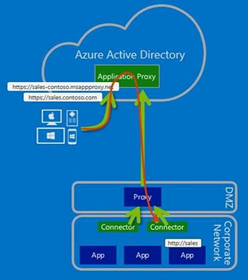
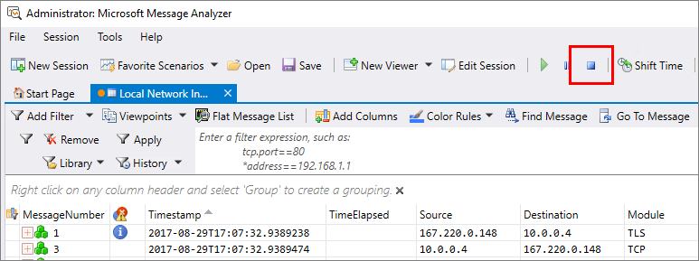

# Work with existing on-premises proxy servers

This article explains how to configure Azure Active Directory (Azure AD) Application Proxy connectors to work with outbound proxy servers. It is intended for customers with network environments that have existing proxies.

We start by looking at these main deployment scenarios:
* Configure connectors to bypass your on-premises outbound proxies.
* Configure connectors to use an outbound proxy to access Azure AD Application Proxy.

For more information about how connectors work, see [Understand Azure AD Application Proxy connectors](application-proxy-connectors.md).

## Bypass outbound proxies

Connectors have underlying OS components that make outbound requests. These components automatically attempt to locate a proxy server on the network using Web Proxy Auto-Discovery (WPAD).

The OS components attempt to locate a proxy server by carrying out a DNS lookup for wpad.domainsuffix. If the lookup resolves in DNS, an HTTP request is then made to the IP address for wpad.dat. This request becomes the proxy configuration script in your environment. The connector uses this script to select an outbound proxy server. However, connector traffic might still not go through, because of additional configuration settings needed on the proxy.

You can configure the connector to bypass your on-premises proxy to ensure that it uses direct connectivity to the Azure services. We recommend this approach, as long as your network policy allows for it, because it means that you have one less configuration to maintain.

To disable outbound proxy usage for the connector, edit the C:\Program Files\Microsoft AAD App Proxy Connector\ApplicationProxyConnectorService.exe.config file and add the *system.net* section shown in this code sample:

```xml
<?xml version="1.0" encoding="utf-8" ?>
<configuration>
  <system.net>
    <defaultProxy enabled="false"></defaultProxy>
  </system.net>
  <runtime>
    <gcServer enabled="true"/>
  </runtime>
  <appSettings>
    <add key="TraceFilename" value="AadAppProxyConnector.log" />
  </appSettings>
</configuration>
```
To ensure that the Connector Updater service also bypasses the proxy, make a similar change to the ApplicationProxyConnectorUpdaterService.exe.config file. This file is located at C:\Program Files\Microsoft AAD App Proxy Connector Updater.

Be sure to make copies of the original files, in case you need to revert to the default .config files.

## Use the outbound proxy server

Some environments require all outbound traffic to go through an outbound proxy, without exception. As a result, bypassing the proxy is not an option.

You can configure the connector traffic to go through the outbound proxy, as shown in the following diagram:

 

As a result of having only outbound traffic, there's no need to configure inbound access through your firewalls.

>[!NOTE]
>Application Proxy does not support authentication to other proxies. The connector/updater network service accounts should be able to connect to the proxy without being challenged for authentication.

### Step 1: Configure the connector and related services to go through the outbound proxy

If WPAD is enabled in the environment and configured appropriately, the connector automatically discovers the outbound proxy server and attempt to use it. However, you can explicitly configure the connector to go through an outbound proxy.

To do so, edit the C:\Program Files\Microsoft AAD App Proxy Connector\ApplicationProxyConnectorService.exe.config file, and add the *system.net* section shown in this code sample. Change *proxyserver:8080* to reflect your local proxy server name or IP address, and the port that it's listening on. The value must have the prefix http:// even if you are using an IP address.

```xml
<?xml version="1.0" encoding="utf-8" ?>
<configuration>
  <system.net>  
    <defaultProxy>   
      <proxy proxyaddress="http://proxyserver:8080" bypassonlocal="True" usesystemdefault="True"/>   
    </defaultProxy>  
  </system.net>
  <runtime>
    <gcServer enabled="true"/>
  </runtime>
  <appSettings>
    <add key="TraceFilename" value="AadAppProxyConnector.log" />
  </appSettings>
</configuration>
```

Next, configure the Connector Updater service to use the proxy by making a similar change to the C:\Program Files\Microsoft AAD App Proxy Connector Updater\ApplicationProxyConnectorUpdaterService.exe.config file.

### Step 2: Configure the proxy to allow traffic from the connector and related services to flow through

There are four aspects to consider at the outbound proxy:
* Proxy outbound rules
* Proxy authentication
* Proxy ports
* SSL inspection

#### Proxy outbound rules
Allow access to the following URLs:

| URL | How it's used |
| --- | --- |
| \*.msappproxy.net<br>\*.servicebus.windows.net | Communication between the connector and the Application Proxy cloud service |
| mscrl.microsoft.com:80<br>crl.microsoft.com:80<br>ocsp.msocsp.com:80<br>www.microsoft.com:80 | Azure uses these URLs to verify certificates |
| login.windows.net<br>login.microsoftonline.com | The connector uses these URLs during the registration process. |

If your firewall or proxy allows DNS whitelisting, you can whitelist connections to \*.msappproxy.net and \*.servicebus.windows.net. If not, you need to allow access to the [Azure DataCenter IP ranges](https://www.microsoft.com/download/details.aspx?id=41653). The IP ranges are updated each week.


If you can't allow connectivity by FQDN and need to specify IP ranges instead, use these options:

* Allow the connector outbound access to all destinations.
* Allow the connector outbound access to all of the [Azure datacenter IP ranges](https://www.microsoft.com//download/details.aspx?id=41653). The challenge with using the list of Azure datacenter IP ranges is that it's updated weekly. You need to put a process in place to ensure that your access rules are updated accordingly. Only using a subset of the IP addresses may cause your configuration to break.

#### Proxy authentication

Proxy authentication is not currently supported. Our current recommendation is to allow the connector anonymous access to the Internet destinations.

#### Proxy ports

The connector makes outbound SSL-based connections by using the CONNECT method. This method essentially sets up a tunnel through the outbound proxy. Configure the proxy server to allow tunneling to ports 443 and 80.

>[!NOTE]
>When Service Bus runs over HTTPS, it uses port 443. However, by default, Service Bus attempts direct TCP connections and falls back to HTTPS only if direct connectivity fails.

#### SSL inspection
Do not use SSL inspection for the connector traffic, because it causes problems for the connector traffic. The connector uses a certificate to authenticate to the Application Proxy service, and that certificate can be lost during SSL inspection. 

## Troubleshoot connector proxy problems and service connectivity issues
Now you should see all traffic flowing through the proxy. If you have problems, the following troubleshooting information should help.

The best way to identify and troubleshoot connector connectivity issues is to take a network capture while starting the connector service. Here are some quick tips on capturing and filtering network traces.

You can use the monitoring tool of your choice. For the purposes of this article, we used Microsoft Message Analyzer. You can [download it from Microsoft](https://www.microsoft.com/download/details.aspx?id=44226).

The following examples are specific to Message Analyzer, but the principles can be applied to any analysis tool.

### Take a capture of connector traffic

For initial troubleshooting, perform the following steps:

1. From services.msc, stop the Azure AD Application Proxy Connector service.

   

2. Run Message Analyzer as an administrator.
3. Select **Start local trace**.

   

3. Start the Azure AD Application Proxy Connector service.
4. Stop the network capture.

   

### Check if the connector traffic bypasses outbound proxies

If you configured your Application Proxy connector to bypass the proxy servers and connect directly to the Application Proxy service, you want to look in the network capture for failed TCP connection attempts. 

Use the Message Analyzer filter to identify these attempts. Enter `property.TCPSynRetransmit` in the filter box and select **Apply**. 

A SYN packet is the first packet sent to establish a TCP connection. If this packet doesn’t return a response, the SYN is reattempted. You can use the preceding filter to see any retransmitted SYNs. Then, you can check whether these SYNs correspond to any connector-related traffic.

If you expect the connector to make direct connections to the Azure services, SynRetransmit responses on port 443 are an indication that you have a network or firewall problem.

### Check if the connector traffic uses outbound proxies

If you configured your Application Proxy connector traffic to go through the proxy servers, you want to look for failed https connections to your proxy. 

To filter the network capture for these connection attempts, enter `(https.Request or https.Response) and tcp.port==8080` in the Message Analyzer filter, replacing 8080 with your proxy service port. Select **Apply** to see the filter results. 

The preceding filter shows just the HTTPs requests and responses to/from the proxy port. You're looking for the CONNECT requests that show communication with the proxy server. Upon success, you get an HTTP OK (200) response.

If you see other response codes, such as 407 or 502, that means that the proxy is requiring authentication or not allowing the traffic for some other reason. At this point, you engage your proxy server support team.

## Next steps

- [Understand Azure AD Application Proxy connectors](application-proxy-connectors.md)

- If you have problems with connector connectivity issues, ask your question in the [Azure Active Directory forum](https://social.msdn.microsoft.com/Forums/azure/en-US/home?forum=WindowsAzureAD&forum=WindowsAzureAD) or create a ticket with our support team.
