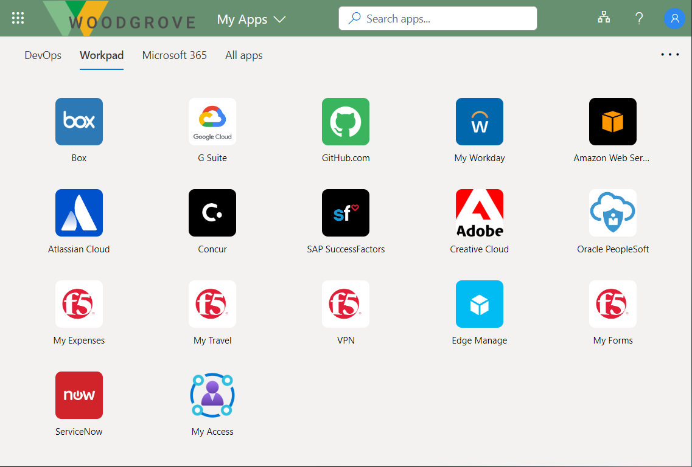
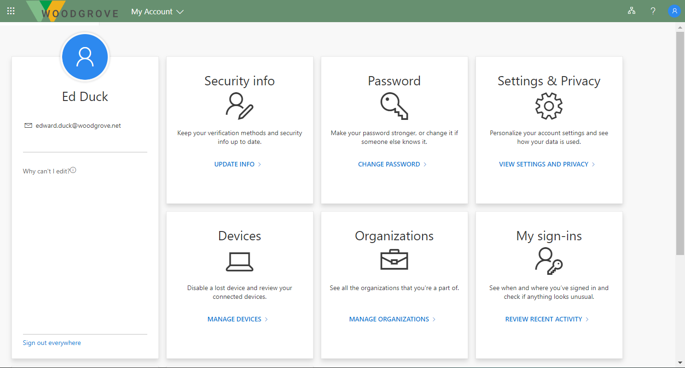
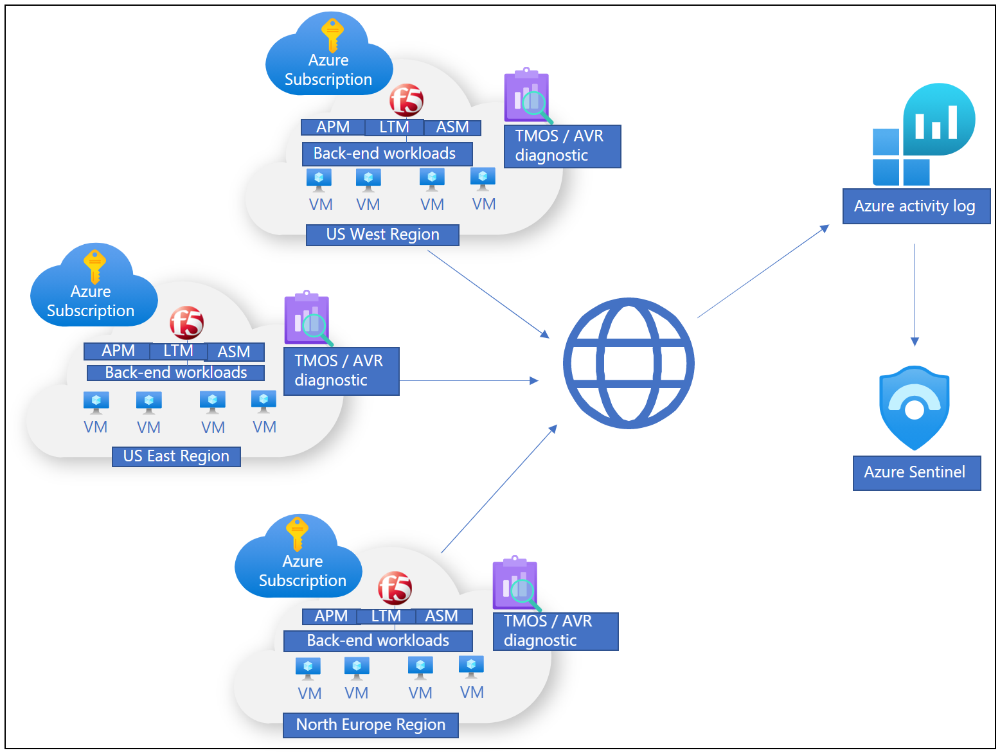

# Integrate F5 BIG-IP with Azure Active Directory

The proliferation of mobility and evolving threat landscape is placing extra scrutiny on resource access and governance, putting [Zero Trust](https://www.microsoft.com/security/blog/2020/04/02/announcing-microsoft-zero-trust-assessment-tool/) front and center of all modernization programs.
At Microsoft and F5, we realize this digital transformation is typically a multi-year journey for any business, potentially leaving critical resources exposed until modernized. The genesis behind F5 BIG-IP and Azure Active Directory Secure Hybrid Access (SHA) aims not only at improving remote access to on-premises applications, but also at strengthening the overall security posture of these vulnerable services.

For context, research estimates that 60-80% of on-premises applications are legacy in nature, or in other words incapable of being integrated directly with Azure Active Directory (AD). The same study also indicated a large proportion of these systems runs on downlevel versions of SAP, Oracle, SAGE, and other well-known workloads that provide critical services.

SHA addresses this blind spot by enabling organizations to continue using their F5 investments for superior network and application delivery. Combined with Azure AD it bridges the heterogeneous application landscape with the modern Identity control plane.

Having Azure AD pre-authenticate access to BIG-IP published services provides many benefits:

- Password-less authentication through [Windows Hello](/windows/security/identity-protection/hello-for-business/hello-overview),
[MS Authenticator](https://support.microsoft.com/account-billing/download-and-install-the-microsoft-authenticator-app-351498fc-850a-45da-b7b6-27e523b8702a), [Fast Identity Online (FIDO) keys](../authentication/howto-authentication-passwordless-security-key.md),
and [Certificate-based authentication](../authentication/active-directory-certificate-based-authentication-get-started.md)

- Preemptive [Conditional Access](../conditional-access/overview.md) and [Multi-factor authentication (MFA)](../authentication/concept-mfa-howitworks.md)

- [Identity Protection](../identity-protection/overview-identity-protection.md) - Adaptive control through user and session risk profiling

- [Leaked credential detection](../identity-protection/concept-identity-protection-risks.md)

- [Self-service password reset (SSPR)](../authentication/tutorial-enable-sspr.md)

- [Partner collaboration](../governance/entitlement-management-external-users.md) - Entitlement management for governed guest access

- [Cloud App Security (CASB)](/cloud-app-security/what-is-cloud-app-security) - For complete app discovery and  control

- Threat monitoring - [Azure Sentinel](https://azure.microsoft.com/services/azure-sentinel/) for advanced threat analytics

- The [Azure AD portal](https://azure.microsoft.com/features/azure-portal/) - A single control plane for governing identity and access

## Scenario description

As an Application Delivery Controller (ADC) and SSL-VPN, a BIG-IP system provides local and remote access to all types of services including:

- Modern and legacy web applications

- Non-web-based applications

- REST and SOAP Web API services

Its Local Traffic Manager (LTM) allows secure publishing of services through reverse proxy functionality. At the same time, a sophisticated Access Policy Manager (APM) extends the BIG-IP with a richer set of capabilities, enabling federation and Single sign-on (SSO).

The integration is based on a standard federation trust between the APM and Azure AD, common to most SHA use cases that includes the [SSL-VPN scenario](f5-aad-password-less-vpn.md). Security Assertion Markup Language (SAML), OAuth and Open ID Connect (OIDC) resources are no exception either, as they too can be secured for remote access. There could also be scenarios where a BIG-IP becomes a choke point for Zero Trust access to all services, including SaaS apps.

A BIG-IP’s ability to integrate with Azure AD is what enables the protocol transitioning required to secure legacy or non-Azure AD-integrated services with modern controls such as [Password-less authentication](https://www.microsoft.com/security/business/identity/passwordless) and [Conditional Access](../conditional-access/overview.md). In this scenario, a BIG-IP continues to fulfill its role as a reverse proxy, while handing off pre-authentication and authorization to Azure AD, on a per service basis.

Steps 1-4 in the diagram illustrate the front-end pre-authentication exchange between a user, a BIG-IP, and Azure AD, in a service provider initiated flow. Steps 5-6 show subsequent APM session enrichment and SSO to individual backend services.

| Step | Description |
|:------|:-----------|
| 1. | User selects an application icon in the portal, resolving URL to the SAML SP (BIG-IP) |
| 2. | The BIG-IP redirects user to SAML IDP (Azure AD) for pre-authentication|
| 3. | Azure AD processes Conditional Access policies and [session controls](../conditional-access/concept-conditional-access-session.md) for authorization|
| 4. | User redirects back to BIG-IP presenting the SAML claims issued by Azure AD |
| 5. | BIG-IP requests any additional session information to include in [SSO](../hybrid/how-to-connect-sso.md) and [Role based access control (RBAC)](../../role-based-access-control/overview.md) to the published service |
| 6. | BIG-IP forwards the client request to the backend service

## User experience

Whether a direct employee, affiliate, or consumer, most users are already acquainted with the Office 365 login experience, so accessing BIG-IP services via SHA remains largely familiar.

Users now find their BIG-IP published services consolidated in the  [MyApps](https://support.microsoft.com/account-billing/sign-in-and-start-apps-from-the-my-apps-portal-2f3b1bae-0e5a-4a86-a33e-876fbd2a4510) or [O365 launchpads](https://o365pp.blob.core.windows.net/media/Resources/Microsoft%20365%20Business/Launchpad%20Overview_for%20Partners_10292019.pdf) along with self-service capabilities to a broader set of services, no matter the type of device or location. Users can even continue accessing published services directly via the BIG-IPs proprietary Webtop portal, if preferred. When logging off, SHA ensures a users’ session is terminated at both ends, the BIG-IP and Azure AD, ensuring services remain fully protected from unauthorized access.  

The screenshots provided are from the Azure AD app portal that users access securely to find their BIG-IP published services and for managing their account properties.  

## Insights and analytics

A BIG-IP’s role is critical to any business, so deployed BIG-IP instances should be monitored to ensure published services are highly available, both at an SHA level and operationally too.

Several options exist for logging events either locally, or remotely through a Security Information and Event Management (SIEM) solution, enabling off-box storage and processing of telemetry. A highly effective solution for monitoring Azure AD and SHA-specific activity, is to use [Azure Monitor](../../azure-monitor/overview.md) and [Azure Sentinel](../../sentinel/overview.md), together offering:

- Detailed overview of your organization, potentially across multiple clouds, and on-premises locations, including BIG-IP infrastructure

- Single control plane providing combined view of all signals, avoiding reliance on complex, and disparate tools

## Prerequisites

Integrating F5 BIG-IP with Azure AD for SHA have the following pre-requisites:

- An F5 BIG-IP instance running on either of the following platforms:

  - Physical appliance

  - Hypervisor Virtual Edition such as Microsoft Hyper-V, VMware ESXi, Linux KVM, and Citrix Hypervisor

  - Cloud Virtual Edition such as Azure, VMware, KVM, Community Xen, MS Hyper-V, AWS, OpenStack, and Google Cloud

    The actual location of a BIG-IP instance can be either on-premises or any supported cloud platform including Azure, provided it has connectivity to the Internet, resources being published, and any other required services such as Active Directory.  

- An active F5 BIG-IP APM license, through one of the following options:

  - F5 BIG-IP® Best bundle (or)

    - F5 BIG-IP Access Policy Manager™ standalone license

    - F5 BIG-IP Access Policy Manager™ (APM) add-on license on an existing BIG-IP F5 BIG-IP® Local Traffic Manager™ (LTM)

    - A 90-day BIG-IP Access Policy Manager™ (APM) [trial license](https://www.f5.com/trial/big-ip-trial.php)

- Azure AD licensing through either of the following options:

  - An Azure AD [free subscription](/windows/client-management/mdm/register-your-free-azure-active-directory-subscription#:~:text=%20Register%20your%20free%20Azure%20Active%20Directory%20subscription,will%20take%20you%20to%20the%20Azure...%20More%20) provides the minimum core requirements for implementing SHA with password-less authentication

  - A [Premium subscription](https://www.microsoft.com/security/business/identity-access-management/azure-ad-pricing) provides all additional value adds outlined in the preface, including [Conditional Access](../conditional-access/overview.md), [MFA](../authentication/concept-mfa-howitworks.md), and [Identity Protection](../identity-protection/overview-identity-protection.md)

No previous experience or F5 BIG-IP knowledge is necessary to implement SHA, but we do recommend familiarizing yourself with F5 BIG-IP terminology. F5’s rich [knowledge base](https://www.f5.com/services/resources/glossary) is also a good place to start building BIG-IP knowledge.

## Deployment scenarios

The following tutorials provide detailed guidance on implementing some of the more common patterns for BIG-IP and Azure AD SHA:

- [F5 BIG-IP in Azure deployment walk-through](f5-bigip-deployment-guide.md)

- [F5 BIG-IP APM and Azure AD SSO to Kerberos applications](../saas-apps/kerbf5-tutorial.md#configure-f5-single-sign-on-for-kerberos-application)

- [F5 BIG-IP APM and Azure AD SSO to Header-based applications](../saas-apps/headerf5-tutorial.md#configure-f5-single-sign-on-for-header-based-application)

- [Securing F5 BIG-IP SSL-VPN with Azure AD SHA](f5-aad-password-less-vpn.md)

- [Configure Azure AD B2C with F5 BIG-IP](../../active-directory-b2c/partner-f5.md)

## Additional resources

- [The end of passwords, go passwordless](https://www.microsoft.com/security/business/identity/passwordless)

- [Azure Active Directory secure hybrid access](https://azure.microsoft.com//services/active-directory/sso/secure-hybrid-access/)

- [Microsoft Zero Trust framework to enable remote work](https://www.microsoft.com/security/blog/2020/04/02/announcing-microsoft-zero-trust-assessment-tool/)

- [Getting started with Azure Sentinel](https://azure.microsoft.com/services/azure-sentinel/?&OCID=AID2100131_SEM_XfknpgAAAHoVMTvh:20200922160358:s&msclkid=5e0e022409fc1c94dab85d4e6f4710e3&ef_id=XfknpgAAAHoVMTvh:20200922160358:s&dclid=CJnX6vHU_esCFUq-ZAod1iQF6A)

## Next steps

Consider running an SHA Proof of concept (POC) using your existing BIG-IP infrastructure, or by deploying a trial instance. [Deploying a BIG-IP Virtual Edition (VE) VM into Azure](f5-bigip-deployment-guide.md) takes approximately 30 minutes, at which point you'll have:

- A fully secured platform to model an SHA proof of concept

- A pre-production instance, fully secured platform to use for testing new BIG-IP system updates and hotfixes

At the same time, you should identify one or two applications that can be targeted for publishing via the BIG-IP and protecting with SHA.  

Our recommendation is to start with an application that isn’t yet published via a BIG-IP, so as to avoid potential disruption to production services. The guidelines mentioned in this article will help you get acquainted with the general procedure for creating the various BIG-IP configuration objects and setting up SHA. Once complete you should be able to do the same with any other new services, plus also have enough knowledge to convert existing BIG-IP published services over to SHA with minimal effort.

The below interactive guide walks through the high-level procedure for implementing SHA and seeing the end-user experience.

