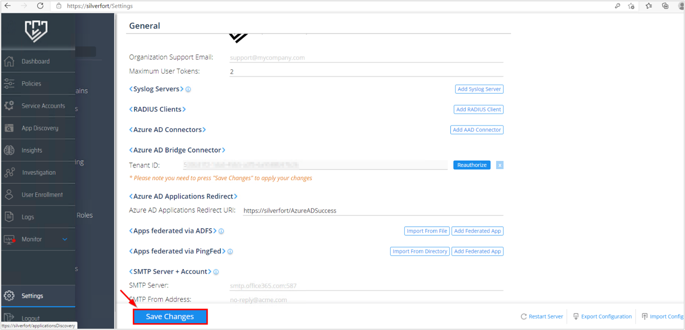
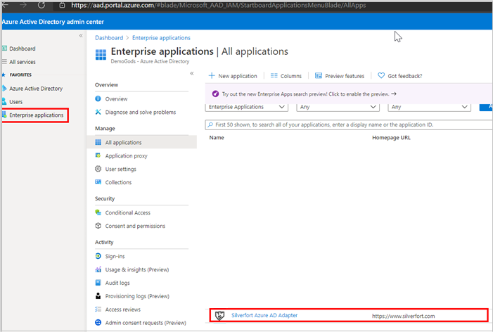

# Tutorial: Configure Secure Hybrid Access with Azure Active Directory and Silverfort 

[Silverfort](https://www.silverfort.com/) uses innovative agent-less and proxy-less technology to connect all your assets on-premises and in the cloud to Azure AD. This solution enables organizations to apply identity protection, visibility, and user experience across all environments in Azure AD. It enables universal risk-based monitoring and assessment of authentication activity for on-premises and cloud environments, and proactively prevents threats.  

In this tutorial, learn how to integrate your existing on premises Silverfort implementation with Azure Active Directory (Azure AD) for [hybrid access](../devices/concept-azure-ad-join-hybrid.md).

Silverfort seamlessly connects assets with Azure AD. These **bridged** assets appear as regular applications in Azure AD and can be protected with Conditional Access, single-sign-on (SSO), multifactor authentication, auditing and more. Use Silverfort to connect assets including:

- Legacy and homegrown applications

- Remote desktop and Secure Shell (SSH)

- Command-line tools and other admin access

- File shares and databases

- Infrastructure and industrial systems

Silverfort integrates your corporate assets and third-party Identity and Access Management (IAM) platforms. This includes Active Directory, Active Directory Federation Services (ADFS), and Remote Authentication Dial-In User Service (RADIUS) on Azure AD, including hybrid and multi-cloud environments.

Follow the steps in this tutorial to configure and test the Silverfort Azure AD bridge in your Azure AD tenant to communicate with your existing Silverfort implementation. Once configured, you can create Silverfort authentication policies that bridge authentication requests from various identity sources to Azure AD for SSO. After an application is bridged, it can be managed in Azure AD.

## Silverfort with Azure AD Authentication Architecture

The following diagram describes the authentication architecture orchestrated by Silverfort in a hybrid environment.

| Step | Description|
|:---------|:------------|
| 1. | User sends authentication request to the original Identity provider (IdP) through protocols such as Kerberos, SAML, NTLM, OIDC, and LDAP(s).|
| 2. | The response is routed as-is to Silverfort for validation to check authentication state.|
| 3. | Silverfort provides visibility, discovery, and bridging to Azure AD.|
| 4. | If the application is configured as **bridged**, the authentication decision is passed on to Azure AD. Azure AD evaluates Conditional Access policies and validates authentication.|
| 5. | The authentication state response is then released and sent as-is to the IdP by Silverfort. |
| 6.| IdP grants or denies access to the resource.|
| 7. | User is notified if access request is granted or denied. |

## Prerequisites

You must already have Silverfort deployed in your tenant or infrastructure in order to perform this tutorial. To deploy Silverfort in your tenant or infrastructure, [contact Silverfort](https://www.silverfort.com/). You will need to install Silverfort Desktop app on relevant workstations.

This tutorial requires you to set up Silverfort Azure AD Adapter in your Azure AD tenant. You'll need:

- An Azure account with an active subscription. You can create a [free account](https://azure.microsoft.com/free/?WT.mc_id=A261C142F).

- One of the following roles in your Azure account - Global administrator, Cloud application administrator, Application administrator, or Owner of the service principal.

- The Silverfort Azure AD Adapter application in the Azure AD gallery is pre-configured to support SSO. You'll need to add Silverfort Azure AD Adapter to your tenant as an Enterprise application from the gallery.

## Configure Silverfort and create a policy

1. From a browser, log in to the **Silverfort admin console**.

2. In the main menu, navigate to **Settings** and then scroll to
   **Azure AD Bridge Connector** in the General section. Confirm your tenant ID, and then select **Authorize**.

   

   

3. A registration confirmation is shown in a new tab. Close this tab.

   

4. In the **Settings** page, select **Save changes**

   

    Log in to your Azure AD console. You'll see **Silverfort Azure AD Adapter** application registered as an Enterprise application.

   

5. In the Silverfort admin console, navigate to the **Policies** page and select **Create Policy**.

6. The **New Policy** dialog will appear. Enter a **Policy Name** that would indicate the application name that will be created in Azure. For example, if you're adding multiple servers or applications under this policy, name it to reflect the resources covered by the policy. In the example, we'll create a policy for the *SL-APP1* server.

   

7. Select appropriate **Authentication** type, and **Protocol**.

8. In the **Users and Groups** field, select the edit icon to configure users that will be affected by the policy. These users' authentication will be bridged to Azure AD.

   

9. Search and select users, groups, or Organization units (OUs).

   

   Selected users will be listed in the SELECTED box.

   

10. Select the **Source** for which the policy will apply. In this example, *All Devices* are selected.

    

11. Set the **Destination** to *SL-App1*. You can select the edit button to change or add more resources or groups of resources (optional).

    

12. Select the Action to **AZURE AD BRIDGE**.

    

13. Select **SAVE** to save the new policy. You'll be prompted to enable or activate it.

    

    The policy will appear in the Policies page, in the Azure AD Bridge section:

    

14. Return to the Azure AD console, and navigate to **Enterprise applications**. The new Silverfort application should now appear. This application can now be included in [Conditional Access policies](../authentication/tutorial-enable-azure-mfa.md?bc=/azure/active-directory/conditional-access/breadcrumb/toc.json&toc=/azure/active-directory/conditional-access/toc.json%23create-a-conditional-access-policy).

## Next steps

- [Silverfort Azure AD adapter](https://azuremarketplace.microsoft.com/marketplace/apps/aad.silverfortazureadadapter?tab=overview)

- [Silverfort resources](https://www.silverfort.com/resources/)

- [Contact Silverfort](https://www.silverfort.com/company/contact/)
