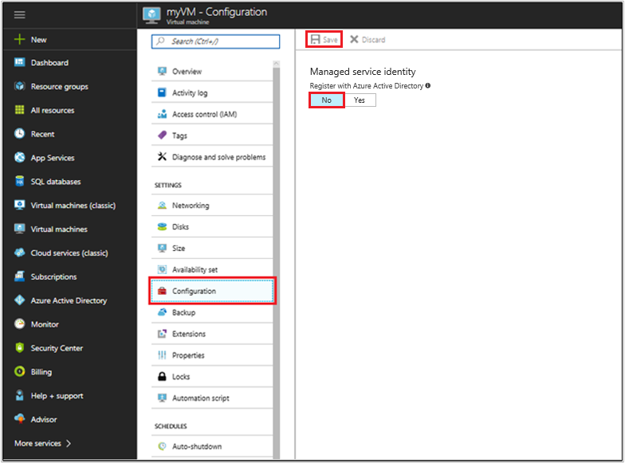

# Configure a VM Managed Service Identity (MSI) using the Azure portal

[!INCLUDE[preview-notice](../../../includes/active-directory-msi-preview-notice.md)]

Managed Service Identity provides Azure services with an automatically managed identity in Azure Active Directory. You can use this identity to authenticate to any service that supports Azure AD authentication, without having credentials in your code. 

In this article, you will learn how to enable and disable the system assigned identity for an Azure VM, using the Azure portal. Assigning and removing user assigned identities from Azure VMs is not currently supported via the Azure Portal.

> [!NOTE]
> Currently, user assigned identity operations are not supported via the Azure Portal. Check back for updates. 

## Prerequisites

- If you're unfamiliar with Managed Service Identity, check out the [overview section](overview.md).
- If you don't already have an Azure account, [sign up for a free account](https://azure.microsoft.com/en-us/free/) before continuing.

## Managed Service Identity during creation of an Azure VM

Currently, VM creation via the Azure portal does not support Managed Service Identity operations. Instead, please refer to one of the following VM creation Quickstart articles to first create a VM:

- [Create a Windows virtual machine with the Azure portal](../../virtual-machines/windows/quick-create-portal.md#create-virtual-machine)
- [Create a Linux virtual machine with the Azure portal](../../virtual-machines/linux/quick-create-portal.md#create-virtual-machine)  

Then proceed to the next section for details on enabling Managed Service Identity on the VM.

## Enable Managed Service Identity on an existing Azure VM

To enable the system assigned identity on a VM that was originally provisioned without it:

1. Sign in to the [Azure portal](https://portal.azure.com) using an account associated with the Azure subscription that contains the VM. Also make sure your account belongs to a role that gives you write permissions on the VM, such as “Virtual Machine Contributor”.

2. Navigate to the desired Virtual Machine and select the "Configuration" page.

3. Enable the system assigned identity on the VM by selecting "Yes" under "Managed service identity" and then click **Save**. This operation can take 60 seconds or more to complete:

    > [!NOTE]
    > Adding a user assigned identity to a VM is not currently supported via the Azure Portal.

     

## Remove Managed Service Identity from an Azure VM

If you have a Virtual Machine that no longer needs the system assigned identity:

1. Sign in to the [Azure portal](https://portal.azure.com) using an account associated with the Azure subscription that contains the VM. Also make sure your account belongs to a role that gives you write permissions on the VM, such as “Virtual Machine Contributor”.

2. Navigate to the desired Virtual Machine and select the "Configuration" page.

3. Disable the system assigned identity on the VM by selecting "No" under "Managed service identity", then click Save. This operation can take 60 seconds or more to complete:

    > [!NOTE]
    > Adding a user assigned identity to a VM is not currently supported via the Azure Portal.

     

## Related content

- For an overview of Managed Service Identity, see [overview](overview.md).

## Next steps

- Using the Azure portal, give an Azure VM's MSI [access to another Azure resource](howto-assign-access-portal.md).

