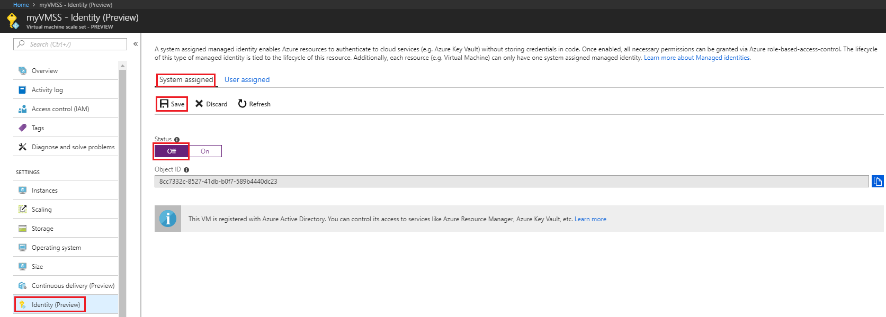
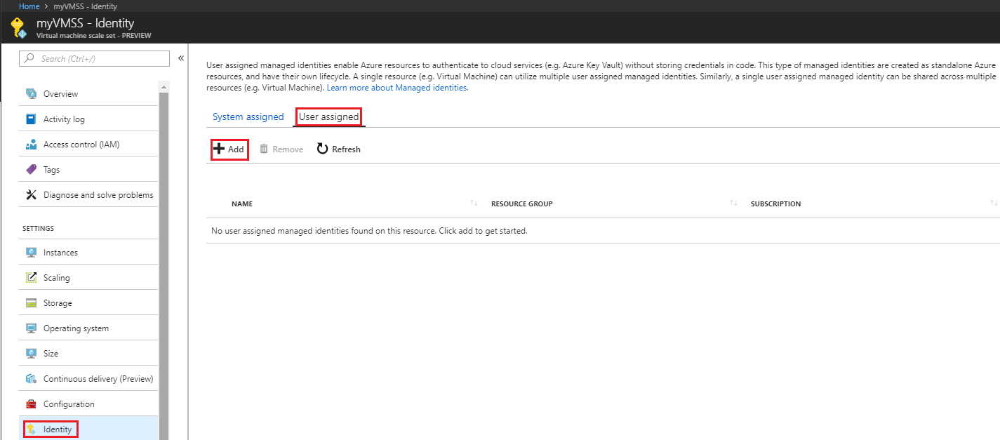
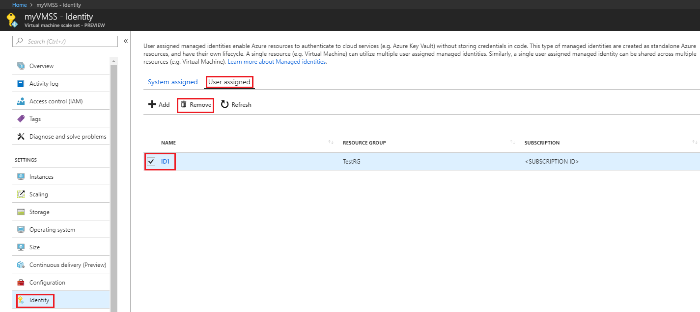

# Configure managed identities for Azure resources on a virtual machine scale set using the Azure portal

[!INCLUDE[preview-notice](../../../includes/active-directory-msi-preview-notice.md)]

Managed identities for Azure resources provides Azure services with an automatically managed identity in Azure Active Directory. You can use this identity to authenticate to any service that supports Azure AD authentication, without having credentials in your code. 

In this article, using PowerShell, you learn how to perform the following managed identities for Azure resources operations on a virtual machine scale set:

- If you're unfamiliar with managed identities for Azure resources, check out the [overview section](overview.md).
- If you don't already have an Azure account, [sign up for a free account](https://azure.microsoft.com/free/) before continuing.
- To perform the management operations in this article, your account needs the following role assignment:
    - [Virtual Machine Contributor](/azure/role-based-access-control/built-in-roles#virtual-machine-contributor) to enable and remove system-assigned managed identity from a virtual machine scale set.

## System-assigned managed identity

In this section, you will learn how to enable and disable the system-assigned managed identity using the Azure portal.

### Enable system-assigned managed identity during creation of a virtual machine scale set

Currently, the Azure portal does not support enabling system-assigned managed identity during the creation of a virtual machine scale set. Instead, refer to the following virtual machine scale set creation Quickstart article to first create a virtual machine scale set, and then proceed to the next section for details on enabling system-assigned managed identity on a virtual machine scale set:

- [Create a Virtual Machine Scale Set in the Azure portal](../../virtual-machine-scale-sets/quick-create-portal.md)  

### Enable system-assigned managed identity on an existing virtual machine scale set

To enable the system-assigned managed identity on a virtual machine scale set that was originally provisioned without it:

1. Sign in to the [Azure portal](https://portal.azure.com) using an account associated with the Azure subscription that contains the virtual machine scale set.

2. Navigate to the desired virtual machine scale set.

3. Under **System assigned**, **Status**, select **On** and then click **Save**:

     

### Remove system-assigned managed identity from a virtual machine scale set

If you have a virtual machine scale set that no longer needs a system-assigned managed identity:

1. Sign in to the [Azure portal](https://portal.azure.com) using an account associated with the Azure subscription that contains the virtual machine scale set. Also make sure your account belongs to a role that gives you write permissions on the virtual machine scale set.

2. Navigate to the desired virtual machine scale set.

3. Under **System assigned**, **Status**, select **Off** and then click **Save**:

   

## User-assigned managed identity

In this section, you learn how to add and remove a user-assigned managed identity from a virtual machine scale set using the Azure portal.

### Assign a user-assigned managed identity during the creation of a virtual machine scale set

Currently, the Azure portal does not support assigning a user-assigned managed identity during the creation of a virtual machine scale set. Instead, refer to the following virtual machine scale set creation Quickstart article to first create a virtual machine scale set, and then proceed to the next section for details on assigning a user-assigned managed identity to it:

- [Create a Virtual Machine Scale Set in the Azure portal](../../virtual-machine-scale-sets/quick-create-portal.md)

### Assign a user-assigned managed identity to an existing virtual machine scale set

1. Sign in to the [Azure portal](https://portal.azure.com) using an account associated with the Azure subscription that contains the virtual machine scale set.
2. Navigate to the desired virtual machine scale set and click **Identity**, **User assigned** and then **\+Add**.

   

3. Click the user-assigned identity you want to add to the virtual machine scale set and then click **Add**.
   
   

### Remove a user-assigned managed identity from a virtual machine scale set

1. Sign in to the [Azure portal](https://portal.azure.com) using an account associated with the Azure subscription that contains the VM.
2. Navigate to the desired virtual machine scale set and click **Identity**, **User assigned**, the name of the user-assigned managed identity you want to delete and then click **Remove** (click **Yes** in the confirmation pane).

   

## Next steps

- Using the Azure portal, give an Azure virtual machine scale set managed identity [access to another Azure resource](howto-assign-access-portal.md).

