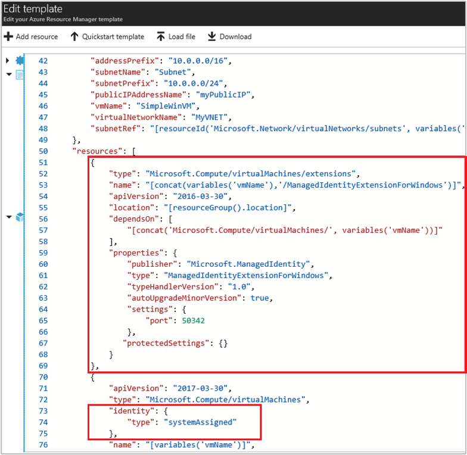
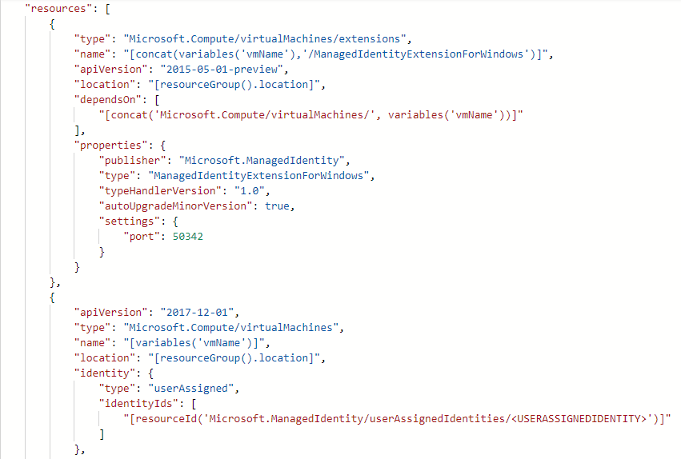

# Configure a VM Managed Service Identity by using a template

[!INCLUDE[preview-notice](../../../includes/active-directory-msi-preview-notice.md)]

Managed Service Identity provides Azure services with an automatically managed identity in Azure Active Directory. You can use this identity to authenticate to any service that supports Azure AD authentication, without having credentials in your code. 

In this article, you learn how to perform the following Managed Service Identity operations on an Azure VM, using Azure Resource Manager deployment template:

## Prerequisites

- If you're unfamiliar with Managed Service Identity, check out the [overview section](overview.md). **Be sure to review the [difference between a system assigned and user assigned identity](overview.md#how-does-it-work)**.
- If you don't already have an Azure account, [sign up for a free account](https://azure.microsoft.com/free/) before continuing.
- To perform the management operations in this article, your account needs the following role assignments:
    - [Virtual Machine Contributor](/azure/role-based-access-control/built-in-roles#virtual-machine-contributor) to create a VM and enable and remove system and/or user assigned managed identity from an Azure VM.
    - [Managed Identity Contributor](/azure/role-based-access-control/built-in-roles#managed-identity-contributor) role to create a user assigned identity.
    - [Managed Identity Operator](/azure/role-based-access-control/built-in-roles#managed-identity-operator) role to assign and remove a user assigned identity from and to a VM.

## Azure Resource Manager templates

As with the Azure portal and scripting, [Azure Resource Manager](../../azure-resource-manager/resource-group-overview.md) templates provide the ability to deploy new or modified resources defined by an Azure resource group. Several options are available for template editing and deployment, both local and portal-based, including:

   - Using a [custom template from the Azure Marketplace](../../azure-resource-manager/resource-group-template-deploy-portal.md#deploy-resources-from-custom-template), which allows you to create a template from scratch, or base it on an existing common or [QuickStart template](https://azure.microsoft.com/documentation/templates/).
   - Deriving from an existing resource group, by exporting a template from either [the original deployment](../../azure-resource-manager/resource-manager-export-template.md#view-template-from-deployment-history), or from the [current state of the deployment](../../azure-resource-manager/resource-manager-export-template.md#export-the-template-from-resource-group).
   - Using a local [JSON editor (such as VS Code)](../../azure-resource-manager/resource-manager-create-first-template.md), and then uploading and deploying by using PowerShell or CLI.
   - Using the Visual Studio [Azure Resource Group project](../../azure-resource-manager/vs-azure-tools-resource-groups-deployment-projects-create-deploy.md) to both create and deploy a template.  

Regardless of the option you choose, template syntax is the same during initial deployment and redeployment. Enabling a system or user assigned identity on a new or existing VM is done in the same manner. Also, by default, Azure Resource Manager does an [incremental update](../../azure-resource-manager/deployment-modes.md) to deployments.

## System assigned identity

In this section, you will enable and disable a system assigned identity using an Azure Resource Manager template.

### Enable system assigned identity during creation of an Azure VM or on an existing VM

1. Whether you sign in to Azure locally or via the Azure portal, use an account that is associated with the Azure subscription that contains the VM.

2. After loading the template into an editor, locate the `Microsoft.Compute/virtualMachines` resource of interest within the `resources` section. Yours might look slightly different from the following screenshot, depending on the editor you're using and whether you are editing a template for a new deployment or existing one.

   >[!NOTE] 
   > This example assumes variables such as `vmName`, `storageAccountName`, and `nicName` have been defined in the template.
   >

    

3. To enable system assigned identity, add the `"identity"` property at the same level as the `"type": "Microsoft.Compute/virtualMachines"` property. Use the following syntax:

   ```JSON
   "identity": { 
       "type": "systemAssigned"
   },
   ```

4. (Optional) Add the VM Managed Service Identity extension as a `resources` element. This step is optional as you can use the Azure Instance Metadata Service (IMDS) identity endpoint, to retrieve tokens as well.  Use the following syntax:

   >[!NOTE] 
   > The following example assumes a Windows VM extension (`ManagedIdentityExtensionForWindows`) is being deployed. You can also configure for Linux by using `ManagedIdentityExtensionForLinux` instead, for the `"name"` and `"type"` elements.
   >

   ```JSON
   { 
       "type": "Microsoft.Compute/virtualMachines/extensions",
       "name": "[concat(variables('vmName'),'/ManagedIdentityExtensionForWindows')]",
       "apiVersion": "2016-03-30",
       "location": "[resourceGroup().location]",
       "dependsOn": [
           "[concat('Microsoft.Compute/virtualMachines/', variables('vmName'))]"
       ],
       "properties": {
           "publisher": "Microsoft.ManagedIdentity",
           "type": "ManagedIdentityExtensionForWindows",
           "typeHandlerVersion": "1.0",
           "autoUpgradeMinorVersion": true,
           "settings": {
               "port": 50342
           },
           "protectedSettings": {}
       }
   }
   ```

5. When you're done, your template should look similar to the following:

   

### Assign a role the VM's system assigned identity

After you have enabled system assigned identity on your VM, you may want to grant it a role such as **Reader** access to the resource group in which it was created.

1. Whether you sign in to Azure locally or via the Azure portal, use an account that is associated with the Azure subscription that contains the VM.
 
2. Load the template into an [editor](#azure-resource-manager-templates) and add the following information to give your VM **Reader** access to the resource group in which it was created.  Your template structure may vary depending on the editor and the deployment model you choose.
   
   Under the `parameters` section add the following:

    ```JSON
    "builtInRoleType": {
          "type": "string",
          "defaultValue": "Reader"
        },
        "rbacGuid": {
          "type": "string"
        }
    ```

    Under the `variables` section add the following:

    ```JSON
    "Reader": "[concat('/subscriptions/', subscription().subscriptionId, '/providers/Microsoft.Authorization/roleDefinitions/', 'acdd72a7-3385-48ef-bd42-f606fba81ae7')]"
    ```

    Under the `resources` section add the following:

    ```JSON
    {
        "apiVersion": "2017-09-01",
         "type": "Microsoft.Authorization/roleAssignments",
         "name": "[parameters('rbacGuid')]",
         "properties": {
                "roleDefinitionId": "[variables(parameters('builtInRoleType'))]",
                "principalId": "[reference(variables('vmResourceId'), '2017-12-01', 'Full').identity.principalId]",
                "scope": "[resourceGroup().id]"
          },
          "dependsOn": [
                "[concat('Microsoft.Compute/virtualMachines/', parameters('vmName'))]"
            ]
    }
    ```

### Disable a system assigned identity from an Azure VM

If you have a VM that no longer needs a managed service identity:

1. Whether you sign in to Azure locally or via the Azure portal, use an account that is associated with the Azure subscription that contains the VM.

2. Load the template into an [editor](#azure-resource-manager-templates) and locate the `Microsoft.Compute/virtualMachines` resource of interest within the `resources` section. If you have a VM that only has system assigned identity, you can disable it by changing the identity type to `None`.  If your VM has both system and user assigned identities, remove `SystemAssigned` from the identity type and keep `UserAssigned` along with the `identityIds` array of the user assigned identities.  The following example shows you how remove a system assigned identity from a VM with no user assigned identities:
   
   ```JSON
    {
      "apiVersion": "2017-12-01",
      "type": "Microsoft.Compute/virtualMachines",
      "name": "[parameters('vmName')]",
      "location": "[resourceGroup().location]",
      "identity": { 
          "type": "None"
    }
   ```

## User assigned identity

In this section, you assign a user assigned identity to an Azure VM using Azure Resource Manager template.

> [!Note]
> To create a user assigned identity using an Azure Resource Manager Template, see [Create a user assigned identity](how-to-manage-ua-identity-arm.md#create-a-user-assigned-identity).

 ### Assign a user assigned identity to an Azure VM

1. Under the `resources` element, add the following entry to assign a user assigned identity to your VM.  Be sure to replace `<USERASSIGNEDIDENTITY>` with the name of the user assigned identity you created.
   
   > [!Important]
   > The `<USERASSIGNEDIDENTITYNAME>` value shown in the following example must be stored in a variable.  Also, for the currently supported implementation of assigning user assigned identities to a virtual machine in a Resource Manager template, the api version must match the version in the following example.
    
    ```json
    {
        "apiVersion": "2017-12-01",
        "type": "Microsoft.Compute/virtualMachines",
        "name": "[variables('vmName')]",
        "location": "[resourceGroup().location]",
        "identity": {
            "type": "userAssigned",
            "identityIds": [
                "[resourceID('Microsoft.ManagedIdentity/userAssignedIdentities/',variables('<USERASSIGNEDIDENTITYNAME>'))]"
            ]
        },
    ```
    
2. (Optional) Next, under the `resources` element, add the following entry to assign the managed identity extension to your VM. This step is optional as you can use the Azure Instance Metadata Service (IMDS) identity endpoint, to retrieve tokens as well. Use the following syntax:
    ```json
    {
        "type": "Microsoft.Compute/virtualMachines/extensions",
        "name": "[concat(variables('vmName'),'/ManagedIdentityExtensionForWindows')]",
        "apiVersion": "2015-05-01-preview",
        "location": "[resourceGroup().location]",
        "dependsOn": [
            "[concat('Microsoft.Compute/virtualMachines/', variables('vmName'))]"
        ],
        "properties": {
            "publisher": "Microsoft.ManagedIdentity",
            "type": "ManagedIdentityExtensionForWindows",
            "typeHandlerVersion": "1.0",
            "autoUpgradeMinorVersion": true,
            "settings": {
                "port": 50342
            }
        }
    }
    ```
    
3.  When you are done, your template should look similar to the following:

      

### Remove user assigned identity from an Azure VM

If you have a VM that no longer needs a managed service identity:

1. Whether you sign in to Azure locally or via the Azure portal, use an account that is associated with the Azure subscription that contains the VM.

2. Load the template into an [editor](#azure-resource-manager-templates) and locate the `Microsoft.Compute/virtualMachines` resource of interest within the `resources` section. If you have a VM that only has user assigned identity, you can disable it by changing the the identity type to `None`.  If your VM has both system and user assigned identities and you would like to keep system assigned identity, remove `UserAssigned` from the identity type along with the `identityIds` array of the user assigned identities.
    
   To remove a a single user assigned identity from a VM, remove it from the `identityIds` array.
   
   The following example shows you how remove all user assigned identities from a VM with no system assigned identities:
   
   ```JSON
    {
      "apiVersion": "2017-12-01",
      "type": "Microsoft.Compute/virtualMachines",
      "name": "[parameters('vmName')]",
      "location": "[resourceGroup().location]",
      "identity": { 
          "type": "None"
    }
   ```

## Related content

- For a broader perspective about Managed Service Identity, read the [Managed Service Identity overview](overview.md).

