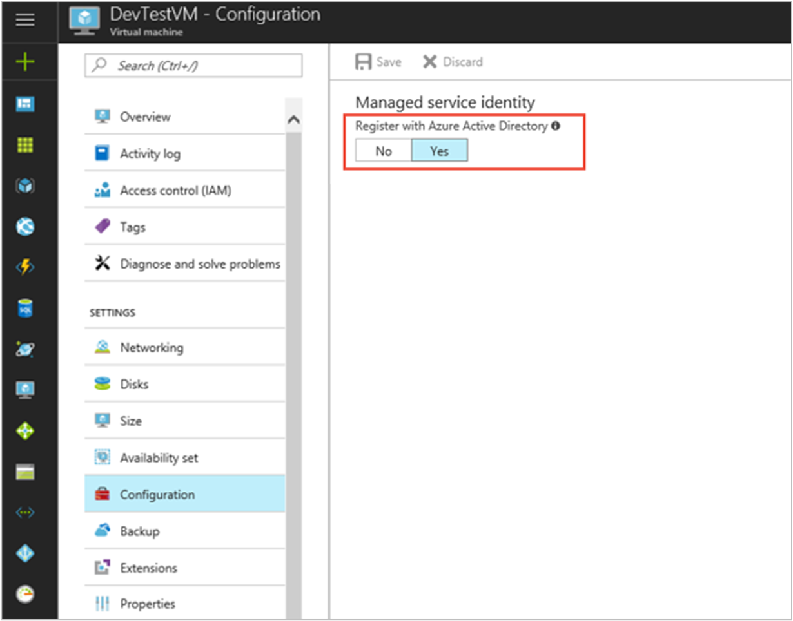
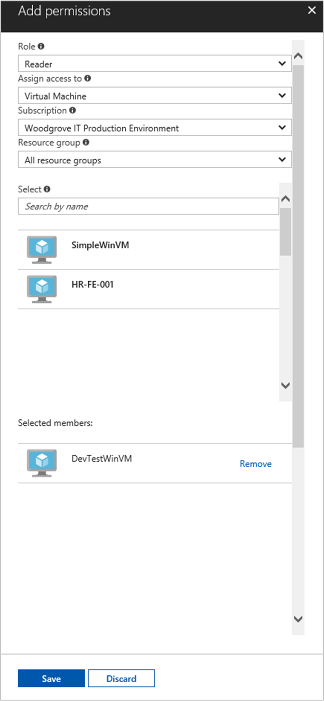

# Use a Windows VM Managed Service Identity (MSI) to access Resource Manager

[!INCLUDE[preview-notice](../../../includes/active-directory-msi-preview-notice.md)]

This tutorial shows you how to enable Managed Service Identity (MSI) for a Windows virtual machine (VM). You can then use that identity to access the Azure Resource Manager API. Managed Service Identities are automatically managed by Azure and enable you to authenticate to services that support Azure AD authentication without needing to insert credentials into your code. You learn how to:

> [!div class="checklist"]
> * Enable MSI on a Windows VM 
> * Grant your VM access to a Resource Group in Azure Resource Manager 
> * Get an access token using the VM identity and use it to call Azure Resource Manager

## Prerequisites

[!INCLUDE [msi-qs-configure-prereqs](../../../includes/active-directory-msi-qs-configure-prereqs.md)]

[!INCLUDE [msi-tut-prereqs](../../../includes/active-directory-msi-tut-prereqs.md)]

## Sign in to Azure
Sign in to the Azure portal at [https://portal.azure.com](https://portal.azure.com).

## Create a Windows virtual machine in a new resource group

For this tutorial, we create a new Windows VM.  You can also enable MSI on an existing VM.

1.	Click the **Create a resource** button found on the upper left-hand corner of the Azure portal.
2.	Select **Compute**, and then select **Windows Server 2016 Datacenter**. 
3.	Enter the virtual machine information. The **Username** and **Password** created here is the credentials you use to login to the virtual machine.
4.  Choose the proper **Subscription** for the virtual machine in the dropdown.
5.	To select a new **Resource Group** in which to create your virtual machine, choose **Create New**. When complete, click **OK**.
6.	Select the size for the VM. To see more sizes, select **View all** or change the **Supported disk type** filter. On the Settings page, keep the defaults, and click **OK**.

    

## Enable MSI on your VM 

A VM MSI enables you to get access tokens from Azure AD without you needing to put credentials into your code. Enabling Managed Service Identity on a VM, does two things: registers your VM with Azure Active Directory to create its managed identity, and it configures the identity on the VM.

1.	Select the **Virtual Machine** that you want to enable MSI on.  
2.	On the left navigation bar click **Configuration**. 
3.	You see **Managed Service Identity**. To register and enable the MSI, select **Yes**, if you wish to disable it, choose No. 
4.	Ensure you click **Save** to save the configuration.  
    

## Grant your VM access to a resource group in Resource Manager
Using MSI your code can get access tokens to authenticate to resources that support Azure AD authentication.  The Azure Resource Manager supports Azure AD authentication.  First, we need to grant this VM’s identity access to a resource in Resource Manager, in this case the Resource Group in which the VM is contained.  

1.	Navigate to the tab for **Resource Groups**. 
2.	Select the specific **Resource Group** you created for your **Windows VM**. 
3.	Go to **Access control (IAM)** in the left panel. 
4.	Then **Add** a new role assignment for your **Windows VM**.  Choose **Role** as **Reader**. 
5.	In the next drop-down, **Assign access to** the resource **Virtual Machine**. 
6.	Next, ensure the proper subscription is listed in the **Subscription** dropdown. And for **Resource Group**, select **All resource groups**. 
7.	Finally, in **Select** choose your Windows VM in the dropdown and click **Save**.

    

## Get an access token using the VM identity and use it to call Azure Resource Manager 

You will need to use **PowerShell** in this portion.  If you don’t have installed, download it [here](https://docs.microsoft.com/powershell/azure/overview?view=azurermps-4.3.1). 

1.	In the portal, navigate to **Virtual Machines** and go to your Windows virtual machine and in the **Overview**, click **Connect**. 
2.	Enter in your **Username** and **Password** for which you added when you created the Windows VM. 
3.	Now that you have created a **Remote Desktop Connection** with the virtual machine, open **PowerShell** in the remote session. 
4.	Using Powershell’s Invoke-WebRequest, make a request to the local MSI endpoint to get an access token for Azure Resource Manager.

    ```powershell
       $response = Invoke-WebRequest -Uri http://169.254.169.254/metadata/identity/oauth2/token?api-version=2018-02-01&resource=https%3A%2F%2Fmanagement.azure.com%2F -Method GET -Headers @{Metadata="true"}
    ```
    
    > [!NOTE]
    > The value of the "resource" parameter must be an exact match for what is expected by Azure AD. When using the Azure Resource Manager resource ID, you must include the trailing slash on the URI.
    
    Next, extract the full response, which is stored as a JavaScript Object Notation (JSON) formatted string in the $response object. 
    
    ```powershell
    $content = $response.Content | ConvertFrom-Json
    ```
    Next, extract the access token from the response.
    
    ```powershell
    $ArmToken = $content.access_token
    ```
    
    Finally, call Azure Resource Manager using the access token. In this example, we're also using PowerShell's Invoke-WebRequest to make the call to Azure Resource Manager, and include the access token in the Authorization header.
    
    ```powershell
    (Invoke-WebRequest -Uri https://management.azure.com/subscriptions/<SUBSCRIPTION ID>/resourceGroups/<RESOURCE GROUP>?api-version=2016-06-01 -Method GET -ContentType "application/json" -Headers @{ Authorization ="Bearer $ArmToken"}).content
    ```
    > [!NOTE] 
    > The URL is case-sensitive, so ensure if you are using the exact same case as you used earlier when you named the Resource Group, and the uppercase "G" in "resourceGroups."
        
    The following command returns the details of the Resource Group:

    ```powershell
    {"id":"/subscriptions/98f51385-2edc-4b79-bed9-7718de4cb861/resourceGroups/DevTest","name":"DevTest","location":"westus","properties":{"provisioningState":"Succeeded"}}
    ```

## Related content

- For an overview of MSI, see [Managed Service Identity overview](overview.md).

Use the following comments section to provide feedback and help us refine and shape our content.

