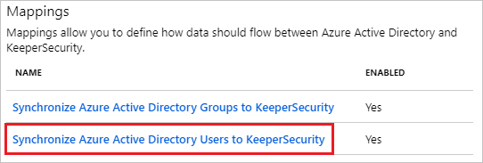
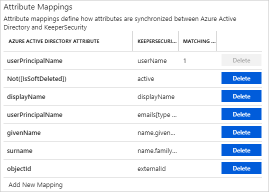
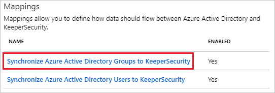
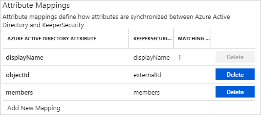

# Tutorial: Configure Keeper Password Manager & Digital Vault for automatic user provisioning

The objective of this tutorial is to demonstrate the steps to be performed in Keeper Password Manager & Digital Vault and Azure Active Directory (Azure AD) to configure Azure AD to automatically provision and de-provision users and/or groups to Keeper Password Manager & Digital Vault.

> [!NOTE]
> This tutorial describes a connector built on top of the Azure AD User Provisioning Service. For important details on what this service does, how it works, and frequently asked questions, see [Automate user provisioning and deprovisioning to SaaS applications with Azure Active Directory](../manage-apps/user-provisioning.md).
>
> This connector is currently in Public Preview. For more information on the general Microsoft Azure terms of use for Preview features, see [Supplemental Terms of Use for Microsoft Azure Previews](https://azure.microsoft.com/support/legal/preview-supplemental-terms/).

## Prerequisites

The scenario outlined in this tutorial assumes that you already have the following prerequisites:

* An Azure AD tenant
* [A Keeper Password Manager & Digital Vault tenant](https://keepersecurity.com/pricing.html?t=e)
* A user account in Keeper Password Manager & Digital Vault with Admin permissions.

## Add Keeper Password Manager & Digital Vault from the gallery

Before configuring Keeper Password Manager & Digital Vault for automatic user provisioning with Azure AD, you need to add Keeper Password Manager & Digital Vault from the Azure AD application gallery to your list of managed SaaS applications.

**To add Keeper Password Manager & Digital Vault from the Azure AD application gallery, perform the following steps:**

1. In the **[Azure portal](https://portal.azure.com)**, in the left navigation panel, select **Azure Active Directory**.

	

2. Go to **Enterprise applications**, and then select **All applications**.

	

3. To add a new application, select the **New application** button at the top of the pane.

	

4. In the search box, enter **Keeper Password Manager & Digital Vault**, select **Keeper Password Manager & Digital Vault** in the results panel, and then click the **Add** button to add the application.

	

## Assigning users to Keeper Password Manager & Digital Vault

Azure Active Directory uses a concept called *assignments* to determine which users should receive access to selected apps. In the context of automatic user provisioning, only the users and/or groups that have been assigned to an application in Azure AD are synchronized.

Before configuring and enabling automatic user provisioning, you should decide which users and/or groups in Azure AD need access to Keeper Password Manager & Digital Vault. Once decided, you can assign these users and/or groups to Keeper Password Manager & Digital Vault by following the instructions here:

* [Assign a user or group to an enterprise app](../manage-apps/assign-user-or-group-access-portal.md)

### Important tips for assigning users to Keeper Password Manager & Digital Vault

* It is recommended that a single Azure AD user is assigned to Keeper Password Manager & Digital Vault to test the automatic user provisioning configuration. Additional users and/or groups may be assigned later.

* When assigning a user to Keeper Password Manager & Digital Vault, you must select any valid application-specific role (if available) in the assignment dialog. Users with the **Default Access** role are excluded from provisioning.

## Configuring automatic user provisioning to Keeper Password Manager & Digital Vault 

This section guides you through the steps to configure the Azure AD provisioning service to create, update, and disable users and/or groups in Keeper Password Manager & Digital Vault based on user and/or group assignments in Azure AD.

> [!TIP]
> You may also choose to enable SAML-based single sign-on for Keeper Password Manager & Digital Vault, following the instructions provided in the [Keeper Password Manager & Digital Vault single sign-on tutorial](keeperpasswordmanager-tutorial.md). Single sign-on can be configured independently of automatic user provisioning, though these two features compliment each other.

### To configure automatic user provisioning for Keeper Password Manager & Digital Vault in Azure AD:

1. Sign in to the [Azure portal](https://portal.azure.com) and select **Enterprise Applications**, select **All applications**, then select **Keeper Password Manager & Digital Vault**.

	

2. In the applications list, select **Keeper Password Manager & Digital Vault**.

	

3. Select the **Provisioning** tab.

	

4. Set the **Provisioning Mode** to **Automatic**.

	

5. Under the **Admin Credentials** section, input the **Tenant URL** and **Secret Token** of your Keeper Password Manager & Digital Vault's account as described in Step 6.

6. Sign in to your [Keeper Admin Console](https://keepersecurity.com/console/#login). Click on **Admin** and select an existing node or create a new one. Navigate to the **Provisioning** tab and select **Add Method**.

	

	Select **SCIM (System for Cross-Domain Identity Management**.

	

	Click **Create Provisioning Token**.

	

	Copy the values for **URL** and **Token** and paste them into **Tenant URL** and **Secret Token** in Azure AD. Click **Save** to complete the provisioning setup on Keeper.

	

7. Upon populating the fields shown in Step 5, click **Test Connection** to ensure Azure AD can connect to Keeper Password Manager & Digital Vault. If the connection fails, ensure your Keeper Password Manager & Digital Vault account has Admin permissions and try again.

	

8. In the **Notification Email** field, enter the email address of a person or group who should receive the provisioning error notifications and check the checkbox - **Send an email notification when a failure occurs**.

	

9. Click **Save**.

10. Under the **Mappings** section, select **Synchronize Azure Active Directory Users to Keeper Password Manager & Digital Vault**.

	

11. Review the user attributes that are synchronized from Azure AD to Keeper Password Manager & Digital Vault in the **Attribute Mapping** section. The attributes selected as **Matching** properties are used to match the user accounts in Keeper Password Manager & Digital Vault for update operations. Select the **Save** button to commit any changes.

	

12. Under the **Mappings** section, select **Synchronize Azure Active Directory Groups to Keeper Password Manager & Digital Vault**.

	

13. Review the group attributes that are synchronized from Azure AD to Keeper Password Manager & Digital Vault in the **Attribute Mapping** section. The attributes selected as **Matching** properties are used to match the groups in Keeper Password Manager & Digital Vault for update operations. Select the **Save** button to commit any changes.

	

14. To configure scoping filters, refer to the following instructions provided in the [Scoping filter tutorial](../manage-apps/define-conditional-rules-for-provisioning-user-accounts.md).

15. To enable the Azure AD provisioning service for Keeper Password Manager & Digital Vault, change the **Provisioning Status** to **On** in the **Settings** section.

	

16. Define the users and/or groups that you would like to provision to Keeper Password Manager & Digital Vault by choosing the desired values in **Scope** in the **Settings** section.

	

17. When you are ready to provision, click **Save**.

	

This operation starts the initial synchronization of all users and/or groups defined in **Scope** in the **Settings** section. The initial sync takes longer to perform than subsequent syncs, which occur approximately every 40 minutes as long as the Azure AD provisioning service is running. You can use the **Synchronization Details** section to monitor progress and follow links to provisioning activity report, which describes all actions performed by the Azure AD provisioning service on Keeper Password Manager & Digital Vault.

For more information on how to read the Azure AD provisioning logs, see [Reporting on automatic user account provisioning](../manage-apps/check-status-user-account-provisioning.md).

## Connector Limitations

* Keeper Password Manager & Digital Vault requires **emails** and **userName** to have the same source value, as any updates to either attributes will modify the other value.
* Keeper Password Manager & Digital Vault does not support user deletes, only disable. Disabled users will appear as locked in the Keeper Admin Console UI.

## Additional resources

* [Managing user account provisioning for Enterprise Apps](../manage-apps/configure-automatic-user-provisioning-portal.md)
* [What is application access and single sign-on with Azure Active Directory?](../manage-apps/what-is-single-sign-on.md)

## Next steps

* [Learn how to review logs and get reports on provisioning activity](../manage-apps/check-status-user-account-provisioning.md)

<!--Image references-->
[1]: ./media/atlassian-cloud-provisioning-tutorial/tutorial-general-01.png
[2]: ./media/atlassian-cloud-provisioning-tutorial/tutorial-general-02.png
[3]: ./media/atlassian-cloud-provisioning-tutorial/tutorial-general-03.png
