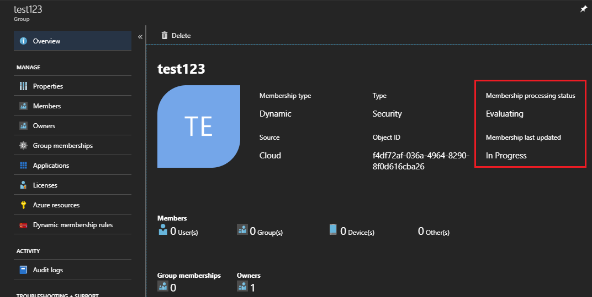

# Create a dynamic group and check status

In Azure Active Directory (Azure AD), you can create groups by applying a rule to determine membership based on user or device properties. When the attributes of a user or device changes, Azure AD evaluates all dynamic group rules in the Azure AD tenant and performs any adds or removes. If a user or device satisfies a rule for a group, they are added as a member, and when they no longer satisfy the rule, they are removed.

This article details how to set up a rule in the Azure portal for dynamic membership on security groups or Office 365 groups. For examples of rule syntax and a complete list of the supported properties, operators, and values for a membership rule, see [Dynamic membership rules for groups in Azure Active Directory](groups-dynamic-membership.md).

## To create a group membership rule

1. Sign in to the [Azure AD admin center](https://aad.portal.azure.com) with an account that is in the Global Administrator, Intune Service Administrator, or User Account Administrator role in the tenant.
2. Select **Groups**.
3. Select **All groups**, and select **New group**.

   

4. On the **Group** blade, enter a name and description for the new group. Select a **Membership type** of either **Dynamic User** or **Dynamic Device**, depending on whether you want to create a rule for users or devices, and then select **Add dynamic query**. You can use the rule builder to build a simple rule, or write a membership rule yourself. This article contains more information about available user and device attributes as well as examples of membership rules.

   

5. To see the full list of customer extension properties that you can add to your membership query, select **Get customer extension properties**, enter a unique application ID, and then select **Refresh properties**. The full ist of properties will now be available to select.
6. After creating the rule, select **Add query** at the bottom of the blade.
7. Select **Create** on the **Group** blade to create the group.

> [!TIP]
> Group creation fails if the rule you entered was incorrectly formed or not valid. A notification is displayed in the upper-right hand corner of the portal, containing an explanation of why the rule could not be processed. Read it carefully to understand how you need to adjust the rule to make it valid.

## Check processing status for a membership rule

You can see the membership processing status and the last updated date on the **Overview** page for the group.
  
  

The following status messages can be shown for **Membership processing** status:

* **Evaluating**:  The group change has been received and the updates are being evaluated.
* **Processing**: Updates are being processed.
* **Update complete**: Processing has completed and all applicable updates have been made.
* **Processing error**: An error was encountered while evaluating the membership rule and processing could not be completed.
* **Update paused**: Dynamic membership rule updates have been paused by the administrator. MembershipRuleProcessingState is set to “Paused”.

The following status messages can be shown for **Membership last updated** status:

* &lt;**Date and time**&gt;: The last time the membership was updated.
* **In Progress**: Updates are currently in progress.
* **Unknown**: The last update time cannot be retrieved. It may be due to the group being newly created.

If an error occurs while processing the membership rule for a specific group, an alert is shown on the top of the **Overview page** for the group. If no pending dynamic membership updates can be processed for all the groups within the tenant for more then 24 hours, an alert is shown on the top of **All groups**.

These articles provide additional information on groups in Azure Active Directory.

* [See existing groups](../fundamentals/active-directory-groups-view-azure-portal.md)
* [Create a new group and adding members](../fundamentals/active-directory-groups-create-azure-portal.md)
* [Manage settings of a group](../fundamentals/active-directory-groups-settings-azure-portal.md)
* [Manage memberships of a group](../fundamentals/active-directory-groups-membership-azure-portal.md)
* [Manage dynamic rules for users in a group](groups-dynamic-membership.md)
