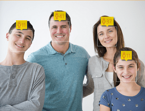

# Face detection with Image Analysis

Image Analysis can detect human faces within an image and generate rectangle coordinates for each detected face.

> [!NOTE]
> This feature is also offered by the dedicated [Face](./overview-identity.md) service. Use this alternative for more detailed face analysis, including face identification and head pose detection. 

[!INCLUDE [Sensitive attributes notice](./includes/identity-sensitive-attributes.md)]

Try out the face detection features quickly and easily in your browser using Vision Studio.

> [!div class="nextstepaction"]
> [Try Vision Studio](https://portal.vision.cognitive.azure.com/)

## Face detection examples

The following example demonstrates the JSON response returned by Analyze API for an image containing a single human face.


```json
{
    "faces": [
        {
            "age": 23,
            "gender": "Female",
            "faceRectangle": {
                "top": 45,
                "left": 194,
                "width": 44,
                "height": 44
            }
        }
    ],
    "requestId": "8439ba87-de65-441b-a0f1-c85913157ecd",
    "metadata": {
        "height": 200,
        "width": 300,
        "format": "Png"
    }
}
```

The next example demonstrates the JSON response returned for an image containing multiple human faces.



```json
{
    "faces": [
        {
            "age": 11,
            "gender": "Male",
            "faceRectangle": {
                "top": 62,
                "left": 22,
                "width": 45,
                "height": 45
            }
        },
        {
            "age": 11,
            "gender": "Female",
            "faceRectangle": {
                "top": 127,
                "left": 240,
                "width": 42,
                "height": 42
            }
        },
        {
            "age": 37,
            "gender": "Female",
            "faceRectangle": {
                "top": 55,
                "left": 200,
                "width": 41,
                "height": 41
            }
        },
        {
            "age": 41,
            "gender": "Male",
            "faceRectangle": {
                "top": 45,
                "left": 103,
                "width": 39,
                "height": 39
            }
        }
    ],
    "requestId": "3a383cbe-1a05-4104-9ce7-1b5cf352b239",
    "metadata": {
        "height": 230,
        "width": 300,
        "format": "Png"
    }
}
```

## Use the API

The face detection feature is part of the [Analyze Image 3.2](https://westcentralus.dev.cognitive.microsoft.com/docs/services/computer-vision-v3-2/operations/56f91f2e778daf14a499f21b) API. You can call this API through a native SDK or through REST calls. Include `Faces` in the **visualFeatures** query parameter. Then, when you get the full JSON response, simply parse the string for the contents of the `"faces"` section.

* [Quickstart: Vision REST API or client libraries](./quickstarts-sdk/image-analysis-client-library.md?pivots=programming-language-csharp)
