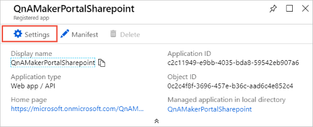
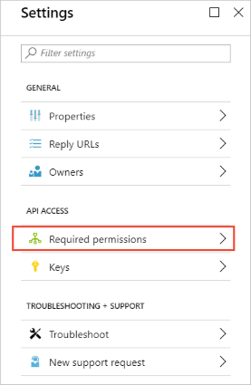
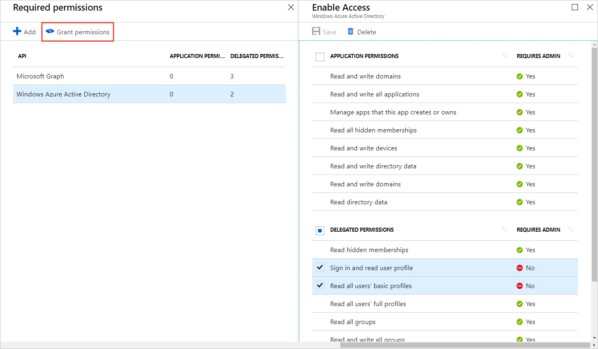
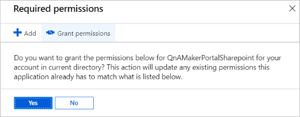

# Add a secured SharePoint data source to your knowledge base

Add secured cloud-based SharePoint data sources to your knowledge base to enrich the knowledge base with questions and answers that may be secured with Active Directory.

When you add a secured SharePoint document to your knowledge base, as the QnA Maker manager, you must request Active Directory permission for QnA Maker. Once this permission is given from the Active Directory manager to QnA Maker for access to SharePoint, it doesn't have to be given again. Each subsequent document addition to the knowledge base will not need authorization if it is in the same SharePoint resource.

If the QnA Maker knowledge base manager is not the Active Directory manager, you will need to communicate with the Active Directory manager to finish this process.

## Prerequisites

* Cloud-based SharePoint - QnA Maker uses Microsoft Graph for permissions. If your SharePoint is on-premises, you won't be able to extract from SharePoint because Microsoft Graph won't be able to determine permissions.
* URL format - QnA Maker only supports SharePoint urls which are generated for sharing and are of format `https://\*.sharepoint.com`

## Add supported file types to knowledge base

You can add all QnA Maker-supported [file types](../concepts/data-sources-and-content.md#file-and-url-data-types) from a SharePoint site to your knowledge base. You may have to grant [permissions](#permissions) if the file resource is secured.

1. From the library with the SharePoint site, select the file's ellipsis menu, `...`.
1. Copy the file's URL.

   

1. In the QnA Maker portal, on the **Settings** page, add the URL to the knowledge base.

### Images with SharePoint files

If files include images, those are not extracted. You can add the image, from the QnA Maker portal, after the file is extracted into QnA pairs.

Add the image with the following markdown syntax:

```markdown

```

The text in the square brackets, `[]`, explains the image. The URL in the parentheses, `()`, is the direct link to the image.

When you test the QnA pair in the interactive test panel, in the QnA Maker portal, the image is displayed, instead of the markdown text. This validates the image can be publicly retrieved from your client-application.

## Permissions

Granting permissions happens when a secured file from a server running SharePoint is added to a knowledge base. Depending on how the SharePoint is set up and the permissions of the person adding the file, this could require:

* no additional steps - the person adding the file has all the permissions needed.
* steps by both [knowledge base manager](#knowledge-base-manager-add-sharepoint-data-source-in-qna-maker-portal) and [Active Directory manager](#active-directory-manager-grant-file-read-access-to-qna-maker).

See the steps listed below.

### Knowledge base manager: add SharePoint data source in QnA Maker portal

When the **QnA Maker manager** adds a secured SharePoint document to a knowledge base, the knowledge base manager initiates a request for permission that the Active Directory manager needs to complete.

The request begins with a pop-up to authenticate to an Active Directory account.


Once the QnA Maker manager selects the account, the Azure Active Directory administrator will receive a notice that they need to allow the QnA Maker app (not the QnA Maker manager) access to the SharePoint resource. The Azure Active Directory manager will need to do this for every SharePoint resource, but not every document in that resource.

### Active directory manager: grant file read access to QnA Maker

The Active Directory manager (not the QnA Maker manager) needs to grant access to QnA Maker to access the SharePoint resource by selecting [this link](https://login.microsoftonline.com/common/oauth2/v2.0/authorize?response_type=id_token&scope=Files.Read%20Files.Read.All%20Sites.Read.All%20User.Read%20User.ReadBasic.All%20profile%20openid%20email&client_id=c2c11949-e9bb-4035-bda8-59542eb907a6&redirect_uri=https%3A%2F%2Fwww.qnamaker.ai%3A%2FCreate&state=68) to authorize the QnA Maker Portal SharePoint enterprise app to have file read permissions.


<!--
The Active Directory manager must grant QnA Maker access either by application name, `QnAMakerPortalSharePoint`, or by application ID, `c2c11949-e9bb-4035-bda8-59542eb907a6`.
-->
<!--
### Grant access from the interactive pop-up window

The Active Directory manager will get a pop-up window requesting permissions to the `QnAMakerPortalSharePoint` app. The pop-up window includes the QnA Maker Manager email address that initiated the request, an `App Info` link to learn more about **QnAMakerPortalSharePoint**, and a list of permissions requested. Select **Accept** to provide those permissions.


-->
<!--

### Grant access from the App Registrations list

1. The Active Directory manager signs in to the Azure portal and opens **[App registrations list](https://portal.azure.com/#blade/Microsoft_AAD_IAM/ApplicationsListBlade)**.

1. Search for and select the **QnAMakerPortalSharePoint** app. Change the second filter box from **My apps** to **All apps**. The app information will open on the right side.

    

1. Select **Settings**.

    [](../media/add-sharepoint-datasources/select-settings-for-qna-maker-app-registration.png#lightbox)

1. Under **API access**, select **Required permissions**.

    

1. Do not change any settings in the **Enable Access** window. Select **Grant Permission**.

    [](../media/add-sharepoint-datasources/grant-app-required-permissions.png#lightbox)

1. Select **YES** in the pop-up confirmation windows.

    
-->
### Grant access from the Azure Active Directory admin center

1. Sign in to the [Azure portal](https://portal.azure.com).
1. Browse to **Azure Active Directory** > **Enterprise applications**.

1. Search for `QnAMakerPortalSharePoint` the select the QnA Maker app.

    [](../media/add-sharepoint-datasources/search-enterprise-apps-for-qna-maker.png#lightbox)

1. Under **Security**, go to **Permissions**. Select **Grant admin consent for Organization**.

    [](../media/add-sharepoint-datasources/grant-aad-permissions-to-enterprise-app.png#lightbox)

1. Select a Sign-On account with permissions to grant permissions for the Active Directory.


## Add SharePoint data source with APIs

There is a workaround to add latest SharePoint content via API using Azure blob storage, below are the steps: 
1.  Download the SharePoint files locally. The user calling the API needs to have access to SharePoint. 
1.  Upload them on the Azure blob storage. This will create a secure shared access by [using SAS token.](../../../storage/common/storage-sas-overview.md#how-a-shared-access-signature-works) 
1. Pass the blob URL generated with the SAS token to the QnA Maker API. To allow the Question Answers extraction from the files, you need to add the suffix file type as '&ext=pdf' or '&ext=doc' at the end of the URL before passing it to QnA Maker API.


<!--
## Get SharePoint File URI

Use the following steps to transform the SharePoint URL into a sharing token.

1. Encode the URL using [base64](https://en.wikipedia.org/wiki/Base64).

1. Convert the base64-encoded result to an unpadded base64url format with the following character changes.

    * Remove the equal character, `=` from the end of the value.
    * Replace `/` with `_`.
    * Replace `+` with `-`.
    * Append `u!` to be beginning of the string.

1. Sign in to Graph explorer and run the following query, where `sharedURL` is ...:

    ```
    https://graph.microsoft.com/v1.0/shares/<sharedURL>/driveitem
    ```

    Get the **@microsoft.graph.downloadUrl** and use this as `fileuri` in the QnA Maker APIs.

### Add or update a SharePoint File URI to your knowledge base

Use the **@microsoft.graph.downloadUrl** from the previous section as the `fileuri` in the QnA Maker API for [adding a knowledge base](/rest/api/cognitiveservices/qnamaker4.0/knowledgebase) or [updating a knowledge base](/rest/api/cognitiveservices/qnamaker/knowledgebase/update). The following fields are mandatory: name, fileuri, filename, source.

```
{
    "name": "Knowledge base name",
    "files": [
        {
            "fileUri": "<@microsoft.graph.downloadURL>",
            "fileName": "filename.xlsx",
            "source": "<SharePoint link>"
        }
    ],
    "urls": [],
    "users": [],
    "hostUrl": "",
    "qnaList": []
}
```


## Remove QnA Maker app from SharePoint authorization

1. Use the steps in the previous section to find the Qna Maker app in the Active Directory admin center.
1. When you select the **QnAMakerPortalSharePoint**, select **Overview**.
1. Select **Delete** to remove permissions.

-->

## Next steps

> [!div class="nextstepaction"]
> [Collaborate on your knowledge base](../concepts/data-sources-and-content.md)
