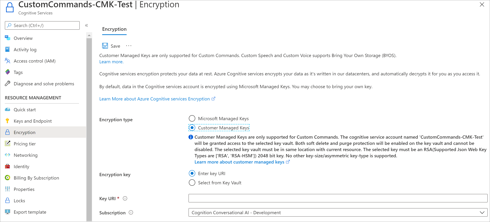
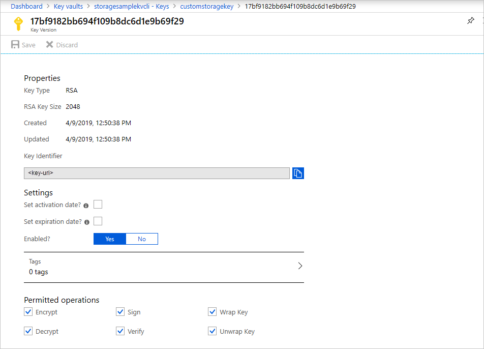
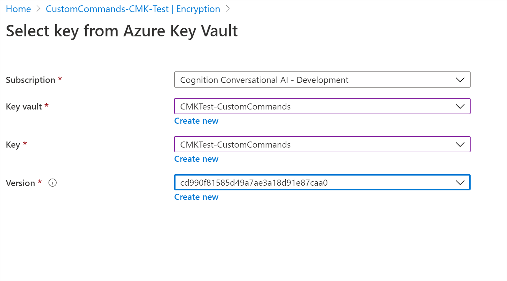

# Custom Commands encryption of data at rest

[!INCLUDE [deprecation notice](./includes/custom-commands-retire.md)]

Custom Commands automatically encrypts your data when it is persisted to the cloud. The Custom Commands service encryption protects your data and to help you to meet your organizational security and compliance commitments.

> [!NOTE]
> Custom Commands service doesn't automatically enable encryption for the LUIS resources associated with your application. If needed, you must enable encryption for your LUIS resource from [here](../luis/encrypt-data-at-rest.md).

## About Azure AI services encryption
Data is encrypted and decrypted using [FIPS 140-2](https://en.wikipedia.org/wiki/FIPS_140-2) compliant [256-bit AES](https://en.wikipedia.org/wiki/Advanced_Encryption_Standard) encryption. Encryption and decryption are transparent, meaning encryption and access are managed for you. Your data is secure by default and you don't need to modify your code or applications to take advantage of encryption.

## About encryption key management

When you use Custom Commands, speech service will store following data in the cloud:
* Configuration JSON behind the Custom Commands application
* LUIS authoring and prediction key

By default, your subscription uses Microsoft-managed encryption keys. However, you can also manage your subscription with your own encryption keys. Customer-managed keys (CMK), also known as bring your own key (BYOK), offer greater flexibility to create, rotate, disable, and revoke access controls. You can also audit the encryption keys used to protect your data.

> [!IMPORTANT]
> Customer-managed keys are only available resources created after 27 June, 2020. To use CMK with the Speech service, you will need to create a new Speech resource. Once the resource is created, you can use Azure Key Vault to set up your managed identity.

To request the ability to use customer-managed keys, fill out and submit Customer-Managed Key Request Form. It will take approximately 3-5 business days to hear back on the status of your request. Depending on demand, you may be placed in a queue and approved as space becomes available. Once approved for using CMK with the Speech service, you'll need to create a new Speech resource from the Azure portal.
   > [!NOTE]
   > **Customer-managed keys (CMK) are supported only for Custom Commands.**
   >
   >  **Custom Speech and Custom Voice still support only Bring Your Own Storage (BYOS).**  [Learn more](speech-encryption-of-data-at-rest.md)
   >
   > If you're using the given speech resource for accessing these service, compliance needs must be met by explicitly configuring BYOS.

## Customer-managed keys with Azure Key Vault

You must use Azure Key Vault to store customer-managed keys. You can either create your own keys and store them in a key vault, or you can use the Azure Key Vault APIs to generate keys. The Speech resource and the key vault must be in the same region and in the same Microsoft Entra tenant, but they can be in different subscriptions. For more information about Azure Key Vault, see [What is Azure Key Vault?](../../key-vault/general/overview.md).

When a new Speech resource is created and used to provision Custom Commands application - data is always encrypted using Microsoft-managed keys. It's not possible to enable customer-managed keys at the time that the resource is created. Customer-managed keys are stored in Azure Key Vault, and the key vault must be provisioned with access policies that grant key permissions to the managed identity that is associated with the Azure AI services resource. The managed identity is available only after the resource is created using the Pricing Tier required for CMK.

Enabling customer managed keys will also enable a system assigned [managed identity](../../active-directory/managed-identities-azure-resources/overview.md), a feature of Microsoft Entra ID. Once the system assigned managed identity is enabled, this resource will be registered with Microsoft Entra ID. After being registered, the managed identity will be given access to the Key Vault selected during customer managed key setup. 

> [!IMPORTANT]
> If you disable system assigned managed identities, access to the key vault will be removed and any data encrypted with the customer keys will no longer be accessible. Any features depended on this data will stop working.

> [!IMPORTANT]
> Managed identities do not currently support cross-directory scenarios. When you configure customer-managed keys in the Azure portal, a managed identity is automatically assigned under the covers. If you subsequently move the subscription, resource group, or resource from one Microsoft Entra directory to another, the managed identity associated with the resource is not transferred to the new tenant, so customer-managed keys may no longer work. For more information, see **Transferring a subscription between Microsoft Entra directories** in [FAQs and known issues with managed identities for Azure resources](../../active-directory/managed-identities-azure-resources/known-issues.md#transferring-a-subscription-between-azure-ad-directories).  

## Configure Azure Key Vault

Using customer-managed keys requires that two properties be set in the key vault, **Soft Delete** and **Do Not Purge**. These properties are not enabled by default, but can be enabled using either PowerShell or Azure CLI on a new or existing key vault.

> [!IMPORTANT]
> If you do not have the **Soft Delete** and **Do Not Purge** properties enabled and you delete your key, you won't be able to recover the data in your Azure AI services resource.

To learn how to enable these properties on an existing key vault, see the sections titled **Enabling soft-delete** and **Enabling Purge Protection** in one of the following articles:

- [How to use soft-delete with PowerShell](../../key-vault/general/key-vault-recovery.md).
- [How to use soft-delete with CLI](../../key-vault/general/key-vault-recovery.md).

Only RSA keys of size 2048 are supported with Azure Storage encryption. For more information about keys, see **Key Vault keys** in [About Azure Key Vault keys, secrets and certificates](../../key-vault/general/about-keys-secrets-certificates.md).

## Enable customer-managed keys for your Speech resource

To enable customer-managed keys in the Azure portal, follow these steps:

1. Navigate to your Speech resource.
1. On the **Settings** blade for your Speech resource, select **Encryption**. Select the **Customer Managed Keys** option, as shown in the following figure.

 

## Specify a key

After you enable customer-managed keys, you'll have the opportunity to specify a key to associate with the Azure AI services resource.

### Specify a key as a URI

To specify a key as a URI, follow these steps:

1. To locate the key URI in the Azure portal, navigate to your key vault, and select the **Keys** setting. Select the desired key, then click the key to view its versions. Select a key version to view the settings for that version.
1. Copy the value of the **Key Identifier** field, which provides the URI.

    

1. In the **Encryption** settings for your Speech service, choose the **Enter key URI** option.
1. Paste the URI that you copied into the **Key URI** field.

1. Specify the subscription that contains the key vault.
1. Save your changes.

### Specify a key from a key vault

To specify a key from a key vault, first make sure that you have a key vault that contains a key. To specify a key from a key vault, follow these steps:

1. Choose the **Select from Key Vault** option.
1. Select the key vault containing the key you want to use.
1. Select the key from the key vault.

   

1. Save your changes.

## Update the key version

When you create a new version of a key, update the Speech resource to use the new version. Follow these steps:

1. Navigate to your Speech resource and display the **Encryption** settings.
1. Enter the URI for the new key version. Alternately, you can select the key vault and the key again to update the version.
1. Save your changes.

## Use a different key

To change the key used for encryption, follow these steps:

1. Navigate to your Speech resource and display the **Encryption** settings.
1. Enter the URI for the new key. Alternately, you can select the key vault and choose a new key.
1. Save your changes.

## Rotate customer-managed keys

You can rotate a customer-managed key in Azure Key Vault according to your compliance policies. When the key is rotated, you must update the Speech resource to use the new key URI. To learn how to update the resource to use a new version of the key in the Azure portal, see [Update the key version](#update-the-key-version).

Rotating the key does not trigger re-encryption of data in the resource. There is no further action required from the user.

## Revoke access to customer-managed keys

To revoke access to customer-managed keys, use PowerShell or Azure CLI. For more information, see [Azure Key Vault PowerShell](/powershell/module/az.keyvault//) or [Azure Key Vault CLI](/cli/azure/keyvault). Revoking access effectively blocks access to all data in the Azure AI services resource, as the encryption key is inaccessible by Azure AI services.

## Disable customer-managed keys

When you disable customer-managed keys, your Speech resource is then encrypted with Microsoft-managed keys. To disable customer-managed keys, follow these steps:

1. Navigate to your Speech resource and display the **Encryption** settings.
1. Deselect the checkbox next to the **Use your own key** setting.

## Next steps

* [Speech Customer-Managed Key Request Form](https://aka.ms/cogsvc-cmk)
* [Learn more about Azure Key Vault](../../key-vault/general/overview.md)
* [What are managed identities](../../active-directory/managed-identities-azure-resources/overview.md)
