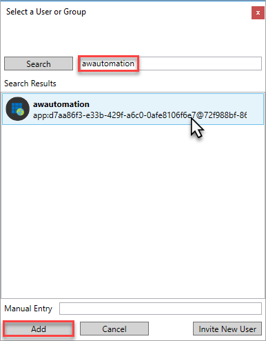

# Add a service principal to the server administrator role 

 To automate unattended PowerShell tasks, a service principal must have **server administrator** privileges on the Analysis Services server being managed. This article describes how to add a service principal to the server administrators role on an Analysis Services server. You can do this using SQL Server Management Studio or a Resource Manager template. 

> [!NOTE]
> Service principals must be added directly to the server administrator role. Adding a service principal to a security group, and then adding that security group to the server administrator role is not supported. 

## Before you begin
Before completing this task, you must have a service principal registered in Azure Active Directory.

[Create service principal - Azure portal](../active-directory/develop/howto-create-service-principal-portal.md)   
[Create service principal - PowerShell](../active-directory/develop/howto-authenticate-service-principal-powershell.md)

## Using SQL Server Management Studio

You can configure server administrators using SQL Server Management Studio (SSMS). To complete this task, you must have [server administrator](analysis-services-server-admins.md) permissions on the Analysis Services server. 

1. In SSMS, connect to your Analysis Services server.
2. In **Server Properties** > **Security**, click **Add**.
3. In **Select a User or Group**, search for your registered app by name, select, and then click **Add**.

    

4. Verify the service principal account ID, and then click **OK**.
    
    

## Using a Resource Manager template

You can also configure server administrators by deploying the Analysis Services server using an Azure Resource Manager template. The identity running the deployment must belong to the **Contributor** role for the resource in [Azure role-based access control (Azure RBAC)](../role-based-access-control/overview.md).

> [!IMPORTANT]
> The service principal must be added using the format `app:{service-principal-client-id}@{azure-ad-tenant-id}`.

The following Resource Manager template deploys an Analysis Services server with a specified service principal added to the Analysis Services Admin role:

```json
{
    "$schema": "https://schema.management.azure.com/schemas/2015-01-01/deploymentTemplate.json#",
    "contentVersion": "1.0.0.0",
    "parameters": {
        "analysisServicesServerName": {
            "type": "string"
        },
        "location": {
            "type": "string"
        },
        "analysisServicesSkuName": {
            "type": "string"
        },
        "analysisServicesCapacity": {
            "type": "int"
        },
        "servicePrincipalClientId": {
            "type": "string"
        },
        "servicePrincipalTenantId": {
            "type": "string"
        }
    },
    "resources": [
        {
            "name": "[parameters('analysisServicesServerName')]",
            "type": "Microsoft.AnalysisServices/servers",
            "apiVersion": "2017-08-01",
            "location": "[parameters('location')]",
            "sku": {
                "name": "[parameters('analysisServicesSkuName')]",
                "capacity": "[parameters('analysisServicesCapacity')]"
            },
            "properties": {
                "asAdministrators": {
                    "members": [
                        "[concat('app:', parameters('servicePrincipalClientId'), '@', parameters('servicePrincipalTenantId'))]"
                    ]
                }
            }
        }
    ]
}
```

## Using managed identities

A managed identity can also be added to the Analysis Services Admins list. For example, you might have a [Logic App with a system-assigned managed identity](../logic-apps/create-managed-service-identity.md), and want to grant it the ability to administer your server.

In most parts of the Azure portal and APIs, managed identities are identified using their service principal object ID. However, Analysis Services requires that they be identified using their client ID. To obtain the client ID for a service principal, you can use the Azure CLI:

```azurecli
az ad sp show --id <ManagedIdentityServicePrincipalObjectId> --query appId -o tsv
```

Alternatively you can use PowerShell:

```powershell
(Get-AzureADServicePrincipal -ObjectId <ManagedIdentityServicePrincipalObjectId>).AppId
```

You can then use this client ID in conjunction with the tenant ID to add the managed identity to the Analysis Services Admins list, as described above.

## Related information

* [Download SQL Server PowerShell Module](/sql/ssms/download-sql-server-ps-module)   
* [Download SSMS](/sql/ssms/download-sql-server-management-studio-ssms)
