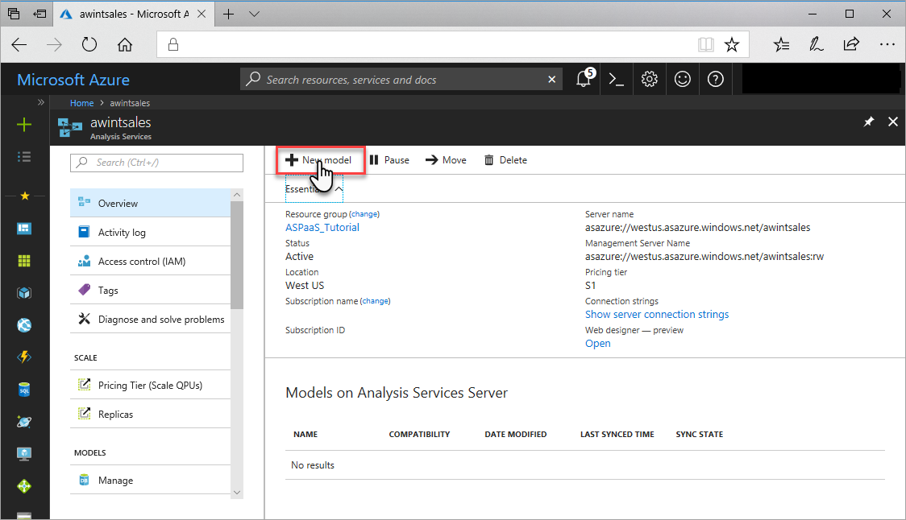
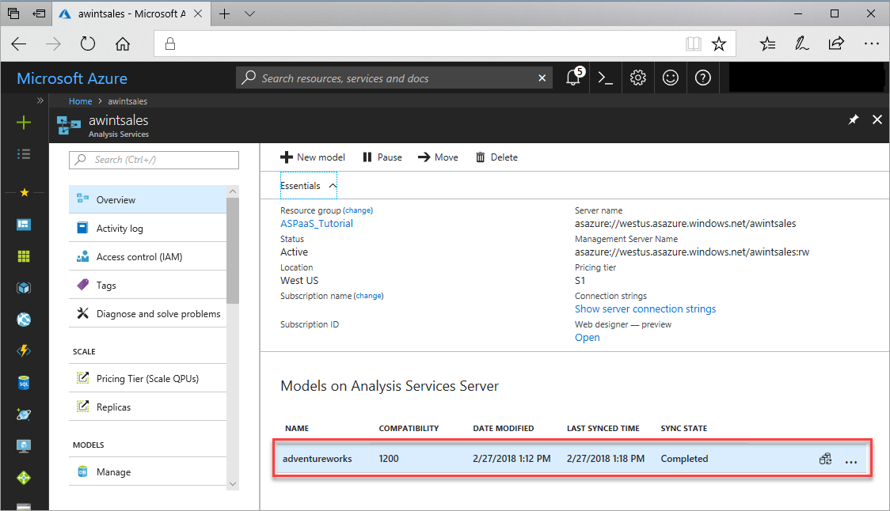
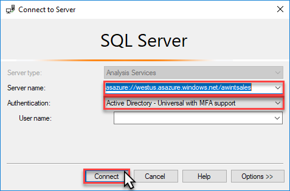
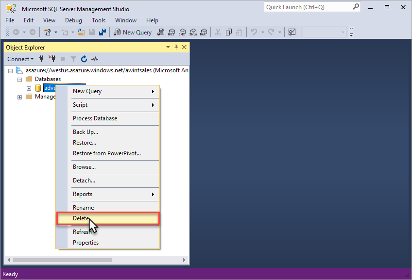

# Tutorial: Add a sample model from the portal

In this tutorial, you add a sample Adventure Works tabular model database to your server. The sample model is a completed version of the Adventure Works Internet Sales (1200) sample data model. A sample model is useful for testing model management, connecting with tools and client applications, and querying model data. This tutorial uses the [Azure portal](https://portal.azure.com) and [SQL Server Management Studio](/sql/ssms/download-sql-server-management-studio-ssms) (SSMS) to: 

> [!div class="checklist"]
> * Add a completed sample tabular data model to a server 
> * Connect to the model with SSMS

If you don't have an Azure subscription, [create a free account](https://azure.microsoft.com/free/) before you begin.

## Before you begin

To complete this tutorial, you need:

- An Azure Analysis Services server. To learn more, see [Create a server - portal](analysis-services-create-server.md).
- Server administrator permissions
- [SQL Server Management Studio](https://docs.microsoft.com/sql/ssms/download-sql-server-management-studio-ssms)

## Sign in to the Azure portal

Sign in to the [portal](https://portal.azure.com/).

## Add a sample model

1. In server **Overview**, click **New model**.

    

2. In **New model** > **Choose a data source**,  verify **Sample data** is selected, and then click **Add**.

    

3. In **Overview**, verify the `adventureworks` sample model is added.

    

## Clean up resources

Your sample model is using cache memory resources. If you are not using your sample model for testing, you should remove it from your server.

These steps describe how to delete a model from a server by using SSMS.

1. In SSMS > **Object Explorer**, click **Connect** > **Analysis Services**.

2. In **Connect to Server**, paste in the server name, then in **Authentication**, choose **Active Directory - Universal with MFA support**, enter your username, and then click **Connect**.

    

3. In **Object Explorer**, right-click the `adventureworks` sample database, and then click **Delete**.

    

## Next steps 

In this tutorial, you learned how to add a basic, sample model to your server. Now that you have a model database, you can connect to it from SQL Server Management Studio and add user roles. To learn more, continue with the next tutorial.

> [!div class="nextstepaction"]
> [Tutorial: Configure server administrator and user roles](analysis-services-database-users.md)

