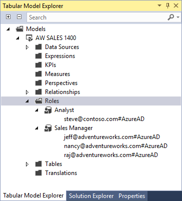
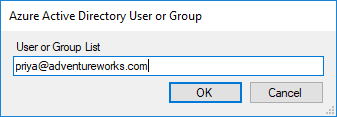

# Manage database roles and users

At the model database level, all users must belong to a role. Roles define users with particular permissions for the model database. Any user or security group added to a role must have an account in an Azure AD tenant in the same subscription as the server.

How you define roles is different depending on the tool you use, but the effect is the same.

Role permissions include:
*  **Administrator** - Users have full permissions for the database. Database roles with Administrator permissions are different from server administrators.
*  **Process** - Users can connect to and perform process operations on the database, and analyze model database data.
*  **Read** -  Users can use a client application to connect to and analyze model database data.

When creating a tabular model project, you create roles and add users or groups to those roles by using Role Manager in SSDT. When deployed to a server, you use SSMS, [Analysis Services PowerShell cmdlets](https://msdn.microsoft.com/library/hh758425.aspx), or [Tabular Model Scripting Language](https://msdn.microsoft.com/library/mt614797.aspx) (TMSL) to add or remove roles and user members.

## To add or manage roles and users in SSDT  
  
1.  In SSDT > **Tabular Model Explorer**, right-click **Roles**.  
  
2.  In **Role Manager**, click **New**.  
  
3.  Type a name for the role.  
  
     By default, the name of the default role is incrementally numbered for each new role. It's recommended you type a name that clearly identifies the member type, for example, Finance Managers or Human Resources Specialists.  
  
4.  Select one of the following permissions:  
  
    |Permission|Description|  
    |----------------|-----------------|  
    |**None**|Members cannot modify the model schema and cannot query data.|  
    |**Read**|Members can query data (based on row filters) but cannot modify the model schema.|  
    |**Read and Process**|Members can query data (based on row-level filters) and run Process and Process All operations, but cannot modify the model schema.|  
    |**Process**|Members can run Process and Process All operations. Cannot modify the model schema and cannot query data.|  
    |**Administrator**|Members can modify the model schema and query all data.|   
  
5.  If the role you are creating has Read or Read and Process permission, you can add row filters by using a DAX formula. Click the **Row Filters** tab, then select a table, then click the **DAX Filter** field, and then type a DAX formula.
  
6.  Click **Members** > **Add External**.  
  
8.  In **Add External Member**, enter users or groups in your tenant Azure AD by email address. After you click OK and close Role Manager, roles and role members appear in Tabular Model Explorer. 
 
     

9. Deploy to your Azure Analysis Services server.


## To add or manage roles and users in SSMS
To add roles and users to a deployed model database, you must be connected to the server as a Server administrator or already in a database role with administrator permissions.

1. In Object Exporer, right-click **Roles** > **New Role**.

2. In **Create Role**, enter a role name and description.

3. Select a permission.
   |Permission|Description|  
   |----------------|-----------------|  
   |**Full control (Administrator)**|Members can modify the model schema, process, and can query all data.| 
   |**Process database**|Members can run Process and Process All operations. Cannot modify the model schema and cannot query data.|  
   |**Read**|Members can query data (based on row filters) but cannot modify the model schema.|  
  
4. Click **Membership**, then enter a user or group in your tenant Azure AD by email address.

     

5. If the role you are creating has Read permission, you can add row filters by using a DAX formula. Click **Row Filters**, select a table, and then type a DAX formula in the **DAX Filter** field. 

## To add roles and users by using a TMSL script
You can run a TMSL script in the XMLA window in SSMS or by using PowerShell. Use the [CreateOrReplace](https://docs.microsoft.com/sql/analysis-services/tabular-models-scripting-language-commands/createorreplace-command-tmsl) command and the [Roles](https://docs.microsoft.com/sql/analysis-services/tabular-models-scripting-language-objects/roles-object-tmsl) object.

**Sample TMSL script**

In this sample, a B2B external user and a group are added to the Analyst role with Read permissions for the SalesBI database. Both the external user and group must be in same tenant Azure AD.

```
{
  "createOrReplace": {
    "object": {
      "database": "SalesBI",
      "role": "Analyst"
    },
    "role": {
      "name": "Users",
      "description": "All allowed users to query the model",
      "modelPermission": "read",
      "members": [
        {
          "memberName": "user1@contoso.com",
          "identityProvider": "AzureAD"
        },
        {
          "memberName": "group1@adventureworks.com",
          "identityProvider": "AzureAD"
        }
      ]
    }
  }
}
```

## To add roles and users by using PowerShell
The [SqlServer](https://msdn.microsoft.com/library/hh758425.aspx) module provides task-specific database management cmdlets and the general-purpose Invoke-ASCmd cmdlet that accepts a Tabular Model Scripting Language (TMSL) query or script. The following cmdlets are used for managing database roles and users.
  
|Cmdlet|Description|
|------------|-----------------| 
|[Add-RoleMember](https://msdn.microsoft.com/library/hh510167.aspx)|Add a member to a database role.| 
|[Remove-RoleMember](https://msdn.microsoft.com/library/hh510173.aspx)|Remove a member from a database role.|   
|[Invoke-ASCmd](https://msdn.microsoft.com/library/hh479579.aspx)|Execute a TMSL script.|

## Row filters  
Row filters define which rows in a table can be queried by members of a particular role. Row filters are defined for each table in a model by using DAX formulas.  
  
Row filters can be defined only for roles with Read and Read and Process permissions. By default, if a row filter is not defined for a particular table, members  can query all rows in the table unless cross-filtering applies from another table.
  
 Row filters require a DAX formula, which must evaluate to a TRUE/FALSE value, to define the rows that can be queried by members of that particular role. Rows not included in the DAX formula cannot be queried. For example, the Customers table with the following row filters expression, *=Customers [Country] = “USA”*, members of the Sales role can only see customers in the USA.  
  
Row filters apply to the specified rows and related rows. When a table has multiple relationships, filters apply security for the relationship that is active. Row filters are intersected with other row filers defined for related tables, for example:  
  
|Table|DAX expression|  
|-----------|--------------------|  
|Region|=Region[Country]=”USA”|  
|ProductCategory|=ProductCategory[Name]=”Bicycles”|  
|Transactions|=Transactions[Year]=2016|  
  
 The net effect is members can query rows of data where the customer is in the USA, the product category is bicycles, and the year is 2016. Users cannot query transactions outside of the USA, transactions that are not bicycles, or transactions not in 2016 unless they are a member of another role that grants these permissions.
  
 You can use the filter, *=FALSE()*, to deny access to all rows for an entire table.

## Next steps
  [Manage server administrators](analysis-services-server-admins.md)   
  [Manage Azure Analysis Services with PowerShell](analysis-services-powershell.md)  
  [Tabular Model Scripting Language (TMSL) Reference](https://docs.microsoft.com/sql/analysis-services/tabular-model-scripting-language-tmsl-reference)

