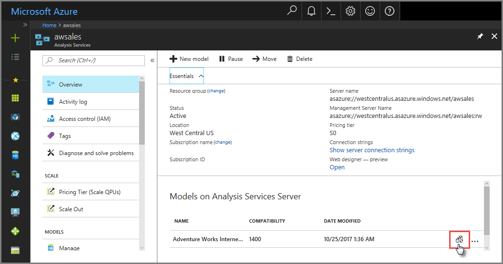

# Azure Analysis Services scale-out

With scale-out, client queries can be distributed among multiple *query replicas* in a query pool, reducing response times during high query workloads. You can also separate processing from the query pool, ensuring client queries are not adversely affected by processing operations. Scale-out can be configured in Azure portal or by using the Analysis Services REST API.

## How it works

In a typical server deployment, one server serves as both processing server and query server. If the number of client queries against models on your server exceeds the Query Processing Units (QPU) for your server's plan, or model processing occurs at the same time as high query workloads, performance can decrease. 

With scale-out, you can create a query pool with up to seven additional query replicas (eight total, including your server). You can scale the number of query replicas to meet QPU demands at critical times and you can separate a processing server from the query pool at any time. 

Regardless of the number of query replicas you have in a query pool, processing workloads are not distributed among query replicas. A single server serves as the processing server. Query replicas serve only queries against the models synchronized between each replica in the query pool. 

When processing operations are completed, a synchronization must be performed between the processing server and the query replica servers. When automating processing operations, it's important to configure a synchronization operation upon successful completion of processing operations.

> [!NOTE]
> Scale-out is available for servers in the Standard pricing tier. Each query replica is billed at the same rate as your server.

> [!NOTE]
> Scale-out does not increase the amount of available memory for your server. To increase memory, you need to upgrade your plan.

## Monitor QPU usage

 To determine if scale-out for your server is necessary, monitor your server in Azure portal by using Metrics. If your QPU regularly maxes out, it means the number of queries against your models is exceeding the QPU limit for your plan. The Query pool job queue length metric also increases when the number of queries in the query thread pool queue exceeds available QPU. To learn more, see [Monitor server metrics](analysis-services-monitor.md).

## Configure scale-out

### In Azure portal

1. In the portal, click **Scale-out**. Use the slider to select the number of query replica servers. The number of replicas you choose is in addition to your existing server.

2. In **Separate the processing server from the querying pool**, select yes to exclude your processing server from query servers.

   

3. Click **Save** to provision your new query replica servers. 

Tabular models on your primary server are synchronized with the replica servers. When synchronization is complete, the query pool begins distributing incoming queries among the replica servers. 

### PowerShell
Use 
[Set-AzureRmAnalysisServicesServer](/powershell/module/azurerm.analysisservices/set-azurermanalysisservicesserver) cmdlet. Specify the `-Capacity` parameter value > 1.

## Synchronization 

When you provision new query replicas, Azure Analysis Services automatically replicates your models across all replicas. You can also perform a manual synchronization. When you process your models, you should perform a synchronization so updates are synchronized among query replicas.

### In Azure portal

In **Overview** > model > **Synchronize model**.

### REST API

Synchronize a model   
`POST https://<region>.asazure.windows.net/servers/<servername>/models/<modelname>/sync`

Get the status of a model synchronization  
`GET https://<region>.asazure.windows.net/servers/<servername>/models/<modelname>/sync`

## Connections

On your server's Overview page, there are two server names. If you haven't yet configured scale-out for a server, both server names work the same. Once you configure scale-out for a server, you will need to specify the appropriate server name depending on the connection type. 

For end-user client connections like Power BI Desktop, Excel and custom apps, use **Server name**. 

For SSMS, SSDT, and connection strings in PowerShell, Azure Function apps, and AMO, use **Management server name**. The management server name includes a special `:rw` (read-write) qualifier. All processing operations occur on the management server.

## Related information

[Monitor server metrics](analysis-services-monitor.md)   
[Manage Azure Analysis Services](analysis-services-manage.md) 

