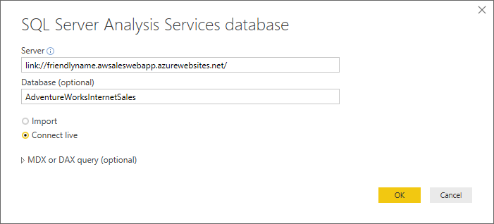

# Alias server names

By using a server name alias, users can connect to your Azure Analysis Services server with a shorter *alias* instead of the server name. When connecting from a client application, the alias is specified as an endpoint using the **link://** protocol format. The endpoint then returns the real server name in order to connect.

Alias server names are good for:

- Migrating models between servers without affecting users. 
- Friendly server names are easier for users to remember. 
- Direct users to different servers at different times of the day. 
- Direct users in different regions to instances that are geographically closer, like when using Azure Traffic Manager. 

Any HTTP endpoint that returns a valid Azure Analysis Services server name can serve as an alias.


When connecting from a client, the alias server name is entered using **link://** protocol format. For example, in Power BI Desktop:



## Create an alias

To create an alias endpoint, you can use any method that returns a valid Azure Analysis Services server name. For example, a reference to a file in Azure Blob Storage containing the real server name, or create and publish an ASP.NET Web Forms application.

In this example, an ASP.NET Web Forms Application is created in Visual Studio. The master page reference and user control are removed from the Default.aspx page. The contents of Default.aspx are simply the following Page directive:

```
<%@ Page Title="Home Page" Language="C#" AutoEventWireup="true" CodeBehind="Default.aspx.cs" Inherits="FriendlyRedirect._Default" %>
```

The Page_Load event in Default.aspx.cs uses the Response.Write() method to return the Azure Analysis Services server name.

```
protected void Page_Load(object sender, EventArgs e)
{
    this.Response.Write("asazure://<region>.asazure.windows.net/<servername>");
}
```

## See also

[Client libraries](analysis-services-data-providers.md)   
[Connect from Power BI Desktop](analysis-services-connect-pbi.md)
